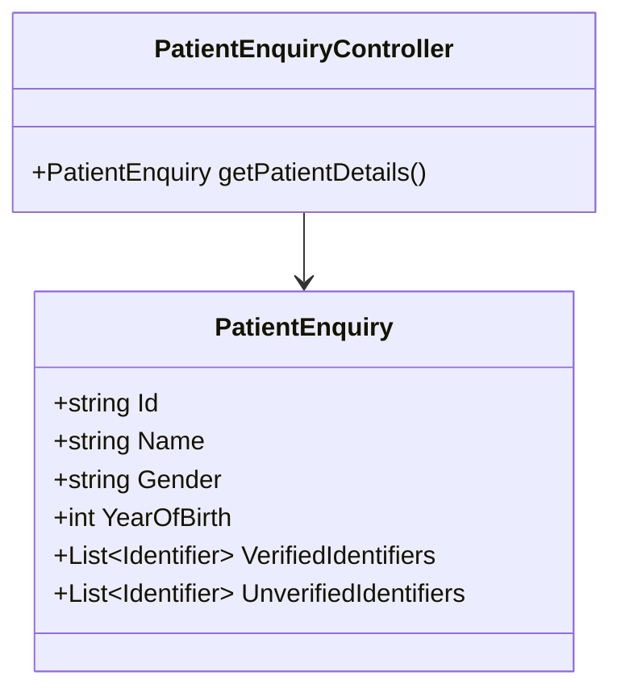

## Overview

The Patient Enquiry Model represents the information required to inquire about a patient. It includes properties such as the patient's ID, name, gender, year of birth, and identifiers.

## Required Properties

The <SwmToken path="src/In.ProjectEKA.HipLibrary/Patient/Model/PatientEnquiry.cs" pos="8:5:5" line-data="    public class PatientEnquiry">`PatientEnquiry`</SwmToken> model includes several required properties:

- <SwmToken path="src/In.ProjectEKA.HipLibrary/Patient/Model/PatientEnquiry.cs" pos="28:5:5" line-data="        public string Id { get; }">`Id`</SwmToken>: Uniquely identifies the patient.
- <SwmToken path="src/In.ProjectEKA.HipLibrary/Patient/Model/PatientEnquiry.cs" pos="35:5:5" line-data="        public string Name { get; }">`Name`</SwmToken>: Represents the patient's name.
- <SwmToken path="src/In.ProjectEKA.HipLibrary/Patient/Model/PatientEnquiry.cs" pos="38:3:3" line-data="        public Gender? Gender { get; }">`Gender`</SwmToken>: Indicates the patient's gender.

<SwmSnippet path="/src/In.ProjectEKA.HipLibrary/Patient/Model/PatientEnquiry.cs" line="27">

---

The <SwmToken path="src/In.ProjectEKA.HipLibrary/Patient/Model/PatientEnquiry.cs" pos="28:5:5" line-data="        public string Id { get; }">`Id`</SwmToken> property is required and uniquely identifies the patient.

```c#
        [Required(ErrorMessage = "Patient id must be provided.")]
        public string Id { get; }
```

---

</SwmSnippet>

<SwmSnippet path="/src/In.ProjectEKA.HipLibrary/Patient/Model/PatientEnquiry.cs" line="34">

---

The <SwmToken path="src/In.ProjectEKA.HipLibrary/Patient/Model/PatientEnquiry.cs" pos="35:5:5" line-data="        public string Name { get; }">`Name`</SwmToken> property is required and represents the patient's name.

```c#
        [Required(ErrorMessage = "Patient name must be provided.")]
        public string Name { get; }
```

---

</SwmSnippet>

<SwmSnippet path="/src/In.ProjectEKA.HipLibrary/Patient/Model/PatientEnquiry.cs" line="37">

---

The <SwmToken path="src/In.ProjectEKA.HipLibrary/Patient/Model/PatientEnquiry.cs" pos="38:3:3" line-data="        public Gender? Gender { get; }">`Gender`</SwmToken> property is required and indicates the patient's gender.

```c#
        [Required(ErrorMessage = "Patient gender must be provided.")]
        public Gender? Gender { get; }
```

---

</SwmSnippet>

## Optional Properties

The <SwmToken path="src/In.ProjectEKA.HipLibrary/Patient/Model/PatientEnquiry.cs" pos="8:5:5" line-data="    public class PatientEnquiry">`PatientEnquiry`</SwmToken> model also includes optional properties:

- <SwmToken path="src/In.ProjectEKA.HipLibrary/Patient/Model/PatientEnquiry.cs" pos="24:1:1" line-data="            YearOfBirth = yearOfBirth;">`YearOfBirth`</SwmToken>: Represents the patient's year of birth.
- <SwmToken path="src/In.ProjectEKA.HipLibrary/Patient/Model/PatientEnquiry.cs" pos="20:1:1" line-data="            VerifiedIdentifiers = verifiedIdentifiers;">`VerifiedIdentifiers`</SwmToken> and <SwmToken path="src/In.ProjectEKA.HipLibrary/Patient/Model/PatientEnquiry.cs" pos="21:1:1" line-data="            UnverifiedIdentifiers = unverifiedIdentifiers;">`UnverifiedIdentifiers`</SwmToken>: Collections of identifiers that have been verified or not verified, respectively.

## Usage in DiscoveryRequest

The <SwmToken path="src/In.ProjectEKA.HipLibrary/Patient/Model/PatientEnquiry.cs" pos="8:5:5" line-data="    public class PatientEnquiry">`PatientEnquiry`</SwmToken> model is used in the `DiscoveryRequest` class to represent the patient information required for a discovery request.

## Patient Enquiry APIs

The `PatientEnquiryController` class defines the endpoint for patient enquiry. This endpoint allows users to inquire about a patient's details using their ID, name, gender, and other identifiers.



&nbsp;

*This is an auto-generated document by Swimm 🌊 and has not yet been verified by a human*

<SwmMeta version="3.0.0" repo-id="Z2l0aHViJTNBJTNBaGlwLXNlcnZpY2UlM0ElM0FTd2ltbS1EZW1v" repo-name="hip-service"><sup>Powered by [Swimm](/)</sup></SwmMeta>
