## Overview

The <SwmToken path="src/In.ProjectEKA.HipLibrary/Patient/IPatientRepository.cs" pos="10:5:5" line-data="    public interface IPatientRepository">`IPatientRepository`</SwmToken> interface defines the contract for accessing patient data within the system. It includes methods for retrieving patient information based on different criteria.

## Methods

The <SwmToken path="src/In.ProjectEKA.HipLibrary/Patient/IPatientRepository.cs" pos="10:5:5" line-data="    public interface IPatientRepository">`IPatientRepository`</SwmToken> interface includes several methods for accessing patient data based on different criteria. These methods are essential for retrieving patient information efficiently and accurately.

### <SwmToken path="src/In.ProjectEKA.HipLibrary/Patient/IPatientRepository.cs" pos="12:8:8" line-data="        Task&lt;Option&lt;Patient&gt;&gt; PatientWithAsync(string patientIdentifier);">`PatientWithAsync`</SwmToken>

The <SwmToken path="src/In.ProjectEKA.HipLibrary/Patient/IPatientRepository.cs" pos="12:8:8" line-data="        Task&lt;Option&lt;Patient&gt;&gt; PatientWithAsync(string patientIdentifier);">`PatientWithAsync`</SwmToken> method retrieves a patient using a unique patient identifier. This method is crucial for fetching specific patient details when the identifier is known.

<SwmSnippet path="/src/In.ProjectEKA.HipLibrary/Patient/IPatientRepository.cs" line="10">

---

The <SwmToken path="src/In.ProjectEKA.HipLibrary/Patient/IPatientRepository.cs" pos="12:8:8" line-data="        Task&lt;Option&lt;Patient&gt;&gt; PatientWithAsync(string patientIdentifier);">`PatientWithAsync`</SwmToken> method is defined in the <SwmToken path="src/In.ProjectEKA.HipLibrary/Patient/IPatientRepository.cs" pos="10:5:5" line-data="    public interface IPatientRepository">`IPatientRepository`</SwmToken> interface. It takes a unique patient identifier as a parameter and returns a <SwmToken path="src/In.ProjectEKA.HipLibrary/Patient/IPatientRepository.cs" pos="12:1:1" line-data="        Task&lt;Option&lt;Patient&gt;&gt; PatientWithAsync(string patientIdentifier);">`Task`</SwmToken> containing an <SwmToken path="src/In.ProjectEKA.HipLibrary/Patient/IPatientRepository.cs" pos="12:3:3" line-data="        Task&lt;Option&lt;Patient&gt;&gt; PatientWithAsync(string patientIdentifier);">`Option`</SwmToken> of <SwmToken path="src/In.ProjectEKA.HipLibrary/Patient/IPatientRepository.cs" pos="12:5:5" line-data="        Task&lt;Option&lt;Patient&gt;&gt; PatientWithAsync(string patientIdentifier);">`Patient`</SwmToken>.

```c#
    public interface IPatientRepository
    {
        Task<Option<Patient>> PatientWithAsync(string patientIdentifier);
```

---

</SwmSnippet>

### <SwmToken path="src/In.ProjectEKA.HipLibrary/Patient/IPatientRepository.cs" pos="14:8:8" line-data="        Task&lt;IQueryable&lt;Patient&gt;&gt; PatientsWithVerifiedId(string healthId);">`PatientsWithVerifiedId`</SwmToken>

The <SwmToken path="src/In.ProjectEKA.HipLibrary/Patient/IPatientRepository.cs" pos="14:8:8" line-data="        Task&lt;IQueryable&lt;Patient&gt;&gt; PatientsWithVerifiedId(string healthId);">`PatientsWithVerifiedId`</SwmToken> method retrieves patients who have a verified health ID. This is useful for ensuring that the patient data being accessed is verified and accurate.

<SwmSnippet path="/src/In.ProjectEKA.HipLibrary/Patient/IPatientRepository.cs" line="14">

---

The <SwmToken path="src/In.ProjectEKA.HipLibrary/Patient/IPatientRepository.cs" pos="14:8:8" line-data="        Task&lt;IQueryable&lt;Patient&gt;&gt; PatientsWithVerifiedId(string healthId);">`PatientsWithVerifiedId`</SwmToken> method is defined in the <SwmToken path="src/In.ProjectEKA.HipLibrary/Patient/IPatientRepository.cs" pos="10:5:5" line-data="    public interface IPatientRepository">`IPatientRepository`</SwmToken> interface. It takes a health ID as a parameter and returns a <SwmToken path="src/In.ProjectEKA.HipLibrary/Patient/IPatientRepository.cs" pos="14:1:1" line-data="        Task&lt;IQueryable&lt;Patient&gt;&gt; PatientsWithVerifiedId(string healthId);">`Task`</SwmToken> containing an <SwmToken path="src/In.ProjectEKA.HipLibrary/Patient/IPatientRepository.cs" pos="14:3:3" line-data="        Task&lt;IQueryable&lt;Patient&gt;&gt; PatientsWithVerifiedId(string healthId);">`IQueryable`</SwmToken> of <SwmToken path="src/In.ProjectEKA.HipLibrary/Patient/IPatientRepository.cs" pos="14:5:5" line-data="        Task&lt;IQueryable&lt;Patient&gt;&gt; PatientsWithVerifiedId(string healthId);">`Patient`</SwmToken>.

```c#
        Task<IQueryable<Patient>> PatientsWithVerifiedId(string healthId);
```

---

</SwmSnippet>

### <SwmToken path="src/In.ProjectEKA.HipLibrary/Patient/IPatientRepository.cs" pos="16:8:8" line-data="        Task&lt;IQueryable&lt;Patient&gt;&gt; PatientsWithDemographics(string name, AdministrativeGender? gender, string yearOfBirth, string phoneNumber);">`PatientsWithDemographics`</SwmToken>

The <SwmToken path="src/In.ProjectEKA.HipLibrary/Patient/IPatientRepository.cs" pos="16:8:8" line-data="        Task&lt;IQueryable&lt;Patient&gt;&gt; PatientsWithDemographics(string name, AdministrativeGender? gender, string yearOfBirth, string phoneNumber);">`PatientsWithDemographics`</SwmToken> method retrieves patients based on demographic information such as name, gender, year of birth, and phone number. This method is essential for fetching patient details when demographic information is available.

<SwmSnippet path="/src/In.ProjectEKA.HipLibrary/Patient/IPatientRepository.cs" line="16">

---

The <SwmToken path="src/In.ProjectEKA.HipLibrary/Patient/IPatientRepository.cs" pos="16:8:8" line-data="        Task&lt;IQueryable&lt;Patient&gt;&gt; PatientsWithDemographics(string name, AdministrativeGender? gender, string yearOfBirth, string phoneNumber);">`PatientsWithDemographics`</SwmToken> method is defined in the <SwmToken path="src/In.ProjectEKA.HipLibrary/Patient/IPatientRepository.cs" pos="10:5:5" line-data="    public interface IPatientRepository">`IPatientRepository`</SwmToken> interface. It takes parameters such as name, gender, year of birth, and phone number, and returns a <SwmToken path="src/In.ProjectEKA.HipLibrary/Patient/IPatientRepository.cs" pos="16:1:1" line-data="        Task&lt;IQueryable&lt;Patient&gt;&gt; PatientsWithDemographics(string name, AdministrativeGender? gender, string yearOfBirth, string phoneNumber);">`Task`</SwmToken> containing an <SwmToken path="src/In.ProjectEKA.HipLibrary/Patient/IPatientRepository.cs" pos="16:3:3" line-data="        Task&lt;IQueryable&lt;Patient&gt;&gt; PatientsWithDemographics(string name, AdministrativeGender? gender, string yearOfBirth, string phoneNumber);">`IQueryable`</SwmToken> of <SwmToken path="src/In.ProjectEKA.HipLibrary/Patient/IPatientRepository.cs" pos="16:5:5" line-data="        Task&lt;IQueryable&lt;Patient&gt;&gt; PatientsWithDemographics(string name, AdministrativeGender? gender, string yearOfBirth, string phoneNumber);">`Patient`</SwmToken>.

```c#
        Task<IQueryable<Patient>> PatientsWithDemographics(string name, AdministrativeGender? gender, string yearOfBirth, string phoneNumber);
```

---

</SwmSnippet>



```mermaid
classDiagram
    IPatientRepository <|-- PatientWithAsync
    IPatientRepository <|-- PatientsWithVerifiedId
    IPatientRepository <|-- PatientsWithDemographics
    class IPatientRepository{
        +Task<Option<Patient>> PatientWithAsync(string patientIdentifier)
        +Task<IQueryable<Patient>> PatientsWithVerifiedId(string healthId)
        +Task<IQueryable<Patient>> PatientsWithDemographics(string name, AdministrativeGender? gender, string yearOfBirth, string phoneNumber)
    }

%% Swimm:
%% classDiagram
%%     <SwmToken path="src/In.ProjectEKA.HipLibrary/Patient/IPatientRepository.cs" pos="10:5:5" line-data="    public interface IPatientRepository">`IPatientRepository`</SwmToken> <|-- <SwmToken path="src/In.ProjectEKA.HipLibrary/Patient/IPatientRepository.cs" pos="12:8:8" line-data="        Task&lt;Option&lt;Patient&gt;&gt; PatientWithAsync(string patientIdentifier);">`PatientWithAsync`</SwmToken>
%%     <SwmToken path="src/In.ProjectEKA.HipLibrary/Patient/IPatientRepository.cs" pos="10:5:5" line-data="    public interface IPatientRepository">`IPatientRepository`</SwmToken> <|-- <SwmToken path="src/In.ProjectEKA.HipLibrary/Patient/IPatientRepository.cs" pos="14:8:8" line-data="        Task&lt;IQueryable&lt;Patient&gt;&gt; PatientsWithVerifiedId(string healthId);">`PatientsWithVerifiedId`</SwmToken>
%%     <SwmToken path="src/In.ProjectEKA.HipLibrary/Patient/IPatientRepository.cs" pos="10:5:5" line-data="    public interface IPatientRepository">`IPatientRepository`</SwmToken> <|-- <SwmToken path="src/In.ProjectEKA.HipLibrary/Patient/IPatientRepository.cs" pos="16:8:8" line-data="        Task&lt;IQueryable&lt;Patient&gt;&gt; PatientsWithDemographics(string name, AdministrativeGender? gender, string yearOfBirth, string phoneNumber);">`PatientsWithDemographics`</SwmToken>
%%     class IPatientRepository{
%%         +Task<Option<Patient>> <SwmToken path="src/In.ProjectEKA.HipLibrary/Patient/IPatientRepository.cs" pos="12:8:10" line-data="        Task&lt;Option&lt;Patient&gt;&gt; PatientWithAsync(string patientIdentifier);">`PatientWithAsync(string`</SwmToken> <SwmToken path="src/In.ProjectEKA.HipLibrary/Patient/IPatientRepository.cs" pos="12:12:12" line-data="        Task&lt;Option&lt;Patient&gt;&gt; PatientWithAsync(string patientIdentifier);">`patientIdentifier`</SwmToken>)
%%         +Task<IQueryable<Patient>> <SwmToken path="src/In.ProjectEKA.HipLibrary/Patient/IPatientRepository.cs" pos="14:8:10" line-data="        Task&lt;IQueryable&lt;Patient&gt;&gt; PatientsWithVerifiedId(string healthId);">`PatientsWithVerifiedId(string`</SwmToken> <SwmToken path="src/In.ProjectEKA.HipLibrary/Patient/IPatientRepository.cs" pos="14:12:12" line-data="        Task&lt;IQueryable&lt;Patient&gt;&gt; PatientsWithVerifiedId(string healthId);">`healthId`</SwmToken>)
%%         +Task<IQueryable<Patient>> <SwmToken path="src/In.ProjectEKA.HipLibrary/Patient/IPatientRepository.cs" pos="16:8:10" line-data="        Task&lt;IQueryable&lt;Patient&gt;&gt; PatientsWithDemographics(string name, AdministrativeGender? gender, string yearOfBirth, string phoneNumber);">`PatientsWithDemographics(string`</SwmToken> name, <SwmToken path="src/In.ProjectEKA.HipLibrary/Patient/IPatientRepository.cs" pos="16:15:15" line-data="        Task&lt;IQueryable&lt;Patient&gt;&gt; PatientsWithDemographics(string name, AdministrativeGender? gender, string yearOfBirth, string phoneNumber);">`AdministrativeGender`</SwmToken>? gender, string <SwmToken path="src/In.ProjectEKA.HipLibrary/Patient/IPatientRepository.cs" pos="16:23:23" line-data="        Task&lt;IQueryable&lt;Patient&gt;&gt; PatientsWithDemographics(string name, AdministrativeGender? gender, string yearOfBirth, string phoneNumber);">`yearOfBirth`</SwmToken>, string <SwmToken path="src/In.ProjectEKA.HipLibrary/Patient/IPatientRepository.cs" pos="16:28:28" line-data="        Task&lt;IQueryable&lt;Patient&gt;&gt; PatientsWithDemographics(string name, AdministrativeGender? gender, string yearOfBirth, string phoneNumber);">`phoneNumber`</SwmToken>)
%%     }
```

&nbsp;

*This is an auto-generated document by Swimm 🌊 and has not yet been verified by a human*

<SwmMeta version="3.0.0" repo-id="Z2l0aHViJTNBJTNBaGlwLXNlcnZpY2UlM0ElM0FTd2ltbS1EZW1v" repo-name="hip-service"><sup>Powered by [Swimm](/)</sup></SwmMeta>
