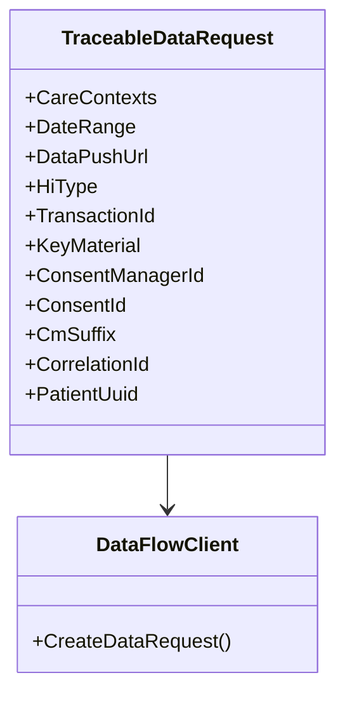

# Basic Concepts of Traceable Data Request Model

The Traceable Data Request Model encapsulates all the necessary information required to request patient data. This model includes details such as care contexts, date range, data push URL, health information types, transaction ID, key material, consent manager ID, consent ID, CM suffix, correlation ID, and patient UUID.

# Purpose and Usage

The <SwmToken path="src/In.ProjectEKA.HipLibrary/Patient/Model/TraceableDataRequest.cs" pos="8:3:3" line-data="        public TraceableDataRequest(">`TraceableDataRequest`</SwmToken> class is used to create instances of data requests that can be traced back using the provided identifiers and context information. This ensures that each data request can be uniquely identified and tracked throughout its lifecycle.

<SwmSnippet path="/src/In.ProjectEKA.HipLibrary/Patient/Model/TraceableDataRequest.cs" line="8">

---

The constructor of the <SwmToken path="src/In.ProjectEKA.HipLibrary/Patient/Model/TraceableDataRequest.cs" pos="8:3:3" line-data="        public TraceableDataRequest(">`TraceableDataRequest`</SwmToken> class initializes the object with various parameters such as care contexts, date range, data push URL, health information types, transaction ID, key material, consent manager ID, consent ID, CM suffix, correlation ID, and patient UUID. This ensures that all necessary information is encapsulated within the object for making a traceable data request.

```c#
        public TraceableDataRequest(
            IEnumerable<GrantedContext> careContexts,
            DateRange dateRange,
            string dataPushUrl,
            IEnumerable<HiType> hiType,
            string transactionId,
            KeyMaterial keyMaterial,
            string consentManagerId,
            string consentId,
            string cmSuffix,
            string correlationId,
            string patientUuid
            )
```

---

</SwmSnippet>

<SwmSnippet path="/src/In.ProjectEKA.HipLibrary/Patient/Model/TraceableDataRequest.cs" line="47">

---

The <SwmToken path="src/In.ProjectEKA.HipLibrary/Patient/Model/TraceableDataRequest.cs" pos="47:7:7" line-data="        public override string ToString()">`ToString`</SwmToken> method in the <SwmToken path="src/In.ProjectEKA.HipLibrary/Patient/Model/TraceableDataRequest.cs" pos="8:3:3" line-data="        public TraceableDataRequest(">`TraceableDataRequest`</SwmToken> class provides a string representation of the data request, including the health information types. This method is useful for logging and debugging purposes, allowing developers to easily view the contents of a data request.

```c#
        public override string ToString()
        {
            var hiTypes = HiType
                .Select(hiType => hiType.ToString())
                .Aggregate("", (source, value) => source + " " + value);
            return $"Data Request with {hiTypes}";
        }
```

---

</SwmSnippet>

# Integration in Codebase

The <SwmToken path="src/In.ProjectEKA.HipLibrary/Patient/Model/TraceableDataRequest.cs" pos="8:3:3" line-data="        public TraceableDataRequest(">`TraceableDataRequest`</SwmToken> class is utilized in various parts of the codebase, such as in the <SwmToken path="src/In.ProjectEKA.HipService/DataFlow/CollectHipService.cs" pos="16:5:5" line-data="    public class CollectHipService : ICollectHipService">`CollectHipService`</SwmToken>, `Collect`, `ICollect`, <SwmToken path="src/In.ProjectEKA.HipService/DataFlow/CollectHipService.cs" pos="16:9:9" line-data="    public class CollectHipService : ICollectHipService">`ICollectHipService`</SwmToken>, `MessagingQueueListener`, `DataFlowClient`, and `DataFlowMessageHandler` classes. These usages demonstrate how the traceable data request model is integrated into the data flow and patient data collection processes.

<SwmSnippet path="/src/In.ProjectEKA.HipService/DataFlow/CollectHipService.cs" line="25">

---

The <SwmToken path="src/In.ProjectEKA.HipService/DataFlow/CollectHipService.cs" pos="25:14:14" line-data="        public async Task&lt;Option&lt;Entries&gt;&gt; CollectData(TraceableDataRequest dataRequest)">`TraceableDataRequest`</SwmToken> class is used in the <SwmToken path="src/In.ProjectEKA.HipService/DataFlow/CollectHipService.cs" pos="16:5:5" line-data="    public class CollectHipService : ICollectHipService">`CollectHipService`</SwmToken> class to collect patient data and log the data request.

```c#
        public async Task<Option<Entries>> CollectData(TraceableDataRequest dataRequest)
        {
```

---

</SwmSnippet>



&nbsp;

*This is an auto-generated document by Swimm 🌊 and has not yet been verified by a human*

<SwmMeta version="3.0.0" repo-id="Z2l0aHViJTNBJTNBaGlwLXNlcnZpY2UlM0ElM0FTd2ltbS1EZW1v" repo-name="hip-service"><sup>Powered by [Swimm](/)</sup></SwmMeta>
