In this document, we will explain the process of ensuring that data is correctly sent to the Health Information User (HIU) and that the gateway is notified appropriately. This involves setting up necessary configurations and mocks, initializing the <SwmToken path="test/In.ProjectEKA.HipServiceTest/DataFlow/DataFlowClientTest.cs" pos="49:9:9" line-data="            var dataFlowClient = new DataFlowClient(httpClient, dataFlowNotificationClient.Object, configuration);">`DataFlowClient`</SwmToken>, and simulating the data flow process.

The flow starts by setting up the necessary configurations and mocks for testing. This includes initializing the <SwmToken path="test/In.ProjectEKA.HipServiceTest/DataFlow/DataFlowClientTest.cs" pos="49:9:9" line-data="            var dataFlowClient = new DataFlowClient(httpClient, dataFlowNotificationClient.Object, configuration);">`DataFlowClient`</SwmToken> with a mock <SwmToken path="test/In.ProjectEKA.HipServiceTest/DataFlow/DataFlowClientTest.cs" pos="29:11:11" line-data="            var dataFlowNotificationClient = new Mock&lt;DataFlowNotificationClient&gt;(MockBehavior.Strict, null);">`DataFlowNotificationClient`</SwmToken> and an HTTP client. The process then involves simulating the data flow to verify that the data is sent correctly to the HIU and that the gateway is notified appropriately. This ensures that the data flow process works as expected in a controlled test environment.

# Flow drill down

```mermaid
graph TD;
      subgraph srcInProjectEKAHipServiceDataFlow["src/In.ProjectEKA.HipService/DataFlow"]
657838290b789a330e07a41009d85047da89683ab3c85edfb469e432af502bef(ShouldReturnDataComponent) --> c9d796bfd5d9245dda9e6770a132540969064581b0d206bd5244e6c71f05a59a(SendDataToHiu)
end

subgraph srcInProjectEKAHipServiceDataFlow["src/In.ProjectEKA.HipService/DataFlow"]
c9d796bfd5d9245dda9e6770a132540969064581b0d206bd5244e6c71f05a59a(SendDataToHiu) --> de87029b085ba0bfbc501cb4d0247fd17ec5da0b704ca2f6678c47ee2ee54d3e(PostTo)
end

subgraph srcInProjectEKAHipServiceDataFlow["src/In.ProjectEKA.HipService/DataFlow"]
de87029b085ba0bfbc501cb4d0247fd17ec5da0b704ca2f6678c47ee2ee54d3e(PostTo) --> bf771a0a0b89d8a519e583a8ccb25b40f0a10871f9290ba76de4d45fc238a5a6(GetDataNotificationRequest)
end

subgraph srcInProjectEKAHipServiceDataFlow["src/In.ProjectEKA.HipService/DataFlow"]
bf771a0a0b89d8a519e583a8ccb25b40f0a10871f9290ba76de4d45fc238a5a6(GetDataNotificationRequest) --> b606a099c9228225dda5462a248d2bdc1deac70e74cff407cac66d79cfa3dca8(NotifyGateway)
end


      classDef mainFlowStyle color:#000000,fill:#7CB9F4
classDef rootsStyle color:#000000,fill:#00FFF4
classDef Style1 color:#000000,fill:#00FFAA
classDef Style2 color:#000000,fill:#FFFF00
classDef Style3 color:#000000,fill:#AA7CB9
```



<SwmSnippet path="/test/In.ProjectEKA.HipServiceTest/DataFlow/DataFlowClientTest.cs" line="25">

---

## <SwmToken path="test/In.ProjectEKA.HipServiceTest/DataFlow/DataFlowClientTest.cs" pos="26:5:5" line-data="        private void ShouldReturnDataComponent()">`ShouldReturnDataComponent`</SwmToken>

First, the <SwmToken path="test/In.ProjectEKA.HipServiceTest/DataFlow/DataFlowClientTest.cs" pos="26:5:5" line-data="        private void ShouldReturnDataComponent()">`ShouldReturnDataComponent`</SwmToken> function sets up the necessary configurations and mocks for testing the data flow. It initializes the <SwmToken path="test/In.ProjectEKA.HipServiceTest/DataFlow/DataFlowClientTest.cs" pos="49:9:9" line-data="            var dataFlowClient = new DataFlowClient(httpClient, dataFlowNotificationClient.Object, configuration);">`DataFlowClient`</SwmToken> with a mock <SwmToken path="test/In.ProjectEKA.HipServiceTest/DataFlow/DataFlowClientTest.cs" pos="29:11:11" line-data="            var dataFlowNotificationClient = new Mock&lt;DataFlowNotificationClient&gt;(MockBehavior.Strict, null);">`DataFlowNotificationClient`</SwmToken> and an HTTP client. This setup is crucial for simulating the data flow process and verifying that the data is sent correctly to the HIU and the gateway is notified appropriately.

```c#
        [Fact]
        private void ShouldReturnDataComponent()
        {
            const string gatewayUrl = "https://root/central-registry";
            var dataFlowNotificationClient = new Mock<DataFlowNotificationClient>(MockBehavior.Strict, null);
            var configuration = new GatewayConfiguration
            {
                Url = gatewayUrl,
                ClientId = "IN0410000183",
                ClientSecret = TestBuilder.RandomString()
            };
            const string transactionId = "transactionId";
            var handlerMock = new Mock<HttpMessageHandler>(MockBehavior.Strict);
            var httpClient = new HttpClient(handlerMock.Object);
            var dataRequest = TestBuilder.TraceableDataRequest(transactionId);
            var content = TestBuilder.Faker().Random.String();
            var checksum = TestBuilder.Faker().Random.Hash();
            var dataNotificationRequest = TestBuilder.DataNotificationRequest(transactionId);
            var correlationId = Uuid.Generate().ToString();
            var entries = new List<Entry>
            {
```

---

</SwmSnippet>

&nbsp;

*This is an auto-generated document by Swimm 🌊 and has not yet been verified by a human*

<SwmMeta version="3.0.0" repo-id="Z2l0aHViJTNBJTNBaGlwLXNlcnZpY2UlM0ElM0FTd2ltbS1EZW1v" repo-name="hip-service"><sup>Powered by [Swimm](/)</sup></SwmMeta>
