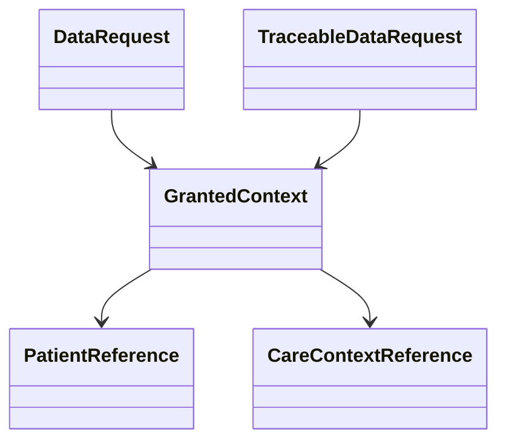

## Overview

The <SwmToken path="src/In.ProjectEKA.HipLibrary/Patient/Model/GrantedContext.cs" pos="3:5:5" line-data="    public class GrantedContext">`GrantedContext`</SwmToken> class represents the context granted to a patient for accessing their health information. It contains two properties: <SwmToken path="src/In.ProjectEKA.HipLibrary/Patient/Model/GrantedContext.cs" pos="7:1:1" line-data="            PatientReference = patientReference;">`PatientReference`</SwmToken> and <SwmToken path="src/In.ProjectEKA.HipLibrary/Patient/Model/GrantedContext.cs" pos="8:1:1" line-data="            CareContextReference = careContextReference;">`CareContextReference`</SwmToken>, which store references to the patient and the specific care context respectively. The constructor of the <SwmToken path="src/In.ProjectEKA.HipLibrary/Patient/Model/GrantedContext.cs" pos="3:5:5" line-data="    public class GrantedContext">`GrantedContext`</SwmToken> class initializes these properties with the provided patient and care context references.

<SwmSnippet path="/src/In.ProjectEKA.HipLibrary/Patient/Model/GrantedContext.cs" line="3">

---

The <SwmToken path="src/In.ProjectEKA.HipLibrary/Patient/Model/GrantedContext.cs" pos="3:5:5" line-data="    public class GrantedContext">`GrantedContext`</SwmToken> class is defined here with its properties and constructor.

```c#
    public class GrantedContext
    {
        public GrantedContext(string patientReference, string careContextReference)
        {
            PatientReference = patientReference;
            CareContextReference = careContextReference;
        }

        public string PatientReference { get; }

        public string CareContextReference { get; }
    }
```

---

</SwmSnippet>

## Usage in <SwmToken path="src/In.ProjectEKA.HipLibrary/Patient/Model/DataRequest.cs" pos="6:5:5" line-data="    public class DataRequest">`DataRequest`</SwmToken>

In the <SwmToken path="src/In.ProjectEKA.HipLibrary/Patient/Model/DataRequest.cs" pos="6:5:5" line-data="    public class DataRequest">`DataRequest`</SwmToken> class, the <SwmToken path="src/In.ProjectEKA.HipLibrary/Patient/Model/GrantedContext.cs" pos="3:5:5" line-data="    public class GrantedContext">`GrantedContext`</SwmToken> is used to store the care contexts that have been granted for a particular data request.

<SwmSnippet path="/src/In.ProjectEKA.HipLibrary/Patient/Model/DataRequest.cs" line="30">

---

The <SwmToken path="src/In.ProjectEKA.HipLibrary/Patient/Model/DataRequest.cs" pos="30:8:8" line-data="        public IEnumerable&lt;GrantedContext&gt; CareContexts { get; }">`CareContexts`</SwmToken> property in the <SwmToken path="src/In.ProjectEKA.HipLibrary/Patient/Model/DataRequest.cs" pos="6:5:5" line-data="    public class DataRequest">`DataRequest`</SwmToken> class holds the granted care contexts.

```c#
        public IEnumerable<GrantedContext> CareContexts { get; }
        public DateRange DateRange { get; }
```

---

</SwmSnippet>

## Usage in <SwmToken path="src/In.ProjectEKA.HipLibrary/Patient/Model/TraceableDataRequest.cs" pos="8:3:3" line-data="        public TraceableDataRequest(">`TraceableDataRequest`</SwmToken>

In the <SwmToken path="src/In.ProjectEKA.HipLibrary/Patient/Model/TraceableDataRequest.cs" pos="8:3:3" line-data="        public TraceableDataRequest(">`TraceableDataRequest`</SwmToken> class, the <SwmToken path="src/In.ProjectEKA.HipLibrary/Patient/Model/GrantedContext.cs" pos="3:5:5" line-data="    public class GrantedContext">`GrantedContext`</SwmToken> is used to store the care contexts that have been granted for a particular data request.

<SwmSnippet path="/src/In.ProjectEKA.HipLibrary/Patient/Model/TraceableDataRequest.cs" line="8">

---

The constructor of the <SwmToken path="src/In.ProjectEKA.HipLibrary/Patient/Model/TraceableDataRequest.cs" pos="8:3:3" line-data="        public TraceableDataRequest(">`TraceableDataRequest`</SwmToken> class initializes various properties including <SwmToken path="src/In.ProjectEKA.HipLibrary/Patient/Model/TraceableDataRequest.cs" pos="22:1:1" line-data="            CareContexts = careContexts;">`CareContexts`</SwmToken> which holds the granted care contexts.

```c#
        public TraceableDataRequest(
            IEnumerable<GrantedContext> careContexts,
            DateRange dateRange,
            string dataPushUrl,
            IEnumerable<HiType> hiType,
            string transactionId,
            KeyMaterial keyMaterial,
            string consentManagerId,
            string consentId,
            string cmSuffix,
            string correlationId,
            string patientUuid
            )
        {
            CareContexts = careContexts;
            DateRange = dateRange;
            DataPushUrl = dataPushUrl;
            HiType = hiType;
            TransactionId = transactionId;
            KeyMaterial = keyMaterial;
            ConsentManagerId = consentManagerId;
```

---

</SwmSnippet>

## Main Functions

The main functions of the <SwmToken path="src/In.ProjectEKA.HipLibrary/Patient/Model/GrantedContext.cs" pos="3:5:5" line-data="    public class GrantedContext">`GrantedContext`</SwmToken> class include its constructor and the properties <SwmToken path="src/In.ProjectEKA.HipLibrary/Patient/Model/GrantedContext.cs" pos="7:1:1" line-data="            PatientReference = patientReference;">`PatientReference`</SwmToken> and <SwmToken path="src/In.ProjectEKA.HipLibrary/Patient/Model/GrantedContext.cs" pos="8:1:1" line-data="            CareContextReference = careContextReference;">`CareContextReference`</SwmToken>.

### <SwmToken path="src/In.ProjectEKA.HipLibrary/Patient/Model/GrantedContext.cs" pos="3:5:5" line-data="    public class GrantedContext">`GrantedContext`</SwmToken> Constructor

The <SwmToken path="src/In.ProjectEKA.HipLibrary/Patient/Model/GrantedContext.cs" pos="3:5:5" line-data="    public class GrantedContext">`GrantedContext`</SwmToken> constructor initializes the <SwmToken path="src/In.ProjectEKA.HipLibrary/Patient/Model/GrantedContext.cs" pos="7:1:1" line-data="            PatientReference = patientReference;">`PatientReference`</SwmToken> and <SwmToken path="src/In.ProjectEKA.HipLibrary/Patient/Model/GrantedContext.cs" pos="8:1:1" line-data="            CareContextReference = careContextReference;">`CareContextReference`</SwmToken> properties with the provided values.

<SwmSnippet path="/src/In.ProjectEKA.HipLibrary/Patient/Model/GrantedContext.cs" line="5">

---

The constructor of the <SwmToken path="src/In.ProjectEKA.HipLibrary/Patient/Model/GrantedContext.cs" pos="5:3:3" line-data="        public GrantedContext(string patientReference, string careContextReference)">`GrantedContext`</SwmToken> class.

```c#
        public GrantedContext(string patientReference, string careContextReference)
        {
            PatientReference = patientReference;
            CareContextReference = careContextReference;
        }
```

---

</SwmSnippet>

### <SwmToken path="src/In.ProjectEKA.HipLibrary/Patient/Model/GrantedContext.cs" pos="7:1:1" line-data="            PatientReference = patientReference;">`PatientReference`</SwmToken> Property

The <SwmToken path="src/In.ProjectEKA.HipLibrary/Patient/Model/GrantedContext.cs" pos="7:1:1" line-data="            PatientReference = patientReference;">`PatientReference`</SwmToken> property stores the reference to the patient.

<SwmSnippet path="/src/In.ProjectEKA.HipLibrary/Patient/Model/GrantedContext.cs" line="11">

---

The <SwmToken path="src/In.ProjectEKA.HipLibrary/Patient/Model/GrantedContext.cs" pos="11:5:5" line-data="        public string PatientReference { get; }">`PatientReference`</SwmToken> property in the <SwmToken path="src/In.ProjectEKA.HipLibrary/Patient/Model/GrantedContext.cs" pos="3:5:5" line-data="    public class GrantedContext">`GrantedContext`</SwmToken> class.

```c#
        public string PatientReference { get; }
```

---

</SwmSnippet>

### <SwmToken path="src/In.ProjectEKA.HipLibrary/Patient/Model/GrantedContext.cs" pos="8:1:1" line-data="            CareContextReference = careContextReference;">`CareContextReference`</SwmToken> Property

The <SwmToken path="src/In.ProjectEKA.HipLibrary/Patient/Model/GrantedContext.cs" pos="8:1:1" line-data="            CareContextReference = careContextReference;">`CareContextReference`</SwmToken> property stores the reference to the specific care context.

<SwmSnippet path="/src/In.ProjectEKA.HipLibrary/Patient/Model/GrantedContext.cs" line="13">

---

The <SwmToken path="src/In.ProjectEKA.HipLibrary/Patient/Model/GrantedContext.cs" pos="13:5:5" line-data="        public string CareContextReference { get; }">`CareContextReference`</SwmToken> property in the <SwmToken path="src/In.ProjectEKA.HipLibrary/Patient/Model/GrantedContext.cs" pos="3:5:5" line-data="    public class GrantedContext">`GrantedContext`</SwmToken> class.

```c#
        public string CareContextReference { get; }
```

---

</SwmSnippet>

## Granted Context Endpoints

The <SwmToken path="src/In.ProjectEKA.HipLibrary/Patient/Model/GrantedContext.cs" pos="3:5:5" line-data="    public class GrantedContext">`GrantedContext`</SwmToken> class is used in various endpoints to represent the granted care contexts for a data request.



&nbsp;

*This is an auto-generated document by Swimm 🌊 and has not yet been verified by a human*

<SwmMeta version="3.0.0" repo-id="Z2l0aHViJTNBJTNBaGlwLXNlcnZpY2UlM0ElM0FTd2ltbS1EZW1v" repo-name="hip-service"><sup>Powered by [Swimm](/)</sup></SwmMeta>
