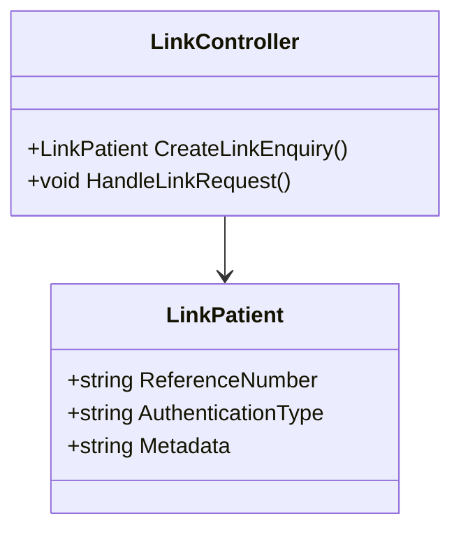

# Link Enquiry Representation Model

The <SwmToken path="src/In.ProjectEKA.HipLibrary/Patient/Model/LinkEnquiryRepresentation.cs" pos="3:5:5" line-data="    public class LinkEnquiryRepresentation">`LinkEnquiryRepresentation`</SwmToken> class encapsulates the details required for linking a patient's account. It includes properties such as the reference number, authentication type, and metadata.

<SwmSnippet path="/src/In.ProjectEKA.HipLibrary/Patient/Model/LinkEnquiryRepresentation.cs" line="3">

---

The <SwmToken path="src/In.ProjectEKA.HipLibrary/Patient/Model/LinkEnquiryRepresentation.cs" pos="3:5:5" line-data="    public class LinkEnquiryRepresentation">`LinkEnquiryRepresentation`</SwmToken> class is defined here with its properties and constructors. The parameterless constructor initializes a new instance of the class without setting any properties, while the parameterized constructor initializes a new instance of the class with the specified reference number, authentication type, and metadata.

```c#
    public class LinkEnquiryRepresentation
    {
        public LinkEnquiryRepresentation()
        {
        }

        public LinkEnquiryRepresentation(string referenceNumber, string authenticationType, LinkReferenceMeta meta)
        {
            ReferenceNumber = referenceNumber;
            AuthenticationType = authenticationType;
            Meta = meta;
        }

        public string ReferenceNumber { get; }

        public string AuthenticationType { get; }

        public LinkReferenceMeta Meta { get; }
    }
```

---

</SwmSnippet>

<SwmSnippet path="/src/In.ProjectEKA.HipLibrary/Patient/Model/LinkEnquiryRepresentation.cs" line="16">

---

The properties <SwmToken path="src/In.ProjectEKA.HipLibrary/Patient/Model/LinkEnquiryRepresentation.cs" pos="16:5:5" line-data="        public string ReferenceNumber { get; }">`ReferenceNumber`</SwmToken>, <SwmToken path="src/In.ProjectEKA.HipLibrary/Patient/Model/LinkEnquiryRepresentation.cs" pos="18:5:5" line-data="        public string AuthenticationType { get; }">`AuthenticationType`</SwmToken>, and <SwmToken path="src/In.ProjectEKA.HipLibrary/Patient/Model/LinkEnquiryRepresentation.cs" pos="20:5:5" line-data="        public LinkReferenceMeta Meta { get; }">`Meta`</SwmToken> are defined here. These properties are used to store the details of the link enquiry.

```c#
        public string ReferenceNumber { get; }

        public string AuthenticationType { get; }

        public LinkReferenceMeta Meta { get; }
```

---

</SwmSnippet>

# Usage in <SwmToken path="src/In.ProjectEKA.HipService/Link/LinkPatient.cs" pos="22:5:5" line-data="    public class LinkPatient">`LinkPatient`</SwmToken> Class

In the <SwmToken path="src/In.ProjectEKA.HipService/Link/LinkPatient.cs" pos="22:5:5" line-data="    public class LinkPatient">`LinkPatient`</SwmToken> class, <SwmToken path="src/In.ProjectEKA.HipLibrary/Patient/Model/LinkEnquiryRepresentation.cs" pos="3:5:5" line-data="    public class LinkEnquiryRepresentation">`LinkEnquiryRepresentation`</SwmToken> is used to create a new link enquiry representation.

<SwmSnippet path="/src/In.ProjectEKA.HipService/Link/LinkPatient.cs" line="105">

---

The <SwmToken path="src/In.ProjectEKA.HipService/Link/LinkPatient.cs" pos="106:3:3" line-data="                new LinkEnquiryRepresentation(linkRefNumber, &quot;MEDIATED&quot;, meta));">`LinkEnquiryRepresentation`</SwmToken> is instantiated with the reference number, authentication type, and metadata in the <SwmToken path="src/In.ProjectEKA.HipService/Link/LinkPatient.cs" pos="22:5:5" line-data="    public class LinkPatient">`LinkPatient`</SwmToken> class.

```c#
            var patientLinkReferenceResponse = new PatientLinkEnquiryRepresentation(
                new LinkEnquiryRepresentation(linkRefNumber, "MEDIATED", meta));
            return (patientLinkReferenceResponse, null);
```

---

</SwmSnippet>

# Usage in <SwmToken path="src/In.ProjectEKA.HipService/Link/LinkController.cs" pos="24:5:5" line-data="    public class LinkController : ControllerBase">`LinkController`</SwmToken>

In the <SwmToken path="src/In.ProjectEKA.HipService/Link/LinkController.cs" pos="24:5:5" line-data="    public class LinkController : ControllerBase">`LinkController`</SwmToken>, <SwmToken path="src/In.ProjectEKA.HipLibrary/Patient/Model/LinkEnquiryRepresentation.cs" pos="3:5:5" line-data="    public class LinkEnquiryRepresentation">`LinkEnquiryRepresentation`</SwmToken> is used to handle link patient requests.

<SwmSnippet path="/src/In.ProjectEKA.HipService/Link/LinkController.cs" line="103">

---

The <SwmToken path="src/In.ProjectEKA.HipService/Link/LinkController.cs" pos="104:9:9" line-data="                var linkedPatientRepresentation = new LinkEnquiryRepresentation();">`LinkEnquiryRepresentation`</SwmToken> is used to handle link patient requests in the <SwmToken path="src/In.ProjectEKA.HipService/Link/LinkController.cs" pos="24:5:5" line-data="    public class LinkController : ControllerBase">`LinkController`</SwmToken>.

```c#
                    : await linkPatient.LinkPatients(patientReferenceRequest);
                var linkedPatientRepresentation = new LinkEnquiryRepresentation();
                if (linkReferenceResponse != null)
```

---

</SwmSnippet>

# Main Functions

The <SwmToken path="src/In.ProjectEKA.HipLibrary/Patient/Model/LinkEnquiryRepresentation.cs" pos="3:5:5" line-data="    public class LinkEnquiryRepresentation">`LinkEnquiryRepresentation`</SwmToken> class has several main functions, including constructors and properties.

# Constructors

The <SwmToken path="src/In.ProjectEKA.HipLibrary/Patient/Model/LinkEnquiryRepresentation.cs" pos="3:5:5" line-data="    public class LinkEnquiryRepresentation">`LinkEnquiryRepresentation`</SwmToken> class has two constructors. The parameterless constructor initializes a new instance of the class without setting any properties. The parameterized constructor initializes a new instance of the class with the specified reference number, authentication type, and metadata.

<SwmSnippet path="/src/In.ProjectEKA.HipLibrary/Patient/Model/LinkEnquiryRepresentation.cs" line="5">

---

The constructors of the <SwmToken path="src/In.ProjectEKA.HipLibrary/Patient/Model/LinkEnquiryRepresentation.cs" pos="5:3:3" line-data="        public LinkEnquiryRepresentation()">`LinkEnquiryRepresentation`</SwmToken> class are defined here.

```c#
        public LinkEnquiryRepresentation()
        {
        }

        public LinkEnquiryRepresentation(string referenceNumber, string authenticationType, LinkReferenceMeta meta)
        {
            ReferenceNumber = referenceNumber;
            AuthenticationType = authenticationType;
            Meta = meta;
        }
```

---

</SwmSnippet>

# Link Enquiry Representation Endpoints

The <SwmToken path="src/In.ProjectEKA.HipService/Link/LinkPatient.cs" pos="22:5:5" line-data="    public class LinkPatient">`LinkPatient`</SwmToken> class is used to create a new link enquiry representation, and the <SwmToken path="src/In.ProjectEKA.HipService/Link/LinkController.cs" pos="24:5:5" line-data="    public class LinkController : ControllerBase">`LinkController`</SwmToken> handles link patient requests.

## <SwmToken path="src/In.ProjectEKA.HipService/Link/LinkPatient.cs" pos="22:5:5" line-data="    public class LinkPatient">`LinkPatient`</SwmToken>

The <SwmToken path="src/In.ProjectEKA.HipService/Link/LinkPatient.cs" pos="22:5:5" line-data="    public class LinkPatient">`LinkPatient`</SwmToken> class is used to create a new link enquiry representation. It includes properties such as the reference number, authentication type, and metadata.

<SwmSnippet path="/src/In.ProjectEKA.HipService/Link/LinkPatient.cs" line="10">

---

The <SwmToken path="src/In.ProjectEKA.HipService/Link/LinkPatient.cs" pos="22:5:5" line-data="    public class LinkPatient">`LinkPatient`</SwmToken> class is defined here with its properties and methods.

```c#
    using System.Linq;
    using System.Threading.Tasks;
    using System.Transactions;
    using Common;
    using Discovery;
    using HipLibrary.Patient;
    using HipLibrary.Patient.Model;
    using Logger;
    using Microsoft.Extensions.Options;
    using Model;
    using static In.ProjectEKA.HipService.Discovery.DiscoveryReqMap;
```

---

</SwmSnippet>

## <SwmToken path="src/In.ProjectEKA.HipService/Link/LinkController.cs" pos="24:5:5" line-data="    public class LinkController : ControllerBase">`LinkController`</SwmToken>

The <SwmToken path="src/In.ProjectEKA.HipService/Link/LinkController.cs" pos="24:5:5" line-data="    public class LinkController : ControllerBase">`LinkController`</SwmToken> handles link patient requests. It uses the <SwmToken path="src/In.ProjectEKA.HipService/Link/LinkPatient.cs" pos="22:5:5" line-data="    public class LinkPatient">`LinkPatient`</SwmToken> class to create a new link enquiry representation and processes the request accordingly.

<SwmSnippet path="/src/In.ProjectEKA.HipService/Link/LinkController.cs" line="15">

---

The <SwmToken path="src/In.ProjectEKA.HipService/Link/LinkController.cs" pos="24:5:5" line-data="    public class LinkController : ControllerBase">`LinkController`</SwmToken> class is defined here with its methods for handling link patient requests.

```c#
    using Microsoft.AspNetCore.Mvc;
    using Microsoft.AspNetCore.Mvc.ModelBinding;
    using static Common.Constants;
    using Model;

    [Authorize]
    [ApiController]
    [Consumes("application/json")]
    [Produces("application/json")]
    public class LinkController : ControllerBase
    {
```

---

</SwmSnippet>



&nbsp;

*This is an auto-generated document by Swimm 🌊 and has not yet been verified by a human*

<SwmMeta version="3.0.0" repo-id="Z2l0aHViJTNBJTNBaGlwLXNlcnZpY2UlM0ElM0FTd2ltbS1EZW1v" repo-name="hip-service"><sup>Powered by [Swimm](/)</sup></SwmMeta>
