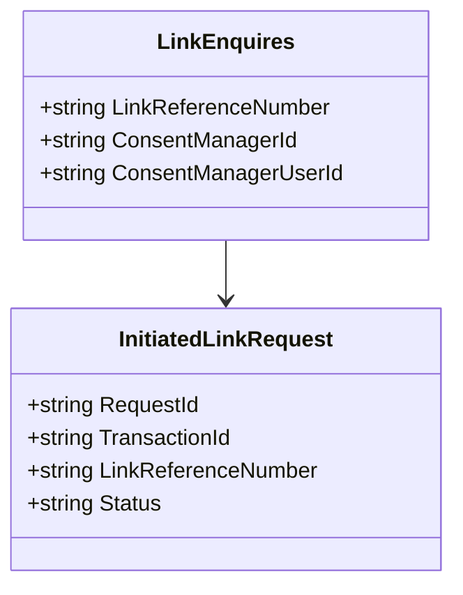

## What is Model

The <SwmToken path="src/In.ProjectEKA.HipService/Link/Model/LinkEnquires.cs" pos="1:10:10" line-data="namespace In.ProjectEKA.HipService.Link.Model">`Model`</SwmToken> in the <SwmToken path="src/In.ProjectEKA.HipService/Link/Model/LinkEnquires.cs" pos="1:8:8" line-data="namespace In.ProjectEKA.HipService.Link.Model">`Link`</SwmToken> directory contains classes that represent the data structures used for linking patient accounts with a Consent Manager. These models are essential for handling the linking process, storing necessary information, and ensuring the correct flow of data between the patient and the Consent Manager.

## How to use Model

These models are used to manage the state and identification of link requests, store information about the link request, and ensure the correct flow of data between the patient and the Consent Manager. For example, the <SwmToken path="src/In.ProjectEKA.HipService/Link/Model/LinkEnquires.cs" pos="6:5:5" line-data="    public class LinkEnquires">`LinkEnquires`</SwmToken> class includes properties such as <SwmToken path="src/In.ProjectEKA.HipService/Link/Model/LinkEnquires.cs" pos="21:1:1" line-data="            LinkReferenceNumber = linkReferenceNumber;">`LinkReferenceNumber`</SwmToken>, <SwmToken path="src/In.ProjectEKA.HipService/Link/Model/LinkEnquires.cs" pos="22:1:1" line-data="            ConsentManagerId = consentManagerId;">`ConsentManagerId`</SwmToken>, and <SwmToken path="src/In.ProjectEKA.HipService/Link/Model/LinkEnquires.cs" pos="23:1:1" line-data="            ConsentManagerUserId = consentManagerUserId;">`ConsentManagerUserId`</SwmToken> to store information about the link request.

## Where Model is used

The <SwmToken path="src/In.ProjectEKA.HipService/Link/Model/LinkEnquires.cs" pos="1:10:10" line-data="namespace In.ProjectEKA.HipService.Link.Model">`Model`</SwmToken> is used in various files within the <SwmToken path="src/In.ProjectEKA.HipService/Link/Model/LinkEnquires.cs" pos="1:8:8" line-data="namespace In.ProjectEKA.HipService.Link.Model">`Link`</SwmToken> directory, such as <SwmToken path="src/In.ProjectEKA.HipService/Link/Model/LinkEnquires.cs" pos="6:5:5" line-data="    public class LinkEnquires">`LinkEnquires`</SwmToken>, <SwmToken path="src/In.ProjectEKA.HipService/Link/Model/InitiatedLinkRequest.cs" pos="5:5:5" line-data="    public class InitiatedLinkRequest">`InitiatedLinkRequest`</SwmToken>, `AuthModeFetch`, `AuthOnInitRequest`, and many others.

<SwmSnippet path="/src/In.ProjectEKA.HipService/Link/Model/LinkEnquires.cs" line="1">

---

The <SwmToken path="src/In.ProjectEKA.HipService/Link/Model/LinkEnquires.cs" pos="6:5:5" line-data="    public class LinkEnquires">`LinkEnquires`</SwmToken> class includes properties such as <SwmToken path="src/In.ProjectEKA.HipService/Link/Model/LinkEnquires.cs" pos="21:1:1" line-data="            LinkReferenceNumber = linkReferenceNumber;">`LinkReferenceNumber`</SwmToken>, <SwmToken path="src/In.ProjectEKA.HipService/Link/Model/LinkEnquires.cs" pos="22:1:1" line-data="            ConsentManagerId = consentManagerId;">`ConsentManagerId`</SwmToken>, and <SwmToken path="src/In.ProjectEKA.HipService/Link/Model/LinkEnquires.cs" pos="23:1:1" line-data="            ConsentManagerUserId = consentManagerUserId;">`ConsentManagerUserId`</SwmToken> to store information about the link request.

```c#
namespace In.ProjectEKA.HipService.Link.Model
```

---

</SwmSnippet>

<SwmSnippet path="/src/In.ProjectEKA.HipService/Link/Model/InitiatedLinkRequest.cs" line="1">

---

The <SwmToken path="src/In.ProjectEKA.HipService/Link/Model/InitiatedLinkRequest.cs" pos="5:5:5" line-data="    public class InitiatedLinkRequest">`InitiatedLinkRequest`</SwmToken> class includes properties like <SwmToken path="src/In.ProjectEKA.HipService/Link/Model/InitiatedLinkRequest.cs" pos="13:1:1" line-data="            RequestId = requestId;">`RequestId`</SwmToken>, <SwmToken path="src/In.ProjectEKA.HipService/Link/Model/InitiatedLinkRequest.cs" pos="14:1:1" line-data="            TransactionId = transactionId;">`TransactionId`</SwmToken>, <SwmToken path="src/In.ProjectEKA.HipService/Link/Model/LinkEnquires.cs" pos="21:1:1" line-data="            LinkReferenceNumber = linkReferenceNumber;">`LinkReferenceNumber`</SwmToken>, and <SwmToken path="src/In.ProjectEKA.HipService/Link/Model/InitiatedLinkRequest.cs" pos="16:1:1" line-data="            Status = status;">`Status`</SwmToken> to manage the state and identification of the link request.

```c#
namespace In.ProjectEKA.HipService.Link.Model
```

---

</SwmSnippet>



&nbsp;

*This is an auto-generated document by Swimm 🌊 and has not yet been verified by a human*

<SwmMeta version="3.0.0" repo-id="Z2l0aHViJTNBJTNBaGlwLXNlcnZpY2UlM0ElM0FTd2ltbS1EZW1v" repo-name="hip-service"><sup>Powered by [Swimm](/)</sup></SwmMeta>
