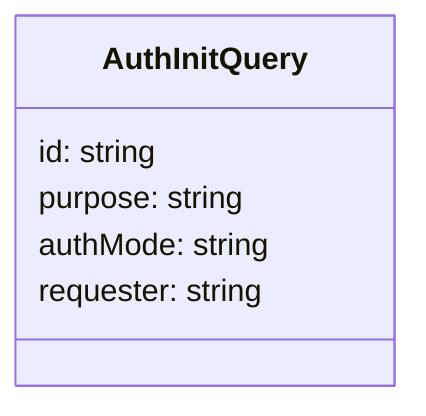
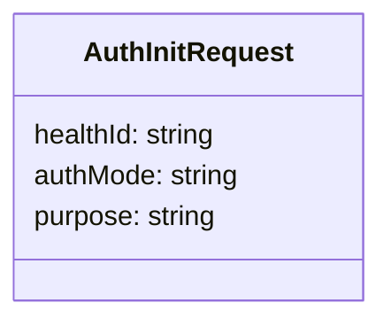

## Overview

User authentication models are essential for defining the structure and data required for user authentication processes. These models ensure that all necessary information is included in the authentication requests and responses.

## <SwmToken path="src/In.ProjectEKA.HipService/UserAuth/Model/AuthInitQuery.cs" pos="5:5:5" line-data="    public class AuthInitQuery">`AuthInitQuery`</SwmToken> Class

The <SwmToken path="src/In.ProjectEKA.HipService/UserAuth/Model/AuthInitQuery.cs" pos="5:5:5" line-data="    public class AuthInitQuery">`AuthInitQuery`</SwmToken> class in the <SwmToken path="src/In.ProjectEKA.HipService/UserAuth/Model/AuthInitQuery.cs" pos="3:10:10" line-data="namespace In.ProjectEKA.HipService.UserAuth.Model">`Model`</SwmToken> namespace includes properties such as <SwmToken path="src/In.ProjectEKA.HipService/UserAuth/Model/AuthInitQuery.cs" pos="7:5:5" line-data="        public string id { get; }">`id`</SwmToken>, <SwmToken path="src/In.ProjectEKA.HipService/UserAuth/Model/AuthInitQuery.cs" pos="8:5:5" line-data="        public string purpose { get; } = KYC_AND_LINK;">`purpose`</SwmToken>, <SwmToken path="src/In.ProjectEKA.HipService/UserAuth/Model/AuthInitQuery.cs" pos="9:5:5" line-data="        public string authMode { get; }">`authMode`</SwmToken>, and <SwmToken path="src/In.ProjectEKA.HipService/UserAuth/Model/AuthInitQuery.cs" pos="10:5:5" line-data="        public Requester requester { get; }">`requester`</SwmToken>. These properties are essential for initializing an authentication request.

<SwmSnippet path="/src/In.ProjectEKA.HipService/UserAuth/Model/AuthInitQuery.cs" line="3">

---

The <SwmToken path="src/In.ProjectEKA.HipService/UserAuth/Model/AuthInitQuery.cs" pos="5:5:5" line-data="    public class AuthInitQuery">`AuthInitQuery`</SwmToken> class is defined in the <SwmToken path="src/In.ProjectEKA.HipService/UserAuth/Model/AuthInitQuery.cs" pos="3:10:10" line-data="namespace In.ProjectEKA.HipService.UserAuth.Model">`Model`</SwmToken> namespace.

```c#
namespace In.ProjectEKA.HipService.UserAuth.Model
```

---

</SwmSnippet>



## <SwmToken path="src/In.ProjectEKA.HipService/UserAuth/Model/AuthInitRequest.cs" pos="3:5:5" line-data="    public class AuthInitRequest">`AuthInitRequest`</SwmToken> Class

The <SwmToken path="src/In.ProjectEKA.HipService/UserAuth/Model/AuthInitRequest.cs" pos="3:5:5" line-data="    public class AuthInitRequest">`AuthInitRequest`</SwmToken> class includes properties like <SwmToken path="src/In.ProjectEKA.HipService/UserAuth/Model/AuthInitRequest.cs" pos="5:5:5" line-data="        public string healthId { get; }">`healthId`</SwmToken>, <SwmToken path="src/In.ProjectEKA.HipService/UserAuth/Model/AuthInitQuery.cs" pos="9:5:5" line-data="        public string authMode { get; }">`authMode`</SwmToken>, and <SwmToken path="src/In.ProjectEKA.HipService/UserAuth/Model/AuthInitQuery.cs" pos="8:5:5" line-data="        public string purpose { get; } = KYC_AND_LINK;">`purpose`</SwmToken>. These properties are used to create an authentication request.

<SwmSnippet path="/src/In.ProjectEKA.HipService/UserAuth/Model/AuthInitRequest.cs" line="1">

---

The <SwmToken path="src/In.ProjectEKA.HipService/UserAuth/Model/AuthInitRequest.cs" pos="3:5:5" line-data="    public class AuthInitRequest">`AuthInitRequest`</SwmToken> class is defined in the <SwmToken path="src/In.ProjectEKA.HipService/UserAuth/Model/AuthInitRequest.cs" pos="1:10:10" line-data="namespace In.ProjectEKA.HipService.UserAuth.Model">`Model`</SwmToken> namespace.

```c#
namespace In.ProjectEKA.HipService.UserAuth.Model
```

---

</SwmSnippet>



## Usage of Models

These models are used to encapsulate the data required for user authentication. They ensure that all necessary information is included in the authentication requests and responses, facilitating a smooth authentication process.

&nbsp;

*This is an auto-generated document by Swimm 🌊 and has not yet been verified by a human*

<SwmMeta version="3.0.0" repo-id="Z2l0aHViJTNBJTNBaGlwLXNlcnZpY2UlM0ElM0FTd2ltbS1EZW1v" repo-name="hip-service"><sup>Powered by [Swimm](/)</sup></SwmMeta>
