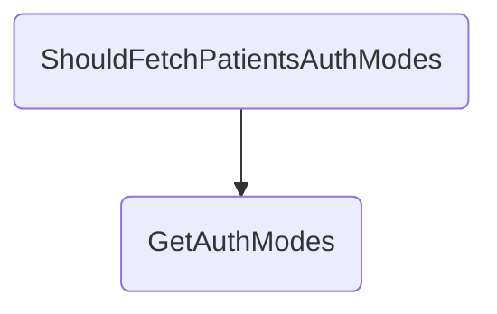

In this document, we will explain the process of fetching patient authentication modes. The process involves setting up necessary request objects, preparing a request representation, setting up a mock response, and handling the request to fetch authentication modes.

The flow starts by setting up the necessary request and requester objects. It then prepares a request representation object that includes the request ID, timestamp, and query details. Next, it sets up a mock response to return the request representation object. The flow then moves to handling the request to fetch authentication modes, where it calls a method to get the request representation object and checks for any errors. It logs the request details and sends the request to the gateway. The flow waits for a response from the gateway, checks for errors or available authentication modes, adds a 'DIRECT' mode to the list if available, and returns the modes as a JSON response. If the gateway times out or an exception occurs, it logs the error and returns an appropriate error message.

# Flow drill down



## <SwmToken path="test/In.ProjectEKA.HipServiceTest/UserAuth/UserAuthControllerTest.cs" pos="64:5:5" line-data="        private void ShouldFetchPatientsAuthModes()">`ShouldFetchPatientsAuthModes`</SwmToken>

First, the <SwmToken path="test/In.ProjectEKA.HipServiceTest/UserAuth/UserAuthControllerTest.cs" pos="64:5:5" line-data="        private void ShouldFetchPatientsAuthModes()">`ShouldFetchPatientsAuthModes`</SwmToken> method sets up the necessary request and requester objects. It creates a <SwmToken path="test/In.ProjectEKA.HipServiceTest/UserAuth/UserAuthControllerTest.cs" pos="66:9:9" line-data="            var request = new FetchRequest(&quot;hina_patel@ncg&quot;, KYC_AND_LINK);">`FetchRequest`</SwmToken> with the patient's health ID and the type of authentication mode required, which in this case is <SwmToken path="test/In.ProjectEKA.HipServiceTest/UserAuth/UserAuthControllerTest.cs" pos="66:18:18" line-data="            var request = new FetchRequest(&quot;hina_patel@ncg&quot;, KYC_AND_LINK);">`KYC_AND_LINK`</SwmToken>.

Next, it prepares a <SwmToken path="test/In.ProjectEKA.HipServiceTest/UserAuth/UserAuthControllerTest.cs" pos="73:3:3" line-data="                new GatewayFetchModesRequestRepresentation(requestId, timeStamp.ToString(DateTimeFormat), query);">`GatewayFetchModesRequestRepresentation`</SwmToken> object that includes the request ID, timestamp, and query details. This object is essential for sending the request to the gateway.

Then, the method sets up a mock response from the <SwmToken path="test/In.ProjectEKA.HipServiceTest/UserAuth/UserAuthControllerTest.cs" pos="83:1:1" line-data="            userAuthService.Setup(a =&gt; a.FetchModeResponse(request, bahmniConfiguration))">`userAuthService`</SwmToken> to return the <SwmToken path="test/In.ProjectEKA.HipServiceTest/UserAuth/UserAuthControllerTest.cs" pos="73:3:3" line-data="                new GatewayFetchModesRequestRepresentation(requestId, timeStamp.ToString(DateTimeFormat), query);">`GatewayFetchModesRequestRepresentation`</SwmToken> object. This mock setup is crucial for testing the flow without making actual calls to the service.

Moving to the <SwmToken path="src/In.ProjectEKA.HipService/UserAuth/UserAuthController.cs" pos="57:10:10" line-data="        public async Task&lt;ActionResult&gt; GetAuthModes(">`GetAuthModes`</SwmToken> method, it defines an endpoint that handles requests to fetch authentication modes. It first calls the <SwmToken path="test/In.ProjectEKA.HipServiceTest/UserAuth/UserAuthControllerTest.cs" pos="83:11:11" line-data="            userAuthService.Setup(a =&gt; a.FetchModeResponse(request, bahmniConfiguration))">`FetchModeResponse`</SwmToken> method from <SwmToken path="test/In.ProjectEKA.HipServiceTest/UserAuth/UserAuthControllerTest.cs" pos="83:1:1" line-data="            userAuthService.Setup(a =&gt; a.FetchModeResponse(request, bahmniConfiguration))">`userAuthService`</SwmToken> to get the <SwmToken path="test/In.ProjectEKA.HipServiceTest/UserAuth/UserAuthControllerTest.cs" pos="73:3:3" line-data="                new GatewayFetchModesRequestRepresentation(requestId, timeStamp.ToString(DateTimeFormat), query);">`GatewayFetchModesRequestRepresentation`</SwmToken> object and checks for any errors.

Then, it logs the request details and sends the request to the gateway using the <SwmToken path="test/In.ProjectEKA.HipServiceTest/UserAuth/UserAuthControllerTest.cs" pos="88:3:3" line-data="                        client.SendDataToGateway(PATH_FETCH_AUTH_MODES,">`SendDataToGateway`</SwmToken> method. This step is critical as it initiates the communication with the gateway to fetch the authentication modes.

The method then enters a loop where it waits for a response from the gateway. It checks if the response contains any errors or if the authentication modes are available. If the modes are available, it adds a 'DIRECT' mode to the list and returns the modes as a JSON response.

<SwmSnippet path="/test/In.ProjectEKA.HipServiceTest/UserAuth/UserAuthControllerTest.cs" line="63">

---

Finally, if the gateway times out or an exception occurs, it logs the error and returns an appropriate error message. This ensures that the client is informed of any issues during the process.

```c#
        [Fact]
        private void ShouldFetchPatientsAuthModes()
        {
            var request = new FetchRequest("hina_patel@ncg", KYC_AND_LINK);
            var requester = new Requester(bahmniConfiguration.Id, HIP);
            var query = new FetchQuery(request.healthId, KYC_AND_LINK, requester);
            var timeStamp = DateTime.Now.ToUniversalTime();
            var requestId = Guid.NewGuid();
            var cmSuffix = "ncg";
            var gatewayFetchModesRequestRepresentation =
                new GatewayFetchModesRequestRepresentation(requestId, timeStamp.ToString(DateTimeFormat), query);
            var correlationId = Uuid.Generate().ToString();
            var modes = new List<Mode>
            {
                {Mode.MOBILE_OTP},
                {Mode.AADHAAR_OTP}
            };
            var onFetchAuthModeRequest = new OnFetchAuthModeRequest(requestId, timeStamp,
                new AuthModeFetch("KYC_AND_LINK", modes), null, new Resp(requestId.ToString()));
            var authModes = string.Join(',', onFetchAuthModeRequest.Auth.Modes);
            userAuthService.Setup(a => a.FetchModeResponse(request, bahmniConfiguration))
```

---

</SwmSnippet>

<SwmSnippet path="/src/In.ProjectEKA.HipService/UserAuth/UserAuthController.cs" line="55">

---

&nbsp;

```c#
        [Authorize(AuthenticationSchemes = BAHMNI_AUTH)]
        [Route(PATH_FETCH_MODES)]
        public async Task<ActionResult> GetAuthModes(
            [FromHeader(Name = CORRELATION_ID)] string correlationId, [FromBody] FetchRequest fetchRequest)
        {
            var (gatewayFetchModesRequestRepresentation, error) =
                userAuthService.FetchModeResponse(fetchRequest, bahmniConfiguration);
            if (error != null)
                return StatusCode(StatusCodes.Status400BadRequest, error);
            Guid requestId = gatewayFetchModesRequestRepresentation.requestId;
            var cmSuffix = gatewayConfiguration.CmSuffix;

            try
            {
                logger.Log(LogLevel.Information,
                    LogEvents.UserAuth,
                    "Request for fetch-modes to gateway: {@GatewayResponse}",
                    gatewayFetchModesRequestRepresentation.dump(gatewayFetchModesRequestRepresentation));
                logger.Log(LogLevel.Information,
                    LogEvents.UserAuth, $"cmSuffix: {{cmSuffix}}, correlationId: {{correlationId}}," +
                                        $" healthId: {{healthId}}, requestId: {{requestId}}",
```

---

</SwmSnippet>

&nbsp;

*This is an auto-generated document by Swimm 🌊 and has not yet been verified by a human*

<SwmMeta version="3.0.0" repo-id="Z2l0aHViJTNBJTNBaGlwLXNlcnZpY2UlM0ElM0FTd2ltbS1EZW1v" repo-name="hip-service"><sup>Powered by [Swimm](/)</sup></SwmMeta>
