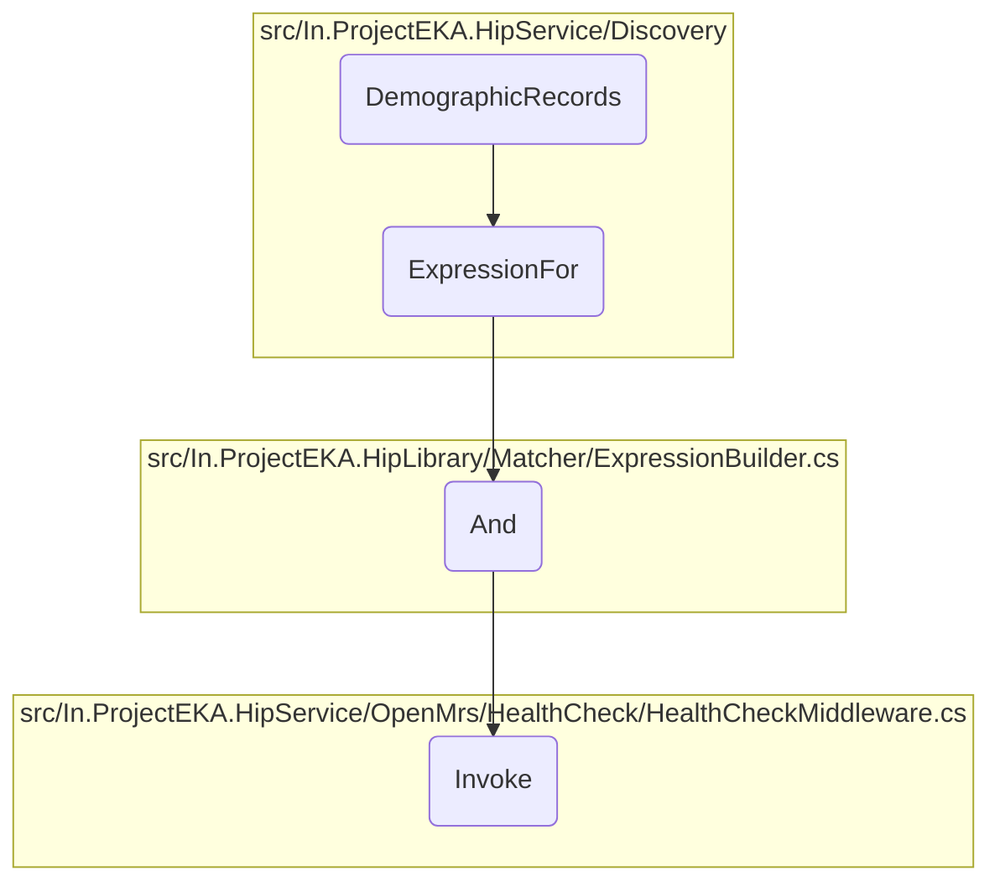

In this document, we will explain the process of filtering and returning patient data without considering the phone number. The process involves several steps to ensure that the patient data is accurately retrieved and filtered based on other criteria.

The flow starts with retrieving demographic records, then building an expression to filter the data. This expression is combined with other conditions, and finally, the filtered data is returned. The phone number is not considered in this filtering process, ensuring that patients are returned based on other demographic information.

Here is a high level diagram of the flow, showing only the most important functions:

# Flow drill down

&nbsp;

*This is an auto-generated document by Swimm 🌊 and has not yet been verified by a human*

<SwmMeta version="3.0.0" repo-id="Z2l0aHViJTNBJTNBaGlwLXNlcnZpY2UlM0ElM0FTd2ltbS1EZW1v" repo-name="hip-service">Powered by [Swimm](/)</SwmMeta>
