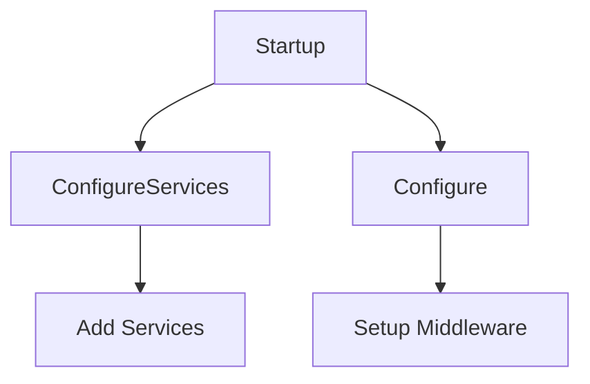

## Overview

The <SwmToken path="src/In.ProjectEKA.HipService/Program.cs" pos="56:4:4" line-data="                .UseStartup&lt;Startup&gt;()">`Startup`</SwmToken> class is responsible for configuring the services and the app's request pipeline. It initializes the configuration settings and sets up an <SwmToken path="src/In.ProjectEKA.HipService/Startup.cs" pos="67:1:1" line-data="            HttpClient = new HttpClient(clientHandler)">`HttpClient`</SwmToken> with specific timeout and connection settings. The <SwmToken path="src/In.ProjectEKA.HipService/Program.cs" pos="56:4:4" line-data="                .UseStartup&lt;Startup&gt;()">`Startup`</SwmToken> class is used in the <SwmPath>[src/In.ProjectEKA.HipService/Program.cs](src/In.ProjectEKA.HipService/Program.cs)</SwmPath> file to configure the application's services and request pipeline.

<SwmSnippet path="/src/In.ProjectEKA.HipService/Program.cs" line="55">

---

The <SwmToken path="src/In.ProjectEKA.HipService/Program.cs" pos="56:4:4" line-data="                .UseStartup&lt;Startup&gt;()">`Startup`</SwmToken> class is referenced in the <SwmPath>[src/In.ProjectEKA.HipService/Program.cs](src/In.ProjectEKA.HipService/Program.cs)</SwmPath> file to configure the application's services and request pipeline.

```c#
                .UseSerilog()
                .UseStartup<Startup>()
                .UseUrls("http://*:80");
```

---

</SwmSnippet>

## Startup Class

The <SwmToken path="src/In.ProjectEKA.HipService/Program.cs" pos="56:4:4" line-data="                .UseStartup&lt;Startup&gt;()">`Startup`</SwmToken> class initializes the configuration settings and sets up an <SwmToken path="src/In.ProjectEKA.HipService/Startup.cs" pos="67:1:1" line-data="            HttpClient = new HttpClient(clientHandler)">`HttpClient`</SwmToken> with specific timeout and connection settings.

<SwmSnippet path="/src/In.ProjectEKA.HipService/Startup.cs" line="54">

---

The <SwmToken path="src/In.ProjectEKA.HipService/Startup.cs" pos="54:5:5" line-data="    public class Startup">`Startup`</SwmToken> class constructor initializes the configuration settings and sets up an <SwmToken path="src/In.ProjectEKA.HipService/Startup.cs" pos="67:1:1" line-data="            HttpClient = new HttpClient(clientHandler)">`HttpClient`</SwmToken> with specific timeout and connection settings.

```c#
    public class Startup
    {
        public Startup(IConfiguration configuration)
        {
            Configuration = configuration;
            var clientHandler = new HttpClientHandler
            {
                ServerCertificateCustomValidationCallback = (
                    sender,
                    cert,
                    chain,
                    sslPolicyErrors) => true
            };
            HttpClient = new HttpClient(clientHandler)
            {
                Timeout = TimeSpan.FromSeconds(Configuration.GetSection("Gateway:timeout").Get<int>())
            };
            // Create new connection everytime
            HttpClient.DefaultRequestHeaders.Add("Connection", "close");
            IdentityModelEventSource.ShowPII = true;
        }
```

---

</SwmSnippet>

## <SwmToken path="src/In.ProjectEKA.HipService/Startup.cs" pos="80:5:5" line-data="        public void ConfigureServices(IServiceCollection services)">`ConfigureServices`</SwmToken> Method

The <SwmToken path="src/In.ProjectEKA.HipService/Startup.cs" pos="80:5:5" line-data="        public void ConfigureServices(IServiceCollection services)">`ConfigureServices`</SwmToken> method is used to add and configure services required by the application, such as database contexts, CORS policies, authentication schemes, and other dependencies.

<SwmSnippet path="/src/In.ProjectEKA.HipService/Startup.cs" line="80">

---

The <SwmToken path="src/In.ProjectEKA.HipService/Startup.cs" pos="80:5:5" line-data="        public void ConfigureServices(IServiceCollection services)">`ConfigureServices`</SwmToken> method adds and configures services required by the application, such as database contexts, CORS policies, authentication schemes, and other dependencies.

```c#
        public void ConfigureServices(IServiceCollection services)
        {
            services
                .AddDbContext<LinkPatientContext>(options =>
                    options.UseNpgsql(Configuration.GetConnectionString("DefaultConnection"),
                        x => x.MigrationsAssembly("In.ProjectEKA.HipService")))
                .AddCors(options =>
                {
                    options.AddPolicy(name: "_myAllowSpecificOrigins",
                        builder =>
                        {
                            builder.WithOrigins(CorsConfiguration.AllowedOrigins).AllowAnyMethod().AllowAnyHeader();
                        });
                })
                .AddDbContext<AuthContext>(options =>
                    options.UseNpgsql(Configuration.GetConnectionString("DefaultConnection"),
                        x => x.MigrationsAssembly("In.ProjectEKA.HipService")))
                .AddDbContext<NdhmDemographicsContext>(options =>
                    options.UseNpgsql(Configuration.GetConnectionString("DefaultConnection"),
                        x => x.MigrationsAssembly("In.ProjectEKA.HipService")))
                .AddDbContext<DiscoveryContext>(options =>
```

---

</SwmSnippet>

## Configure Method

The <SwmToken path="src/In.ProjectEKA.HipService/Startup.cs" pos="239:5:5" line-data="        public void Configure(IApplicationBuilder app, IWebHostEnvironment env)">`Configure`</SwmToken> method defines how the application will respond to HTTP requests. It sets up middleware components like Swagger, static files, routing, CORS, authentication, and authorization. Additionally, it configures health checks and ensures that the database contexts are migrated to the latest version.

<SwmSnippet path="/src/In.ProjectEKA.HipService/Startup.cs" line="239">

---

The <SwmToken path="src/In.ProjectEKA.HipService/Startup.cs" pos="239:5:5" line-data="        public void Configure(IApplicationBuilder app, IWebHostEnvironment env)">`Configure`</SwmToken> method sets up middleware components like Swagger, static files, routing, CORS, authentication, and authorization. It also configures health checks and ensures that the database contexts are migrated to the latest version.

```c#
        public void Configure(IApplicationBuilder app, IWebHostEnvironment env)
        {
            app.Use(async (context, next) =>
            {
                Stopwatch timer = new Stopwatch();
                timer.Start();
                var traceId = Guid.NewGuid();
                Log.Information($"Request {traceId} received.");

                await next.Invoke();

                timer.Stop();
                Log.Information($"Request {traceId} served in {timer.ElapsedMilliseconds}ms.");
            });
            app.UseSwagger();
            app.UseSwaggerUI(c => { c.SwaggerEndpoint("/swagger/v1/swagger.json", "HIP Service"); });

            app.UseStaticFilesWithYaml()
                .UseRouting()
                .UseCors("_myAllowSpecificOrigins")
                .UseIf(!env.IsDevelopment(), x => x.UseHsts())
```

---

</SwmSnippet>



&nbsp;

*This is an auto-generated document by Swimm 🌊 and has not yet been verified by a human*

<SwmMeta version="3.0.0" repo-id="Z2l0aHViJTNBJTNBaGlwLXNlcnZpY2UlM0ElM0FTd2ltbS1EZW1v" repo-name="hip-service"><sup>Powered by [Swimm](/)</sup></SwmMeta>
