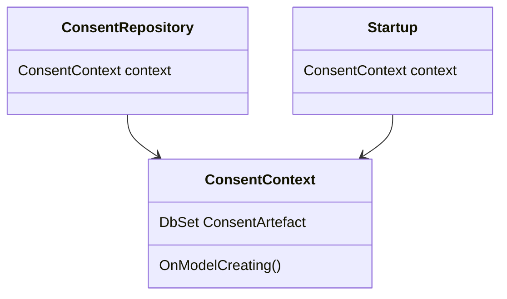

## Overview

The <SwmToken path="src/In.ProjectEKA.HipService/Consent/Database/Migrations/20200403080416_addConsentManagerIdenitifier.Designer.cs" pos="11:6:6" line-data="    [DbContext(typeof(ConsentContext))]">`ConsentContext`</SwmToken> class is a part of the database layer in the Consent module. It inherits from <SwmToken path="src/In.ProjectEKA.HipService/Consent/Database/Migrations/20200403080416_addConsentManagerIdenitifier.Designer.cs" pos="11:2:2" line-data="    [DbContext(typeof(ConsentContext))]">`DbContext`</SwmToken> and is responsible for managing the database operations related to consent artifacts. This class includes a `DbSet<Consent>` property called <SwmToken path="src/In.ProjectEKA.HipService/Consent/Database/Migrations/20200403080416_addConsentManagerIdenitifier.Designer.cs" pos="30:9:9" line-data="                    b.Property&lt;string&gt;(&quot;ConsentArtefact&quot;)">`ConsentArtefact`</SwmToken>, which represents the consent artifacts table in the database.

## Configuration

The `OnModelCreating` method in the <SwmToken path="src/In.ProjectEKA.HipService/Consent/Database/Migrations/20200403080416_addConsentManagerIdenitifier.Designer.cs" pos="11:6:6" line-data="    [DbContext(typeof(ConsentContext))]">`ConsentContext`</SwmToken> class configures the model by setting up entity properties and relationships. It ensures that the <SwmToken path="src/In.ProjectEKA.HipService/Consent/Database/Migrations/20200403080416_addConsentManagerIdenitifier.Designer.cs" pos="33:9:9" line-data="                    b.Property&lt;string&gt;(&quot;ConsentArtefactId&quot;)">`ConsentArtefactId`</SwmToken> property is unique and configures the <SwmToken path="src/In.ProjectEKA.HipService/Consent/Database/Migrations/20200403080416_addConsentManagerIdenitifier.Designer.cs" pos="42:9:9" line-data="                    b.Property&lt;string&gt;(&quot;Status&quot;)">`Status`</SwmToken> property to use a specific conversion.

## Usage in Application

The <SwmToken path="src/In.ProjectEKA.HipService/Consent/Database/Migrations/20200403080416_addConsentManagerIdenitifier.Designer.cs" pos="11:6:6" line-data="    [DbContext(typeof(ConsentContext))]">`ConsentContext`</SwmToken> class is used in various parts of the application, such as the `ConsentRepository` class, where it is injected to perform database operations related to consent artifacts. Additionally, it is used in the `Startup` class to apply any pending migrations to the database, ensuring that the database schema is up-to-date.

<SwmSnippet path="/src/In.ProjectEKA.HipService/Consent/Database/Migrations/20200403080416_addConsentManagerIdenitifier.Designer.cs" line="2">

---

This snippet shows the usage of <SwmToken path="src/In.ProjectEKA.HipService/Consent/Database/Migrations/20200403080416_addConsentManagerIdenitifier.Designer.cs" pos="11:6:6" line-data="    [DbContext(typeof(ConsentContext))]">`ConsentContext`</SwmToken> in the migration file <SwmToken path="src/In.ProjectEKA.HipService/Consent/Database/Migrations/20200403080416_addConsentManagerIdenitifier.Designer.cs" pos="13:5:5" line-data="    partial class addConsentManagerIdenitifier">`addConsentManagerIdenitifier`</SwmToken>.

```c#
using In.ProjectEKA.HipService.Consent.Database;
using Microsoft.EntityFrameworkCore;
using Microsoft.EntityFrameworkCore.Infrastructure;
using Microsoft.EntityFrameworkCore.Migrations;
using Microsoft.EntityFrameworkCore.Storage.ValueConversion;
using Npgsql.EntityFrameworkCore.PostgreSQL.Metadata;

namespace In.ProjectEKA.HipService.Consent.Database.Migrations
```

---

</SwmSnippet>

## Database Endpoints

The <SwmToken path="src/In.ProjectEKA.HipService/appsettings.json" pos="30:2:2" line-data="  &quot;ConnectionStrings&quot;: {">`ConnectionStrings`</SwmToken> section in the <SwmPath>[src/In.ProjectEKA.HipService/appsettings.json](src/In.ProjectEKA.HipService/appsettings.json)</SwmPath> file defines the connection string for the database. This connection string is used by the application to connect to the database and perform various operations.

<SwmSnippet path="/src/In.ProjectEKA.HipService/appsettings.json" line="30">

---

This snippet shows the <SwmToken path="src/In.ProjectEKA.HipService/appsettings.json" pos="30:2:2" line-data="  &quot;ConnectionStrings&quot;: {">`ConnectionStrings`</SwmToken> section in the <SwmPath>[src/In.ProjectEKA.HipService/appsettings.json](src/In.ProjectEKA.HipService/appsettings.json)</SwmPath> file.

```json
  "ConnectionStrings": {
    "DefaultConnection": "$CONNECTION_STRING;"
  },
```

---

</SwmSnippet>



&nbsp;

*This is an* <SwmToken path="src/In.ProjectEKA.HipService/Consent/Database/Migrations/20200403080416_addConsentManagerIdenitifier.Designer.cs" pos="1:4:6" line-data="// &lt;auto-generated /&gt;">`auto-generated`</SwmToken> *document by Swimm 🌊 and has not yet been verified by a human*

<SwmMeta version="3.0.0" repo-id="Z2l0aHViJTNBJTNBaGlwLXNlcnZpY2UlM0ElM0FTd2ltbS1EZW1v" repo-name="hip-service"><sup>Powered by [Swimm](/)</sup></SwmMeta>
