```mermaid
classDiagram
 DataRequest --> CareContexts
 DataRequest --> DateRange
 DataRequest --> DataPushUrl
 DataRequest --> HiType
 DataRequest --> TransactionId
 DataRequest --> KeyMaterial
 DataRequest --> ConsentManagerId
 DataRequest --> ConsentId
 DataRequest --> CmSuffix

%% Swimm:
%% classDiagram
%%  <SwmToken path="src/In.ProjectEKA.HipLibrary/Patient/Model/DataRequest.cs" pos="6:5:5" line-data="    public class DataRequest">`DataRequest`</SwmToken> --> <SwmToken path="src/In.ProjectEKA.HipLibrary/Patient/Model/DataRequest.cs" pos="19:1:1" line-data="            CareContexts = careContexts;">`CareContexts`</SwmToken>
%%  <SwmToken path="src/In.ProjectEKA.HipLibrary/Patient/Model/DataRequest.cs" pos="6:5:5" line-data="    public class DataRequest">`DataRequest`</SwmToken> --> <SwmToken path="src/In.ProjectEKA.HipLibrary/Patient/Model/DataRequest.cs" pos="10:1:1" line-data="            DateRange dateRange,">`DateRange`</SwmToken>
%%  <SwmToken path="src/In.ProjectEKA.HipLibrary/Patient/Model/DataRequest.cs" pos="6:5:5" line-data="    public class DataRequest">`DataRequest`</SwmToken> --> <SwmToken path="src/In.ProjectEKA.HipLibrary/Patient/Model/DataRequest.cs" pos="21:1:1" line-data="            DataPushUrl = dataPushUrl;">`DataPushUrl`</SwmToken>
%%  <SwmToken path="src/In.ProjectEKA.HipLibrary/Patient/Model/DataRequest.cs" pos="6:5:5" line-data="    public class DataRequest">`DataRequest`</SwmToken> --> <SwmToken path="src/In.ProjectEKA.HipLibrary/Patient/Model/DataRequest.cs" pos="12:3:3" line-data="            IEnumerable&lt;HiType&gt; hiType,">`HiType`</SwmToken>
%%  <SwmToken path="src/In.ProjectEKA.HipLibrary/Patient/Model/DataRequest.cs" pos="6:5:5" line-data="    public class DataRequest">`DataRequest`</SwmToken> --> <SwmToken path="src/In.ProjectEKA.HipLibrary/Patient/Model/DataRequest.cs" pos="23:1:1" line-data="            TransactionId = transactionId;">`TransactionId`</SwmToken>
%%  <SwmToken path="src/In.ProjectEKA.HipLibrary/Patient/Model/DataRequest.cs" pos="6:5:5" line-data="    public class DataRequest">`DataRequest`</SwmToken> --> <SwmToken path="src/In.ProjectEKA.HipLibrary/Patient/Model/DataRequest.cs" pos="14:1:1" line-data="            KeyMaterial keyMaterial,">`KeyMaterial`</SwmToken>
%%  <SwmToken path="src/In.ProjectEKA.HipLibrary/Patient/Model/DataRequest.cs" pos="6:5:5" line-data="    public class DataRequest">`DataRequest`</SwmToken> --> <SwmToken path="src/In.ProjectEKA.HipLibrary/Patient/Model/DataRequest.cs" pos="25:1:1" line-data="            ConsentManagerId = consentManagerId;">`ConsentManagerId`</SwmToken>
%%  <SwmToken path="src/In.ProjectEKA.HipLibrary/Patient/Model/DataRequest.cs" pos="6:5:5" line-data="    public class DataRequest">`DataRequest`</SwmToken> --> <SwmToken path="src/In.ProjectEKA.HipLibrary/Patient/Model/DataRequest.cs" pos="26:1:1" line-data="            ConsentId = consentId;">`ConsentId`</SwmToken>
%%  <SwmToken path="src/In.ProjectEKA.HipLibrary/Patient/Model/DataRequest.cs" pos="6:5:5" line-data="    public class DataRequest">`DataRequest`</SwmToken> --> <SwmToken path="src/In.ProjectEKA.HipLibrary/Patient/Model/DataRequest.cs" pos="38:5:5" line-data="        public string CmSuffix { get; }">`CmSuffix`</SwmToken>
```

# Getting Started with Data Request Model

The Data Request Model is essential for requesting patient health information based on granted consent. This document will guide you through the <SwmToken path="src/In.ProjectEKA.HipLibrary/Patient/Model/DataRequest.cs" pos="6:5:5" line-data="    public class DataRequest">`DataRequest`</SwmToken> class, its properties, and its methods.

## <SwmToken path="src/In.ProjectEKA.HipLibrary/Patient/Model/DataRequest.cs" pos="6:5:5" line-data="    public class DataRequest">`DataRequest`</SwmToken> Class

The <SwmToken path="src/In.ProjectEKA.HipLibrary/Patient/Model/DataRequest.cs" pos="6:5:5" line-data="    public class DataRequest">`DataRequest`</SwmToken> class encapsulates all the necessary details required to make a data request. It includes properties such as <SwmToken path="src/In.ProjectEKA.HipLibrary/Patient/Model/DataRequest.cs" pos="19:1:1" line-data="            CareContexts = careContexts;">`CareContexts`</SwmToken>, <SwmToken path="src/In.ProjectEKA.HipLibrary/Patient/Model/DataRequest.cs" pos="10:1:1" line-data="            DateRange dateRange,">`DateRange`</SwmToken>, <SwmToken path="src/In.ProjectEKA.HipLibrary/Patient/Model/DataRequest.cs" pos="21:1:1" line-data="            DataPushUrl = dataPushUrl;">`DataPushUrl`</SwmToken>, <SwmToken path="src/In.ProjectEKA.HipLibrary/Patient/Model/DataRequest.cs" pos="12:3:3" line-data="            IEnumerable&lt;HiType&gt; hiType,">`HiType`</SwmToken>, <SwmToken path="src/In.ProjectEKA.HipLibrary/Patient/Model/DataRequest.cs" pos="23:1:1" line-data="            TransactionId = transactionId;">`TransactionId`</SwmToken>, <SwmToken path="src/In.ProjectEKA.HipLibrary/Patient/Model/DataRequest.cs" pos="14:1:1" line-data="            KeyMaterial keyMaterial,">`KeyMaterial`</SwmToken>, <SwmToken path="src/In.ProjectEKA.HipLibrary/Patient/Model/DataRequest.cs" pos="25:1:1" line-data="            ConsentManagerId = consentManagerId;">`ConsentManagerId`</SwmToken>, <SwmToken path="src/In.ProjectEKA.HipLibrary/Patient/Model/DataRequest.cs" pos="26:1:1" line-data="            ConsentId = consentId;">`ConsentId`</SwmToken>, and <SwmToken path="src/In.ProjectEKA.HipLibrary/Patient/Model/DataRequest.cs" pos="38:5:5" line-data="        public string CmSuffix { get; }">`CmSuffix`</SwmToken>.

<SwmSnippet path="/src/In.ProjectEKA.HipLibrary/Patient/Model/DataRequest.cs" line="6">

---

The <SwmToken path="src/In.ProjectEKA.HipLibrary/Patient/Model/DataRequest.cs" pos="6:5:5" line-data="    public class DataRequest">`DataRequest`</SwmToken> constructor initializes a new instance of the <SwmToken path="src/In.ProjectEKA.HipLibrary/Patient/Model/DataRequest.cs" pos="6:5:5" line-data="    public class DataRequest">`DataRequest`</SwmToken> class with the provided parameters, setting up the necessary properties for a data request.

```c#
    public class DataRequest
    {
        public DataRequest(
            IEnumerable<GrantedContext> careContexts,
            DateRange dateRange,
            string dataPushUrl,
            IEnumerable<HiType> hiType,
            string transactionId,
            KeyMaterial keyMaterial,
            string consentManagerId,
            string consentId,
            string cmSuffix)
        {
            CareContexts = careContexts;
            DateRange = dateRange;
            DataPushUrl = dataPushUrl;
            HiType = hiType;
            TransactionId = transactionId;
            KeyMaterial = keyMaterial;
            ConsentManagerId = consentManagerId;
            ConsentId = consentId;
```

---

</SwmSnippet>

## Properties of <SwmToken path="src/In.ProjectEKA.HipLibrary/Patient/Model/DataRequest.cs" pos="6:5:5" line-data="    public class DataRequest">`DataRequest`</SwmToken>

The <SwmToken path="src/In.ProjectEKA.HipLibrary/Patient/Model/DataRequest.cs" pos="6:5:5" line-data="    public class DataRequest">`DataRequest`</SwmToken> class includes several properties that are crucial for making a data request. Below are the key properties and their purposes:

### <SwmToken path="src/In.ProjectEKA.HipLibrary/Patient/Model/DataRequest.cs" pos="19:1:1" line-data="            CareContexts = careContexts;">`CareContexts`</SwmToken>

The <SwmToken path="src/In.ProjectEKA.HipLibrary/Patient/Model/DataRequest.cs" pos="19:1:1" line-data="            CareContexts = careContexts;">`CareContexts`</SwmToken> property holds the contexts of care that have been granted for data access.

<SwmSnippet path="/src/In.ProjectEKA.HipLibrary/Patient/Model/DataRequest.cs" line="30">

---

The <SwmToken path="src/In.ProjectEKA.HipLibrary/Patient/Model/DataRequest.cs" pos="30:8:8" line-data="        public IEnumerable&lt;GrantedContext&gt; CareContexts { get; }">`CareContexts`</SwmToken> property in the <SwmToken path="src/In.ProjectEKA.HipLibrary/Patient/Model/DataRequest.cs" pos="6:5:5" line-data="    public class DataRequest">`DataRequest`</SwmToken> class.

```c#
        public IEnumerable<GrantedContext> CareContexts { get; }
```

---

</SwmSnippet>

### <SwmToken path="src/In.ProjectEKA.HipLibrary/Patient/Model/DataRequest.cs" pos="10:1:1" line-data="            DateRange dateRange,">`DateRange`</SwmToken>

The <SwmToken path="src/In.ProjectEKA.HipLibrary/Patient/Model/DataRequest.cs" pos="10:1:1" line-data="            DateRange dateRange,">`DateRange`</SwmToken> property specifies the range of dates for which the data is being requested.

<SwmSnippet path="/src/In.ProjectEKA.HipLibrary/Patient/Model/DataRequest.cs" line="31">

---

The <SwmToken path="src/In.ProjectEKA.HipLibrary/Patient/Model/DataRequest.cs" pos="31:3:3" line-data="        public DateRange DateRange { get; }">`DateRange`</SwmToken> property in the <SwmToken path="src/In.ProjectEKA.HipLibrary/Patient/Model/DataRequest.cs" pos="6:5:5" line-data="    public class DataRequest">`DataRequest`</SwmToken> class.

```c#
        public DateRange DateRange { get; }
```

---

</SwmSnippet>

### <SwmToken path="src/In.ProjectEKA.HipLibrary/Patient/Model/DataRequest.cs" pos="21:1:1" line-data="            DataPushUrl = dataPushUrl;">`DataPushUrl`</SwmToken>

The <SwmToken path="src/In.ProjectEKA.HipLibrary/Patient/Model/DataRequest.cs" pos="21:1:1" line-data="            DataPushUrl = dataPushUrl;">`DataPushUrl`</SwmToken> property is the URL to which the requested data will be pushed.

<SwmSnippet path="/src/In.ProjectEKA.HipLibrary/Patient/Model/DataRequest.cs" line="32">

---

The <SwmToken path="src/In.ProjectEKA.HipLibrary/Patient/Model/DataRequest.cs" pos="32:5:5" line-data="        public string DataPushUrl { get; }">`DataPushUrl`</SwmToken> property in the <SwmToken path="src/In.ProjectEKA.HipLibrary/Patient/Model/DataRequest.cs" pos="6:5:5" line-data="    public class DataRequest">`DataRequest`</SwmToken> class.

```c#
        public string DataPushUrl { get; }
```

---

</SwmSnippet>

### <SwmToken path="src/In.ProjectEKA.HipLibrary/Patient/Model/DataRequest.cs" pos="12:3:3" line-data="            IEnumerable&lt;HiType&gt; hiType,">`HiType`</SwmToken>

The <SwmToken path="src/In.ProjectEKA.HipLibrary/Patient/Model/DataRequest.cs" pos="12:3:3" line-data="            IEnumerable&lt;HiType&gt; hiType,">`HiType`</SwmToken> property lists the types of health information being requested.

<SwmSnippet path="/src/In.ProjectEKA.HipLibrary/Patient/Model/DataRequest.cs" line="33">

---

The <SwmToken path="src/In.ProjectEKA.HipLibrary/Patient/Model/DataRequest.cs" pos="33:5:5" line-data="        public IEnumerable&lt;HiType&gt; HiType { get; }">`HiType`</SwmToken> property in the <SwmToken path="src/In.ProjectEKA.HipLibrary/Patient/Model/DataRequest.cs" pos="6:5:5" line-data="    public class DataRequest">`DataRequest`</SwmToken> class.

```c#
        public IEnumerable<HiType> HiType { get; }
```

---

</SwmSnippet>

### <SwmToken path="src/In.ProjectEKA.HipLibrary/Patient/Model/DataRequest.cs" pos="23:1:1" line-data="            TransactionId = transactionId;">`TransactionId`</SwmToken>

The <SwmToken path="src/In.ProjectEKA.HipLibrary/Patient/Model/DataRequest.cs" pos="23:1:1" line-data="            TransactionId = transactionId;">`TransactionId`</SwmToken> property is a unique identifier for the data request transaction.

<SwmSnippet path="/src/In.ProjectEKA.HipLibrary/Patient/Model/DataRequest.cs" line="34">

---

The <SwmToken path="src/In.ProjectEKA.HipLibrary/Patient/Model/DataRequest.cs" pos="34:5:5" line-data="        public string TransactionId { get; }">`TransactionId`</SwmToken> property in the <SwmToken path="src/In.ProjectEKA.HipLibrary/Patient/Model/DataRequest.cs" pos="6:5:5" line-data="    public class DataRequest">`DataRequest`</SwmToken> class.

```c#
        public string TransactionId { get; }
```

---

</SwmSnippet>

### <SwmToken path="src/In.ProjectEKA.HipLibrary/Patient/Model/DataRequest.cs" pos="14:1:1" line-data="            KeyMaterial keyMaterial,">`KeyMaterial`</SwmToken>

The <SwmToken path="src/In.ProjectEKA.HipLibrary/Patient/Model/DataRequest.cs" pos="14:1:1" line-data="            KeyMaterial keyMaterial,">`KeyMaterial`</SwmToken> property contains cryptographic keys used for securing the data transfer.

<SwmSnippet path="/src/In.ProjectEKA.HipLibrary/Patient/Model/DataRequest.cs" line="35">

---

The <SwmToken path="src/In.ProjectEKA.HipLibrary/Patient/Model/DataRequest.cs" pos="35:3:3" line-data="        public KeyMaterial KeyMaterial { get; }">`KeyMaterial`</SwmToken> property in the <SwmToken path="src/In.ProjectEKA.HipLibrary/Patient/Model/DataRequest.cs" pos="6:5:5" line-data="    public class DataRequest">`DataRequest`</SwmToken> class.

```c#
        public KeyMaterial KeyMaterial { get; }
```

---

</SwmSnippet>

### <SwmToken path="src/In.ProjectEKA.HipLibrary/Patient/Model/DataRequest.cs" pos="25:1:1" line-data="            ConsentManagerId = consentManagerId;">`ConsentManagerId`</SwmToken>

The <SwmToken path="src/In.ProjectEKA.HipLibrary/Patient/Model/DataRequest.cs" pos="25:1:1" line-data="            ConsentManagerId = consentManagerId;">`ConsentManagerId`</SwmToken> property identifies the consent manager handling the consent for the data request.

<SwmSnippet path="/src/In.ProjectEKA.HipLibrary/Patient/Model/DataRequest.cs" line="36">

---

The <SwmToken path="src/In.ProjectEKA.HipLibrary/Patient/Model/DataRequest.cs" pos="36:5:5" line-data="        public string ConsentManagerId { get; }">`ConsentManagerId`</SwmToken> property in the <SwmToken path="src/In.ProjectEKA.HipLibrary/Patient/Model/DataRequest.cs" pos="6:5:5" line-data="    public class DataRequest">`DataRequest`</SwmToken> class.

```c#
        public string ConsentManagerId { get; }
```

---

</SwmSnippet>

### <SwmToken path="src/In.ProjectEKA.HipLibrary/Patient/Model/DataRequest.cs" pos="26:1:1" line-data="            ConsentId = consentId;">`ConsentId`</SwmToken>

The <SwmToken path="src/In.ProjectEKA.HipLibrary/Patient/Model/DataRequest.cs" pos="26:1:1" line-data="            ConsentId = consentId;">`ConsentId`</SwmToken> property is the identifier for the specific consent artifact that permits the data request.

<SwmSnippet path="/src/In.ProjectEKA.HipLibrary/Patient/Model/DataRequest.cs" line="37">

---

The <SwmToken path="src/In.ProjectEKA.HipLibrary/Patient/Model/DataRequest.cs" pos="37:5:5" line-data="        public string ConsentId { get; }">`ConsentId`</SwmToken> property in the <SwmToken path="src/In.ProjectEKA.HipLibrary/Patient/Model/DataRequest.cs" pos="6:5:5" line-data="    public class DataRequest">`DataRequest`</SwmToken> class.

```c#
        public string ConsentId { get; }
```

---

</SwmSnippet>

### <SwmToken path="src/In.ProjectEKA.HipLibrary/Patient/Model/DataRequest.cs" pos="38:5:5" line-data="        public string CmSuffix { get; }">`CmSuffix`</SwmToken>

The <SwmToken path="src/In.ProjectEKA.HipLibrary/Patient/Model/DataRequest.cs" pos="38:5:5" line-data="        public string CmSuffix { get; }">`CmSuffix`</SwmToken> property is an additional identifier used by the consent manager.

<SwmSnippet path="/src/In.ProjectEKA.HipLibrary/Patient/Model/DataRequest.cs" line="38">

---

The <SwmToken path="src/In.ProjectEKA.HipLibrary/Patient/Model/DataRequest.cs" pos="38:5:5" line-data="        public string CmSuffix { get; }">`CmSuffix`</SwmToken> property in the <SwmToken path="src/In.ProjectEKA.HipLibrary/Patient/Model/DataRequest.cs" pos="6:5:5" line-data="    public class DataRequest">`DataRequest`</SwmToken> class.

```c#
        public string CmSuffix { get; }
```

---

</SwmSnippet>



## <SwmToken path="src/In.ProjectEKA.HipLibrary/Patient/Model/DataRequest.cs" pos="40:7:7" line-data="        public override string ToString()">`ToString`</SwmToken> Method

The <SwmToken path="src/In.ProjectEKA.HipLibrary/Patient/Model/DataRequest.cs" pos="40:7:7" line-data="        public override string ToString()">`ToString`</SwmToken> method provides a string representation of the data request, including the types of health information being requested.

<SwmSnippet path="/src/In.ProjectEKA.HipLibrary/Patient/Model/DataRequest.cs" line="40">

---

The <SwmToken path="src/In.ProjectEKA.HipLibrary/Patient/Model/DataRequest.cs" pos="40:7:7" line-data="        public override string ToString()">`ToString`</SwmToken> method in the <SwmToken path="src/In.ProjectEKA.HipLibrary/Patient/Model/DataRequest.cs" pos="6:5:5" line-data="    public class DataRequest">`DataRequest`</SwmToken> class.

```c#
        public override string ToString()
        {
            var hiTypes = HiType
                .Select(hiType => hiType.ToString())
                .Aggregate("", (source, value) => source + " " + value);
            return $"Data Request with {hiTypes}";
        }
```

---

</SwmSnippet>

&nbsp;

*This is an auto-generated document by Swimm 🌊 and has not yet been verified by a human*

<SwmMeta version="3.0.0" repo-id="Z2l0aHViJTNBJTNBaGlwLXNlcnZpY2UlM0ElM0FTd2ltbS1EZW1v" repo-name="hip-service"><sup>Powered by [Swimm](/)</sup></SwmMeta>
