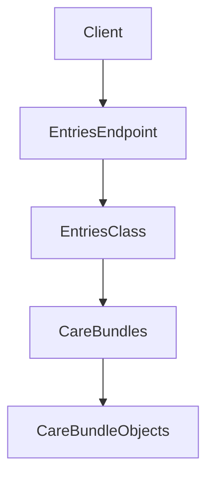

# Getting Started with Entries Model

The <SwmToken path="src/In.ProjectEKA.HipLibrary/Patient/Model/Entries.cs" pos="5:5:5" line-data="    public class Entries">`Entries`</SwmToken> class represents a collection of care bundles. It is designed to encapsulate and manage these bundles efficiently.

<SwmSnippet path="/src/In.ProjectEKA.HipLibrary/Patient/Model/Entries.cs" line="5">

---

## Entries Class Definition

The <SwmToken path="src/In.ProjectEKA.HipLibrary/Patient/Model/Entries.cs" pos="5:5:5" line-data="    public class Entries">`Entries`</SwmToken> class is defined to encapsulate a collection of care bundles. It has a constructor that initializes the collection and a property to access the care bundles.

```c#
    public class Entries
    {
        public Entries(IEnumerable<CareBundle> careBundles)
        {
            CareBundles = careBundles;
        }

        public IEnumerable<CareBundle> CareBundles { get; }
    }
```

---

</SwmSnippet>

## Constructor

The constructor of the <SwmToken path="src/In.ProjectEKA.HipLibrary/Patient/Model/Entries.cs" pos="5:5:5" line-data="    public class Entries">`Entries`</SwmToken> class initializes the collection of care bundles. It takes an <SwmToken path="src/In.ProjectEKA.HipLibrary/Patient/Model/Entries.cs" pos="7:5:5" line-data="        public Entries(IEnumerable&lt;CareBundle&gt; careBundles)">`IEnumerable`</SwmToken> of <SwmToken path="src/In.ProjectEKA.HipLibrary/Patient/Model/Entries.cs" pos="7:7:7" line-data="        public Entries(IEnumerable&lt;CareBundle&gt; careBundles)">`CareBundle`</SwmToken> objects as a parameter and assigns it to the <SwmToken path="src/In.ProjectEKA.HipLibrary/Patient/Model/Entries.cs" pos="9:1:1" line-data="            CareBundles = careBundles;">`CareBundles`</SwmToken> property.

## <SwmToken path="src/In.ProjectEKA.HipLibrary/Patient/Model/Entries.cs" pos="9:1:1" line-data="            CareBundles = careBundles;">`CareBundles`</SwmToken> Property

The <SwmToken path="src/In.ProjectEKA.HipLibrary/Patient/Model/Entries.cs" pos="9:1:1" line-data="            CareBundles = careBundles;">`CareBundles`</SwmToken> property is an enumerable collection of <SwmToken path="src/In.ProjectEKA.HipLibrary/Patient/Model/Entries.cs" pos="7:7:7" line-data="        public Entries(IEnumerable&lt;CareBundle&gt; careBundles)">`CareBundle`</SwmToken> objects. It provides access to the collection of care bundles that are initialized by the constructor.

<SwmSnippet path="/src/In.ProjectEKA.HipLibrary/Patient/Model/Entries.cs" line="12">

---

The <SwmToken path="src/In.ProjectEKA.HipLibrary/Patient/Model/Entries.cs" pos="12:8:8" line-data="        public IEnumerable&lt;CareBundle&gt; CareBundles { get; }">`CareBundles`</SwmToken> property provides access to the collection of care bundles.

```c#
        public IEnumerable<CareBundle> CareBundles { get; }
```

---

</SwmSnippet>

## Usage in <SwmToken path="src/In.ProjectEKA.HipLibrary/Patient/ICollect.cs" pos="7:5:5" line-data="    public interface ICollect">`ICollect`</SwmToken> Interface

The <SwmToken path="src/In.ProjectEKA.HipLibrary/Patient/Model/Entries.cs" pos="5:5:5" line-data="    public class Entries">`Entries`</SwmToken> class is used in the <SwmToken path="src/In.ProjectEKA.HipLibrary/Patient/ICollect.cs" pos="7:5:5" line-data="    public interface ICollect">`ICollect`</SwmToken> interface to collect data based on a <SwmToken path="src/In.ProjectEKA.HipLibrary/Patient/ICollect.cs" pos="9:10:10" line-data="        Task&lt;Option&lt;Entries&gt;&gt; CollectData(TraceableDataRequest dataRequest);">`TraceableDataRequest`</SwmToken>.

<SwmSnippet path="/src/In.ProjectEKA.HipLibrary/Patient/ICollect.cs" line="8">

---

The <SwmToken path="src/In.ProjectEKA.HipLibrary/Patient/ICollect.cs" pos="9:8:8" line-data="        Task&lt;Option&lt;Entries&gt;&gt; CollectData(TraceableDataRequest dataRequest);">`CollectData`</SwmToken> method in the <SwmToken path="src/In.ProjectEKA.HipLibrary/Patient/ICollect.cs" pos="7:5:5" line-data="    public interface ICollect">`ICollect`</SwmToken> interface returns an `Option<Entries>` based on a <SwmToken path="src/In.ProjectEKA.HipLibrary/Patient/ICollect.cs" pos="9:10:10" line-data="        Task&lt;Option&lt;Entries&gt;&gt; CollectData(TraceableDataRequest dataRequest);">`TraceableDataRequest`</SwmToken>.

```c#
    {
        Task<Option<Entries>> CollectData(TraceableDataRequest dataRequest);
    }
```

---

</SwmSnippet>

## Entries Endpoints

The <SwmToken path="src/In.ProjectEKA.HipLibrary/Patient/Model/Entries.cs" pos="5:5:5" line-data="    public class Entries">`Entries`</SwmToken> endpoints in the `EntriesController` class provide access to care bundles. These endpoints allow clients to retrieve, create, and manage care bundles.



The diagram above illustrates the flow of data from the client to the care bundles through the <SwmToken path="src/In.ProjectEKA.HipLibrary/Patient/Model/Entries.cs" pos="5:5:5" line-data="    public class Entries">`Entries`</SwmToken> class and its endpoints.

&nbsp;

*This is an auto-generated document by Swimm 🌊 and has not yet been verified by a human*

<SwmMeta version="3.0.0" repo-id="Z2l0aHViJTNBJTNBaGlwLXNlcnZpY2UlM0ElM0FTd2ltbS1EZW1v" repo-name="hip-service"><sup>Powered by [Swimm](/)</sup></SwmMeta>
