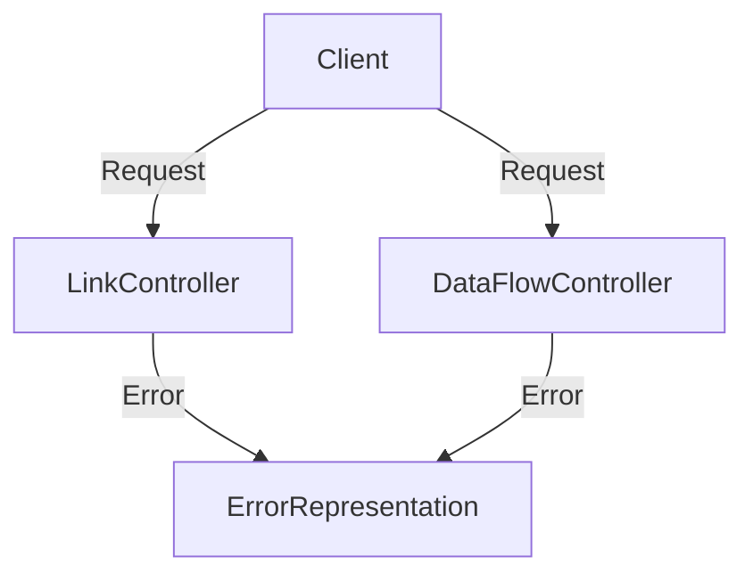

## Overview

Error representation refers to the encapsulation of error details within the application. It is implemented through the <SwmToken path="src/In.ProjectEKA.HipLibrary/Patient/Model/ErrorRepresentation.cs" pos="5:3:3" line-data="        public ErrorRepresentation(Error error)">`ErrorRepresentation`</SwmToken> class, which holds an <SwmToken path="src/In.ProjectEKA.HipLibrary/Patient/Model/ErrorRepresentation.cs" pos="5:5:5" line-data="        public ErrorRepresentation(Error error)">`Error`</SwmToken> object. This class is used to standardize the way errors are communicated across different parts of the application, ensuring that error information is consistently structured and easily accessible.

## <SwmToken path="src/In.ProjectEKA.HipLibrary/Patient/Model/ErrorRepresentation.cs" pos="5:3:3" line-data="        public ErrorRepresentation(Error error)">`ErrorRepresentation`</SwmToken> Class

The <SwmToken path="src/In.ProjectEKA.HipLibrary/Patient/Model/ErrorRepresentation.cs" pos="5:3:3" line-data="        public ErrorRepresentation(Error error)">`ErrorRepresentation`</SwmToken> class is instantiated with an <SwmToken path="src/In.ProjectEKA.HipLibrary/Patient/Model/ErrorRepresentation.cs" pos="5:5:5" line-data="        public ErrorRepresentation(Error error)">`Error`</SwmToken> object, which contains specific error details such as error codes and messages. This allows for precise identification and handling of various error scenarios.

<SwmSnippet path="/src/In.ProjectEKA.HipLibrary/Patient/Model/ErrorRepresentation.cs" line="5">

---

The <SwmToken path="src/In.ProjectEKA.HipLibrary/Patient/Model/ErrorRepresentation.cs" pos="5:3:3" line-data="        public ErrorRepresentation(Error error)">`ErrorRepresentation`</SwmToken> constructor initializes the class with an <SwmToken path="src/In.ProjectEKA.HipLibrary/Patient/Model/ErrorRepresentation.cs" pos="5:5:5" line-data="        public ErrorRepresentation(Error error)">`Error`</SwmToken> object, encapsulating error details within the instance.

```c#
        public ErrorRepresentation(Error error)
        {
            Error = error;
        }
```

---

</SwmSnippet>

<SwmSnippet path="/src/In.ProjectEKA.HipLibrary/Patient/Model/ErrorRepresentation.cs" line="10">

---

The <SwmToken path="src/In.ProjectEKA.HipLibrary/Patient/Model/ErrorRepresentation.cs" pos="10:3:3" line-data="        public Error Error { get; }">`Error`</SwmToken> property holds the <SwmToken path="src/In.ProjectEKA.HipLibrary/Patient/Model/ErrorRepresentation.cs" pos="10:3:3" line-data="        public Error Error { get; }">`Error`</SwmToken> object passed during instantiation, providing access to the specific error details encapsulated within the <SwmToken path="src/In.ProjectEKA.HipLibrary/Patient/Model/ErrorRepresentation.cs" pos="5:3:3" line-data="        public ErrorRepresentation(Error error)">`ErrorRepresentation`</SwmToken> instance.

```c#
        public Error Error { get; }
    }
```

---

</SwmSnippet>

## Usage in Services and Controllers

In the application, <SwmToken path="src/In.ProjectEKA.HipLibrary/Patient/Model/ErrorRepresentation.cs" pos="5:3:3" line-data="        public ErrorRepresentation(Error error)">`ErrorRepresentation`</SwmToken> is used in multiple services and controllers to return error responses. This ensures that detailed error information is provided to clients, aiding in debugging and improving the overall robustness of the system.

### <SwmToken path="src/In.ProjectEKA.HipService/DataFlow/DataFlow.cs" pos="3:8:8" line-data="namespace In.ProjectEKA.HipService.DataFlow">`DataFlow`</SwmToken> Service

<SwmToken path="src/In.ProjectEKA.HipLibrary/Patient/Model/ErrorRepresentation.cs" pos="5:3:3" line-data="        public ErrorRepresentation(Error error)">`ErrorRepresentation`</SwmToken> is used to encapsulate error information when a data request fails.

<SwmSnippet path="/src/In.ProjectEKA.HipService/DataFlow/DataFlow.cs" line="68">

---

In the <SwmToken path="src/In.ProjectEKA.HipService/DataFlow/DataFlow.cs" pos="3:8:8" line-data="namespace In.ProjectEKA.HipService.DataFlow">`DataFlow`</SwmToken> service, <SwmToken path="src/In.ProjectEKA.HipService/DataFlow/DataFlow.cs" pos="69:10:10" line-data="                return new Tuple&lt;HealthInformationTransactionResponse, ErrorRepresentation&gt;(null, errorResponse);">`ErrorRepresentation`</SwmToken> is used to return error responses when data requests fail.

```c#
                    ErrorMessage.InternalServerError));
                return new Tuple<HealthInformationTransactionResponse, ErrorRepresentation>(null, errorResponse);
            }).ValueOr(new Tuple<HealthInformationTransactionResponse,
```

---

</SwmSnippet>

### Link Service

<SwmToken path="src/In.ProjectEKA.HipLibrary/Patient/Model/ErrorRepresentation.cs" pos="5:3:3" line-data="        public ErrorRepresentation(Error error)">`ErrorRepresentation`</SwmToken> is used to handle duplicate request errors in the Link service.

<SwmSnippet path="/src/In.ProjectEKA.HipService/Link/CareContextService.cs" line="57">

---

In the <SwmToken path="src/In.ProjectEKA.HipService/Link/LinkController.cs" pos="52:3:3" line-data="        /// Link patient&#39;s care contexts">`Link`</SwmToken> service, <SwmToken path="src/In.ProjectEKA.HipService/Link/CareContextService.cs" pos="57:10:10" line-data="                return new Tuple&lt;GatewayAddContextsRequestRepresentation, ErrorRepresentation&gt;">`ErrorRepresentation`</SwmToken> is used to handle errors related to duplicate request IDs.

```c#
                return new Tuple<GatewayAddContextsRequestRepresentation, ErrorRepresentation>
                    (null, new ErrorRepresentation(new Error(ErrorCode.DuplicateRequestId, ErrorMessage.DuplicateRequestId)));
```

---

</SwmSnippet>

### Patient Discovery

<SwmToken path="src/In.ProjectEKA.HipLibrary/Patient/Model/ErrorRepresentation.cs" pos="5:3:3" line-data="        public ErrorRepresentation(Error error)">`ErrorRepresentation`</SwmToken> is used to return error details when patient discovery fails.

### User Authentication

<SwmToken path="src/In.ProjectEKA.HipLibrary/Patient/Model/ErrorRepresentation.cs" pos="5:3:3" line-data="        public ErrorRepresentation(Error error)">`ErrorRepresentation`</SwmToken> is used to handle invalid health ID errors in the User Authentication service.

<SwmSnippet path="/src/In.ProjectEKA.HipService/UserAuth/UserAuthService.cs" line="38">

---

In the <SwmToken path="src/In.ProjectEKA.HipService/Link/CareContextService.cs" pos="13:8:8" line-data="using In.ProjectEKA.HipService.UserAuth;">`UserAuth`</SwmToken> service, <SwmToken path="src/In.ProjectEKA.HipService/UserAuth/UserAuthService.cs" pos="38:8:8" line-data="        public Tuple&lt;GatewayFetchModesRequestRepresentation, ErrorRepresentation&gt; FetchModeResponse(">`ErrorRepresentation`</SwmToken> is used to handle errors related to invalid health IDs.

```c#
        public Tuple<GatewayFetchModesRequestRepresentation, ErrorRepresentation> FetchModeResponse(
            FetchRequest fetchRequest, BahmniConfiguration bahmniConfiguration)
        {
            var healthId = fetchRequest.healthId;
            if (!(IsValidHealthId(healthId) || IsValidHealthNumber(healthId)))
                return new Tuple<GatewayFetchModesRequestRepresentation, ErrorRepresentation>
                    (null, new ErrorRepresentation(ErrorResponse.InvalidHealthId));
```

---

</SwmSnippet>

## Error Representation in Controllers

The <SwmToken path="src/In.ProjectEKA.HipLibrary/Patient/Model/ErrorRepresentation.cs" pos="5:3:3" line-data="        public ErrorRepresentation(Error error)">`ErrorRepresentation`</SwmToken> class is also utilized in various controllers to ensure consistent error handling and response structure.

### <SwmToken path="src/In.ProjectEKA.HipService/Link/LinkController.cs" pos="24:5:5" line-data="    public class LinkController : ControllerBase">`LinkController`</SwmToken>

The <SwmToken path="src/In.ProjectEKA.HipService/Link/LinkController.cs" pos="24:5:5" line-data="    public class LinkController : ControllerBase">`LinkController`</SwmToken> uses the <SwmToken path="src/In.ProjectEKA.HipLibrary/Patient/Model/ErrorRepresentation.cs" pos="5:3:3" line-data="        public ErrorRepresentation(Error error)">`ErrorRepresentation`</SwmToken> class to return error responses when linking operations fail.

<SwmSnippet path="/src/In.ProjectEKA.HipService/Link/LinkController.cs" line="51">

---

In the <SwmToken path="src/In.ProjectEKA.HipService/Link/LinkController.cs" pos="24:5:5" line-data="    public class LinkController : ControllerBase">`LinkController`</SwmToken>, <SwmToken path="src/In.ProjectEKA.HipLibrary/Patient/Model/ErrorRepresentation.cs" pos="5:3:3" line-data="        public ErrorRepresentation(Error error)">`ErrorRepresentation`</SwmToken> is used to handle errors during care context linking operations.

```c#
        /// <summary>
        /// Link patient's care contexts
        /// </summary>
        /// <remarks>
        /// Links care contexts associated with only one patient
```

---

</SwmSnippet>

### <SwmToken path="src/In.ProjectEKA.HipService/DataFlow/DataFlowController.cs" pos="18:5:5" line-data="    public class DataFlowController : ControllerBase">`DataFlowController`</SwmToken>

The <SwmToken path="src/In.ProjectEKA.HipService/DataFlow/DataFlowController.cs" pos="18:5:5" line-data="    public class DataFlowController : ControllerBase">`DataFlowController`</SwmToken> uses the <SwmToken path="src/In.ProjectEKA.HipLibrary/Patient/Model/ErrorRepresentation.cs" pos="5:3:3" line-data="        public ErrorRepresentation(Error error)">`ErrorRepresentation`</SwmToken> class to encapsulate error information when data flow operations encounter issues.

<SwmSnippet path="/src/In.ProjectEKA.HipService/DataFlow/DataFlowController.cs" line="60">

---

In the <SwmToken path="src/In.ProjectEKA.HipService/DataFlow/DataFlowController.cs" pos="18:5:5" line-data="    public class DataFlowController : ControllerBase">`DataFlowController`</SwmToken>, <SwmToken path="src/In.ProjectEKA.HipLibrary/Patient/Model/ErrorRepresentation.cs" pos="5:3:3" line-data="        public ErrorRepresentation(Error error)">`ErrorRepresentation`</SwmToken> is used to handle errors during data flow operations.

```c#
                };
        }
    }

    [ApiController]
    public class PatientDataFlowController : ControllerBase
```

---

</SwmSnippet>



&nbsp;

*This is an auto-generated document by Swimm 🌊 and has not yet been verified by a human*

<SwmMeta version="3.0.0" repo-id="Z2l0aHViJTNBJTNBaGlwLXNlcnZpY2UlM0ElM0FTd2ltbS1EZW1v" repo-name="hip-service"><sup>Powered by [Swimm](/)</sup></SwmMeta>
