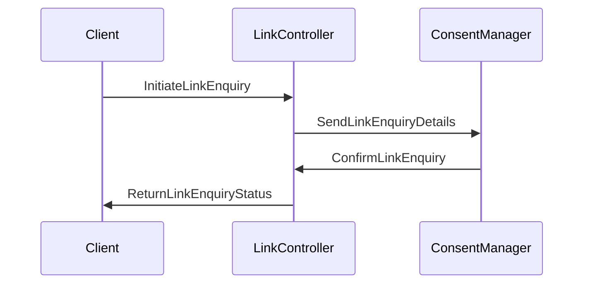

# Getting Started with Link Enquiry Model

The Link Enquiry model represents the details required to link a patient's care contexts with a consent manager. It includes properties such as <SwmToken path="src/In.ProjectEKA.HipLibrary/Patient/Model/LinkEnquiry.cs" pos="13:1:1" line-data="            ConsentManagerId = consentManagerId;">`ConsentManagerId`</SwmToken>, <SwmToken path="src/In.ProjectEKA.HipLibrary/Patient/Model/LinkEnquiry.cs" pos="14:1:1" line-data="            ConsentManagerUserId = consentManagerUserId;">`ConsentManagerUserId`</SwmToken>, <SwmToken path="src/In.ProjectEKA.HipLibrary/Patient/Model/LinkEnquiry.cs" pos="15:1:1" line-data="            ReferenceNumber = referenceNumber;">`ReferenceNumber`</SwmToken>, and a collection of <SwmToken path="src/In.ProjectEKA.HipLibrary/Patient/Model/LinkEnquiry.cs" pos="11:3:3" line-data="            IEnumerable&lt;CareContextEnquiry&gt; careContexts)">`CareContextEnquiry`</SwmToken> objects.

## Properties of Link Enquiry

The <SwmToken path="src/In.ProjectEKA.HipLibrary/Patient/Model/LinkEnquiry.cs" pos="13:1:1" line-data="            ConsentManagerId = consentManagerId;">`ConsentManagerId`</SwmToken> and <SwmToken path="src/In.ProjectEKA.HipLibrary/Patient/Model/LinkEnquiry.cs" pos="14:1:1" line-data="            ConsentManagerUserId = consentManagerUserId;">`ConsentManagerUserId`</SwmToken> are identifiers for the consent manager and the user within the consent manager system. The <SwmToken path="src/In.ProjectEKA.HipLibrary/Patient/Model/LinkEnquiry.cs" pos="15:1:1" line-data="            ReferenceNumber = referenceNumber;">`ReferenceNumber`</SwmToken> is used to uniquely identify the link enquiry request. The <SwmToken path="src/In.ProjectEKA.HipLibrary/Patient/Model/LinkEnquiry.cs" pos="16:1:1" line-data="            CareContexts = careContexts;">`CareContexts`</SwmToken> property holds a list of care contexts that are being linked.

## Usage of Link Enquiry

Link enquiry is used to facilitate the linking of a patient's care contexts with a consent manager by providing necessary identifiers and reference numbers. It is instantiated with the consent manager ID, user ID, reference number, and a collection of care context enquiries. This model is then used in various parts of the application to manage the linking process.

## Example Usage of Link Enquiry

An example of using Link enquiry is in the <SwmToken path="src/In.ProjectEKA.HipService/Link/LinkController.cs" pos="24:5:5" line-data="    public class LinkController : ControllerBase">`LinkController`</SwmToken> where it is instantiated with the consent manager suffix, user ID, reference number, and care contexts.

<SwmSnippet path="/src/In.ProjectEKA.HipService/Link/LinkController.cs" line="77">

---

In the <SwmToken path="src/In.ProjectEKA.HipService/Link/LinkController.cs" pos="24:5:5" line-data="    public class LinkController : ControllerBase">`LinkController`</SwmToken>, the <SwmToken path="src/In.ProjectEKA.HipService/Link/LinkController.cs" pos="78:9:9" line-data="            var patient = new LinkEnquiry(">`LinkEnquiry`</SwmToken> is instantiated with the consent manager suffix, user ID, reference number, and care contexts.

```c#
            var cmSuffix = cmUserId.Substring(cmUserId.LastIndexOf("@", StringComparison.Ordinal) + 1);
            var patient = new LinkEnquiry(
                cmSuffix,
```

---

</SwmSnippet>

## Main Functions

There are several main functions in this folder. Some of them are <SwmToken path="src/In.ProjectEKA.HipService/Link/LinkController.cs" pos="78:9:9" line-data="            var patient = new LinkEnquiry(">`LinkEnquiry`</SwmToken>, <SwmToken path="src/In.ProjectEKA.HipLibrary/Patient/Model/LinkEnquiry.cs" pos="13:1:1" line-data="            ConsentManagerId = consentManagerId;">`ConsentManagerId`</SwmToken>, <SwmToken path="src/In.ProjectEKA.HipLibrary/Patient/Model/LinkEnquiry.cs" pos="14:1:1" line-data="            ConsentManagerUserId = consentManagerUserId;">`ConsentManagerUserId`</SwmToken>, <SwmToken path="src/In.ProjectEKA.HipLibrary/Patient/Model/LinkEnquiry.cs" pos="15:1:1" line-data="            ReferenceNumber = referenceNumber;">`ReferenceNumber`</SwmToken>, and <SwmToken path="src/In.ProjectEKA.HipLibrary/Patient/Model/LinkEnquiry.cs" pos="16:1:1" line-data="            CareContexts = careContexts;">`CareContexts`</SwmToken>. We will dive a little into <SwmToken path="src/In.ProjectEKA.HipService/Link/LinkController.cs" pos="78:9:9" line-data="            var patient = new LinkEnquiry(">`LinkEnquiry`</SwmToken> and its properties.

### <SwmToken path="src/In.ProjectEKA.HipService/Link/LinkController.cs" pos="78:9:9" line-data="            var patient = new LinkEnquiry(">`LinkEnquiry`</SwmToken>

The <SwmToken path="src/In.ProjectEKA.HipService/Link/LinkController.cs" pos="78:9:9" line-data="            var patient = new LinkEnquiry(">`LinkEnquiry`</SwmToken> class represents the details required to link a patient's care contexts with a consent manager. It includes properties such as <SwmToken path="src/In.ProjectEKA.HipLibrary/Patient/Model/LinkEnquiry.cs" pos="13:1:1" line-data="            ConsentManagerId = consentManagerId;">`ConsentManagerId`</SwmToken>, <SwmToken path="src/In.ProjectEKA.HipLibrary/Patient/Model/LinkEnquiry.cs" pos="14:1:1" line-data="            ConsentManagerUserId = consentManagerUserId;">`ConsentManagerUserId`</SwmToken>, <SwmToken path="src/In.ProjectEKA.HipLibrary/Patient/Model/LinkEnquiry.cs" pos="15:1:1" line-data="            ReferenceNumber = referenceNumber;">`ReferenceNumber`</SwmToken>, and a collection of <SwmToken path="src/In.ProjectEKA.HipLibrary/Patient/Model/LinkEnquiry.cs" pos="11:3:3" line-data="            IEnumerable&lt;CareContextEnquiry&gt; careContexts)">`CareContextEnquiry`</SwmToken> objects.

<SwmSnippet path="/src/In.ProjectEKA.HipLibrary/Patient/Model/LinkEnquiry.cs" line="5">

---

The <SwmToken path="src/In.ProjectEKA.HipLibrary/Patient/Model/LinkEnquiry.cs" pos="5:5:5" line-data="    public class LinkEnquiry">`LinkEnquiry`</SwmToken> class constructor initializes the properties <SwmToken path="src/In.ProjectEKA.HipLibrary/Patient/Model/LinkEnquiry.cs" pos="13:1:1" line-data="            ConsentManagerId = consentManagerId;">`ConsentManagerId`</SwmToken>, <SwmToken path="src/In.ProjectEKA.HipLibrary/Patient/Model/LinkEnquiry.cs" pos="14:1:1" line-data="            ConsentManagerUserId = consentManagerUserId;">`ConsentManagerUserId`</SwmToken>, <SwmToken path="src/In.ProjectEKA.HipLibrary/Patient/Model/LinkEnquiry.cs" pos="15:1:1" line-data="            ReferenceNumber = referenceNumber;">`ReferenceNumber`</SwmToken>, and <SwmToken path="src/In.ProjectEKA.HipLibrary/Patient/Model/LinkEnquiry.cs" pos="16:1:1" line-data="            CareContexts = careContexts;">`CareContexts`</SwmToken>.

```c#
    public class LinkEnquiry
    {
        public LinkEnquiry(
            string consentManagerId,
            string consentManagerUserId,
            string referenceNumber,
            IEnumerable<CareContextEnquiry> careContexts)
        {
            ConsentManagerId = consentManagerId;
            ConsentManagerUserId = consentManagerUserId;
            ReferenceNumber = referenceNumber;
            CareContexts = careContexts;
        }
```

---

</SwmSnippet>

### <SwmToken path="src/In.ProjectEKA.HipLibrary/Patient/Model/LinkEnquiry.cs" pos="13:1:1" line-data="            ConsentManagerId = consentManagerId;">`ConsentManagerId`</SwmToken>

The <SwmToken path="src/In.ProjectEKA.HipLibrary/Patient/Model/LinkEnquiry.cs" pos="13:1:1" line-data="            ConsentManagerId = consentManagerId;">`ConsentManagerId`</SwmToken> property is an identifier for the consent manager.

<SwmSnippet path="/src/In.ProjectEKA.HipLibrary/Patient/Model/LinkEnquiry.cs" line="19">

---

The <SwmToken path="src/In.ProjectEKA.HipLibrary/Patient/Model/LinkEnquiry.cs" pos="19:5:5" line-data="        public string ConsentManagerId { get; }">`ConsentManagerId`</SwmToken> property is defined here.

```c#
        public string ConsentManagerId { get; }
```

---

</SwmSnippet>

### <SwmToken path="src/In.ProjectEKA.HipLibrary/Patient/Model/LinkEnquiry.cs" pos="14:1:1" line-data="            ConsentManagerUserId = consentManagerUserId;">`ConsentManagerUserId`</SwmToken>

The <SwmToken path="src/In.ProjectEKA.HipLibrary/Patient/Model/LinkEnquiry.cs" pos="14:1:1" line-data="            ConsentManagerUserId = consentManagerUserId;">`ConsentManagerUserId`</SwmToken> property is an identifier for the user within the consent manager system.

<SwmSnippet path="/src/In.ProjectEKA.HipLibrary/Patient/Model/LinkEnquiry.cs" line="21">

---

The <SwmToken path="src/In.ProjectEKA.HipLibrary/Patient/Model/LinkEnquiry.cs" pos="21:5:5" line-data="        public string ConsentManagerUserId { get; }">`ConsentManagerUserId`</SwmToken> property is defined here.

```c#
        public string ConsentManagerUserId { get; }
```

---

</SwmSnippet>

### <SwmToken path="src/In.ProjectEKA.HipLibrary/Patient/Model/LinkEnquiry.cs" pos="15:1:1" line-data="            ReferenceNumber = referenceNumber;">`ReferenceNumber`</SwmToken>

The <SwmToken path="src/In.ProjectEKA.HipLibrary/Patient/Model/LinkEnquiry.cs" pos="15:1:1" line-data="            ReferenceNumber = referenceNumber;">`ReferenceNumber`</SwmToken> property is used to uniquely identify the link enquiry request.

<SwmSnippet path="/src/In.ProjectEKA.HipLibrary/Patient/Model/LinkEnquiry.cs" line="23">

---

The <SwmToken path="src/In.ProjectEKA.HipLibrary/Patient/Model/LinkEnquiry.cs" pos="23:5:5" line-data="        public string ReferenceNumber { get; }">`ReferenceNumber`</SwmToken> property is defined here.

```c#
        public string ReferenceNumber { get; }
```

---

</SwmSnippet>

### <SwmToken path="src/In.ProjectEKA.HipLibrary/Patient/Model/LinkEnquiry.cs" pos="16:1:1" line-data="            CareContexts = careContexts;">`CareContexts`</SwmToken>

The <SwmToken path="src/In.ProjectEKA.HipLibrary/Patient/Model/LinkEnquiry.cs" pos="16:1:1" line-data="            CareContexts = careContexts;">`CareContexts`</SwmToken> property holds a list of care contexts that are being linked.

<SwmSnippet path="/src/In.ProjectEKA.HipLibrary/Patient/Model/LinkEnquiry.cs" line="25">

---

The <SwmToken path="src/In.ProjectEKA.HipLibrary/Patient/Model/LinkEnquiry.cs" pos="25:8:8" line-data="        public IEnumerable&lt;CareContextEnquiry&gt; CareContexts { get; }">`CareContexts`</SwmToken> property is defined here.

```c#
        public IEnumerable<CareContextEnquiry> CareContexts { get; }
```

---

</SwmSnippet>

# Link Enquiry Endpoints

The <SwmToken path="src/In.ProjectEKA.HipService/Link/LinkController.cs" pos="24:5:5" line-data="    public class LinkController : ControllerBase">`LinkController`</SwmToken> class handles the endpoints related to link enquiries. It includes methods for initiating and processing link enquiries.

<SwmSnippet path="/src/In.ProjectEKA.HipService/Link/LinkController.cs" line="10">

---

The <SwmToken path="src/In.ProjectEKA.HipService/Link/LinkController.cs" pos="24:5:5" line-data="    public class LinkController : ControllerBase">`LinkController`</SwmToken> class imports necessary dependencies and is decorated with the <SwmToken path="src/In.ProjectEKA.HipService/Link/LinkController.cs" pos="20:1:3" line-data="    [Authorize]">`[Authorize]`</SwmToken> attribute.

```c#
    using Hangfire;
    using HipLibrary.Patient.Model;
    using Logger;
    using Microsoft.AspNetCore.Http;
    using Microsoft.AspNetCore.Authorization;
    using Microsoft.AspNetCore.Mvc;
    using Microsoft.AspNetCore.Mvc.ModelBinding;
    using static Common.Constants;
    using Model;

    [Authorize]
```

---

</SwmSnippet>

## Initiate Link Enquiry

The `InitiateLinkEnquiry` method is an endpoint that initiates a link enquiry request. It takes the link enquiry details as input and processes the request.

<SwmSnippet path="/src/In.ProjectEKA.HipService/Link/LinkController.cs" line="22">

---

The `InitiateLinkEnquiry` method in the <SwmToken path="src/In.ProjectEKA.HipService/Link/LinkController.cs" pos="24:5:5" line-data="    public class LinkController : ControllerBase">`LinkController`</SwmToken> class processes the link enquiry request.

```c#
    [Consumes("application/json")]
    [Produces("application/json")]
    public class LinkController : ControllerBase
    {
        private readonly IDiscoveryRequestRepository discoveryRequestRepository;
        private readonly IBackgroundJobClient backgroundJob;
        private readonly LinkPatient linkPatient;
        private readonly GatewayClient gatewayClient;

        public LinkController(
            IDiscoveryRequestRepository discoveryRequestRepository,
```

---

</SwmSnippet>



&nbsp;

*This is an auto-generated document by Swimm 🌊 and has not yet been verified by a human*

<SwmMeta version="3.0.0" repo-id="Z2l0aHViJTNBJTNBaGlwLXNlcnZpY2UlM0ElM0FTd2ltbS1EZW1v" repo-name="hip-service"><sup>Powered by [Swimm](/)</sup></SwmMeta>
