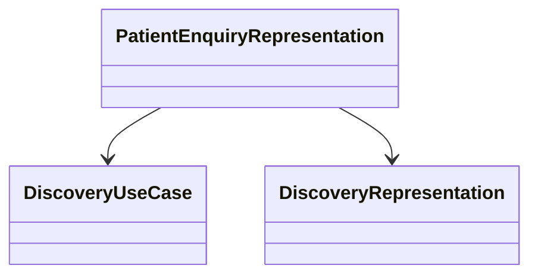

# Getting Started with Patient Enquiry Representation Model

The Patient Enquiry Representation Model encapsulates the details of a patient's enquiry. It includes properties such as the reference number, display name, care contexts, and matched criteria.

## Properties of Patient Enquiry Representation

The <SwmToken path="src/In.ProjectEKA.HipLibrary/Patient/Model/PatientEnquiryRepresentation.cs" pos="13:1:1" line-data="            ReferenceNumber = referenceNumber;">`ReferenceNumber`</SwmToken> property holds a unique identifier for the patient enquiry, ensuring that each enquiry can be distinctly referenced. The <SwmToken path="src/In.ProjectEKA.HipLibrary/Patient/Model/PatientEnquiryRepresentation.cs" pos="21:5:5" line-data="        public string Display { get; }">`Display`</SwmToken> property provides a human-readable name or description for the patient enquiry, making it easier to identify and understand. The <SwmToken path="src/In.ProjectEKA.HipLibrary/Patient/Model/PatientEnquiryRepresentation.cs" pos="23:8:8" line-data="        public IEnumerable&lt;CareContextRepresentation&gt; CareContexts { get; }">`CareContexts`</SwmToken> property is a collection of care context representations associated with the patient. These care contexts represent different healthcare settings or episodes of care related to the patient. The <SwmToken path="src/In.ProjectEKA.HipLibrary/Patient/Model/PatientEnquiryRepresentation.cs" pos="25:8:8" line-data="        public IEnumerable&lt;string&gt; MatchedBy { get; }">`MatchedBy`</SwmToken> property is a collection of strings that indicate the criteria by which the patient enquiry was matched. This could include demographic details, health IDs, or other identifiers.

## Usage in Codebase

The <SwmToken path="src/In.ProjectEKA.HipService/Discovery/DiscoveryUseCase.cs" pos="11:7:7" line-data="        public static ValueTuple&lt;PatientEnquiryRepresentation, ErrorRepresentation&gt; DiscoverPatient(">`PatientEnquiryRepresentation`</SwmToken> class is utilized in various parts of the codebase, such as in the <SwmToken path="src/In.ProjectEKA.HipService/Discovery/DiscoveryUseCase.cs" pos="9:7:7" line-data="    public static class DiscoveryUseCase">`DiscoveryUseCase`</SwmToken>, `DiscoveryRepresentation`, and `PatientDiscovery` classes, to represent and handle patient enquiries during the discovery process.

<SwmSnippet path="/src/In.ProjectEKA.HipService/Discovery/DiscoveryUseCase.cs" line="10">

---

An example of <SwmToken path="src/In.ProjectEKA.HipService/Discovery/DiscoveryUseCase.cs" pos="11:7:7" line-data="        public static ValueTuple&lt;PatientEnquiryRepresentation, ErrorRepresentation&gt; DiscoverPatient(">`PatientEnquiryRepresentation`</SwmToken> usage can be found in the <SwmToken path="src/In.ProjectEKA.HipService/Discovery/DiscoveryUseCase.cs" pos="9:7:7" line-data="    public static class DiscoveryUseCase">`DiscoveryUseCase`</SwmToken> class, where it is used to discover patient details.

```c#
    {
        public static ValueTuple<PatientEnquiryRepresentation, ErrorRepresentation> DiscoverPatient(
            IEnumerable<PatientEnquiryRepresentation> patients)
        {
```

---

</SwmSnippet>

## Main Functions

There are several main functions in this class. Some of them are <SwmToken path="src/In.ProjectEKA.HipLibrary/Patient/Model/PatientEnquiryRepresentation.cs" pos="13:1:1" line-data="            ReferenceNumber = referenceNumber;">`ReferenceNumber`</SwmToken>, Display, <SwmToken path="src/In.ProjectEKA.HipLibrary/Patient/Model/PatientEnquiryRepresentation.cs" pos="23:8:8" line-data="        public IEnumerable&lt;CareContextRepresentation&gt; CareContexts { get; }">`CareContexts`</SwmToken>, and <SwmToken path="src/In.ProjectEKA.HipLibrary/Patient/Model/PatientEnquiryRepresentation.cs" pos="25:8:8" line-data="        public IEnumerable&lt;string&gt; MatchedBy { get; }">`MatchedBy`</SwmToken>. We will dive a little into each of them.

<SwmSnippet path="/src/In.ProjectEKA.HipLibrary/Patient/Model/PatientEnquiryRepresentation.cs" line="21">

---

### Display

The <SwmToken path="src/In.ProjectEKA.HipLibrary/Patient/Model/PatientEnquiryRepresentation.cs" pos="21:5:5" line-data="        public string Display { get; }">`Display`</SwmToken> property provides a human-readable name or description for the patient enquiry, making it easier to identify and understand.

```c#
        public string Display { get; }
```

---

</SwmSnippet>

<SwmSnippet path="/src/In.ProjectEKA.HipLibrary/Patient/Model/PatientEnquiryRepresentation.cs" line="23">

---

### <SwmToken path="src/In.ProjectEKA.HipLibrary/Patient/Model/PatientEnquiryRepresentation.cs" pos="23:8:8" line-data="        public IEnumerable&lt;CareContextRepresentation&gt; CareContexts { get; }">`CareContexts`</SwmToken>

The <SwmToken path="src/In.ProjectEKA.HipLibrary/Patient/Model/PatientEnquiryRepresentation.cs" pos="23:8:8" line-data="        public IEnumerable&lt;CareContextRepresentation&gt; CareContexts { get; }">`CareContexts`</SwmToken> property is a collection of care context representations associated with the patient. These care contexts represent different healthcare settings or episodes of care related to the patient.

```c#
        public IEnumerable<CareContextRepresentation> CareContexts { get; }
```

---

</SwmSnippet>

<SwmSnippet path="/src/In.ProjectEKA.HipLibrary/Patient/Model/PatientEnquiryRepresentation.cs" line="25">

---

### <SwmToken path="src/In.ProjectEKA.HipLibrary/Patient/Model/PatientEnquiryRepresentation.cs" pos="25:8:8" line-data="        public IEnumerable&lt;string&gt; MatchedBy { get; }">`MatchedBy`</SwmToken>

The <SwmToken path="src/In.ProjectEKA.HipLibrary/Patient/Model/PatientEnquiryRepresentation.cs" pos="25:8:8" line-data="        public IEnumerable&lt;string&gt; MatchedBy { get; }">`MatchedBy`</SwmToken> property is a collection of strings that indicate the criteria by which the patient enquiry was matched. This could include demographic details, health IDs, or other identifiers.

```c#
        public IEnumerable<string> MatchedBy { get; }
```

---

</SwmSnippet>

## Patient Enquiry Representation Endpoints

The <SwmToken path="src/In.ProjectEKA.HipService/Discovery/DiscoveryUseCase.cs" pos="11:7:7" line-data="        public static ValueTuple&lt;PatientEnquiryRepresentation, ErrorRepresentation&gt; DiscoverPatient(">`PatientEnquiryRepresentation`</SwmToken> class is used to encapsulate the details of a patient's enquiry. It includes properties such as <SwmToken path="src/In.ProjectEKA.HipLibrary/Patient/Model/PatientEnquiryRepresentation.cs" pos="13:1:1" line-data="            ReferenceNumber = referenceNumber;">`ReferenceNumber`</SwmToken>, <SwmToken path="src/In.ProjectEKA.HipLibrary/Patient/Model/PatientEnquiryRepresentation.cs" pos="21:5:5" line-data="        public string Display { get; }">`Display`</SwmToken>, <SwmToken path="src/In.ProjectEKA.HipLibrary/Patient/Model/PatientEnquiryRepresentation.cs" pos="23:8:8" line-data="        public IEnumerable&lt;CareContextRepresentation&gt; CareContexts { get; }">`CareContexts`</SwmToken>, and <SwmToken path="src/In.ProjectEKA.HipLibrary/Patient/Model/PatientEnquiryRepresentation.cs" pos="25:8:8" line-data="        public IEnumerable&lt;string&gt; MatchedBy { get; }">`MatchedBy`</SwmToken>. This class is utilized in various parts of the codebase to represent and handle patient enquiries during the discovery process.

<SwmSnippet path="/src/In.ProjectEKA.HipService/Discovery/DiscoveryUseCase.cs" line="10">

---

The <SwmToken path="src/In.ProjectEKA.HipService/Discovery/DiscoveryUseCase.cs" pos="11:7:7" line-data="        public static ValueTuple&lt;PatientEnquiryRepresentation, ErrorRepresentation&gt; DiscoverPatient(">`PatientEnquiryRepresentation`</SwmToken> class is used in the <SwmToken path="src/In.ProjectEKA.HipService/Discovery/DiscoveryUseCase.cs" pos="9:7:7" line-data="    public static class DiscoveryUseCase">`DiscoveryUseCase`</SwmToken> class to discover patient details and handle errors if no patient is found.

```c#
    {
        public static ValueTuple<PatientEnquiryRepresentation, ErrorRepresentation> DiscoverPatient(
            IEnumerable<PatientEnquiryRepresentation> patients)
        {
            if (!patients.Any())
                return (null, new ErrorRepresentation(new Error(ErrorCode.NoPatientFound, "No patient found")));

            if (patients.Count() == 1)
                return (patients.First(), null);

            return (null,
```

---

</SwmSnippet>

## Discovery Representation

The `DiscoveryRepresentation` class uses the <SwmToken path="src/In.ProjectEKA.HipService/Discovery/DiscoveryUseCase.cs" pos="11:7:7" line-data="        public static ValueTuple&lt;PatientEnquiryRepresentation, ErrorRepresentation&gt; DiscoverPatient(">`PatientEnquiryRepresentation`</SwmToken> to manage patient enquiries. It ensures that the patient enquiry details are correctly represented and processed during the discovery process.



&nbsp;

*This is an auto-generated document by Swimm 🌊 and has not yet been verified by a human*

<SwmMeta version="3.0.0" repo-id="Z2l0aHViJTNBJTNBaGlwLXNlcnZpY2UlM0ElM0FTd2ltbS1EZW1v" repo-name="hip-service"><sup>Powered by [Swimm](/)</sup></SwmMeta>
