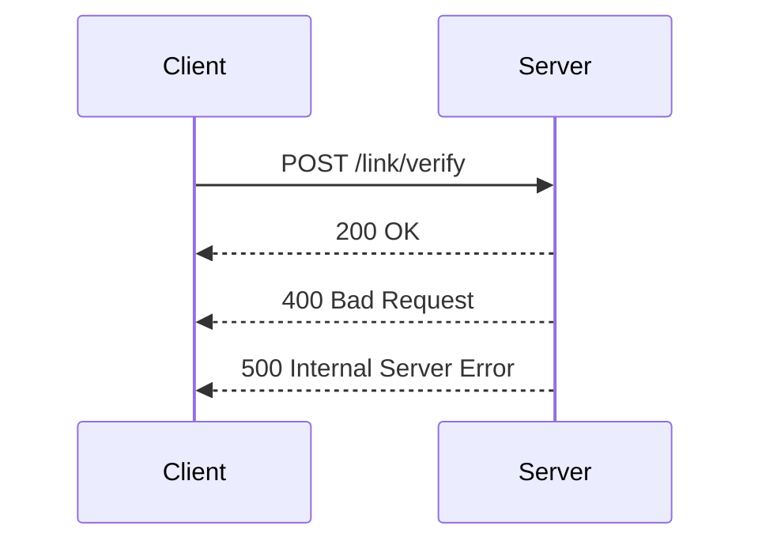

# Getting Started with Patient Link Confirmation Representation Model

The <SwmToken path="src/In.ProjectEKA.HipLibrary/Patient/Model/PatientLinkConfirmationRepresentation.cs" pos="3:5:5" line-data="    public class PatientLinkConfirmationRepresentation">`PatientLinkConfirmationRepresentation`</SwmToken> class is a model that represents the confirmation of a patient's link. It contains a single property, <SwmToken path="src/In.ProjectEKA.HipLibrary/Patient/Model/PatientLinkConfirmationRepresentation.cs" pos="1:8:8" line-data="namespace In.ProjectEKA.HipLibrary.Patient.Model">`Patient`</SwmToken>, which holds an instance of <SwmToken path="src/In.ProjectEKA.HipLibrary/Patient/Model/PatientLinkConfirmationRepresentation.cs" pos="5:5:5" line-data="        public PatientLinkConfirmationRepresentation(LinkConfirmationRepresentation patient)">`LinkConfirmationRepresentation`</SwmToken>. This class is used to encapsulate the confirmation details of a patient's link, ensuring that the necessary information is passed and stored in a structured manner.

## Constructor

The constructor of the <SwmToken path="src/In.ProjectEKA.HipLibrary/Patient/Model/PatientLinkConfirmationRepresentation.cs" pos="3:5:5" line-data="    public class PatientLinkConfirmationRepresentation">`PatientLinkConfirmationRepresentation`</SwmToken> class initializes the <SwmToken path="src/In.ProjectEKA.HipLibrary/Patient/Model/PatientLinkConfirmationRepresentation.cs" pos="1:8:8" line-data="namespace In.ProjectEKA.HipLibrary.Patient.Model">`Patient`</SwmToken> property with the provided <SwmToken path="src/In.ProjectEKA.HipLibrary/Patient/Model/PatientLinkConfirmationRepresentation.cs" pos="5:5:5" line-data="        public PatientLinkConfirmationRepresentation(LinkConfirmationRepresentation patient)">`LinkConfirmationRepresentation`</SwmToken> instance.

<SwmSnippet path="/src/In.ProjectEKA.HipLibrary/Patient/Model/PatientLinkConfirmationRepresentation.cs" line="1">

---

The <SwmToken path="src/In.ProjectEKA.HipLibrary/Patient/Model/PatientLinkConfirmationRepresentation.cs" pos="3:5:5" line-data="    public class PatientLinkConfirmationRepresentation">`PatientLinkConfirmationRepresentation`</SwmToken> class is defined in this file. The constructor initializes the <SwmToken path="src/In.ProjectEKA.HipLibrary/Patient/Model/PatientLinkConfirmationRepresentation.cs" pos="1:8:8" line-data="namespace In.ProjectEKA.HipLibrary.Patient.Model">`Patient`</SwmToken> property with the provided <SwmToken path="src/In.ProjectEKA.HipLibrary/Patient/Model/PatientLinkConfirmationRepresentation.cs" pos="5:5:5" line-data="        public PatientLinkConfirmationRepresentation(LinkConfirmationRepresentation patient)">`LinkConfirmationRepresentation`</SwmToken> instance.

```c#
namespace In.ProjectEKA.HipLibrary.Patient.Model
{
    public class PatientLinkConfirmationRepresentation
    {
        public PatientLinkConfirmationRepresentation(LinkConfirmationRepresentation patient)
        {
            Patient = patient;
        }

        public LinkConfirmationRepresentation Patient { get; }
    }
```

---

</SwmSnippet>

## Usage in <SwmToken path="src/In.ProjectEKA.HipService/Link/LinkPatient.cs" pos="133:1:1" line-data="            VerifyAndLinkCareContext(">`VerifyAndLinkCareContext`</SwmToken>

In the <SwmToken path="src/In.ProjectEKA.HipService/Link/LinkPatient.cs" pos="133:1:1" line-data="            VerifyAndLinkCareContext(">`VerifyAndLinkCareContext`</SwmToken> method, the <SwmToken path="src/In.ProjectEKA.HipLibrary/Patient/Model/PatientLinkConfirmationRepresentation.cs" pos="3:5:5" line-data="    public class PatientLinkConfirmationRepresentation">`PatientLinkConfirmationRepresentation`</SwmToken> is used to return the result of the verification and linking process.

<SwmSnippet path="/src/In.ProjectEKA.HipService/Link/LinkPatient.cs" line="132">

---

The <SwmToken path="src/In.ProjectEKA.HipService/Link/LinkPatient.cs" pos="133:1:1" line-data="            VerifyAndLinkCareContext(">`VerifyAndLinkCareContext`</SwmToken> method uses the <SwmToken path="src/In.ProjectEKA.HipService/Link/LinkPatient.cs" pos="132:11:11" line-data="        public virtual async Task&lt;ValueTuple&lt;PatientLinkConfirmationRepresentation, string, ErrorRepresentation&gt;&gt;">`PatientLinkConfirmationRepresentation`</SwmToken> to return the result of the verification and linking process.

```c#
        public virtual async Task<ValueTuple<PatientLinkConfirmationRepresentation, string, ErrorRepresentation>>
            VerifyAndLinkCareContext(
            LinkConfirmationRequest request)
        {
            var (linkEnquires, exception) =
                await linkPatientRepository.GetPatientFor(request.LinkReferenceNumber);
            var cmId = "";
            if (exception != null)
                return (null,cmId,
                    new ErrorRepresentation(new Error(ErrorCode.NoLinkRequestFound, ErrorMessage.NoLinkRequestFound)));
            cmId = linkEnquires.ConsentManagerId;

            var errorResponse = await patientVerification.Verify(request.LinkReferenceNumber, request.Token);
            if (errorResponse != null)
                return (null,cmId, new ErrorRepresentation(errorResponse.toError()));

            var patient = await patientRepository.PatientWithAsync(linkEnquires.PatientReferenceNumber);
            return await patient.Map( async patient =>
                {
                    var savedLinkRequests = await linkPatientRepository.Get(request.LinkReferenceNumber);
                    savedLinkRequests.MatchSome(linkRequests =>
```

---

</SwmSnippet>

## Patient Link Confirmation Endpoints

The <SwmToken path="src/In.ProjectEKA.HipService/Link/LinkPatient.cs" pos="133:1:1" line-data="            VerifyAndLinkCareContext(">`VerifyAndLinkCareContext`</SwmToken> method in the <SwmToken path="src/In.ProjectEKA.HipService/Link/LinkController.cs" pos="24:5:5" line-data="    public class LinkController : ControllerBase">`LinkController`</SwmToken> class is responsible for verifying and linking a patient's care context. It uses the <SwmToken path="src/In.ProjectEKA.HipLibrary/Patient/Model/PatientLinkConfirmationRepresentation.cs" pos="3:5:5" line-data="    public class PatientLinkConfirmationRepresentation">`PatientLinkConfirmationRepresentation`</SwmToken> to return the result of the verification and linking process.

<SwmSnippet path="/src/In.ProjectEKA.HipService/Link/LinkController.cs" line="45">

---

The <SwmToken path="src/In.ProjectEKA.HipService/Link/LinkPatient.cs" pos="133:1:1" line-data="            VerifyAndLinkCareContext(">`VerifyAndLinkCareContext`</SwmToken> method in the <SwmToken path="src/In.ProjectEKA.HipService/Link/LinkController.cs" pos="24:5:5" line-data="    public class LinkController : ControllerBase">`LinkController`</SwmToken> class handles the verification and linking of a patient's care context.

```c#
            [FromBody] LinkReferenceRequest request)
        {
            backgroundJob.Enqueue(() => LinkPatient(request, correlationId));
            return Accepted();
        }

        /// <summary>
        /// Link patient's care contexts
        /// </summary>
        /// <remarks>
        /// Links care contexts associated with only one patient
        ///
        /// 1. Validate account reference number and care context reference number
        /// 2. Validate transactionId in the request with discovery request entry to check whether there was a discovery and were these care contexts discovered or not for a given patient
        /// 3. Before linking, HIP needs to authenticate the request with the patient(Ex: OTP verification)
        /// 4. Communicate the mode of authentication of a successful request with Consent Manager
```

---

</SwmSnippet>



&nbsp;

*This is an auto-generated document by Swimm 🌊 and has not yet been verified by a human*

<SwmMeta version="3.0.0" repo-id="Z2l0aHViJTNBJTNBaGlwLXNlcnZpY2UlM0ElM0FTd2ltbS1EZW1v" repo-name="hip-service"><sup>Powered by [Swimm](/)</sup></SwmMeta>
