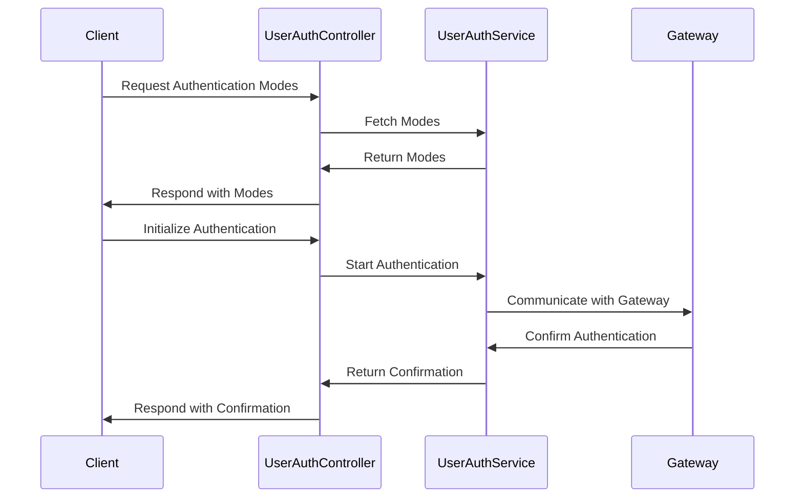

## Overview

The <SwmToken path="src/In.ProjectEKA.HipService/UserAuth/UserAuthController.cs" pos="28:5:5" line-data="    public class UserAuthController : Controller">`UserAuthController`</SwmToken> is responsible for handling user authentication-related requests. It interacts with various services and configurations such as <SwmToken path="src/In.ProjectEKA.HipService/UserAuth/UserAuthController.cs" pos="30:5:5" line-data="        private readonly IGatewayClient gatewayClient;">`IGatewayClient`</SwmToken>, <SwmToken path="src/In.ProjectEKA.HipService/UserAuth/UserAuthController.cs" pos="31:5:5" line-data="        private readonly ILogger&lt;UserAuthController&gt; logger;">`ILogger`</SwmToken>, <SwmToken path="src/In.ProjectEKA.HipService/UserAuth/UserAuthController.cs" pos="32:5:5" line-data="        private readonly BahmniConfiguration bahmniConfiguration;">`BahmniConfiguration`</SwmToken>, <SwmToken path="src/In.ProjectEKA.HipService/UserAuth/UserAuthController.cs" pos="33:5:5" line-data="        private readonly IUserAuthService userAuthService;">`IUserAuthService`</SwmToken>, <SwmToken path="src/In.ProjectEKA.HipService/UserAuth/UserAuthController.cs" pos="34:5:5" line-data="        private readonly GatewayConfiguration gatewayConfiguration;">`GatewayConfiguration`</SwmToken>, <SwmToken path="src/In.ProjectEKA.HipService/UserAuth/UserAuthController.cs" pos="35:5:5" line-data="        private readonly HttpClient httpClient;">`HttpClient`</SwmToken>, and <SwmToken path="src/In.ProjectEKA.HipService/UserAuth/UserAuthController.cs" pos="36:5:5" line-data="        private readonly OpenMrsConfiguration openMrsConfiguration;">`OpenMrsConfiguration`</SwmToken>. The controller includes methods for fetching authentication modes, initializing authentication, confirming authentication, and handling demographic details. It uses the <SwmToken path="src/In.ProjectEKA.HipService/UserAuth/UserAuthController.cs" pos="61:1:1" line-data="                userAuthService.FetchModeResponse(fetchRequest, bahmniConfiguration);">`userAuthService`</SwmToken> to process requests and communicate with the gateway for authentication purposes. The controller ensures that the appropriate authentication schemes are applied and logs relevant information for each request.

## Main Functions

There are several main functions in this controller. Some of them are <SwmToken path="src/In.ProjectEKA.HipService/UserAuth/UserAuthController.cs" pos="57:10:10" line-data="        public async Task&lt;ActionResult&gt; GetAuthModes(">`GetAuthModes`</SwmToken>, <SwmToken path="src/In.ProjectEKA.HipService/UserAuth/UserAuthController.cs" pos="119:5:5" line-data="        public AcceptedResult SetAuthModes(OnFetchAuthModeRequest request)">`SetAuthModes`</SwmToken>, <SwmToken path="src/In.ProjectEKA.HipService/UserAuth/UserAuthController.cs" pos="143:10:10" line-data="        public async Task&lt;ActionResult&gt; GetTransactionId(">`GetTransactionId`</SwmToken>, <SwmToken path="src/In.ProjectEKA.HipService/UserAuth/UserAuthController.cs" pos="156:5:5" line-data="        public AcceptedResult SetTransactionId(AuthOnInitRequest request)">`SetTransactionId`</SwmToken>, <SwmToken path="src/In.ProjectEKA.HipService/UserAuth/UserAuthController.cs" pos="182:10:10" line-data="        public async Task&lt;ActionResult&gt; GetAccessToken(">`GetAccessToken`</SwmToken>, <SwmToken path="src/In.ProjectEKA.HipService/UserAuth/UserAuthController.cs" pos="195:10:10" line-data="        public async Task&lt;ActionResult&gt; SetAccessToken(OnAuthConfirmRequest request)">`SetAccessToken`</SwmToken>, <SwmToken path="src/In.ProjectEKA.HipService/UserAuth/UserAuthController.cs" pos="222:7:7" line-data="        public async Task SetDemographicDetails(">`SetDemographicDetails`</SwmToken>, <SwmToken path="src/In.ProjectEKA.HipService/UserAuth/UserAuthController.cs" pos="235:10:10" line-data="        public async Task&lt;ActionResult&gt; DemographicAuth([FromBody] NdhmDemographics ndhmDemographics)">`DemographicAuth`</SwmToken>, <SwmToken path="src/In.ProjectEKA.HipService/UserAuth/UserAuthController.cs" pos="254:10:10" line-data="        public async Task&lt;ActionResult&gt; AuthNotify([FromHeader(Name = CORRELATION_ID)] string correlationId, ">`AuthNotify`</SwmToken>, and <SwmToken path="src/In.ProjectEKA.HipService/UserAuth/UserAuthController.cs" pos="278:10:10" line-data="        public async Task&lt;ActionResult&gt; GetPatientDetails([FromParameter(&quot;healthId&quot;)] string healthId)">`GetPatientDetails`</SwmToken>. We will dive a little into each of these functions.

<SwmSnippet path="/src/In.ProjectEKA.HipService/UserAuth/UserAuthController.cs" line="55">

---

### <SwmToken path="src/In.ProjectEKA.HipService/UserAuth/UserAuthController.cs" pos="57:10:10" line-data="        public async Task&lt;ActionResult&gt; GetAuthModes(">`GetAuthModes`</SwmToken>

The <SwmToken path="src/In.ProjectEKA.HipService/UserAuth/UserAuthController.cs" pos="57:10:10" line-data="        public async Task&lt;ActionResult&gt; GetAuthModes(">`GetAuthModes`</SwmToken> function fetches the authentication modes available for a user. It interacts with the <SwmToken path="src/In.ProjectEKA.HipService/UserAuth/UserAuthController.cs" pos="61:1:1" line-data="                userAuthService.FetchModeResponse(fetchRequest, bahmniConfiguration);">`userAuthService`</SwmToken> to get the modes and sends a request to the gateway. It handles errors and logs relevant information.

```c#
        [Authorize(AuthenticationSchemes = BAHMNI_AUTH)]
        [Route(PATH_FETCH_MODES)]
        public async Task<ActionResult> GetAuthModes(
            [FromHeader(Name = CORRELATION_ID)] string correlationId, [FromBody] FetchRequest fetchRequest)
        {
            var (gatewayFetchModesRequestRepresentation, error) =
                userAuthService.FetchModeResponse(fetchRequest, bahmniConfiguration);
            if (error != null)
                return StatusCode(StatusCodes.Status400BadRequest, error);
            Guid requestId = gatewayFetchModesRequestRepresentation.requestId;
            var cmSuffix = gatewayConfiguration.CmSuffix;

            try
            {
                logger.Log(LogLevel.Information,
                    LogEvents.UserAuth,
                    "Request for fetch-modes to gateway: {@GatewayResponse}",
                    gatewayFetchModesRequestRepresentation.dump(gatewayFetchModesRequestRepresentation));
                logger.Log(LogLevel.Information,
                    LogEvents.UserAuth, $"cmSuffix: {{cmSuffix}}, correlationId: {{correlationId}}," +
                                        $" healthId: {{healthId}}, requestId: {{requestId}}",
```

---

</SwmSnippet>

<SwmSnippet path="/src/In.ProjectEKA.HipService/UserAuth/UserAuthController.cs" line="117">

---

### <SwmToken path="src/In.ProjectEKA.HipService/UserAuth/UserAuthController.cs" pos="119:5:5" line-data="        public AcceptedResult SetAuthModes(OnFetchAuthModeRequest request)">`SetAuthModes`</SwmToken>

The <SwmToken path="src/In.ProjectEKA.HipService/UserAuth/UserAuthController.cs" pos="119:5:5" line-data="        public AcceptedResult SetAuthModes(OnFetchAuthModeRequest request)">`SetAuthModes`</SwmToken> function sets the authentication modes received from the gateway. It updates the internal mappings and logs the received information.

```c#
        [Authorize]
        [HttpPost(PATH_ON_FETCH_AUTH_MODES)]
        public AcceptedResult SetAuthModes(OnFetchAuthModeRequest request)
        {
            logger.Log(LogLevel.Information,
                LogEvents.UserAuth, "On fetch mode request received." +
                                    $" RequestId:{request.RequestId}, " +
                                    $" Timestamp:{request.Timestamp}," +
                                    $" ResponseRequestId:{request.Resp.RequestId}, ");
            if (request.Error != null)
            {
                RequestIdToErrorMessage.Add(Guid.Parse(request.Resp.RequestId), request.Error);
                logger.Log(LogLevel.Information,
                    LogEvents.UserAuth, $" Error Code:{request.Error.Code}," +
                                        $" Error Message:{request.Error.Message}.");
            }
            else if (request.Auth != null)
            {
                RequestIdToAuthModes.Add(Guid.Parse(request.Resp.RequestId), request.Auth.Modes);
            }
```

---

</SwmSnippet>

<SwmSnippet path="/src/In.ProjectEKA.HipService/UserAuth/UserAuthController.cs" line="142">

---

### <SwmToken path="src/In.ProjectEKA.HipService/UserAuth/UserAuthController.cs" pos="143:10:10" line-data="        public async Task&lt;ActionResult&gt; GetTransactionId(">`GetTransactionId`</SwmToken>

The <SwmToken path="src/In.ProjectEKA.HipService/UserAuth/UserAuthController.cs" pos="143:10:10" line-data="        public async Task&lt;ActionResult&gt; GetTransactionId(">`GetTransactionId`</SwmToken> function initiates an authentication transaction and retrieves a transaction ID. It uses the <SwmToken path="src/In.ProjectEKA.HipService/UserAuth/UserAuthController.cs" pos="147:3:3" line-data="                await userAuthService.AuthInit(authInitRequest, correlationId, bahmniConfiguration,gatewayConfiguration);">`userAuthService`</SwmToken> to process the request and handles any errors.

```c#
        [Route(PATH_HIP_AUTH_INIT)]
        public async Task<ActionResult> GetTransactionId(
            [FromHeader(Name = CORRELATION_ID)] string correlationId, [FromBody] AuthInitRequest authInitRequest)
        {
            var error =
                await userAuthService.AuthInit(authInitRequest, correlationId, bahmniConfiguration,gatewayConfiguration);
            if (error == null) return Accepted();
            Log.Information($" Error Code:{error.Error.Code}," +
                            $" Error Message:{error.Error.Message}");
            return StatusCode(ErrorCodeToStatusCode.GetValueOrDefault(error.Error.Code, StatusCodes.Status400BadRequest), error);
```

---

</SwmSnippet>

<SwmSnippet path="/src/In.ProjectEKA.HipService/UserAuth/UserAuthController.cs" line="155">

---

### <SwmToken path="src/In.ProjectEKA.HipService/UserAuth/UserAuthController.cs" pos="156:5:5" line-data="        public AcceptedResult SetTransactionId(AuthOnInitRequest request)">`SetTransactionId`</SwmToken>

The <SwmToken path="src/In.ProjectEKA.HipService/UserAuth/UserAuthController.cs" pos="156:5:5" line-data="        public AcceptedResult SetTransactionId(AuthOnInitRequest request)">`SetTransactionId`</SwmToken> function sets the transaction ID received from the gateway. It updates the internal mappings and logs the received information.

```c#
        [HttpPost(PATH_ON_AUTH_INIT)]
        public AcceptedResult SetTransactionId(AuthOnInitRequest request)
        {
            logger.Log(LogLevel.Information,
                LogEvents.UserAuth, "Auth on init request received." +
                                    $" RequestId:{request.RequestId}, " +
                                    $" Timestamp:{request.Timestamp},");
            if (request.Error != null)
            {
                RequestIdToErrorMessage.Add(Guid.Parse(request.Resp.RequestId), request.Error);
                logger.Log(LogLevel.Information,
                    LogEvents.UserAuth, $" Error Code:{request.Error.Code}," +
                                        $" Error Message:{request.Error.Message}.");
            }
            else if (request.Auth != null)
            {
                string transactionId = request.Auth.TransactionId;
                RequestIdToTransactionIdMap.Add(Guid.Parse(request.Resp.RequestId), transactionId);
            }
```

---

</SwmSnippet>

<SwmSnippet path="/src/In.ProjectEKA.HipService/UserAuth/UserAuthController.cs" line="181">

---

### <SwmToken path="src/In.ProjectEKA.HipService/UserAuth/UserAuthController.cs" pos="182:10:10" line-data="        public async Task&lt;ActionResult&gt; GetAccessToken(">`GetAccessToken`</SwmToken>

The <SwmToken path="src/In.ProjectEKA.HipService/UserAuth/UserAuthController.cs" pos="182:10:10" line-data="        public async Task&lt;ActionResult&gt; GetAccessToken(">`GetAccessToken`</SwmToken> function confirms the authentication and retrieves an access token. It uses the <SwmToken path="src/In.ProjectEKA.HipService/UserAuth/UserAuthController.cs" pos="186:3:3" line-data="                await userAuthService.AuthConfirm(authConfirmRequest, correlationId,gatewayConfiguration);">`userAuthService`</SwmToken> to process the request and handles any errors.

```c#
        [Route(PATH_HIP_AUTH_CONFIRM)]
        public async Task<ActionResult> GetAccessToken(
            [FromHeader(Name = CORRELATION_ID)] string correlationId, [FromBody] AuthConfirmRequest authConfirmRequest)
        {
            var (authConfirm, error) =
                await userAuthService.AuthConfirm(authConfirmRequest, correlationId,gatewayConfiguration);
            if (error == null) return Accepted(authConfirm);
            Log.Information($" Error Code:{error.Error.Code}," +
                            $" Error Message:{error.Error.Message}");
            return StatusCode(ErrorCodeToStatusCode.GetValueOrDefault(error.Error.Code, StatusCodes.Status400BadRequest), error);
        }
```

---

</SwmSnippet>

<SwmSnippet path="/src/In.ProjectEKA.HipService/UserAuth/UserAuthController.cs" line="194">

---

### <SwmToken path="src/In.ProjectEKA.HipService/UserAuth/UserAuthController.cs" pos="195:10:10" line-data="        public async Task&lt;ActionResult&gt; SetAccessToken(OnAuthConfirmRequest request)">`SetAccessToken`</SwmToken>

The <SwmToken path="src/In.ProjectEKA.HipService/UserAuth/UserAuthController.cs" pos="195:10:10" line-data="        public async Task&lt;ActionResult&gt; SetAccessToken(OnAuthConfirmRequest request)">`SetAccessToken`</SwmToken> function sets the access token received from the gateway. It updates the internal mappings and logs the received information.

```c#
        [HttpPost(PATH_ON_AUTH_CONFIRM)]
        public async Task<ActionResult> SetAccessToken(OnAuthConfirmRequest request)
        {
            logger.Log(LogLevel.Information,
                LogEvents.UserAuth, "Auth on confirm request received." +
                                    $" RequestId:{request.requestID}, " +
                                    $" Timestamp:{request.timestamp}," +
                                    $" ResponseRequestId:{request.resp.RequestId}, ");
            if (request.error != null)
            {
                RequestIdToErrorMessage.Add(Guid.Parse(request.resp.RequestId), request.error);
                logger.Log(LogLevel.Information,
                    LogEvents.UserAuth, $" Error Code:{request.error.Code}," +
                                        $" Error Message:{request.error.Message}.");
            }
            else if (request.auth != null)
            {
                var (response, error) = await userAuthService.OnAuthConfirmResponse(request);
                if (error != null)
                    return StatusCode(StatusCodes.Status400BadRequest, error);
            }
```

---

</SwmSnippet>

<SwmSnippet path="/src/In.ProjectEKA.HipService/UserAuth/UserAuthController.cs" line="221">

---

### <SwmToken path="src/In.ProjectEKA.HipService/UserAuth/UserAuthController.cs" pos="222:7:7" line-data="        public async Task SetDemographicDetails(">`SetDemographicDetails`</SwmToken>

The <SwmToken path="src/In.ProjectEKA.HipService/UserAuth/UserAuthController.cs" pos="222:7:7" line-data="        public async Task SetDemographicDetails(">`SetDemographicDetails`</SwmToken> function sets the demographic details of a user. It uses the <SwmToken path="src/In.ProjectEKA.HipService/UserAuth/UserAuthController.cs" pos="231:3:3" line-data="            await userAuthService.Dump(ndhmDemographics);">`userAuthService`</SwmToken> to store the details.

```c#
        [Route(PATH_ADD_NDHM_DEMOGRAPHICS)]
        public async Task SetDemographicDetails(
            [FromBody] NDHMDemographicRequest ndhmDemographicRequest)
        {
            var healthId = ndhmDemographicRequest.HealthId;
            var name = ndhmDemographicRequest.Name;
            var gender = ndhmDemographicRequest.Gender;
            var dateOfBirth = ndhmDemographicRequest.DateOfBirth;
            var phoneNumber = ndhmDemographicRequest.PhoneNumber;
            var ndhmDemographics = new NdhmDemographics(healthId, name, gender, dateOfBirth, phoneNumber);
            await userAuthService.Dump(ndhmDemographics);
        }
```

---

</SwmSnippet>

<SwmSnippet path="/src/In.ProjectEKA.HipService/UserAuth/UserAuthController.cs" line="234">

---

### <SwmToken path="src/In.ProjectEKA.HipService/UserAuth/UserAuthController.cs" pos="235:10:10" line-data="        public async Task&lt;ActionResult&gt; DemographicAuth([FromBody] NdhmDemographics ndhmDemographics)">`DemographicAuth`</SwmToken>

The <SwmToken path="src/In.ProjectEKA.HipService/UserAuth/UserAuthController.cs" pos="235:10:10" line-data="        public async Task&lt;ActionResult&gt; DemographicAuth([FromBody] NdhmDemographics ndhmDemographics)">`DemographicAuth`</SwmToken> function handles authentication based on demographic details. It initiates and confirms the authentication using the <SwmToken path="src/In.ProjectEKA.HipService/UserAuth/UserAuthController.cs" pos="239:9:9" line-data="            var initError = await userAuthService.AuthInit(authInitRequest, null, bahmniConfiguration,gatewayConfiguration);">`userAuthService`</SwmToken>.

```c#
        [Route(PATH_DEMOGRAPHICS)]
        public async Task<ActionResult> DemographicAuth([FromBody] NdhmDemographics ndhmDemographics)
        {
            var authInitRequest = new AuthInitRequest(ndhmDemographics.HealthId, "DEMOGRAPHICS", "LINK");
            
            var initError = await userAuthService.AuthInit(authInitRequest, null, bahmniConfiguration,gatewayConfiguration);
            if (initError != null)
                return StatusCode(StatusCodes.Status500InternalServerError, initError);
            
            var identifier = new Identifier(MOBILE, ndhmDemographics.PhoneNumber);
            var demographics = new Demographics(ndhmDemographics.Name, ndhmDemographics.Gender,
                ndhmDemographics.DateOfBirth, identifier);
            var authConfirmRequest = new AuthConfirmRequest(null, ndhmDemographics.HealthId, demographics);
            
            var (authConfirm, confirmError) = await userAuthService.AuthConfirm(authConfirmRequest, null ,gatewayConfiguration);
            return confirmError != null ? StatusCode(ErrorCodeToStatusCode.GetValueOrDefault(confirmError.Error.Code,StatusCodes.Status400BadRequest),confirmError) : Accepted(authConfirm);
        }
```

---

</SwmSnippet>

<SwmSnippet path="/src/In.ProjectEKA.HipService/UserAuth/UserAuthController.cs" line="253">

---

### <SwmToken path="src/In.ProjectEKA.HipService/UserAuth/UserAuthController.cs" pos="254:10:10" line-data="        public async Task&lt;ActionResult&gt; AuthNotify([FromHeader(Name = CORRELATION_ID)] string correlationId, ">`AuthNotify`</SwmToken>

The <SwmToken path="src/In.ProjectEKA.HipService/UserAuth/UserAuthController.cs" pos="254:10:10" line-data="        public async Task&lt;ActionResult&gt; AuthNotify([FromHeader(Name = CORRELATION_ID)] string correlationId, ">`AuthNotify`</SwmToken> function handles notifications related to authentication. It processes the notification using the <SwmToken path="src/In.ProjectEKA.HipService/UserAuth/UserAuthController.cs" pos="262:9:9" line-data="            var error = await userAuthService.AuthNotify(request);">`userAuthService`</SwmToken> and sends a response to the gateway.

```c#
        [HttpPost(PATH_AUTH_NOTIFY)]
        public async Task<ActionResult> AuthNotify([FromHeader(Name = CORRELATION_ID)] string correlationId, 
            [FromBody] AuthNotifyRequest request)
        {
            logger.Log(LogLevel.Information,
                LogEvents.UserAuth, "Auth notify request received." +
                                    $" RequestId:{request.requestId}, " +
                                    $" Timestamp:{request.timestamp}");

            var error = await userAuthService.AuthNotify(request);
            var cmSuffix = gatewayConfiguration.CmSuffix;
            var gatewayAuthOnNotifyResponseRepresentation = new AuthOnNotifyResponse(
                Guid.NewGuid(),
                DateTime.Now.ToUniversalTime().ToString(DateTimeFormat),
                new AuthOnNotifyAcknowledgement(AuthOnNotifyStatus.OK),
                error?.Error,
                new Resp(request.requestId.ToString())
            );
            await gatewayClient.SendDataToGateway(PATH_AUTH_ON_NOTIFY, gatewayAuthOnNotifyResponseRepresentation, cmSuffix, correlationId);
            
            return Accepted();
```

---

</SwmSnippet>

<SwmSnippet path="/src/In.ProjectEKA.HipService/UserAuth/UserAuthController.cs" line="277">

---

### <SwmToken path="src/In.ProjectEKA.HipService/UserAuth/UserAuthController.cs" pos="278:10:10" line-data="        public async Task&lt;ActionResult&gt; GetPatientDetails([FromParameter(&quot;healthId&quot;)] string healthId)">`GetPatientDetails`</SwmToken>

The <SwmToken path="src/In.ProjectEKA.HipService/UserAuth/UserAuthController.cs" pos="278:10:10" line-data="        public async Task&lt;ActionResult&gt; GetPatientDetails([FromParameter(&quot;healthId&quot;)] string healthId)">`GetPatientDetails`</SwmToken> function retrieves patient details for direct authentication. It uses the <SwmToken path="src/In.ProjectEKA.HipService/UserAuth/UserAuthController.cs" pos="280:12:12" line-data="            var (authConfirmPatient, error) = userAuthService.GetPatientDetailsForDirectAuth(healthId, gatewayConfiguration);">`userAuthService`</SwmToken> to get the details and handles any errors.

```c#
        [Route(PATH_HIP_DIRECT_AUTH)]
        public async Task<ActionResult> GetPatientDetails([FromParameter("healthId")] string healthId)
        {
            var (authConfirmPatient, error) = userAuthService.GetPatientDetailsForDirectAuth(healthId, gatewayConfiguration);
            if (error == null) 
                return Accepted(authConfirmPatient);
            
            Log.Information($" Error Code:{error.Error.Code}," +
                            $" Error Message:{error.Error.Message}");
            return StatusCode(ErrorCodeToStatusCode.GetValueOrDefault(error.Error.Code,StatusCodes.Status400BadRequest), error);
        }
```

---

</SwmSnippet>

## User Authentication APIs

User Authentication APIs provide endpoints for various authentication-related operations.

### Fetching Authentication Modes

The `fetching authentication `<SwmToken path="src/In.ProjectEKA.HipService/UserAuth/UserAuthController.cs" pos="71:8:8" line-data="                    &quot;Request for fetch-modes to gateway: {@GatewayResponse}&quot;,">`modes`</SwmToken> endpoint is used to retrieve the available authentication modes for a user. This endpoint interacts with the <SwmToken path="src/In.ProjectEKA.HipService/UserAuth/UserAuthController.cs" pos="61:1:1" line-data="                userAuthService.FetchModeResponse(fetchRequest, bahmniConfiguration);">`userAuthService`</SwmToken> to get the necessary data and returns it to the client.

### Initializing Authentication

The `initializing authentication` endpoint is responsible for starting the authentication process for a user. It uses the <SwmToken path="src/In.ProjectEKA.HipService/UserAuth/UserAuthController.cs" pos="61:1:1" line-data="                userAuthService.FetchModeResponse(fetchRequest, bahmniConfiguration);">`userAuthService`</SwmToken> to initiate the authentication and communicates with the gateway to ensure the process is correctly handled.



&nbsp;

*This is an auto-generated document by Swimm 🌊 and has not yet been verified by a human*

<SwmMeta version="3.0.0" repo-id="Z2l0aHViJTNBJTNBaGlwLXNlcnZpY2UlM0ElM0FTd2ltbS1EZW1v" repo-name="hip-service"><sup>Powered by [Swimm](/)</sup></SwmMeta>
