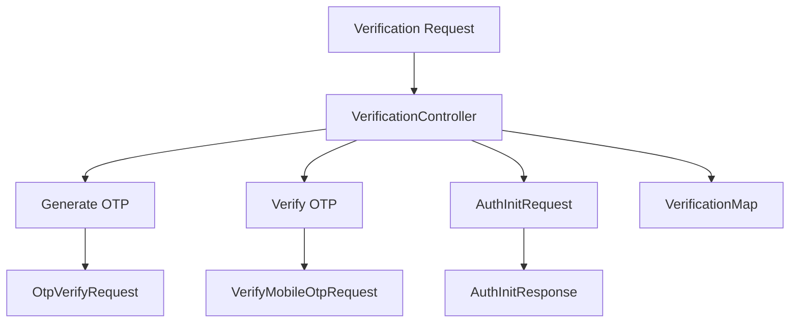

# Getting Started with Verification Process

Verification refers to the process of confirming the authenticity of a user's identity or request. This is essential for ensuring that only authorized individuals can access or manipulate sensitive health information.

## Overview of the Verification Process

The verification process involves several steps such as generating and verifying OTPs (One-Time Passwords), initializing authentication requests, and handling responses. These steps are implemented through different classes and methods within the <SwmToken path="src/In.ProjectEKA.HipService/Verification/VerificationController.cs" pos="10:8:8" line-data="using In.ProjectEKA.HipService.Verification.Model;">`Verification`</SwmToken> namespace.

## Key Classes and Methods

Classes like <SwmToken path="src/In.ProjectEKA.HipService/Verification/VerificationController.cs" pos="130:21:21" line-data="            [FromHeader(Name = CORRELATION_ID)] string correlationId, [FromBody] OtpVerifyRequest otpVerifyRequest)">`OtpVerifyRequest`</SwmToken>, <SwmToken path="src/In.ProjectEKA.HipService/Verification/VerificationController.cs" pos="278:21:21" line-data="            [FromHeader(Name = CORRELATION_ID)] string correlationId, [FromBody] VerifyMobileOtpRequest verifyMobileOtpRequest)">`VerifyMobileOtpRequest`</SwmToken>, and <SwmToken path="src/In.ProjectEKA.HipService/Verification/VerificationController.cs" pos="85:21:21" line-data="            [FromHeader(Name = CORRELATION_ID)] string correlationId, [FromBody] AuthInitRequest authInitRequest)">`AuthInitRequest`</SwmToken> are used to handle different types of verification requests. These classes define the structure of the requests, including necessary fields like OTP and health ID.

## Verification Controller and Map

The <SwmToken path="src/In.ProjectEKA.HipService/Verification/VerificationController.cs" pos="24:5:5" line-data="    public class VerificationController : Controller">`VerificationController`</SwmToken> and <SwmToken path="src/In.ProjectEKA.HipService/Verification/VerificationMap.cs" pos="5:7:7" line-data="    public static class VerificationMap">`VerificationMap`</SwmToken> are responsible for managing the verification process. The controller handles incoming verification requests, while the map provides a static mapping of verification-related functionalities.

## Data Structures

The <SwmToken path="src/In.ProjectEKA.HipService/Verification/VerificationController.cs" pos="7:10:10" line-data="using In.ProjectEKA.HipService.Creation.Model;">`Model`</SwmToken> directory within the <SwmToken path="src/In.ProjectEKA.HipService/Verification/VerificationController.cs" pos="10:8:8" line-data="using In.ProjectEKA.HipService.Verification.Model;">`Verification`</SwmToken> namespace contains various classes that represent the data structures used in the verification process. These include request and response models for OTP generation, mobile OTP verification, and token authorization.

<SwmSnippet path="/src/In.ProjectEKA.HipService/Verification/VerificationController.cs" line="83">

---

## <SwmToken path="src/In.ProjectEKA.HipService/Verification/VerificationController.cs" pos="84:10:10" line-data="        public async Task&lt;ActionResult&gt; AuthInit(">`AuthInit`</SwmToken> Method

The <SwmToken path="src/In.ProjectEKA.HipService/Verification/VerificationController.cs" pos="84:10:10" line-data="        public async Task&lt;ActionResult&gt; AuthInit(">`AuthInit`</SwmToken> method in the <SwmToken path="src/In.ProjectEKA.HipService/Verification/VerificationController.cs" pos="24:5:5" line-data="    public class VerificationController : Controller">`VerificationController`</SwmToken> handles the initialization of authentication requests. It logs the request details, calls the <SwmToken path="src/In.ProjectEKA.HipService/Verification/VerificationController.cs" pos="98:14:14" line-data="                using (var response = await gatewayClient.CallABHAService(HttpMethod.Post,gatewayConfiguration.AbhaNumberServiceUrl, AUTH_INIT_VERIFY, authInitRequest, correlationId))">`CallABHAService`</SwmToken> method, and processes the response.

```c#
        [Route(AUTH_INIT_VERIFY)]
        public async Task<ActionResult> AuthInit(
            [FromHeader(Name = CORRELATION_ID)] string correlationId, [FromBody] AuthInitRequest authInitRequest)
        {
            string sessionId = HttpContext.Items[SESSION_ID] as string;

            try
            {
                logger.Log(LogLevel.Information,
                    LogEvents.Verification,
                    "Request for auth init to gateway: {@GatewayResponse}", authInitRequest);
                logger.Log(LogLevel.Information,
                    LogEvents.Verification, $"correlationId: {{correlationId}}," +
                                            $" healthId: {{healthId}}" + $" authMethod: {{authMethod}}",
                    correlationId, authInitRequest.healthid,authInitRequest.authMethod);
                using (var response = await gatewayClient.CallABHAService(HttpMethod.Post,gatewayConfiguration.AbhaNumberServiceUrl, AUTH_INIT_VERIFY, authInitRequest, correlationId))
                {
                    var responseContent = await response.Content.ReadAsStringAsync().ConfigureAwait(false);
                    if (response.IsSuccessStatusCode)
                    {
                        var generationResponse =
```

---

</SwmSnippet>

## Verification APIs

The <SwmToken path="src/In.ProjectEKA.HipService/Verification/VerificationController.cs" pos="24:5:5" line-data="    public class VerificationController : Controller">`VerificationController`</SwmToken> handles incoming verification requests. It includes methods for generating and verifying OTPs, initializing authentication requests, and handling responses. This controller ensures that the verification process is managed efficiently and securely.

<SwmSnippet path="/src/In.ProjectEKA.HipService/Verification/VerificationController.cs" line="1">

---

The <SwmToken path="src/In.ProjectEKA.HipService/Verification/VerificationController.cs" pos="24:5:5" line-data="    public class VerificationController : Controller">`VerificationController`</SwmToken> includes necessary imports and dependencies for handling verification requests.

```c#
using System;
using System.Net.Http;
using System.Threading.Tasks;
using Hangfire;
using In.ProjectEKA.HipService.Common;
using In.ProjectEKA.HipService.Creation;
using In.ProjectEKA.HipService.Creation.Model;
using In.ProjectEKA.HipService.Gateway;
using In.ProjectEKA.HipService.OpenMrs;
using In.ProjectEKA.HipService.Verification.Model;
```

---

</SwmSnippet>

## <SwmToken path="src/In.ProjectEKA.HipService/Verification/VerificationMap.cs" pos="5:7:7" line-data="    public static class VerificationMap">`VerificationMap`</SwmToken>

The <SwmToken path="src/In.ProjectEKA.HipService/Verification/VerificationMap.cs" pos="5:7:7" line-data="    public static class VerificationMap">`VerificationMap`</SwmToken> provides a static mapping of verification-related functionalities. It helps in organizing and managing the different verification processes, ensuring that each request is routed to the appropriate handler.

<SwmSnippet path="/src/In.ProjectEKA.HipService/Verification/VerificationMap.cs" line="1">

---

The <SwmToken path="src/In.ProjectEKA.HipService/Verification/VerificationMap.cs" pos="5:7:7" line-data="    public static class VerificationMap">`VerificationMap`</SwmToken> includes a dictionary to store transaction IDs and their corresponding values.

```c#
using System.Collections.Generic;

namespace In.ProjectEKA.HipService.Verification
{
    public static class VerificationMap
    {
        public static Dictionary<string, string> TxnDictionary = new Dictionary<string, string>();
    }
}
```

---

</SwmSnippet>



&nbsp;

*This is an auto-generated document by Swimm 🌊 and has not yet been verified by a human*

<SwmMeta version="3.0.0" repo-id="Z2l0aHViJTNBJTNBaGlwLXNlcnZpY2UlM0ElM0FTd2ltbS1EZW1v" repo-name="hip-service"><sup>Powered by [Swimm](/)</sup></SwmMeta>
