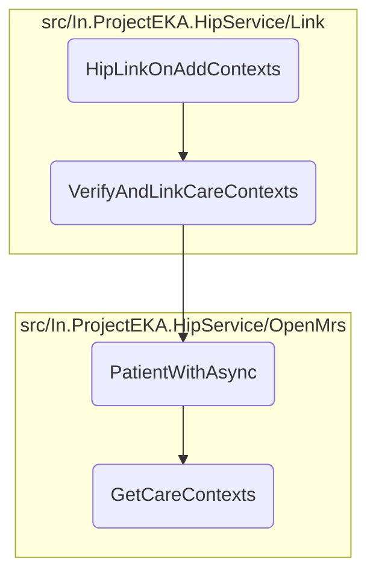

In this document, we will explain the process of handling the confirmation of linking care contexts for a patient. The process involves receiving the confirmation, verifying the care contexts, retrieving patient details, and fetching the care contexts.

The flow starts with receiving a confirmation from the client. If the confirmation is successful, it proceeds to verify the care contexts associated with the patient. Then, it retrieves the patient details using the patient identifier and finally fetches the care contexts for the patient using the patient UUID.

# Flow drill down



<SwmSnippet path="/src/In.ProjectEKA.HipService/Link/LinkController.cs" line="155">

---

## Handling the Confirmation

First, the <SwmToken path="src/In.ProjectEKA.HipService/Link/LinkController.cs" pos="156:10:10" line-data="        public async Task&lt;AcceptedResult&gt; HipLinkOnAddContexts(HipLinkContextConfirmation confirmation)">`HipLinkOnAddContexts`</SwmToken> method handles the confirmation received from the client. It logs the request details and checks for any errors in the confirmation. If the confirmation is successful, it proceeds to verify and link the care contexts by calling the <SwmToken path="src/In.ProjectEKA.HipService/Link/LinkController.cs" pos="169:5:5" line-data="                        await linkPatient.VerifyAndLinkCareContexts(confirmation.Resp.RequestId);">`VerifyAndLinkCareContexts`</SwmToken> method.

```c#
        [HttpPost(PATH_ON_ADD_CONTEXTS)]
        public async Task<AcceptedResult> HipLinkOnAddContexts(HipLinkContextConfirmation confirmation)
        {
            Log.Information("Link on-add-context received." +
                            $" RequestId:{confirmation.RequestId}, " +
                            $" Timestamp:{confirmation.Timestamp}");
            if (confirmation.Error != null)
                Log.Information($" Error Code:{confirmation.Error.Code}," +
                                $" Error Message:{confirmation.Error.Message}");
            else if (confirmation.Acknowledgement != null)
            {
                if (confirmation.Acknowledgement.Status.Equals(Status.SUCCESS.ToString()))
                {
                    var error =
                        await linkPatient.VerifyAndLinkCareContexts(confirmation.Resp.RequestId);
                    if (error != null)
                    {
                        Log.Error(error);
                    }
                }
                Log.Information($" Acknowledgment Status:{confirmation.Acknowledgement.Status}");
```

---

</SwmSnippet>

<SwmSnippet path="/src/In.ProjectEKA.HipService/Link/LinkPatient.cs" line="237">

---

## Verifying and Linking Care Contexts

Next, the <SwmToken path="src/In.ProjectEKA.HipService/Link/LinkPatient.cs" pos="237:10:10" line-data="        public async Task&lt;ErrorRepresentation&gt; VerifyAndLinkCareContexts(String requestId)">`VerifyAndLinkCareContexts`</SwmToken> method verifies the care contexts associated with the patient. It retrieves the patient details using the <SwmToken path="src/In.ProjectEKA.HipService/Link/LinkPatient.cs" pos="245:11:11" line-data="            var patient = await patientRepository.PatientWithAsync(linkEnquires.PatientReferenceNumber);">`PatientWithAsync`</SwmToken> method and updates the link request status. If the patient is found, it saves the linked accounts; otherwise, it returns an error.

```c#
        public async Task<ErrorRepresentation> VerifyAndLinkCareContexts(String requestId)
        {
            var (linkEnquires, exception) =
                await linkPatientRepository.GetPatientFor(requestId);
            var cmId = "";
            if (exception != null)
                return new ErrorRepresentation(new Error(ErrorCode.NoLinkRequestFound, ErrorMessage.NoLinkRequestFound));
            cmId = linkEnquires.ConsentManagerId;
            var patient = await patientRepository.PatientWithAsync(linkEnquires.PatientReferenceNumber);
            return await patient.Map( async patient =>
                {
                    var savedLinkRequests = await linkPatientRepository.Get(requestId);
                    savedLinkRequests.MatchSome(linkRequests =>
                    {
                        foreach (var linkRequest in linkRequests)
                        {
                            linkRequest.Status = true;
                            linkPatientRepository.Update(linkRequest);
                        }
                    });
                    return await SaveLinkedAccounts(linkEnquires,patient.Uuid)
```

---

</SwmSnippet>

<SwmSnippet path="/src/In.ProjectEKA.HipService/OpenMrs/OpenMrsPatientRepository.cs" line="29">

---

### Retrieving Patient Details

Then, the <SwmToken path="src/In.ProjectEKA.HipService/OpenMrs/OpenMrsPatientRepository.cs" pos="29:12:12" line-data="        public async Task&lt;Option&lt;Patient&gt;&gt; PatientWithAsync(string patientIdentifier)">`PatientWithAsync`</SwmToken> method retrieves the patient details using the patient identifier. It loads the patient data, converts it to a HIP patient format, and fetches the care contexts and phone number associated with the patient.

```c#
        public async Task<Option<Patient>> PatientWithAsync(string patientIdentifier)
        {
            var fhirPatient = await _patientDal.LoadPatientAsyncWithIdentifier(patientIdentifier);
            var firstName = fhirPatient.Name[0].GivenElement.FirstOrDefault().ToString();
            var hipPatient = fhirPatient.ToHipPatient(firstName);
            var referenceNumber = hipPatient.Uuid;
            hipPatient.CareContexts = await _careContextRepository.GetCareContexts(referenceNumber);
            hipPatient.PhoneNumber = await _phoneNumberRepository.GetPhoneNumber(referenceNumber);

            return Option.Some(hipPatient);
```

---

</SwmSnippet>

<SwmSnippet path="/src/In.ProjectEKA.HipService/OpenMrs/OpenMrsCareContextRepository.cs" line="19">

---

### Fetching Care Contexts

Finally, the <SwmToken path="src/In.ProjectEKA.HipService/OpenMrs/OpenMrsCareContextRepository.cs" pos="19:12:12" line-data="        public async Task&lt;IEnumerable&lt;CareContextRepresentation&gt;&gt; GetCareContexts(string patientUuid)">`GetCareContexts`</SwmToken> method fetches the care contexts for the patient using the patient UUID. It constructs the query path, sends a request to the OpenMRS client, and parses the response to extract the care context details.

```c#
        public async Task<IEnumerable<CareContextRepresentation>> GetCareContexts(string patientUuid)
        {
            var path = DiscoveryPathConstants.CareContextPath;
            var query = HttpUtility.ParseQueryString(string.Empty);
            if (!string.IsNullOrEmpty(patientUuid))
            {
                query["patientUuid"] = patientUuid;
            }

            if (query.ToString() != "")
            {
                path = $"{path}?{query}";
            }

            var response = await openMrsClient.GetAsync(path);
            var content = await response.Content.ReadAsStringAsync();
            var jsonDoc = JsonDocument.Parse(content);
            var root = jsonDoc.RootElement;
            var careContexts = new List<CareContextRepresentation>();

            for (var i = 0; i < root.GetArrayLength(); i++)
```

---

</SwmSnippet>

&nbsp;

*This is an auto-generated document by Swimm 🌊 and has not yet been verified by a human*

<SwmMeta version="3.0.0" repo-id="Z2l0aHViJTNBJTNBaGlwLXNlcnZpY2UlM0ElM0FTd2ltbS1EZW1v" repo-name="hip-service"><sup>Powered by [Swimm](/)</sup></SwmMeta>
