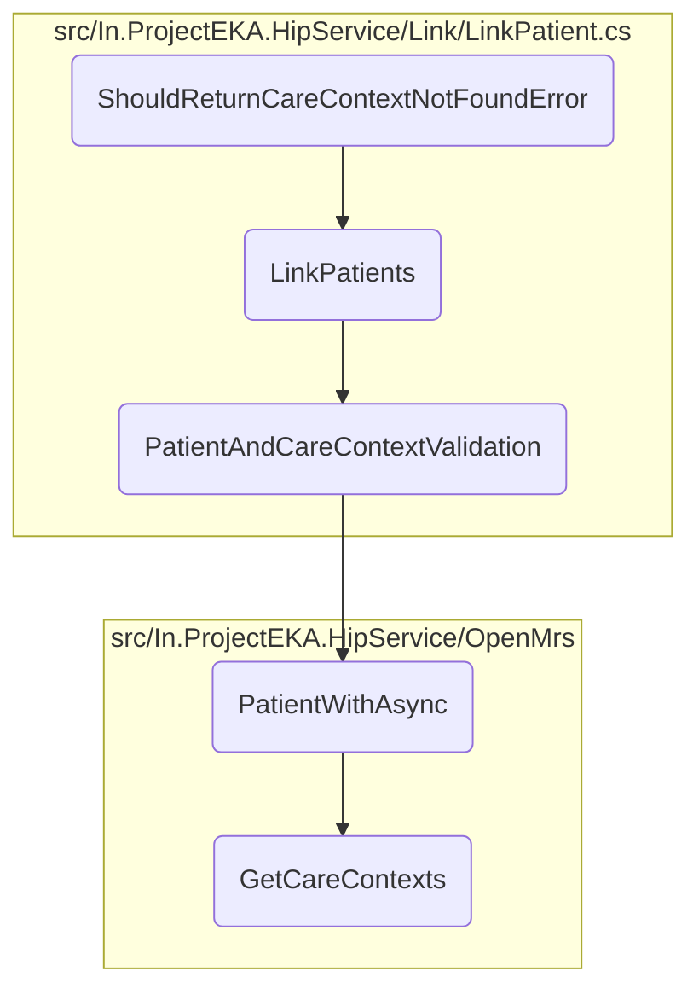

This document explains the process of handling a scenario where a care context is not found for a given patient. The process involves setting up a patient reference request, mocking the patient repository, calling the <SwmToken path="test/In.ProjectEKA.HipServiceTest/Link/LinkPatientTest.cs" pos="135:16:16" line-data="            var (_, error) = await linkPatient.LinkPatients(patientReferenceRequest);">`LinkPatients`</SwmToken> method, and verifying the returned error.

The flow starts by setting up a patient reference request and mocking the patient repository to return a specific patient. Then, the <SwmToken path="test/In.ProjectEKA.HipServiceTest/Link/LinkPatientTest.cs" pos="135:16:16" line-data="            var (_, error) = await linkPatient.LinkPatients(patientReferenceRequest);">`LinkPatients`</SwmToken> method is called, and the system checks if the returned error matches the expected <SwmToken path="test/In.ProjectEKA.HipServiceTest/Link/LinkPatientTest.cs" pos="133:7:7" line-data="                new Error(ErrorCode.CareContextNotFound, ErrorMessage.CareContextNotFound));">`CareContextNotFound`</SwmToken> error. Finally, the patient repository is verified, and the invocation count of the discovery request repository is checked to ensure it is zero.

# Flow drill down



<SwmSnippet path="/test/In.ProjectEKA.HipServiceTest/Link/LinkPatientTest.cs" line="126">

---

## <SwmToken path="test/In.ProjectEKA.HipServiceTest/Link/LinkPatientTest.cs" pos="127:7:7" line-data="        private async void ShouldReturnCareContextNotFoundError()">`ShouldReturnCareContextNotFoundError`</SwmToken>

The <SwmToken path="test/In.ProjectEKA.HipServiceTest/Link/LinkPatientTest.cs" pos="127:7:7" line-data="        private async void ShouldReturnCareContextNotFoundError()">`ShouldReturnCareContextNotFoundError`</SwmToken> method is a test case designed to verify that the system correctly handles the scenario where a care context is not found for a given patient. This method sets up a patient reference request and mocks the patient repository to return a specific patient. It then calls the <SwmToken path="test/In.ProjectEKA.HipServiceTest/Link/LinkPatientTest.cs" pos="135:16:16" line-data="            var (_, error) = await linkPatient.LinkPatients(patientReferenceRequest);">`LinkPatients`</SwmToken> method and checks if the returned error matches the expected <SwmToken path="test/In.ProjectEKA.HipServiceTest/Link/LinkPatientTest.cs" pos="133:7:7" line-data="                new Error(ErrorCode.CareContextNotFound, ErrorMessage.CareContextNotFound));">`CareContextNotFound`</SwmToken> error.

```c#
        [Fact]
        private async void ShouldReturnCareContextNotFoundError()
        {
            var patientReferenceRequest = getPatientReferenceRequest("1234");
            patientRepository.Setup(e => e.PatientWithAsync(testPatient.Identifier))
                .ReturnsAsync(Option.Some(testPatient));
            var expectedError = new ErrorRepresentation(
                new Error(ErrorCode.CareContextNotFound, ErrorMessage.CareContextNotFound));

            var (_, error) = await linkPatient.LinkPatients(patientReferenceRequest);

            patientRepository.Verify();
            discoveryRequestRepository.Invocations.Count.Should().Be(0);
            error.Should().BeEquivalentTo(expectedError);
        }
```

---

</SwmSnippet>

&nbsp;

*This is an auto-generated document by Swimm 🌊 and has not yet been verified by a human*

<SwmMeta version="3.0.0" repo-id="Z2l0aHViJTNBJTNBaGlwLXNlcnZpY2UlM0ElM0FTd2ltbS1EZW1v" repo-name="hip-service"><sup>Powered by [Swimm](/)</sup></SwmMeta>
