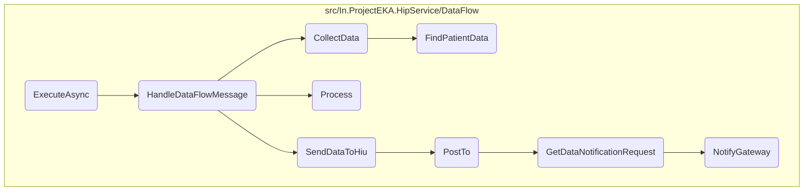
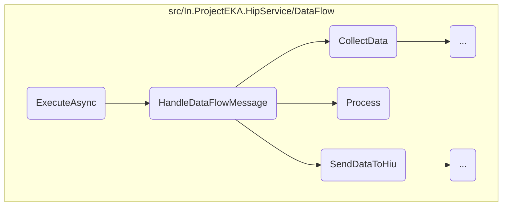
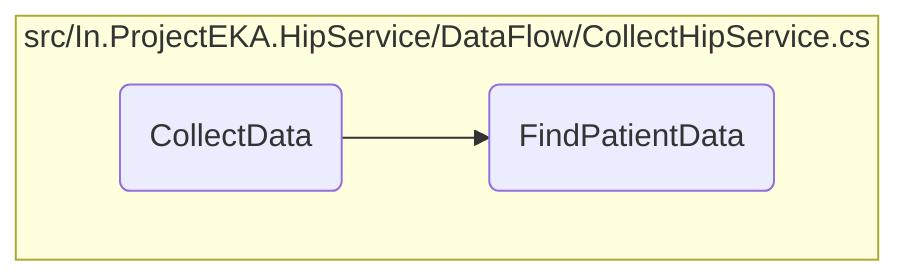
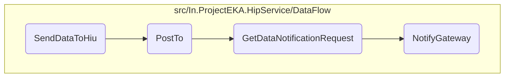

This document explains the process of handling data flow messages within the system. The process begins with setting up a consumer to listen for incoming messages, followed by handling these messages, collecting and processing patient data, and finally sending the processed data to the Health Information User (HIU).

The process starts by setting up a listener to wait for incoming data messages. Once a message is received, it is handled by collecting the necessary patient data. This data is then processed and encrypted to ensure security. Finally, the encrypted data is sent to the intended recipient, the Health Information User (HIU).

Here is a high level diagram of the flow, showing only the most important functions:



# Flow drill down

First, we'll zoom into this section of the flow:



<SwmSnippet path="/src/In.ProjectEKA.HipService/DataFlow/MessagingQueueListener.cs" line="45">

---

## <SwmToken path="src/In.ProjectEKA.HipService/DataFlow/MessagingQueueListener.cs" pos="45:7:7" line-data="        protected override Task ExecuteAsync(CancellationToken stoppingToken)">`ExecuteAsync`</SwmToken>

The <SwmToken path="src/In.ProjectEKA.HipService/DataFlow/MessagingQueueListener.cs" pos="45:7:7" line-data="        protected override Task ExecuteAsync(CancellationToken stoppingToken)">`ExecuteAsync`</SwmToken> method is responsible for setting up a consumer to listen for incoming data flow messages from a messaging queue. It ensures that the consumer is ready to process messages and acknowledges them once processed.

```c#
        protected override Task ExecuteAsync(CancellationToken stoppingToken)
        {
            stoppingToken.ThrowIfCancellationRequested();
            var consumer = new EventingBasicConsumer(channel);
            consumer.Received += async (ch, ea) =>
            {
                var body = ea.Body;
                var message = Encoding.UTF8.GetString(body.ToArray());
                var dataFlowMessage =
                    JsonConvert.DeserializeObject<HipLibrary.Patient.Model.TraceableDataRequest>(message);
                await dataFlowMessageHandler.HandleDataFlowMessage(dataFlowMessage);
                channel.BasicAck(ea.DeliveryTag, false);
            };
            channel.BasicConsume(MessagingQueueConstants.DataRequestRoutingKey, false, consumer);
            return Task.CompletedTask;
        }
```

---

</SwmSnippet>

<SwmSnippet path="/src/In.ProjectEKA.HipService/DataFlow/DataFlowMessageHandler.cs" line="24">

---

## <SwmToken path="src/In.ProjectEKA.HipService/DataFlow/DataFlowMessageHandler.cs" pos="24:7:7" line-data="        public async Task HandleDataFlowMessage(TraceableDataRequest dataRequest)">`HandleDataFlowMessage`</SwmToken>

Next, the <SwmToken path="src/In.ProjectEKA.HipService/DataFlow/DataFlowMessageHandler.cs" pos="24:7:7" line-data="        public async Task HandleDataFlowMessage(TraceableDataRequest dataRequest)">`HandleDataFlowMessage`</SwmToken> method is invoked to handle the received data flow message. This method collects patient data based on the request, processes and encrypts the data, and sends it to the Health Information User (HIU).

```c#
        public async Task HandleDataFlowMessage(TraceableDataRequest dataRequest)
        {
            var sentKeyMaterial = dataRequest.KeyMaterial;
            var data = await collectHipService.CollectData(dataRequest).ConfigureAwait(false);
            var encryptedEntries = data.FlatMap(entries =>
                dataEntryFactory.Process(entries, sentKeyMaterial, dataRequest.TransactionId));
            encryptedEntries.MatchSome(async entries =>
                await dataFlowClient.SendDataToHiu(dataRequest,
                    entries.Entries,
                    entries.KeyMaterial).ConfigureAwait(false));
        }
```

---

</SwmSnippet>

### Processing Data

### Collecting Data

First, the method collects patient data by calling the <SwmToken path="src/In.ProjectEKA.HipService/DataFlow/DataFlowMessageHandler.cs" pos="27:11:11" line-data="            var data = await collectHipService.CollectData(dataRequest).ConfigureAwait(false);">`CollectData`</SwmToken> function. This function retrieves patient data based on the provided data request and returns it as entries.

<SwmSnippet path="/src/In.ProjectEKA.HipService/DataFlow/DataEntryFactory.cs" line="42">

---

Then, the <SwmToken path="src/In.ProjectEKA.HipService/DataFlow/DataEntryFactory.cs" pos="42:10:10" line-data="        public virtual Option&lt;EncryptedEntries&gt; Process(Entries entries,">`Process`</SwmToken> method processes the collected entries. It encrypts each care bundle with a generated key pair and constructs key material with encryption details and a random key. The processed and encrypted entries are then prepared for transmission.

```c#
        public virtual Option<EncryptedEntries> Process(Entries entries,
            HipLibrary.Patient.Model.KeyMaterial dataRequestKeyMaterial, string transactionId)
        {
            var keyPair = EncryptorHelper.GenerateKeyPair(dataRequestKeyMaterial.Curve,
                dataRequestKeyMaterial.CryptoAlg);
            var randomKey = EncryptorHelper.GenerateRandomKey();

            var processedEntries = new List<Entry>();
            var careBundles = entries.CareBundles;
            foreach (var careBundle in careBundles)
            {
                var encryptData =
                    encryptor.EncryptData(dataRequestKeyMaterial,
                        keyPair,
                        Serializer.SerializeToString(careBundle.BundleForThisCcr), randomKey);
                if (!encryptData.HasValue)
                    return Option.None<EncryptedEntries>();

                encryptData.MatchSome(content =>
                {
                    var entry = IsLinkable(content)
```

---

</SwmSnippet>

Now, lets zoom into this section of the flow:



<SwmSnippet path="/src/In.ProjectEKA.HipService/DataFlow/CollectHipService.cs" line="27">

---

## Retrieving Patient Data

First, the <SwmToken path="src/In.ProjectEKA.HipService/DataFlow/DataFlowMessageHandler.cs" pos="27:11:11" line-data="            var data = await collectHipService.CollectData(dataRequest).ConfigureAwait(false);">`CollectData`</SwmToken> method initializes an empty list to store care bundles and calls the <SwmToken path="src/In.ProjectEKA.HipService/DataFlow/CollectHipService.cs" pos="28:9:9" line-data="            var patientData = await FindPatientData(dataRequest);">`FindPatientData`</SwmToken> method to retrieve patient data based on the provided data request.

```c#
            var bundles = new List<CareBundle>();
            var patientData = await FindPatientData(dataRequest);
```

---

</SwmSnippet>

Now, lets zoom into this section of the flow:



<SwmSnippet path="/src/In.ProjectEKA.HipService/DataFlow/DataFlowClient.cs" line="31">

---

## Sending Health Information to HIU

First, the <SwmToken path="src/In.ProjectEKA.HipService/DataFlow/DataFlowClient.cs" pos="31:9:9" line-data="        public virtual async Task SendDataToHiu(TraceableDataRequest dataRequest,">`SendDataToHiu`</SwmToken> function is responsible for initiating the process of sending health information to the Health Information User (HIU). It takes in a data request, the data to be sent, and key material for encryption. This function calls the <SwmToken path="src/In.ProjectEKA.HipService/DataFlow/DataFlowClient.cs" pos="35:3:3" line-data="            await PostTo(dataRequest.ConsentId,">`PostTo`</SwmToken> function to handle the actual posting of data.

```c#
        public virtual async Task SendDataToHiu(TraceableDataRequest dataRequest,
            IEnumerable<Entry> data,
            KeyMaterial keyMaterial)
        {
            await PostTo(dataRequest.ConsentId,
                dataRequest.DataPushUrl,
                dataRequest.CareContexts,
                new DataResponse(dataRequest.TransactionId, data, keyMaterial),
                dataRequest.CmSuffix,
                dataRequest.CorrelationId).ConfigureAwait(false);
        }
```

---

</SwmSnippet>

&nbsp;

*This is an auto-generated document by Swimm 🌊 and has not yet been verified by a human*

<SwmMeta version="3.0.0" repo-id="Z2l0aHViJTNBJTNBaGlwLXNlcnZpY2UlM0ElM0FTd2ltbS1EZW1v" repo-name="hip-service"><sup>Powered by [Swimm](/)</sup></SwmMeta>
