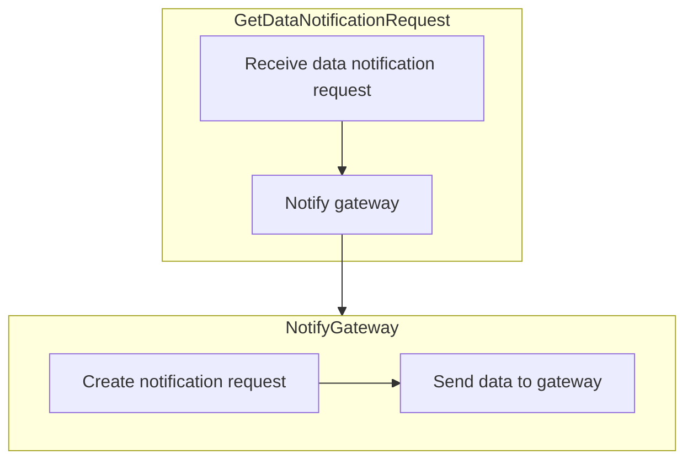

```mermaid
graph TD
  subgraph HandleDataFlowMessage
    HandleDataFlowMessage:A["Retrieve key material from data request"] --> HandleDataFlowMessage:B["Collect patient data"]
    HandleDataFlowMessage:B --> HandleDataFlowMessage:C["Process entries with key material"]
    HandleDataFlowMessage:C --> HandleDataFlowMessage:D["Send encrypted data to HIU"]
  end
  subgraph Process
    Process:A["Generate encryption key pair"] --> Process:B["Generate random encryption key"]
    Process:B --> Process:C["Encrypt data from care bundles"]
    Process:C --> Process:D["Store or link encrypted components"]
    Process:D --> Process:E["Prepare key material"]
    Process:E --> Process:F["Return encrypted entries with key material"]
  end
  HandleDataFlowMessage:C --> Process

%% Swimm:
%% graph TD
%%   subgraph <SwmToken path="src/In.ProjectEKA.HipService/DataFlow/MessagingQueueListener.cs" pos="55:5:5" line-data="                await dataFlowMessageHandler.HandleDataFlowMessage(dataFlowMessage);">`HandleDataFlowMessage`</SwmToken>
%%     <SwmToken path="src/In.ProjectEKA.HipService/DataFlow/MessagingQueueListener.cs" pos="55:5:5" line-data="                await dataFlowMessageHandler.HandleDataFlowMessage(dataFlowMessage);">`HandleDataFlowMessage`</SwmToken>:A["Retrieve key material from data request"] --> <SwmToken path="src/In.ProjectEKA.HipService/DataFlow/MessagingQueueListener.cs" pos="55:5:5" line-data="                await dataFlowMessageHandler.HandleDataFlowMessage(dataFlowMessage);">`HandleDataFlowMessage`</SwmToken>:B["Collect patient data"]
%%     <SwmToken path="src/In.ProjectEKA.HipService/DataFlow/MessagingQueueListener.cs" pos="55:5:5" line-data="                await dataFlowMessageHandler.HandleDataFlowMessage(dataFlowMessage);">`HandleDataFlowMessage`</SwmToken>:B --> <SwmToken path="src/In.ProjectEKA.HipService/DataFlow/MessagingQueueListener.cs" pos="55:5:5" line-data="                await dataFlowMessageHandler.HandleDataFlowMessage(dataFlowMessage);">`HandleDataFlowMessage`</SwmToken>:C["Process entries with key material"]
%%     <SwmToken path="src/In.ProjectEKA.HipService/DataFlow/MessagingQueueListener.cs" pos="55:5:5" line-data="                await dataFlowMessageHandler.HandleDataFlowMessage(dataFlowMessage);">`HandleDataFlowMessage`</SwmToken>:C --> <SwmToken path="src/In.ProjectEKA.HipService/DataFlow/MessagingQueueListener.cs" pos="55:5:5" line-data="                await dataFlowMessageHandler.HandleDataFlowMessage(dataFlowMessage);">`HandleDataFlowMessage`</SwmToken>:D["Send encrypted data to HIU"]
%%   end
%%   subgraph Process
%%     Process:A["Generate encryption key pair"] --> Process:B["Generate random encryption key"]
%%     Process:B --> Process:C["Encrypt data from care bundles"]
%%     Process:C --> Process:D["Store or link encrypted components"]
%%     Process:D --> Process:E["Prepare key material"]
%%     Process:E --> Process:F["Return encrypted entries with key material"]
%%   end
%%   <SwmToken path="src/In.ProjectEKA.HipService/DataFlow/MessagingQueueListener.cs" pos="55:5:5" line-data="                await dataFlowMessageHandler.HandleDataFlowMessage(dataFlowMessage);">`HandleDataFlowMessage`</SwmToken>:C --> Process
```

```mermaid
graph TD
  subgraph CollectData
    CollectData:A["Initialize an empty bundles list"] --> CollectData:B["Retrieve patient data"]
    CollectData:B --> CollectData:C["Extract care context references"]
    CollectData:C --> CollectData:D["Loop through each context reference"]
    CollectData:D --> CollectData:E["Loop through results for each context"]
    CollectData:E --> CollectData:F["Parse and add to bundles"]
    CollectData:F --> CollectData:G["Create entries"]
    CollectData:G --> CollectData:H["Return entries"]
  end
  subgraph FindPatientData
    FindPatientData:A["Log data request"] --> FindPatientData:B["Extract date range"]
    FindPatientData:B --> FindPatientData:C["Initialize context-data dictionary"]
    FindPatientData:C --> FindPatientData:D["Loop through granted contexts"]
    FindPatientData:D --> FindPatientData:E["Loop through HI types"]
    FindPatientData:E --> FindPatientData:F["Retrieve patient data"]
    FindPatientData:F --> FindPatientData:G["Add results to list"]
    FindPatientData:G --> FindPatientData:H["Map context references to data lists"]
    FindPatientData:H --> FindPatientData:I["Return the dictionary"]
  end
  CollectData:B --> FindPatientData

%% Swimm:
%% graph TD
%%   subgraph <SwmToken path="src/In.ProjectEKA.HipService/DataFlow/DataFlowMessageHandler.cs" pos="27:11:11" line-data="            var data = await collectHipService.CollectData(dataRequest).ConfigureAwait(false);">`CollectData`</SwmToken>
%%     <SwmToken path="src/In.ProjectEKA.HipService/DataFlow/DataFlowMessageHandler.cs" pos="27:11:11" line-data="            var data = await collectHipService.CollectData(dataRequest).ConfigureAwait(false);">`CollectData`</SwmToken>:A["Initialize an empty bundles list"] --> <SwmToken path="src/In.ProjectEKA.HipService/DataFlow/DataFlowMessageHandler.cs" pos="27:11:11" line-data="            var data = await collectHipService.CollectData(dataRequest).ConfigureAwait(false);">`CollectData`</SwmToken>:B["Retrieve patient data"]
%%     <SwmToken path="src/In.ProjectEKA.HipService/DataFlow/DataFlowMessageHandler.cs" pos="27:11:11" line-data="            var data = await collectHipService.CollectData(dataRequest).ConfigureAwait(false);">`CollectData`</SwmToken>:B --> <SwmToken path="src/In.ProjectEKA.HipService/DataFlow/DataFlowMessageHandler.cs" pos="27:11:11" line-data="            var data = await collectHipService.CollectData(dataRequest).ConfigureAwait(false);">`CollectData`</SwmToken>:C["Extract care context references"]
%%     <SwmToken path="src/In.ProjectEKA.HipService/DataFlow/DataFlowMessageHandler.cs" pos="27:11:11" line-data="            var data = await collectHipService.CollectData(dataRequest).ConfigureAwait(false);">`CollectData`</SwmToken>:C --> <SwmToken path="src/In.ProjectEKA.HipService/DataFlow/DataFlowMessageHandler.cs" pos="27:11:11" line-data="            var data = await collectHipService.CollectData(dataRequest).ConfigureAwait(false);">`CollectData`</SwmToken>:D["Loop through each context reference"]
%%     <SwmToken path="src/In.ProjectEKA.HipService/DataFlow/DataFlowMessageHandler.cs" pos="27:11:11" line-data="            var data = await collectHipService.CollectData(dataRequest).ConfigureAwait(false);">`CollectData`</SwmToken>:D --> <SwmToken path="src/In.ProjectEKA.HipService/DataFlow/DataFlowMessageHandler.cs" pos="27:11:11" line-data="            var data = await collectHipService.CollectData(dataRequest).ConfigureAwait(false);">`CollectData`</SwmToken>:E["Loop through results for each context"]
%%     <SwmToken path="src/In.ProjectEKA.HipService/DataFlow/DataFlowMessageHandler.cs" pos="27:11:11" line-data="            var data = await collectHipService.CollectData(dataRequest).ConfigureAwait(false);">`CollectData`</SwmToken>:E --> <SwmToken path="src/In.ProjectEKA.HipService/DataFlow/DataFlowMessageHandler.cs" pos="27:11:11" line-data="            var data = await collectHipService.CollectData(dataRequest).ConfigureAwait(false);">`CollectData`</SwmToken>:F["Parse and add to bundles"]
%%     <SwmToken path="src/In.ProjectEKA.HipService/DataFlow/DataFlowMessageHandler.cs" pos="27:11:11" line-data="            var data = await collectHipService.CollectData(dataRequest).ConfigureAwait(false);">`CollectData`</SwmToken>:F --> <SwmToken path="src/In.ProjectEKA.HipService/DataFlow/DataFlowMessageHandler.cs" pos="27:11:11" line-data="            var data = await collectHipService.CollectData(dataRequest).ConfigureAwait(false);">`CollectData`</SwmToken>:G["Create entries"]
%%     <SwmToken path="src/In.ProjectEKA.HipService/DataFlow/DataFlowMessageHandler.cs" pos="27:11:11" line-data="            var data = await collectHipService.CollectData(dataRequest).ConfigureAwait(false);">`CollectData`</SwmToken>:G --> <SwmToken path="src/In.ProjectEKA.HipService/DataFlow/DataFlowMessageHandler.cs" pos="27:11:11" line-data="            var data = await collectHipService.CollectData(dataRequest).ConfigureAwait(false);">`CollectData`</SwmToken>:H["Return entries"]
%%   end
%%   subgraph <SwmToken path="src/In.ProjectEKA.HipService/DataFlow/CollectHipService.cs" pos="28:9:9" line-data="            var patientData = await FindPatientData(dataRequest);">`FindPatientData`</SwmToken>
%%     <SwmToken path="src/In.ProjectEKA.HipService/DataFlow/CollectHipService.cs" pos="28:9:9" line-data="            var patientData = await FindPatientData(dataRequest);">`FindPatientData`</SwmToken>:A["Log data request"] --> <SwmToken path="src/In.ProjectEKA.HipService/DataFlow/CollectHipService.cs" pos="28:9:9" line-data="            var patientData = await FindPatientData(dataRequest);">`FindPatientData`</SwmToken>:B["Extract date range"]
%%     <SwmToken path="src/In.ProjectEKA.HipService/DataFlow/CollectHipService.cs" pos="28:9:9" line-data="            var patientData = await FindPatientData(dataRequest);">`FindPatientData`</SwmToken>:B --> <SwmToken path="src/In.ProjectEKA.HipService/DataFlow/CollectHipService.cs" pos="28:9:9" line-data="            var patientData = await FindPatientData(dataRequest);">`FindPatientData`</SwmToken>:C["Initialize context-data dictionary"]
%%     <SwmToken path="src/In.ProjectEKA.HipService/DataFlow/CollectHipService.cs" pos="28:9:9" line-data="            var patientData = await FindPatientData(dataRequest);">`FindPatientData`</SwmToken>:C --> <SwmToken path="src/In.ProjectEKA.HipService/DataFlow/CollectHipService.cs" pos="28:9:9" line-data="            var patientData = await FindPatientData(dataRequest);">`FindPatientData`</SwmToken>:D["Loop through granted contexts"]
%%     <SwmToken path="src/In.ProjectEKA.HipService/DataFlow/CollectHipService.cs" pos="28:9:9" line-data="            var patientData = await FindPatientData(dataRequest);">`FindPatientData`</SwmToken>:D --> <SwmToken path="src/In.ProjectEKA.HipService/DataFlow/CollectHipService.cs" pos="28:9:9" line-data="            var patientData = await FindPatientData(dataRequest);">`FindPatientData`</SwmToken>:E["Loop through HI types"]
%%     <SwmToken path="src/In.ProjectEKA.HipService/DataFlow/CollectHipService.cs" pos="28:9:9" line-data="            var patientData = await FindPatientData(dataRequest);">`FindPatientData`</SwmToken>:E --> <SwmToken path="src/In.ProjectEKA.HipService/DataFlow/CollectHipService.cs" pos="28:9:9" line-data="            var patientData = await FindPatientData(dataRequest);">`FindPatientData`</SwmToken>:F["Retrieve patient data"]
%%     <SwmToken path="src/In.ProjectEKA.HipService/DataFlow/CollectHipService.cs" pos="28:9:9" line-data="            var patientData = await FindPatientData(dataRequest);">`FindPatientData`</SwmToken>:F --> <SwmToken path="src/In.ProjectEKA.HipService/DataFlow/CollectHipService.cs" pos="28:9:9" line-data="            var patientData = await FindPatientData(dataRequest);">`FindPatientData`</SwmToken>:G["Add results to list"]
%%     <SwmToken path="src/In.ProjectEKA.HipService/DataFlow/CollectHipService.cs" pos="28:9:9" line-data="            var patientData = await FindPatientData(dataRequest);">`FindPatientData`</SwmToken>:G --> <SwmToken path="src/In.ProjectEKA.HipService/DataFlow/CollectHipService.cs" pos="28:9:9" line-data="            var patientData = await FindPatientData(dataRequest);">`FindPatientData`</SwmToken>:H["Map context references to data lists"]
%%     <SwmToken path="src/In.ProjectEKA.HipService/DataFlow/CollectHipService.cs" pos="28:9:9" line-data="            var patientData = await FindPatientData(dataRequest);">`FindPatientData`</SwmToken>:H --> <SwmToken path="src/In.ProjectEKA.HipService/DataFlow/CollectHipService.cs" pos="28:9:9" line-data="            var patientData = await FindPatientData(dataRequest);">`FindPatientData`</SwmToken>:I["Return the dictionary"]
%%   end
%%   <SwmToken path="src/In.ProjectEKA.HipService/DataFlow/DataFlowMessageHandler.cs" pos="27:11:11" line-data="            var data = await collectHipService.CollectData(dataRequest).ConfigureAwait(false);">`CollectData`</SwmToken>:B --> <SwmToken path="src/In.ProjectEKA.HipService/DataFlow/CollectHipService.cs" pos="28:9:9" line-data="            var patientData = await FindPatientData(dataRequest);">`FindPatientData`</SwmToken>
```

```mermaid
graph TD
  subgraph SendDataToHiu
    SendDataToHiu:A["Send Data"] --> SendDataToHiu:B["Post to HIU"]
    SendDataToHiu:B --> SendDataToHiu:C["Update status based on outcome"]
    SendDataToHiu:C --> SendDataToHiu:D["Send data notification request"]
  end

%% Swimm:
%% graph TD
%%   subgraph <SwmToken path="src/In.ProjectEKA.HipService/DataFlow/DataFlowMessageHandler.cs" pos="31:5:5" line-data="                await dataFlowClient.SendDataToHiu(dataRequest,">`SendDataToHiu`</SwmToken>
%%     <SwmToken path="src/In.ProjectEKA.HipService/DataFlow/DataFlowMessageHandler.cs" pos="31:5:5" line-data="                await dataFlowClient.SendDataToHiu(dataRequest,">`SendDataToHiu`</SwmToken>:A["Send Data"] --> <SwmToken path="src/In.ProjectEKA.HipService/DataFlow/DataFlowMessageHandler.cs" pos="31:5:5" line-data="                await dataFlowClient.SendDataToHiu(dataRequest,">`SendDataToHiu`</SwmToken>:B["Post to HIU"]
%%     <SwmToken path="src/In.ProjectEKA.HipService/DataFlow/DataFlowMessageHandler.cs" pos="31:5:5" line-data="                await dataFlowClient.SendDataToHiu(dataRequest,">`SendDataToHiu`</SwmToken>:B --> <SwmToken path="src/In.ProjectEKA.HipService/DataFlow/DataFlowMessageHandler.cs" pos="31:5:5" line-data="                await dataFlowClient.SendDataToHiu(dataRequest,">`SendDataToHiu`</SwmToken>:C["Update status based on outcome"]
%%     <SwmToken path="src/In.ProjectEKA.HipService/DataFlow/DataFlowMessageHandler.cs" pos="31:5:5" line-data="                await dataFlowClient.SendDataToHiu(dataRequest,">`SendDataToHiu`</SwmToken>:C --> <SwmToken path="src/In.ProjectEKA.HipService/DataFlow/DataFlowMessageHandler.cs" pos="31:5:5" line-data="                await dataFlowClient.SendDataToHiu(dataRequest,">`SendDataToHiu`</SwmToken>:D["Send data notification request"]
%%   end
```

This document explains the process of handling data flow messages, starting from the initialization of an event consumer to the final acknowledgment of the message. The process involves several steps, including decoding and deserializing the received message, handling the data flow message, collecting patient data, processing the data, and sending it to the Health Information User (HIU).

The flow begins with initializing an event consumer that listens for incoming messages. When a message is received, it is decoded and deserialized into a data request object. This object is then processed to collect patient data, which is encrypted and sent to the HIU. Finally, the message is acknowledged, indicating successful processing.

Here is a high level diagram of the flow, showing only the most important functions:

```mermaid
graph TD;
      subgraph srcInProjectEKAHipServiceDataFlow[src/In.ProjectEKA.HipService/DataFlow]
c1e50dae121ee46406a1116ce2ea5cfaf6a4bcc9ec96a8aee949f27561f8e8cf(ExecuteAsync) --> 7f9d3594ff3b745a1909c479ff890f21dbfdfddf3542b708c3ba65abe524cc1f(HandleDataFlowMessage)
end

subgraph srcInProjectEKAHipServiceDataFlow[src/In.ProjectEKA.HipService/DataFlow]
7f9d3594ff3b745a1909c479ff890f21dbfdfddf3542b708c3ba65abe524cc1f(HandleDataFlowMessage) --> 2a0e5645c96d62b9d7fb694f78176c30488c6f5023c3abdda3442199cf904297(CollectData)
end

subgraph srcInProjectEKAHipServiceDataFlow[src/In.ProjectEKA.HipService/DataFlow]
7f9d3594ff3b745a1909c479ff890f21dbfdfddf3542b708c3ba65abe524cc1f(HandleDataFlowMessage) --> 34c074d1f8ebc179b257d9a67a39f99008d760b1a0fce60884a1c941b4f540fe(Process)
end

subgraph srcInProjectEKAHipServiceDataFlow[src/In.ProjectEKA.HipService/DataFlow]
7f9d3594ff3b745a1909c479ff890f21dbfdfddf3542b708c3ba65abe524cc1f(HandleDataFlowMessage) --> c9d796bfd5d9245dda9e6770a132540969064581b0d206bd5244e6c71f05a59a(SendDataToHiu)
end

subgraph srcInProjectEKAHipServiceDataFlow[src/In.ProjectEKA.HipService/DataFlow]
2a0e5645c96d62b9d7fb694f78176c30488c6f5023c3abdda3442199cf904297(CollectData) --> da9b97779658718dfbb570908e107c412613a72eb1db9a5d0f1220fa4fd0e88e(FindPatientData)
end

subgraph srcInProjectEKAHipServiceDataFlow[src/In.ProjectEKA.HipService/DataFlow]
c9d796bfd5d9245dda9e6770a132540969064581b0d206bd5244e6c71f05a59a(SendDataToHiu) --> de87029b085ba0bfbc501cb4d0247fd17ec5da0b704ca2f6678c47ee2ee54d3e(PostTo)
end

subgraph srcInProjectEKAHipServiceDataFlow[src/In.ProjectEKA.HipService/DataFlow]
de87029b085ba0bfbc501cb4d0247fd17ec5da0b704ca2f6678c47ee2ee54d3e(PostTo) --> bf771a0a0b89d8a519e583a8ccb25b40f0a10871f9290ba76de4d45fc238a5a6(GetDataNotificationRequest)
end

subgraph srcInProjectEKAHipServiceDataFlow[src/In.ProjectEKA.HipService/DataFlow]
bf771a0a0b89d8a519e583a8ccb25b40f0a10871f9290ba76de4d45fc238a5a6(GetDataNotificationRequest) --> b606a099c9228225dda5462a248d2bdc1deac70e74cff407cac66d79cfa3dca8(NotifyGateway)
end


      classDef mainFlowStyle color:#000000,fill:#7CB9F4
classDef rootsStyle color:#000000,fill:#00FFF4
classDef Style1 color:#000000,fill:#00FFAA
classDef Style2 color:#000000,fill:#FFFF00
classDef Style3 color:#000000,fill:#AA7CB9

%% Swimm:
%% graph TD;
%%       subgraph srcInProjectEKAHipServiceDataFlow[<SwmPath>[src/In.ProjectEKA.HipService/DataFlow/](src/In.ProjectEKA.HipService/DataFlow/)</SwmPath>]
%% c1e50dae121ee46406a1116ce2ea5cfaf6a4bcc9ec96a8aee949f27561f8e8cf(<SwmToken path="src/In.ProjectEKA.HipService/DataFlow/MessagingQueueListener.cs" pos="45:7:7" line-data="        protected override Task ExecuteAsync(CancellationToken stoppingToken)">`ExecuteAsync`</SwmToken>) --> 7f9d3594ff3b745a1909c479ff890f21dbfdfddf3542b708c3ba65abe524cc1f(<SwmToken path="src/In.ProjectEKA.HipService/DataFlow/MessagingQueueListener.cs" pos="55:5:5" line-data="                await dataFlowMessageHandler.HandleDataFlowMessage(dataFlowMessage);">`HandleDataFlowMessage`</SwmToken>)
%% end
%% 
%% subgraph srcInProjectEKAHipServiceDataFlow[<SwmPath>[src/In.ProjectEKA.HipService/DataFlow/](src/In.ProjectEKA.HipService/DataFlow/)</SwmPath>]
%% 7f9d3594ff3b745a1909c479ff890f21dbfdfddf3542b708c3ba65abe524cc1f(<SwmToken path="src/In.ProjectEKA.HipService/DataFlow/MessagingQueueListener.cs" pos="55:5:5" line-data="                await dataFlowMessageHandler.HandleDataFlowMessage(dataFlowMessage);">`HandleDataFlowMessage`</SwmToken>) --> 2a0e5645c96d62b9d7fb694f78176c30488c6f5023c3abdda3442199cf904297(<SwmToken path="src/In.ProjectEKA.HipService/DataFlow/DataFlowMessageHandler.cs" pos="27:11:11" line-data="            var data = await collectHipService.CollectData(dataRequest).ConfigureAwait(false);">`CollectData`</SwmToken>)
%% end
%% 
%% subgraph srcInProjectEKAHipServiceDataFlow[<SwmPath>[src/In.ProjectEKA.HipService/DataFlow/](src/In.ProjectEKA.HipService/DataFlow/)</SwmPath>]
%% 7f9d3594ff3b745a1909c479ff890f21dbfdfddf3542b708c3ba65abe524cc1f(<SwmToken path="src/In.ProjectEKA.HipService/DataFlow/MessagingQueueListener.cs" pos="55:5:5" line-data="                await dataFlowMessageHandler.HandleDataFlowMessage(dataFlowMessage);">`HandleDataFlowMessage`</SwmToken>) --> 34c074d1f8ebc179b257d9a67a39f99008d760b1a0fce60884a1c941b4f540fe(Process)
%% end
%% 
%% subgraph srcInProjectEKAHipServiceDataFlow[<SwmPath>[src/In.ProjectEKA.HipService/DataFlow/](src/In.ProjectEKA.HipService/DataFlow/)</SwmPath>]
%% 7f9d3594ff3b745a1909c479ff890f21dbfdfddf3542b708c3ba65abe524cc1f(<SwmToken path="src/In.ProjectEKA.HipService/DataFlow/MessagingQueueListener.cs" pos="55:5:5" line-data="                await dataFlowMessageHandler.HandleDataFlowMessage(dataFlowMessage);">`HandleDataFlowMessage`</SwmToken>) --> c9d796bfd5d9245dda9e6770a132540969064581b0d206bd5244e6c71f05a59a(<SwmToken path="src/In.ProjectEKA.HipService/DataFlow/DataFlowMessageHandler.cs" pos="31:5:5" line-data="                await dataFlowClient.SendDataToHiu(dataRequest,">`SendDataToHiu`</SwmToken>)
%% end
%% 
%% subgraph srcInProjectEKAHipServiceDataFlow[<SwmPath>[src/In.ProjectEKA.HipService/DataFlow/](src/In.ProjectEKA.HipService/DataFlow/)</SwmPath>]
%% 2a0e5645c96d62b9d7fb694f78176c30488c6f5023c3abdda3442199cf904297(<SwmToken path="src/In.ProjectEKA.HipService/DataFlow/DataFlowMessageHandler.cs" pos="27:11:11" line-data="            var data = await collectHipService.CollectData(dataRequest).ConfigureAwait(false);">`CollectData`</SwmToken>) --> da9b97779658718dfbb570908e107c412613a72eb1db9a5d0f1220fa4fd0e88e(<SwmToken path="src/In.ProjectEKA.HipService/DataFlow/CollectHipService.cs" pos="28:9:9" line-data="            var patientData = await FindPatientData(dataRequest);">`FindPatientData`</SwmToken>)
%% end
%% 
%% subgraph srcInProjectEKAHipServiceDataFlow[<SwmPath>[src/In.ProjectEKA.HipService/DataFlow/](src/In.ProjectEKA.HipService/DataFlow/)</SwmPath>]
%% c9d796bfd5d9245dda9e6770a132540969064581b0d206bd5244e6c71f05a59a(<SwmToken path="src/In.ProjectEKA.HipService/DataFlow/DataFlowMessageHandler.cs" pos="31:5:5" line-data="                await dataFlowClient.SendDataToHiu(dataRequest,">`SendDataToHiu`</SwmToken>) --> de87029b085ba0bfbc501cb4d0247fd17ec5da0b704ca2f6678c47ee2ee54d3e(<SwmToken path="src/In.ProjectEKA.HipService/DataFlow/DataFlowClient.cs" pos="35:3:3" line-data="            await PostTo(dataRequest.ConsentId,">`PostTo`</SwmToken>)
%% end
%% 
%% subgraph srcInProjectEKAHipServiceDataFlow[<SwmPath>[src/In.ProjectEKA.HipService/DataFlow/](src/In.ProjectEKA.HipService/DataFlow/)</SwmPath>]
%% de87029b085ba0bfbc501cb4d0247fd17ec5da0b704ca2f6678c47ee2ee54d3e(<SwmToken path="src/In.ProjectEKA.HipService/DataFlow/DataFlowClient.cs" pos="35:3:3" line-data="            await PostTo(dataRequest.ConsentId,">`PostTo`</SwmToken>) --> bf771a0a0b89d8a519e583a8ccb25b40f0a10871f9290ba76de4d45fc238a5a6(<SwmToken path="src/In.ProjectEKA.HipService/DataFlow/DataFlowClient.cs" pos="81:3:3" line-data="                await GetDataNotificationRequest(dataNotificationRequest, cmSuffix, correlationId).ConfigureAwait(false);">`GetDataNotificationRequest`</SwmToken>)
%% end
%% 
%% subgraph srcInProjectEKAHipServiceDataFlow[<SwmPath>[src/In.ProjectEKA.HipService/DataFlow/](src/In.ProjectEKA.HipService/DataFlow/)</SwmPath>]
%% bf771a0a0b89d8a519e583a8ccb25b40f0a10871f9290ba76de4d45fc238a5a6(<SwmToken path="src/In.ProjectEKA.HipService/DataFlow/DataFlowClient.cs" pos="81:3:3" line-data="                await GetDataNotificationRequest(dataNotificationRequest, cmSuffix, correlationId).ConfigureAwait(false);">`GetDataNotificationRequest`</SwmToken>) --> b606a099c9228225dda5462a248d2bdc1deac70e74cff407cac66d79cfa3dca8(<SwmToken path="src/In.ProjectEKA.HipService/DataFlow/DataFlowClient.cs" pos="93:5:5" line-data="            await dataFlowNotificationClient.NotifyGateway(cmSuffix, dataNotificationRequest, correlationId);">`NotifyGateway`</SwmToken>)
%% end
%% 
%% 
%%       classDef mainFlowStyle color:#000000,fill:#7CB9F4
%% classDef rootsStyle color:#000000,fill:#00FFF4
%% classDef Style1 color:#000000,fill:#00FFAA
%% classDef Style2 color:#000000,fill:#FFFF00
%% classDef Style3 color:#000000,fill:#AA7CB9
```



# Flow drill down

```mermaid
graph TD
  subgraph ExecuteAsync
    ExecuteAsync:A["Initialize event consumer"] --> ExecuteAsync:B["Decode received message"]
    ExecuteAsync:B --> ExecuteAsync:C["Deserialize message"]
    ExecuteAsync:C --> ExecuteAsync:D["Handle data flow message"]
    ExecuteAsync:D --> ExecuteAsync:E["Acknowledge message"]
  end

%% Swimm:
%% graph TD
%%   subgraph <SwmToken path="src/In.ProjectEKA.HipService/DataFlow/MessagingQueueListener.cs" pos="45:7:7" line-data="        protected override Task ExecuteAsync(CancellationToken stoppingToken)">`ExecuteAsync`</SwmToken>
%%     <SwmToken path="src/In.ProjectEKA.HipService/DataFlow/MessagingQueueListener.cs" pos="45:7:7" line-data="        protected override Task ExecuteAsync(CancellationToken stoppingToken)">`ExecuteAsync`</SwmToken>:A["Initialize event consumer"] --> <SwmToken path="src/In.ProjectEKA.HipService/DataFlow/MessagingQueueListener.cs" pos="45:7:7" line-data="        protected override Task ExecuteAsync(CancellationToken stoppingToken)">`ExecuteAsync`</SwmToken>:B["Decode received message"]
%%     <SwmToken path="src/In.ProjectEKA.HipService/DataFlow/MessagingQueueListener.cs" pos="45:7:7" line-data="        protected override Task ExecuteAsync(CancellationToken stoppingToken)">`ExecuteAsync`</SwmToken>:B --> <SwmToken path="src/In.ProjectEKA.HipService/DataFlow/MessagingQueueListener.cs" pos="45:7:7" line-data="        protected override Task ExecuteAsync(CancellationToken stoppingToken)">`ExecuteAsync`</SwmToken>:C["Deserialize message"]
%%     <SwmToken path="src/In.ProjectEKA.HipService/DataFlow/MessagingQueueListener.cs" pos="45:7:7" line-data="        protected override Task ExecuteAsync(CancellationToken stoppingToken)">`ExecuteAsync`</SwmToken>:C --> <SwmToken path="src/In.ProjectEKA.HipService/DataFlow/MessagingQueueListener.cs" pos="45:7:7" line-data="        protected override Task ExecuteAsync(CancellationToken stoppingToken)">`ExecuteAsync`</SwmToken>:D["Handle data flow message"]
%%     <SwmToken path="src/In.ProjectEKA.HipService/DataFlow/MessagingQueueListener.cs" pos="45:7:7" line-data="        protected override Task ExecuteAsync(CancellationToken stoppingToken)">`ExecuteAsync`</SwmToken>:D --> <SwmToken path="src/In.ProjectEKA.HipService/DataFlow/MessagingQueueListener.cs" pos="45:7:7" line-data="        protected override Task ExecuteAsync(CancellationToken stoppingToken)">`ExecuteAsync`</SwmToken>:E["Acknowledge message"]
%%   end
```

## Zooming into <SwmToken path="src/In.ProjectEKA.HipService/DataFlow/MessagingQueueListener.cs" pos="45:7:7" line-data="        protected override Task ExecuteAsync(CancellationToken stoppingToken)">`ExecuteAsync`</SwmToken>



<SwmSnippet path="/src/In.ProjectEKA.HipService/DataFlow/MessagingQueueListener.cs" line="47">

---

## Handling the received message

First, the <SwmToken path="src/In.ProjectEKA.HipService/DataFlow/MessagingQueueListener.cs" pos="45:7:7" line-data="        protected override Task ExecuteAsync(CancellationToken stoppingToken)">`ExecuteAsync`</SwmToken> method begins by checking if the cancellation has been requested using <SwmToken path="src/In.ProjectEKA.HipService/DataFlow/MessagingQueueListener.cs" pos="47:1:5" line-data="            stoppingToken.ThrowIfCancellationRequested();">`stoppingToken.ThrowIfCancellationRequested()`</SwmToken>. This ensures that the process can be gracefully stopped if needed.

```c#
            stoppingToken.ThrowIfCancellationRequested();
```

---

</SwmSnippet>

<SwmSnippet path="/src/In.ProjectEKA.HipService/DataFlow/MessagingQueueListener.cs" line="48">

---

Next, an <SwmToken path="src/In.ProjectEKA.HipService/DataFlow/MessagingQueueListener.cs" pos="48:9:9" line-data="            var consumer = new EventingBasicConsumer(channel);">`EventingBasicConsumer`</SwmToken> is created for the messaging queue channel. This consumer listens for incoming messages on the specified channel.

```c#
            var consumer = new EventingBasicConsumer(channel);
```

---

</SwmSnippet>

<SwmSnippet path="/src/In.ProjectEKA.HipService/DataFlow/MessagingQueueListener.cs" line="51">

---

Moving to the <SwmToken path="src/In.ProjectEKA.HipService/DataFlow/MessagingQueueListener.cs" pos="49:1:3" line-data="            consumer.Received += async (ch, ea) =&gt;">`consumer.Received`</SwmToken> event handler, when a message is received, it is first converted from a byte array to a string using UTF-8 encoding. This string represents the JSON message received from the queue.

```c#
                var body = ea.Body;
                var message = Encoding.UTF8.GetString(body.ToArray());
```

---

</SwmSnippet>

<SwmSnippet path="/src/In.ProjectEKA.HipService/DataFlow/MessagingQueueListener.cs" line="53">

---

Then, the JSON message is deserialized into a <SwmToken path="src/In.ProjectEKA.HipService/DataFlow/MessagingQueueListener.cs" pos="54:11:11" line-data="                    JsonConvert.DeserializeObject&lt;HipLibrary.Patient.Model.TraceableDataRequest&gt;(message);">`TraceableDataRequest`</SwmToken> object. This object contains the details of the patient data request that needs to be processed.

```c#
                var dataFlowMessage =
                    JsonConvert.DeserializeObject<HipLibrary.Patient.Model.TraceableDataRequest>(message);
```

---

</SwmSnippet>

<SwmSnippet path="/src/In.ProjectEKA.HipService/DataFlow/MessagingQueueListener.cs" line="55">

---

Next, the <SwmToken path="src/In.ProjectEKA.HipService/DataFlow/MessagingQueueListener.cs" pos="55:5:5" line-data="                await dataFlowMessageHandler.HandleDataFlowMessage(dataFlowMessage);">`HandleDataFlowMessage`</SwmToken> method is called with the deserialized <SwmToken path="src/In.ProjectEKA.HipService/DataFlow/MessagingQueueListener.cs" pos="54:11:11" line-data="                    JsonConvert.DeserializeObject&lt;HipLibrary.Patient.Model.TraceableDataRequest&gt;(message);">`TraceableDataRequest`</SwmToken> object. This method is responsible for collecting patient data, encrypting it, and sending it to the Health Information User (HIU).

```c#
                await dataFlowMessageHandler.HandleDataFlowMessage(dataFlowMessage);
```

---

</SwmSnippet>

<SwmSnippet path="/src/In.ProjectEKA.HipService/DataFlow/MessagingQueueListener.cs" line="56">

---

Finally, the message is acknowledged using <SwmToken path="src/In.ProjectEKA.HipService/DataFlow/MessagingQueueListener.cs" pos="56:1:3" line-data="                channel.BasicAck(ea.DeliveryTag, false);">`channel.BasicAck`</SwmToken>, indicating that the message has been successfully processed and can be removed from the queue.

```c#
                channel.BasicAck(ea.DeliveryTag, false);
```

---

</SwmSnippet>

## Looking at <SwmToken path="src/In.ProjectEKA.HipService/DataFlow/MessagingQueueListener.cs" pos="55:5:5" line-data="                await dataFlowMessageHandler.HandleDataFlowMessage(dataFlowMessage);">`HandleDataFlowMessage`</SwmToken> & Process



<SwmSnippet path="/src/In.ProjectEKA.HipService/DataFlow/DataFlowMessageHandler.cs" line="24">

---

## Handling Data Flow Messages

First, the <SwmToken path="src/In.ProjectEKA.HipService/DataFlow/DataFlowMessageHandler.cs" pos="24:7:7" line-data="        public async Task HandleDataFlowMessage(TraceableDataRequest dataRequest)">`HandleDataFlowMessage`</SwmToken> method is responsible for managing the flow of patient data requests. It begins by extracting the key material from the data request and then calls the <SwmToken path="src/In.ProjectEKA.HipService/DataFlow/DataFlowMessageHandler.cs" pos="27:11:11" line-data="            var data = await collectHipService.CollectData(dataRequest).ConfigureAwait(false);">`CollectData`</SwmToken> method to retrieve patient data based on the request parameters and organize it by care context.

```c#
        public async Task HandleDataFlowMessage(TraceableDataRequest dataRequest)
        {
            var sentKeyMaterial = dataRequest.KeyMaterial;
            var data = await collectHipService.CollectData(dataRequest).ConfigureAwait(false);
```

---

</SwmSnippet>

<SwmSnippet path="/src/In.ProjectEKA.HipService/DataFlow/DataEntryFactory.cs" line="42">

---

## Processing Medical Entries

Next, the <SwmToken path="src/In.ProjectEKA.HipService/DataFlow/DataEntryFactory.cs" pos="42:10:10" line-data="        public virtual Option&lt;EncryptedEntries&gt; Process(Entries entries,">`Process`</SwmToken> method processes the collected medical entries. It generates key pairs and a random key, then iterates over each care bundle to encrypt the data. If the encryption is successful, the encrypted data is either stored or linked to a care context reference. This ensures that the medical entries are securely processed and ready for transmission.

```c#
        public virtual Option<EncryptedEntries> Process(Entries entries,
            HipLibrary.Patient.Model.KeyMaterial dataRequestKeyMaterial, string transactionId)
        {
            var keyPair = EncryptorHelper.GenerateKeyPair(dataRequestKeyMaterial.Curve,
                dataRequestKeyMaterial.CryptoAlg);
            var randomKey = EncryptorHelper.GenerateRandomKey();

            var processedEntries = new List<Entry>();
            var careBundles = entries.CareBundles;
            foreach (var careBundle in careBundles)
            {
                var encryptData =
                    encryptor.EncryptData(dataRequestKeyMaterial,
                        keyPair,
                        Serializer.SerializeToString(careBundle.BundleForThisCcr), randomKey);
                if (!encryptData.HasValue)
                    return Option.None<EncryptedEntries>();

                encryptData.MatchSome(content =>
                {
                    var entry = IsLinkable(content)
```

---

</SwmSnippet>

<SwmSnippet path="/src/In.ProjectEKA.HipService/DataFlow/DataFlowMessageHandler.cs" line="30">

---

## Sending Data to HIU

Then, the <SwmToken path="src/In.ProjectEKA.HipService/DataFlow/MessagingQueueListener.cs" pos="55:5:5" line-data="                await dataFlowMessageHandler.HandleDataFlowMessage(dataFlowMessage);">`HandleDataFlowMessage`</SwmToken> method continues by sending the encrypted entries to the Health Information User (HIU) using the <SwmToken path="src/In.ProjectEKA.HipService/DataFlow/DataFlowMessageHandler.cs" pos="31:5:5" line-data="                await dataFlowClient.SendDataToHiu(dataRequest,">`SendDataToHiu`</SwmToken> method. This involves making a POST request to a specific URL, ensuring that the health data is transmitted securely and efficiently.

```c#
            encryptedEntries.MatchSome(async entries =>
                await dataFlowClient.SendDataToHiu(dataRequest,
                    entries.Entries,
                    entries.KeyMaterial).ConfigureAwait(false));
```

---

</SwmSnippet>

## Diving into <SwmToken path="src/In.ProjectEKA.HipService/DataFlow/DataFlowMessageHandler.cs" pos="27:11:11" line-data="            var data = await collectHipService.CollectData(dataRequest).ConfigureAwait(false);">`CollectData`</SwmToken> & <SwmToken path="src/In.ProjectEKA.HipService/DataFlow/CollectHipService.cs" pos="28:9:9" line-data="            var patientData = await FindPatientData(dataRequest);">`FindPatientData`</SwmToken>



<SwmSnippet path="/src/In.ProjectEKA.HipService/DataFlow/CollectHipService.cs" line="25">

---

## Collecting Data

First, the <SwmToken path="src/In.ProjectEKA.HipService/DataFlow/CollectHipService.cs" pos="25:12:12" line-data="        public async Task&lt;Option&lt;Entries&gt;&gt; CollectData(TraceableDataRequest dataRequest)">`CollectData`</SwmToken> method initializes an empty list of <SwmToken path="src/In.ProjectEKA.HipService/DataFlow/CollectHipService.cs" pos="27:11:11" line-data="            var bundles = new List&lt;CareBundle&gt;();">`CareBundle`</SwmToken> objects to store the collected data. It then calls the <SwmToken path="src/In.ProjectEKA.HipService/DataFlow/CollectHipService.cs" pos="28:9:9" line-data="            var patientData = await FindPatientData(dataRequest);">`FindPatientData`</SwmToken> method to retrieve patient data based on the request parameters.

```c#
        public async Task<Option<Entries>> CollectData(TraceableDataRequest dataRequest)
        {
            var bundles = new List<CareBundle>();
            var patientData = await FindPatientData(dataRequest);
```

---

</SwmSnippet>

<SwmSnippet path="/src/In.ProjectEKA.HipService/DataFlow/CollectHipService.cs" line="43">

---

Moving to the <SwmToken path="src/In.ProjectEKA.HipService/DataFlow/CollectHipService.cs" pos="43:17:17" line-data="        private async Task&lt;Dictionary&lt;string, List&lt;string&gt;&gt;&gt; FindPatientData(TraceableDataRequest request)">`FindPatientData`</SwmToken> method, it logs the data request and extracts the date range from the request. It initializes a dictionary to store the data files organized by care context.

```c#
        private async Task<Dictionary<string, List<string>>> FindPatientData(TraceableDataRequest request)
        {
            try
            {
                LogDataRequest(request);
                var toDate = request.DateRange.To;
                var fromDate = request.DateRange.From;
                var careContextsAndListOfDataFiles = new Dictionary<string, List<string>>();
```

---

</SwmSnippet>

<SwmSnippet path="/src/In.ProjectEKA.HipService/DataFlow/CollectHipService.cs" line="51">

---

Next, it iterates over each granted care context in the request and initializes a list to store the data files for each context. For each health information type in the request, it retrieves the patient data from the <SwmToken path="src/In.ProjectEKA.HipService/DataFlow/CollectHipService.cs" pos="57:9:9" line-data="                        var result = await openMrsPatientData">`openMrsPatientData`</SwmToken> service and adds the results to the list of data files.

```c#
                foreach (var grantedContext in request.CareContexts)
                {
                    var listOfDataFiles = new List<string>();
                    foreach (var hiType in request.HiType) 
                    {
                        var hiTypeStr = hiType.ToString().ToLower();
                        var result = await openMrsPatientData
                            .GetPatientData(request.PatientUuid, grantedContext.CareContextReference, toDate, fromDate,
                                hiTypeStr).ConfigureAwait(false);
                        if (result?.Any() == true)
                        {
                            result.ForEach(item => listOfDataFiles.Add(item));
                        }
```

---

</SwmSnippet>

<SwmSnippet path="/src/In.ProjectEKA.HipService/DataFlow/CollectHipService.cs" line="64">

---

Then, it adds the list of data files to the dictionary under the corresponding care context reference. If an error occurs during data retrieval, it logs the error and returns an empty dictionary.

```c#
                    }

                    careContextsAndListOfDataFiles.Add(grantedContext.CareContextReference, listOfDataFiles);
                }

                return careContextsAndListOfDataFiles;
            }
            catch (Exception e)
            {
                Log.Error("Error Occured while collecting data. {Error}", e);
            }

            return new Dictionary<string, List<string>>();
```

---

</SwmSnippet>

<SwmSnippet path="/src/In.ProjectEKA.HipService/DataFlow/CollectHipService.cs" line="29">

---

Returning to the <SwmToken path="src/In.ProjectEKA.HipService/DataFlow/DataFlowMessageHandler.cs" pos="27:11:11" line-data="            var data = await collectHipService.CollectData(dataRequest).ConfigureAwait(false);">`CollectData`</SwmToken> method, it iterates over the care context references and parses each data file into a <SwmToken path="src/In.ProjectEKA.HipService/DataFlow/CollectHipService.cs" pos="34:15:15" line-data="                    var bundle = new FhirJsonParser().Parse&lt;Bundle&gt;(result);">`Bundle`</SwmToken> object. It then creates a <SwmToken path="src/In.ProjectEKA.HipService/DataFlow/CollectHipService.cs" pos="35:7:7" line-data="                    bundles.Add(new CareBundle(careContextReference, bundle));">`CareBundle`</SwmToken> object for each care context reference and adds it to the list of <SwmToken path="src/In.ProjectEKA.HipService/DataFlow/CollectHipService.cs" pos="35:7:7" line-data="                    bundles.Add(new CareBundle(careContextReference, bundle));">`CareBundle`</SwmToken> objects.

```c#
            var careContextReferences = patientData.Keys.ToList();
            foreach (var careContextReference in careContextReferences)
            {
                foreach (var result in patientData.GetOrDefault(careContextReference))
                {
                    var bundle = new FhirJsonParser().Parse<Bundle>(result);
                    bundles.Add(new CareBundle(careContextReference, bundle));
                }
```

---

</SwmSnippet>

<SwmSnippet path="/src/In.ProjectEKA.HipService/DataFlow/CollectHipService.cs" line="39">

---

Finally, it creates an <SwmToken path="src/In.ProjectEKA.HipService/DataFlow/CollectHipService.cs" pos="39:9:9" line-data="            var entries = new Entries(bundles);">`Entries`</SwmToken> object containing the list of <SwmToken path="src/In.ProjectEKA.HipService/DataFlow/CollectHipService.cs" pos="27:11:11" line-data="            var bundles = new List&lt;CareBundle&gt;();">`CareBundle`</SwmToken> objects and returns it as the result.

```c#
            var entries = new Entries(bundles);
            return Option.Some(entries);
```

---

</SwmSnippet>

## Looking at <SwmToken path="src/In.ProjectEKA.HipService/DataFlow/DataFlowMessageHandler.cs" pos="31:5:5" line-data="                await dataFlowClient.SendDataToHiu(dataRequest,">`SendDataToHiu`</SwmToken>



<SwmSnippet path="/src/In.ProjectEKA.HipService/DataFlow/DataFlowClient.cs" line="31">

---

## Sending Data to HIU

First, the <SwmToken path="src/In.ProjectEKA.HipService/DataFlow/DataFlowClient.cs" pos="31:9:9" line-data="        public virtual async Task SendDataToHiu(TraceableDataRequest dataRequest,">`SendDataToHiu`</SwmToken> method is responsible for sending health data to the Health Information User (HIU). This method takes a <SwmToken path="src/In.ProjectEKA.HipService/DataFlow/DataFlowClient.cs" pos="31:11:11" line-data="        public virtual async Task SendDataToHiu(TraceableDataRequest dataRequest,">`TraceableDataRequest`</SwmToken>, a collection of <SwmToken path="src/In.ProjectEKA.HipService/DataFlow/DataFlowClient.cs" pos="32:3:3" line-data="            IEnumerable&lt;Entry&gt; data,">`Entry`</SwmToken> objects, and <SwmToken path="src/In.ProjectEKA.HipService/DataFlow/DataFlowClient.cs" pos="33:1:1" line-data="            KeyMaterial keyMaterial)">`KeyMaterial`</SwmToken> as parameters. It prepares the data to be sent by creating a <SwmToken path="src/In.ProjectEKA.HipService/DataFlow/DataFlowClient.cs" pos="38:3:3" line-data="                new DataResponse(dataRequest.TransactionId, data, keyMaterial),">`DataResponse`</SwmToken> object, which includes the transaction ID, the data entries, and the key material.

```c#
        public virtual async Task SendDataToHiu(TraceableDataRequest dataRequest,
            IEnumerable<Entry> data,
            KeyMaterial keyMaterial)
        {
```

---

</SwmSnippet>

<SwmSnippet path="/src/In.ProjectEKA.HipService/DataFlow/DataFlowClient.cs" line="35">

---

### Posting Data

Next, the <SwmToken path="src/In.ProjectEKA.HipService/DataFlow/DataFlowMessageHandler.cs" pos="31:5:5" line-data="                await dataFlowClient.SendDataToHiu(dataRequest,">`SendDataToHiu`</SwmToken> method calls the <SwmToken path="src/In.ProjectEKA.HipService/DataFlow/DataFlowClient.cs" pos="35:3:3" line-data="            await PostTo(dataRequest.ConsentId,">`PostTo`</SwmToken> method. This method sends a POST request to the specified URL (<SwmToken path="src/In.ProjectEKA.HipService/DataFlow/DataFlowClient.cs" pos="36:1:3" line-data="                dataRequest.DataPushUrl,">`dataRequest.DataPushUrl`</SwmToken>) with the constructed <SwmToken path="src/In.ProjectEKA.HipService/DataFlow/DataFlowClient.cs" pos="38:3:3" line-data="                new DataResponse(dataRequest.TransactionId, data, keyMaterial),">`DataResponse`</SwmToken> object. The <SwmToken path="src/In.ProjectEKA.HipService/DataFlow/DataFlowClient.cs" pos="35:3:3" line-data="            await PostTo(dataRequest.ConsentId,">`PostTo`</SwmToken> method handles the response from the HIU, updating the status based on the outcome. This ensures that the health data is successfully transmitted and any issues are appropriately handled.

```c#
            await PostTo(dataRequest.ConsentId,
                dataRequest.DataPushUrl,
                dataRequest.CareContexts,
                new DataResponse(dataRequest.TransactionId, data, keyMaterial),
                dataRequest.CmSuffix,
                dataRequest.CorrelationId).ConfigureAwait(false);
        }
```

---

</SwmSnippet>

## Inside <SwmToken path="src/In.ProjectEKA.HipService/DataFlow/DataFlowClient.cs" pos="35:3:3" line-data="            await PostTo(dataRequest.ConsentId,">`PostTo`</SwmToken>



```mermaid
graph TD
  subgraph PostTo
    PostTo:A["Remove existing authorization headers"] --> PostTo:B["Send HTTP POST request with data"]
    PostTo:B -->|Request Successful| PostTo:C["Set hiStatus to DELIVERED"]
    PostTo:B -->|Request Successful| PostTo:D["Set sessionStatus to TRANSFERRED"]
    PostTo:B -->|Request Successful| PostTo:E["Set message to Successfully delivered health information"]
    PostTo:B -->|Request Failed| PostTo:F["Set hiStatus to ERRORED"]
    PostTo:B -->|Request Failed| PostTo:G["Set sessionStatus to FAILED"]
    PostTo:B -->|Request Failed| PostTo:H["Set message to Failed to deliver health information"]
    PostTo:H --> PostTo:C
    PostTo:H --> PostTo:D
    PostTo:C --> PostTo:I["Create status responses for each granted context"]
    PostTo:D --> PostTo:I
    PostTo:I --> PostTo:J["Create data notification request"]
    PostTo:J --> PostTo:K["Send data notification request"]
  end

%% Swimm:
%% graph TD
%%   subgraph <SwmToken path="src/In.ProjectEKA.HipService/DataFlow/DataFlowClient.cs" pos="35:3:3" line-data="            await PostTo(dataRequest.ConsentId,">`PostTo`</SwmToken>
%%     <SwmToken path="src/In.ProjectEKA.HipService/DataFlow/DataFlowClient.cs" pos="35:3:3" line-data="            await PostTo(dataRequest.ConsentId,">`PostTo`</SwmToken>:A["Remove existing authorization headers"] --> <SwmToken path="src/In.ProjectEKA.HipService/DataFlow/DataFlowClient.cs" pos="35:3:3" line-data="            await PostTo(dataRequest.ConsentId,">`PostTo`</SwmToken>:B["Send HTTP POST request with data"]
%%     <SwmToken path="src/In.ProjectEKA.HipService/DataFlow/DataFlowClient.cs" pos="35:3:3" line-data="            await PostTo(dataRequest.ConsentId,">`PostTo`</SwmToken>:B -->|Request Successful| <SwmToken path="src/In.ProjectEKA.HipService/DataFlow/DataFlowClient.cs" pos="35:3:3" line-data="            await PostTo(dataRequest.ConsentId,">`PostTo`</SwmToken>:C["Set <SwmToken path="src/In.ProjectEKA.HipService/DataFlow/DataFlowClient.cs" pos="51:3:3" line-data="            var hiStatus = HiStatus.DELIVERED;">`hiStatus`</SwmToken> to DELIVERED"]
%%     <SwmToken path="src/In.ProjectEKA.HipService/DataFlow/DataFlowClient.cs" pos="35:3:3" line-data="            await PostTo(dataRequest.ConsentId,">`PostTo`</SwmToken>:B -->|Request Successful| <SwmToken path="src/In.ProjectEKA.HipService/DataFlow/DataFlowClient.cs" pos="35:3:3" line-data="            await PostTo(dataRequest.ConsentId,">`PostTo`</SwmToken>:D["Set <SwmToken path="src/In.ProjectEKA.HipService/DataFlow/DataFlowClient.cs" pos="52:3:3" line-data="            var sessionStatus = SessionStatus.TRANSFERRED;">`sessionStatus`</SwmToken> to TRANSFERRED"]
%%     <SwmToken path="src/In.ProjectEKA.HipService/DataFlow/DataFlowClient.cs" pos="35:3:3" line-data="            await PostTo(dataRequest.ConsentId,">`PostTo`</SwmToken>:B -->|Request Successful| <SwmToken path="src/In.ProjectEKA.HipService/DataFlow/DataFlowClient.cs" pos="35:3:3" line-data="            await PostTo(dataRequest.ConsentId,">`PostTo`</SwmToken>:E["Set message to Successfully delivered health information"]
%%     <SwmToken path="src/In.ProjectEKA.HipService/DataFlow/DataFlowClient.cs" pos="35:3:3" line-data="            await PostTo(dataRequest.ConsentId,">`PostTo`</SwmToken>:B -->|Request Failed| <SwmToken path="src/In.ProjectEKA.HipService/DataFlow/DataFlowClient.cs" pos="35:3:3" line-data="            await PostTo(dataRequest.ConsentId,">`PostTo`</SwmToken>:F["Set <SwmToken path="src/In.ProjectEKA.HipService/DataFlow/DataFlowClient.cs" pos="51:3:3" line-data="            var hiStatus = HiStatus.DELIVERED;">`hiStatus`</SwmToken> to ERRORED"]
%%     <SwmToken path="src/In.ProjectEKA.HipService/DataFlow/DataFlowClient.cs" pos="35:3:3" line-data="            await PostTo(dataRequest.ConsentId,">`PostTo`</SwmToken>:B -->|Request Failed| <SwmToken path="src/In.ProjectEKA.HipService/DataFlow/DataFlowClient.cs" pos="35:3:3" line-data="            await PostTo(dataRequest.ConsentId,">`PostTo`</SwmToken>:G["Set <SwmToken path="src/In.ProjectEKA.HipService/DataFlow/DataFlowClient.cs" pos="52:3:3" line-data="            var sessionStatus = SessionStatus.TRANSFERRED;">`sessionStatus`</SwmToken> to FAILED"]
%%     <SwmToken path="src/In.ProjectEKA.HipService/DataFlow/DataFlowClient.cs" pos="35:3:3" line-data="            await PostTo(dataRequest.ConsentId,">`PostTo`</SwmToken>:B -->|Request Failed| <SwmToken path="src/In.ProjectEKA.HipService/DataFlow/DataFlowClient.cs" pos="35:3:3" line-data="            await PostTo(dataRequest.ConsentId,">`PostTo`</SwmToken>:H["Set message to Failed to deliver health information"]
%%     <SwmToken path="src/In.ProjectEKA.HipService/DataFlow/DataFlowClient.cs" pos="35:3:3" line-data="            await PostTo(dataRequest.ConsentId,">`PostTo`</SwmToken>:H --> <SwmToken path="src/In.ProjectEKA.HipService/DataFlow/DataFlowClient.cs" pos="35:3:3" line-data="            await PostTo(dataRequest.ConsentId,">`PostTo`</SwmToken>:C
%%     <SwmToken path="src/In.ProjectEKA.HipService/DataFlow/DataFlowClient.cs" pos="35:3:3" line-data="            await PostTo(dataRequest.ConsentId,">`PostTo`</SwmToken>:H --> <SwmToken path="src/In.ProjectEKA.HipService/DataFlow/DataFlowClient.cs" pos="35:3:3" line-data="            await PostTo(dataRequest.ConsentId,">`PostTo`</SwmToken>:D
%%     <SwmToken path="src/In.ProjectEKA.HipService/DataFlow/DataFlowClient.cs" pos="35:3:3" line-data="            await PostTo(dataRequest.ConsentId,">`PostTo`</SwmToken>:C --> <SwmToken path="src/In.ProjectEKA.HipService/DataFlow/DataFlowClient.cs" pos="35:3:3" line-data="            await PostTo(dataRequest.ConsentId,">`PostTo`</SwmToken>:I["Create status responses for each granted context"]
%%     <SwmToken path="src/In.ProjectEKA.HipService/DataFlow/DataFlowClient.cs" pos="35:3:3" line-data="            await PostTo(dataRequest.ConsentId,">`PostTo`</SwmToken>:D --> <SwmToken path="src/In.ProjectEKA.HipService/DataFlow/DataFlowClient.cs" pos="35:3:3" line-data="            await PostTo(dataRequest.ConsentId,">`PostTo`</SwmToken>:I
%%     <SwmToken path="src/In.ProjectEKA.HipService/DataFlow/DataFlowClient.cs" pos="35:3:3" line-data="            await PostTo(dataRequest.ConsentId,">`PostTo`</SwmToken>:I --> <SwmToken path="src/In.ProjectEKA.HipService/DataFlow/DataFlowClient.cs" pos="35:3:3" line-data="            await PostTo(dataRequest.ConsentId,">`PostTo`</SwmToken>:J["Create data notification request"]
%%     <SwmToken path="src/In.ProjectEKA.HipService/DataFlow/DataFlowClient.cs" pos="35:3:3" line-data="            await PostTo(dataRequest.ConsentId,">`PostTo`</SwmToken>:J --> <SwmToken path="src/In.ProjectEKA.HipService/DataFlow/DataFlowClient.cs" pos="35:3:3" line-data="            await PostTo(dataRequest.ConsentId,">`PostTo`</SwmToken>:K["Send data notification request"]
%%   end
```

## Handling the delivery of health information

First, the <SwmToken path="src/In.ProjectEKA.HipService/DataFlow/DataFlowClient.cs" pos="35:3:3" line-data="            await PostTo(dataRequest.ConsentId,">`PostTo`</SwmToken> method is responsible for delivering health information to a specified URL. It takes parameters such as <SwmToken path="src/In.ProjectEKA.HipService/DataFlow/DataFlowClient.cs" pos="43:11:11" line-data="        private async Task PostTo(string consentId,">`consentId`</SwmToken>, <SwmToken path="src/In.ProjectEKA.HipService/DataFlow/DataFlowClient.cs" pos="44:3:3" line-data="            string dataPushUrl,">`dataPushUrl`</SwmToken>, <SwmToken path="src/In.ProjectEKA.HipService/DataFlow/DataFlowClient.cs" pos="45:6:6" line-data="            IEnumerable&lt;GrantedContext&gt; careContexts,">`careContexts`</SwmToken>, <SwmToken path="src/In.ProjectEKA.HipService/DataFlow/DataFlowClient.cs" pos="46:3:3" line-data="            DataResponse dataResponse,">`dataResponse`</SwmToken>, <SwmToken path="src/In.ProjectEKA.HipService/DataFlow/DataFlowClient.cs" pos="47:3:3" line-data="            string cmSuffix,">`cmSuffix`</SwmToken>, and <SwmToken path="src/In.ProjectEKA.HipService/DataFlow/DataFlowClient.cs" pos="48:3:3" line-data="            string correlationId)">`correlationId`</SwmToken>. The method starts by converting the <SwmToken path="src/In.ProjectEKA.HipService/DataFlow/DataFlowClient.cs" pos="45:6:6" line-data="            IEnumerable&lt;GrantedContext&gt; careContexts,">`careContexts`</SwmToken> to an array if it is not already one. It then sets initial statuses for health information and session as <SwmToken path="src/In.ProjectEKA.HipService/DataFlow/DataFlowClient.cs" pos="51:9:9" line-data="            var hiStatus = HiStatus.DELIVERED;">`DELIVERED`</SwmToken> and <SwmToken path="src/In.ProjectEKA.HipService/DataFlow/DataFlowClient.cs" pos="52:9:9" line-data="            var sessionStatus = SessionStatus.TRANSFERRED;">`TRANSFERRED`</SwmToken> respectively, and prepares a success message.

<SwmSnippet path="/src/In.ProjectEKA.HipService/DataFlow/DataFlowClient.cs" line="43">

---

Next, the method attempts to send the health information using an HTTP POST request. It removes any existing 'Authorization' headers and sends the request using the <SwmToken path="src/In.ProjectEKA.HipService/DataFlow/DataFlowClient.cs" pos="57:1:1" line-data="                httpClient.DefaultRequestHeaders.Remove(&quot;Authorization&quot;);">`httpClient`</SwmToken>. If the request is successful, the statuses remain as <SwmToken path="src/In.ProjectEKA.HipService/DataFlow/DataFlowClient.cs" pos="51:9:9" line-data="            var hiStatus = HiStatus.DELIVERED;">`DELIVERED`</SwmToken> and <SwmToken path="src/In.ProjectEKA.HipService/DataFlow/DataFlowClient.cs" pos="52:9:9" line-data="            var sessionStatus = SessionStatus.TRANSFERRED;">`TRANSFERRED`</SwmToken>. However, if an exception occurs during the request, the statuses are updated to <SwmToken path="src/In.ProjectEKA.HipService/DataFlow/DataFlowClient.cs" pos="62:7:7" line-data="                hiStatus = HiStatus.ERRORED;">`ERRORED`</SwmToken> and <SwmToken path="src/In.ProjectEKA.HipService/DataFlow/DataFlowClient.cs" pos="63:7:7" line-data="                sessionStatus = SessionStatus.FAILED;">`FAILED`</SwmToken>, and an error message is logged.

```c#
        private async Task PostTo(string consentId,
            string dataPushUrl,
            IEnumerable<GrantedContext> careContexts,
            DataResponse dataResponse,
            string cmSuffix,
            string correlationId)
        {
            var grantedContexts = careContexts as GrantedContext[] ?? careContexts.ToArray();
            var hiStatus = HiStatus.DELIVERED;
            var sessionStatus = SessionStatus.TRANSFERRED;
            var message = "Successfully delivered health information";
            try
            {
                // TODO: Need to handle non 2xx response also
                httpClient.DefaultRequestHeaders.Remove("Authorization");
                await httpClient.SendAsync(CreateHttpRequest(HttpMethod.Post, dataPushUrl, dataResponse, correlationId)).ConfigureAwait(false);
            }
            catch (Exception exception)
            {
                hiStatus = HiStatus.ERRORED;
                sessionStatus = SessionStatus.FAILED;
```

---

</SwmSnippet>

<SwmSnippet path="/src/In.ProjectEKA.HipService/DataFlow/DataFlowClient.cs" line="68">

---

## Sending status notifications

Then, the method prepares to send a status notification to the gateway. It creates a list of <SwmToken path="src/In.ProjectEKA.HipService/DataFlow/DataFlowClient.cs" pos="72:3:3" line-data="                        new StatusResponse(grantedContext.CareContextReference, hiStatus,">`StatusResponse`</SwmToken> objects for each granted context, indicating the delivery status and message. It then constructs a <SwmToken path="src/In.ProjectEKA.HipService/DataFlow/DataFlowClient.cs" pos="75:9:9" line-data="                var dataNotificationRequest = new DataNotificationRequest(dataResponse.TransactionId,">`DataNotificationRequest`</SwmToken> object with details such as the transaction ID, current time, notifier information, status notification, consent ID, and a new GUID.

```c#
            try
            {
                var statusResponses = grantedContexts
                    .Select(grantedContext =>
                        new StatusResponse(grantedContext.CareContextReference, hiStatus,
                            message))
                    .ToList();
                var dataNotificationRequest = new DataNotificationRequest(dataResponse.TransactionId,
                    DateTime.Now.ToUniversalTime().ToString(Constants.DateTimeFormat),
                    new Notifier(Type.HIP, gatewayConfiguration.ClientId),
                    new StatusNotification(sessionStatus, gatewayConfiguration.ClientId, statusResponses),
                    consentId,
                    Guid.NewGuid());
```

---

</SwmSnippet>

<SwmSnippet path="/src/In.ProjectEKA.HipService/DataFlow/DataFlowClient.cs" line="81">

---

Finally, the method calls <SwmToken path="src/In.ProjectEKA.HipService/DataFlow/DataFlowClient.cs" pos="81:3:3" line-data="                await GetDataNotificationRequest(dataNotificationRequest, cmSuffix, correlationId).ConfigureAwait(false);">`GetDataNotificationRequest`</SwmToken> to send the data notification request to the gateway. This ensures that the gateway is informed about the delivery status of the health information. If an exception occurs during this process, it is logged for further investigation.

```c#
                await GetDataNotificationRequest(dataNotificationRequest, cmSuffix, correlationId).ConfigureAwait(false);
            }
            catch (Exception ex)
            {
                Log.Error(ex, ex.Message);
            }
```

---

</SwmSnippet>

## Exploring <SwmToken path="src/In.ProjectEKA.HipService/DataFlow/DataFlowClient.cs" pos="81:3:3" line-data="                await GetDataNotificationRequest(dataNotificationRequest, cmSuffix, correlationId).ConfigureAwait(false);">`GetDataNotificationRequest`</SwmToken> & <SwmToken path="src/In.ProjectEKA.HipService/DataFlow/DataFlowClient.cs" pos="93:5:5" line-data="            await dataFlowNotificationClient.NotifyGateway(cmSuffix, dataNotificationRequest, correlationId);">`NotifyGateway`</SwmToken>



## Handling Data Notification Requests

First, the <SwmToken path="src/In.ProjectEKA.HipService/DataFlow/DataFlowClient.cs" pos="81:3:3" line-data="                await GetDataNotificationRequest(dataNotificationRequest, cmSuffix, correlationId).ConfigureAwait(false);">`GetDataNotificationRequest`</SwmToken> method is responsible for handling data notification requests. It takes in parameters such as <SwmToken path="src/In.ProjectEKA.HipService/DataFlow/DataFlowClient.cs" pos="75:3:3" line-data="                var dataNotificationRequest = new DataNotificationRequest(dataResponse.TransactionId,">`dataNotificationRequest`</SwmToken>, <SwmToken path="src/In.ProjectEKA.HipService/DataFlow/DataFlowClient.cs" pos="47:3:3" line-data="            string cmSuffix,">`cmSuffix`</SwmToken>, and <SwmToken path="src/In.ProjectEKA.HipService/DataFlow/DataFlowClient.cs" pos="48:3:3" line-data="            string correlationId)">`correlationId`</SwmToken>.

<SwmSnippet path="/src/In.ProjectEKA.HipService/DataFlow/DataFlowClient.cs" line="89">

---

Moving to the next step, this method calls the <SwmToken path="src/In.ProjectEKA.HipService/DataFlow/DataFlowClient.cs" pos="93:5:5" line-data="            await dataFlowNotificationClient.NotifyGateway(cmSuffix, dataNotificationRequest, correlationId);">`NotifyGateway`</SwmToken> method to send the data notification request to the gateway. This ensures that the necessary data is communicated to the gateway for further processing.

```c#
        private async Task GetDataNotificationRequest(DataNotificationRequest dataNotificationRequest,
            string cmSuffix,
            string correlationId)
        {
            await dataFlowNotificationClient.NotifyGateway(cmSuffix, dataNotificationRequest, correlationId);
        }
```

---

</SwmSnippet>

## Notifying the Gateway

Next, the <SwmToken path="src/In.ProjectEKA.HipService/DataFlow/DataFlowClient.cs" pos="93:5:5" line-data="            await dataFlowNotificationClient.NotifyGateway(cmSuffix, dataNotificationRequest, correlationId);">`NotifyGateway`</SwmToken> method is responsible for notifying the gateway with the data notification request. It constructs a <SwmToken path="src/In.ProjectEKA.HipService/DataFlow/DataFlowNotificationClient.cs" pos="24:9:9" line-data="            var notificationRequest = new GatewayDataNotificationRequest(Guid.NewGuid(),">`GatewayDataNotificationRequest`</SwmToken> object with relevant details such as a new GUID, the current time in UTC, and the data from the <SwmToken path="src/In.ProjectEKA.HipService/DataFlow/DataFlowClient.cs" pos="75:3:3" line-data="                var dataNotificationRequest = new DataNotificationRequest(dataResponse.TransactionId,">`dataNotificationRequest`</SwmToken>.

<SwmSnippet path="/src/In.ProjectEKA.HipService/DataFlow/DataFlowNotificationClient.cs" line="21">

---

Then, it sends this notification request to the gateway using the <SwmToken path="src/In.ProjectEKA.HipService/DataFlow/DataFlowNotificationClient.cs" pos="32:5:5" line-data="            await gatewayClient.SendDataToGateway(PATH_HEALTH_INFORMATION_NOTIFY_GATEWAY,">`SendDataToGateway`</SwmToken> method. This step ensures that the gateway receives the necessary information to process the data notification.

```c#
        public virtual async Task NotifyGateway(string cmSuffix, DataNotificationRequest dataNotificationRequest,
            string correlationId)
        {
            var notificationRequest = new GatewayDataNotificationRequest(Guid.NewGuid(),
                DateTime.Now.ToUniversalTime().ToString(DateTimeFormat),
                new DataFlowNotificationRequest(
                    dataNotificationRequest.TransactionId,
                    dataNotificationRequest.ConsentId,
                    dataNotificationRequest.DoneAt,
                    dataNotificationRequest.Notifier,
                    dataNotificationRequest.StatusNotification));
            await gatewayClient.SendDataToGateway(PATH_HEALTH_INFORMATION_NOTIFY_GATEWAY,
                notificationRequest,
                cmSuffix, correlationId);
        }
```

---

</SwmSnippet>

&nbsp;

*This is an auto-generated document by Swimm 🌊 and has not yet been verified by a human*

<SwmMeta version="3.0.0" repo-id="Z2l0aHViJTNBJTNBaGlwLXNlcnZpY2UlM0ElM0FTd2ltbS1EZW1v" repo-name="hip-service"><sup>Powered by [Swimm](/)</sup></SwmMeta>
