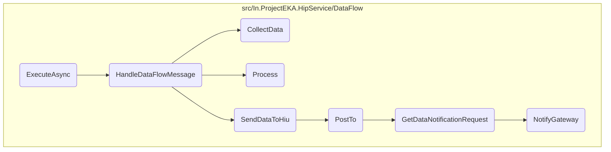
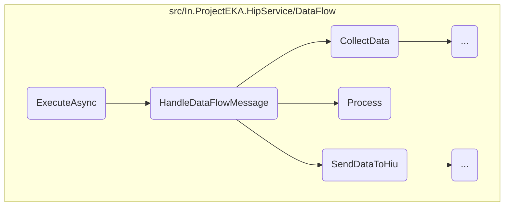
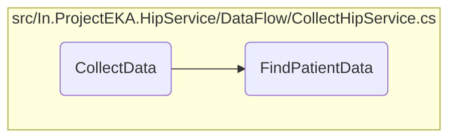
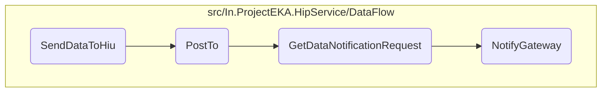

In this document, we will explain the process of handling data requests and transferring data securely. The process involves setting up a consumer to listen for incoming messages, processing the received data request, collecting the necessary data, encrypting the data, and sending the encrypted data to the Health Information User (HIU).

The flow starts with setting up a listener for incoming data requests. When a request is received, it is processed to collect the necessary data. This data is then encrypted to ensure security. Finally, the encrypted data is sent to the HIU, and a notification is sent to the gateway to inform about the status of the data transfer.

Here is a high level diagram of the flow, showing only the most important functions:



# Flow drill down

First, we'll zoom into this section of the flow:



<SwmSnippet path="/src/In.ProjectEKA.HipService/DataFlow/MessagingQueueListener.cs" line="45">

---

## <SwmToken path="src/In.ProjectEKA.HipService/DataFlow/MessagingQueueListener.cs" pos="45:7:7" line-data="        protected override Task ExecuteAsync(CancellationToken stoppingToken)">`ExecuteAsync`</SwmToken>

First, <SwmToken path="src/In.ProjectEKA.HipService/DataFlow/MessagingQueueListener.cs" pos="45:7:7" line-data="        protected override Task ExecuteAsync(CancellationToken stoppingToken)">`ExecuteAsync`</SwmToken> sets up a consumer to listen for incoming messages on a specific queue. When a message is received, it is deserialized into a <SwmToken path="src/In.ProjectEKA.HipService/DataFlow/MessagingQueueListener.cs" pos="54:11:11" line-data="                    JsonConvert.DeserializeObject&lt;HipLibrary.Patient.Model.TraceableDataRequest&gt;(message);">`TraceableDataRequest`</SwmToken> object and passed to the <SwmToken path="src/In.ProjectEKA.HipService/DataFlow/MessagingQueueListener.cs" pos="55:5:5" line-data="                await dataFlowMessageHandler.HandleDataFlowMessage(dataFlowMessage);">`HandleDataFlowMessage`</SwmToken> method for further processing.

```c#
        protected override Task ExecuteAsync(CancellationToken stoppingToken)
        {
            stoppingToken.ThrowIfCancellationRequested();
            var consumer = new EventingBasicConsumer(channel);
            consumer.Received += async (ch, ea) =>
            {
                var body = ea.Body;
                var message = Encoding.UTF8.GetString(body.ToArray());
                var dataFlowMessage =
                    JsonConvert.DeserializeObject<HipLibrary.Patient.Model.TraceableDataRequest>(message);
                await dataFlowMessageHandler.HandleDataFlowMessage(dataFlowMessage);
                channel.BasicAck(ea.DeliveryTag, false);
            };
            channel.BasicConsume(MessagingQueueConstants.DataRequestRoutingKey, false, consumer);
            return Task.CompletedTask;
        }
```

---

</SwmSnippet>

<SwmSnippet path="/src/In.ProjectEKA.HipService/DataFlow/DataFlowMessageHandler.cs" line="24">

---

## <SwmToken path="src/In.ProjectEKA.HipService/DataFlow/DataFlowMessageHandler.cs" pos="24:7:7" line-data="        public async Task HandleDataFlowMessage(TraceableDataRequest dataRequest)">`HandleDataFlowMessage`</SwmToken>

Next, <SwmToken path="src/In.ProjectEKA.HipService/DataFlow/DataFlowMessageHandler.cs" pos="24:7:7" line-data="        public async Task HandleDataFlowMessage(TraceableDataRequest dataRequest)">`HandleDataFlowMessage`</SwmToken> processes the received data request. It collects the necessary data, processes it by encrypting the entries, and then sends the encrypted data to the HIU. This ensures that the data is securely transferred and only accessible by the intended recipient.

```c#
        public async Task HandleDataFlowMessage(TraceableDataRequest dataRequest)
        {
            var sentKeyMaterial = dataRequest.KeyMaterial;
            var data = await collectHipService.CollectData(dataRequest).ConfigureAwait(false);
            var encryptedEntries = data.FlatMap(entries =>
                dataEntryFactory.Process(entries, sentKeyMaterial, dataRequest.TransactionId));
            encryptedEntries.MatchSome(async entries =>
                await dataFlowClient.SendDataToHiu(dataRequest,
                    entries.Entries,
                    entries.KeyMaterial).ConfigureAwait(false));
        }
```

---

</SwmSnippet>

<SwmSnippet path="/src/In.ProjectEKA.HipService/DataFlow/DataFlowMessageHandler.cs" line="27">

---

### Collecting Data

The <SwmToken path="src/In.ProjectEKA.HipService/DataFlow/DataFlowMessageHandler.cs" pos="27:9:11" line-data="            var data = await collectHipService.CollectData(dataRequest).ConfigureAwait(false);">`collectHipService.CollectData`</SwmToken> method is called to gather the required data based on the received request. This data is essential for fulfilling the data request from the HIU.

```c#
            var data = await collectHipService.CollectData(dataRequest).ConfigureAwait(false);
```

---

</SwmSnippet>

<SwmSnippet path="/src/In.ProjectEKA.HipService/DataFlow/DataEntryFactory.cs" line="42">

---

### Processing Data

Then, the <SwmToken path="src/In.ProjectEKA.HipService/DataFlow/DataEntryFactory.cs" pos="42:10:10" line-data="        public virtual Option&lt;EncryptedEntries&gt; Process(Entries entries,">`Process`</SwmToken> method encrypts the collected data entries using the provided key material. This step ensures that the data is securely encrypted before being sent to the HIU.

```c#
        public virtual Option<EncryptedEntries> Process(Entries entries,
            HipLibrary.Patient.Model.KeyMaterial dataRequestKeyMaterial, string transactionId)
        {
            var keyPair = EncryptorHelper.GenerateKeyPair(dataRequestKeyMaterial.Curve,
                dataRequestKeyMaterial.CryptoAlg);
            var randomKey = EncryptorHelper.GenerateRandomKey();

            var processedEntries = new List<Entry>();
            var careBundles = entries.CareBundles;
            foreach (var careBundle in careBundles)
            {
                var encryptData =
                    encryptor.EncryptData(dataRequestKeyMaterial,
                        keyPair,
                        Serializer.SerializeToString(careBundle.BundleForThisCcr), randomKey);
                if (!encryptData.HasValue)
                    return Option.None<EncryptedEntries>();

                encryptData.MatchSome(content =>
                {
                    var entry = IsLinkable(content)
```

---

</SwmSnippet>

<SwmSnippet path="/src/In.ProjectEKA.HipService/DataFlow/DataFlowClient.cs" line="31">

---

## <SwmToken path="src/In.ProjectEKA.HipService/DataFlow/DataFlowClient.cs" pos="31:9:9" line-data="        public virtual async Task SendDataToHiu(TraceableDataRequest dataRequest,">`SendDataToHiu`</SwmToken>

Finally, <SwmToken path="src/In.ProjectEKA.HipService/DataFlow/DataFlowClient.cs" pos="31:9:9" line-data="        public virtual async Task SendDataToHiu(TraceableDataRequest dataRequest,">`SendDataToHiu`</SwmToken> sends the encrypted data along with the key material to the HIU. This step completes the data transfer process, ensuring that the HIU receives the requested data securely.

```c#
        public virtual async Task SendDataToHiu(TraceableDataRequest dataRequest,
            IEnumerable<Entry> data,
            KeyMaterial keyMaterial)
        {
            await PostTo(dataRequest.ConsentId,
                dataRequest.DataPushUrl,
                dataRequest.CareContexts,
                new DataResponse(dataRequest.TransactionId, data, keyMaterial),
                dataRequest.CmSuffix,
                dataRequest.CorrelationId).ConfigureAwait(false);
        }
```

---

</SwmSnippet>

Now, lets zoom into this section of the flow:



<SwmSnippet path="/src/In.ProjectEKA.HipService/DataFlow/CollectHipService.cs" line="25">

---

## Collecting Patient Data

First, the <SwmToken path="src/In.ProjectEKA.HipService/DataFlow/CollectHipService.cs" pos="25:12:12" line-data="        public async Task&lt;Option&lt;Entries&gt;&gt; CollectData(TraceableDataRequest dataRequest)">`CollectData`</SwmToken> method initializes an empty list of <SwmToken path="src/In.ProjectEKA.HipService/DataFlow/CollectHipService.cs" pos="27:11:11" line-data="            var bundles = new List&lt;CareBundle&gt;();">`CareBundle`</SwmToken> objects. It then calls the <SwmToken path="src/In.ProjectEKA.HipService/DataFlow/CollectHipService.cs" pos="28:9:9" line-data="            var patientData = await FindPatientData(dataRequest);">`FindPatientData`</SwmToken> method to retrieve patient data based on the provided <SwmToken path="src/In.ProjectEKA.HipService/DataFlow/CollectHipService.cs" pos="25:16:16" line-data="        public async Task&lt;Option&lt;Entries&gt;&gt; CollectData(TraceableDataRequest dataRequest)">`dataRequest`</SwmToken>. The retrieved data is organized into care context references, which are then parsed and added to the list of <SwmToken path="src/In.ProjectEKA.HipService/DataFlow/CollectHipService.cs" pos="27:11:11" line-data="            var bundles = new List&lt;CareBundle&gt;();">`CareBundle`</SwmToken> objects. Finally, an <SwmToken path="src/In.ProjectEKA.HipService/DataFlow/CollectHipService.cs" pos="25:9:9" line-data="        public async Task&lt;Option&lt;Entries&gt;&gt; CollectData(TraceableDataRequest dataRequest)">`Entries`</SwmToken> object is created with the list of <SwmToken path="src/In.ProjectEKA.HipService/DataFlow/CollectHipService.cs" pos="27:11:11" line-data="            var bundles = new List&lt;CareBundle&gt;();">`CareBundle`</SwmToken> objects and returned.

```c#
        public async Task<Option<Entries>> CollectData(TraceableDataRequest dataRequest)
        {
            var bundles = new List<CareBundle>();
            var patientData = await FindPatientData(dataRequest);
            var careContextReferences = patientData.Keys.ToList();
            foreach (var careContextReference in careContextReferences)
            {
                foreach (var result in patientData.GetOrDefault(careContextReference))
                {
                    var bundle = new FhirJsonParser().Parse<Bundle>(result);
                    bundles.Add(new CareBundle(careContextReference, bundle));
                }
            }

            var entries = new Entries(bundles);
            return Option.Some(entries);
        }
```

---

</SwmSnippet>

<SwmSnippet path="/src/In.ProjectEKA.HipService/DataFlow/CollectHipService.cs" line="43">

---

## Finding Patient Data

Next, the <SwmToken path="src/In.ProjectEKA.HipService/DataFlow/CollectHipService.cs" pos="43:17:17" line-data="        private async Task&lt;Dictionary&lt;string, List&lt;string&gt;&gt;&gt; FindPatientData(TraceableDataRequest request)">`FindPatientData`</SwmToken> method logs the data request and initializes a dictionary to store care contexts and their corresponding data files. It iterates over each granted care context and health information type (<SwmToken path="src/In.ProjectEKA.HipService/DataFlow/CollectHipService.cs" pos="54:6:6" line-data="                    foreach (var hiType in request.HiType) ">`hiType`</SwmToken>) in the request, retrieving patient data for each combination. The retrieved data is added to the dictionary, which is then returned. If an error occurs during data collection, it is logged, and an empty dictionary is returned.

```c#
        private async Task<Dictionary<string, List<string>>> FindPatientData(TraceableDataRequest request)
        {
            try
            {
                LogDataRequest(request);
                var toDate = request.DateRange.To;
                var fromDate = request.DateRange.From;
                var careContextsAndListOfDataFiles = new Dictionary<string, List<string>>();
                foreach (var grantedContext in request.CareContexts)
                {
                    var listOfDataFiles = new List<string>();
                    foreach (var hiType in request.HiType) 
                    {
                        var hiTypeStr = hiType.ToString().ToLower();
                        var result = await openMrsPatientData
                            .GetPatientData(request.PatientUuid, grantedContext.CareContextReference, toDate, fromDate,
                                hiTypeStr).ConfigureAwait(false);
                        if (result?.Any() == true)
                        {
                            result.ForEach(item => listOfDataFiles.Add(item));
                        }
```

---

</SwmSnippet>

Now, lets zoom into this section of the flow:



<SwmSnippet path="/src/In.ProjectEKA.HipService/DataFlow/DataFlowClient.cs" line="43">

---

## Sending Data to HIU

First, the <SwmToken path="src/In.ProjectEKA.HipService/DataFlow/DataFlowClient.cs" pos="43:7:7" line-data="        private async Task PostTo(string consentId,">`PostTo`</SwmToken> method is responsible for sending the health information to the HIU. It constructs the HTTP request and sends it to the specified data push URL. If the delivery is successful, it sets the status to 'DELIVERED' and 'TRANSFERRED'. If there is an error, it updates the status to 'ERRORED' and 'FAILED'. This step ensures that the health information is sent to the HIU and the status is updated accordingly.

```c#
        private async Task PostTo(string consentId,
            string dataPushUrl,
            IEnumerable<GrantedContext> careContexts,
            DataResponse dataResponse,
            string cmSuffix,
            string correlationId)
        {
            var grantedContexts = careContexts as GrantedContext[] ?? careContexts.ToArray();
            var hiStatus = HiStatus.DELIVERED;
            var sessionStatus = SessionStatus.TRANSFERRED;
            var message = "Successfully delivered health information";
            try
            {
                // TODO: Need to handle non 2xx response also
                httpClient.DefaultRequestHeaders.Remove("Authorization");
                await httpClient.SendAsync(CreateHttpRequest(HttpMethod.Post, dataPushUrl, dataResponse, correlationId)).ConfigureAwait(false);
            }
            catch (Exception exception)
            {
                hiStatus = HiStatus.ERRORED;
                sessionStatus = SessionStatus.FAILED;
```

---

</SwmSnippet>

<SwmSnippet path="/src/In.ProjectEKA.HipService/DataFlow/DataFlowClient.cs" line="89">

---

## Creating Data Notification Request

Next, the <SwmToken path="src/In.ProjectEKA.HipService/DataFlow/DataFlowClient.cs" pos="89:7:7" line-data="        private async Task GetDataNotificationRequest(DataNotificationRequest dataNotificationRequest,">`GetDataNotificationRequest`</SwmToken> method is called to create a data notification request. This method prepares the data notification request with the necessary details such as transaction ID, notifier information, and status notification. It then calls the <SwmToken path="src/In.ProjectEKA.HipService/DataFlow/DataFlowClient.cs" pos="93:5:5" line-data="            await dataFlowNotificationClient.NotifyGateway(cmSuffix, dataNotificationRequest, correlationId);">`NotifyGateway`</SwmToken> method to send this notification to the gateway.

```c#
        private async Task GetDataNotificationRequest(DataNotificationRequest dataNotificationRequest,
            string cmSuffix,
            string correlationId)
        {
            await dataFlowNotificationClient.NotifyGateway(cmSuffix, dataNotificationRequest, correlationId);
        }
```

---

</SwmSnippet>

<SwmSnippet path="/src/In.ProjectEKA.HipService/DataFlow/DataFlowNotificationClient.cs" line="21">

---

## Notifying the Gateway

Finally, the <SwmToken path="src/In.ProjectEKA.HipService/DataFlow/DataFlowNotificationClient.cs" pos="21:9:9" line-data="        public virtual async Task NotifyGateway(string cmSuffix, DataNotificationRequest dataNotificationRequest,">`NotifyGateway`</SwmToken> method is responsible for sending the data notification request to the gateway. It constructs the gateway data notification request and sends it to the gateway using the <SwmToken path="src/In.ProjectEKA.HipService/DataFlow/DataFlowNotificationClient.cs" pos="32:5:5" line-data="            await gatewayClient.SendDataToGateway(PATH_HEALTH_INFORMATION_NOTIFY_GATEWAY,">`SendDataToGateway`</SwmToken> method. This step ensures that the gateway is notified about the status of the data transfer, completing the flow of sending data to the HIU and notifying the gateway.

```c#
        public virtual async Task NotifyGateway(string cmSuffix, DataNotificationRequest dataNotificationRequest,
            string correlationId)
        {
            var notificationRequest = new GatewayDataNotificationRequest(Guid.NewGuid(),
                DateTime.Now.ToUniversalTime().ToString(DateTimeFormat),
                new DataFlowNotificationRequest(
                    dataNotificationRequest.TransactionId,
                    dataNotificationRequest.ConsentId,
                    dataNotificationRequest.DoneAt,
                    dataNotificationRequest.Notifier,
                    dataNotificationRequest.StatusNotification));
            await gatewayClient.SendDataToGateway(PATH_HEALTH_INFORMATION_NOTIFY_GATEWAY,
                notificationRequest,
                cmSuffix, correlationId);
        }
```

---

</SwmSnippet>

&nbsp;

*This is an auto-generated document by Swimm 🌊 and has not yet been verified by a human*

<SwmMeta version="3.0.0" repo-id="Z2l0aHViJTNBJTNBaGlwLXNlcnZpY2UlM0ElM0FTd2ltbS1EZW1v" repo-name="hip-service"><sup>Powered by [Swimm](/)</sup></SwmMeta>
