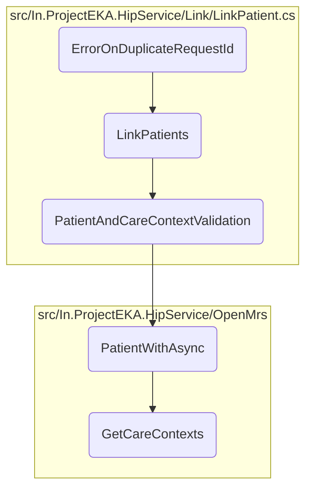

This document explains the <SwmToken path="test/In.ProjectEKA.HipServiceTest/Link/LinkPatientTest.cs" pos="269:7:7" line-data="        private async void ErrorOnDuplicateRequestId()">`ErrorOnDuplicateRequestId`</SwmToken> method, which is responsible for managing scenarios where a duplicate request ID is encountered during the patient linking process. It sets up necessary mocks and expectations, simulates the linking process, and verifies that the appropriate error response is returned if a duplicate request ID is detected.

The flow starts with the <SwmToken path="test/In.ProjectEKA.HipServiceTest/Link/LinkPatientTest.cs" pos="269:7:7" line-data="        private async void ErrorOnDuplicateRequestId()">`ErrorOnDuplicateRequestId`</SwmToken> method setting up the necessary mocks and expectations. It then calls the <SwmToken path="src/In.ProjectEKA.HipService/Link/LinkPatient.cs" pos="52:17:17" line-data="        public virtual async Task&lt;ValueTuple&lt;PatientLinkEnquiryRepresentation, ErrorRepresentation&gt;&gt; LinkPatients(">`LinkPatients`</SwmToken> method to simulate the patient linking process. During this process, the <SwmToken path="src/In.ProjectEKA.HipService/Link/LinkPatient.cs" pos="55:14:14" line-data="            var (patient, error) = await PatientAndCareContextValidation(request);">`PatientAndCareContextValidation`</SwmToken> method validates the patient and care context. If validation is successful, a link reference number is generated, and the link request is initiated. The request is then saved, and an OTP is sent for patient verification. If a duplicate request ID is detected at any point, the appropriate error response is returned, ensuring that the system handles such scenarios gracefully.

# Flow drill down



<SwmSnippet path="/test/In.ProjectEKA.HipServiceTest/Link/LinkPatientTest.cs" line="268">

---

## <SwmToken path="test/In.ProjectEKA.HipServiceTest/Link/LinkPatientTest.cs" pos="269:7:7" line-data="        private async void ErrorOnDuplicateRequestId()">`ErrorOnDuplicateRequestId`</SwmToken>

First, the <SwmToken path="test/In.ProjectEKA.HipServiceTest/Link/LinkPatientTest.cs" pos="269:7:7" line-data="        private async void ErrorOnDuplicateRequestId()">`ErrorOnDuplicateRequestId`</SwmToken> method is responsible for testing the scenario where a duplicate request ID is encountered. It sets up the necessary mocks and expectations, and then calls the <SwmToken path="src/In.ProjectEKA.HipService/Link/LinkPatient.cs" pos="52:17:17" line-data="        public virtual async Task&lt;ValueTuple&lt;PatientLinkEnquiryRepresentation, ErrorRepresentation&gt;&gt; LinkPatients(">`LinkPatients`</SwmToken> method to simulate the linking process. If a duplicate request ID is detected, it verifies that the appropriate error response is returned.

```c#
        [Fact]
        private async void ErrorOnDuplicateRequestId()
        {
            const string linkReferenceNumber = "linkreference";
            const string programRefNo = "129";
            var expectedErrorResponse =
                new ErrorRepresentation(new Error(ErrorCode.DuplicateRequestId, ErrorMessage.DuplicateRequestId));
            var patientReferenceRequest = getPatientReferenceRequest(programRefNo);
            guidGenerator.Setup(x => x.NewGuid()).Returns(linkReferenceNumber);
            patientVerification.Setup(x => x.SendTokenFor(new Session(linkReferenceNumber
                    , new Communication(CommunicationMode.MOBILE, testPatient.PhoneNumber),
                    new OtpGenerationDetail(TestBuilder.Faker().Random.Word(), OtpAction.LINK_PATIENT_CARECONTEXT.ToString()))))
                .ReturnsAsync((OtpMessage) null);
            linkRepository.Setup(x => x.SaveRequestWith(linkReferenceNumber,
                    patientReferenceRequest.Patient.ConsentManagerId,
                    patientReferenceRequest.Patient.ConsentManagerUserId,
                    patientReferenceRequest.Patient.ReferenceNumber, new[] {programRefNo}))
                .ReturnsAsync(new Tuple<LinkEnquires, Exception>(null, null));
            linkRepository.Setup(x => x.Save(patientReferenceRequest.RequestId,
                                                                         patientReferenceRequest.TransactionId,
                                                                         linkReferenceNumber))
```

---

</SwmSnippet>

<SwmSnippet path="/src/In.ProjectEKA.HipService/Link/LinkPatient.cs" line="52">

---

## <SwmToken path="src/In.ProjectEKA.HipService/Link/LinkPatient.cs" pos="52:17:17" line-data="        public virtual async Task&lt;ValueTuple&lt;PatientLinkEnquiryRepresentation, ErrorRepresentation&gt;&gt; LinkPatients(">`LinkPatients`</SwmToken>

Next, the <SwmToken path="src/In.ProjectEKA.HipService/Link/LinkPatient.cs" pos="52:17:17" line-data="        public virtual async Task&lt;ValueTuple&lt;PatientLinkEnquiryRepresentation, ErrorRepresentation&gt;&gt; LinkPatients(">`LinkPatients`</SwmToken> method is the core function that handles the patient linking process. It first validates the patient and care context using the <SwmToken path="src/In.ProjectEKA.HipService/Link/LinkPatient.cs" pos="55:14:14" line-data="            var (patient, error) = await PatientAndCareContextValidation(request);">`PatientAndCareContextValidation`</SwmToken> method. If validation fails, it logs the error and returns an error response. If validation is successful, it generates a link reference number and initiates the link request. It then saves the request and sends an OTP for patient verification. If any step fails, appropriate error responses are returned. Finally, it cleans up the discovery request repository and forms the link reference response.

```c#
        public virtual async Task<ValueTuple<PatientLinkEnquiryRepresentation, ErrorRepresentation>> LinkPatients(
            PatientLinkEnquiry request)
        {
            var (patient, error) = await PatientAndCareContextValidation(request);
            if (error != null)
            {
                Log.Error(error.Error.Message);
                return (null, error);
            }

            var linkRefNumber = referenceNumberGenerator.NewGuid();
            using (var scope = new TransactionScope(TransactionScopeAsyncFlowOption.Enabled))
            {
                if (!await SaveInitiatedLinkRequest(request.RequestId, request.TransactionId, linkRefNumber)
                    .ConfigureAwait(false))
                    return (null,
                        new ErrorRepresentation(new Error(ErrorCode.DuplicateRequestId, ErrorMessage.DuplicateRequestId))
                        );

                var careContextReferenceNumbers = request.Patient.CareContexts
                    .Select(context => context.ReferenceNumber)
```

---

</SwmSnippet>

<SwmSnippet path="/src/In.ProjectEKA.HipService/Link/LinkPatient.cs" line="110">

---

## <SwmToken path="src/In.ProjectEKA.HipService/Link/LinkPatient.cs" pos="110:21:21" line-data="        private async Task&lt;ValueTuple&lt;HipLibrary.Patient.Model.Patient, ErrorRepresentation&gt;&gt; PatientAndCareContextValidation(">`PatientAndCareContextValidation`</SwmToken>

Moving to the <SwmToken path="src/In.ProjectEKA.HipService/Link/LinkPatient.cs" pos="110:21:21" line-data="        private async Task&lt;ValueTuple&lt;HipLibrary.Patient.Model.Patient, ErrorRepresentation&gt;&gt; PatientAndCareContextValidation(">`PatientAndCareContextValidation`</SwmToken> method, this function validates the patient and their care contexts. It retrieves patient information based on the patient reference number and checks if the provided care contexts match the ones stored for the patient. If there is any care context mismatch or if the patient is not found, appropriate error representations are returned.

```c#
        private async Task<ValueTuple<HipLibrary.Patient.Model.Patient, ErrorRepresentation>> PatientAndCareContextValidation(
            PatientLinkEnquiry request)
        {
            var patient = await patientRepository.PatientWithAsync(request.Patient.ReferenceNumber);
            return patient.Map(patient =>
                    {
                        var programs = request.Patient.CareContexts
                            .Where(careContext =>
                                patient.CareContexts.Any(c => c.ReferenceNumber == careContext.ReferenceNumber))
                            .Select(context => new CareContextRepresentation(context.ReferenceNumber,
                                patient.CareContexts.First(info => info.ReferenceNumber == context.ReferenceNumber)
                                    .Display)).ToList();
                        if (programs.Count != request.Patient.CareContexts.Count())
                            return (null, new ErrorRepresentation(new Error(ErrorCode.CareContextNotFound,
                                ErrorMessage.CareContextNotFound)));

                        return (patient, (ErrorRepresentation) null);
                    })
                .ValueOr((null,
                    new ErrorRepresentation(new Error(ErrorCode.NoPatientFound, ErrorMessage.NoPatientFound))));
        }
```

---

</SwmSnippet>

<SwmSnippet path="/src/In.ProjectEKA.HipService/OpenMrs/OpenMrsPatientRepository.cs" line="29">

---

## <SwmToken path="src/In.ProjectEKA.HipService/OpenMrs/OpenMrsPatientRepository.cs" pos="29:12:12" line-data="        public async Task&lt;Option&lt;Patient&gt;&gt; PatientWithAsync(string patientIdentifier)">`PatientWithAsync`</SwmToken>

Then, the <SwmToken path="src/In.ProjectEKA.HipService/OpenMrs/OpenMrsPatientRepository.cs" pos="29:12:12" line-data="        public async Task&lt;Option&lt;Patient&gt;&gt; PatientWithAsync(string patientIdentifier)">`PatientWithAsync`</SwmToken> method retrieves a patient's information using their identifier. It processes the information, including care contexts and phone number, and returns an optional Patient object. This method is crucial for validating the patient during the linking process.

```c#
        public async Task<Option<Patient>> PatientWithAsync(string patientIdentifier)
        {
            var fhirPatient = await _patientDal.LoadPatientAsyncWithIdentifier(patientIdentifier);
            var firstName = fhirPatient.Name[0].GivenElement.FirstOrDefault().ToString();
            var hipPatient = fhirPatient.ToHipPatient(firstName);
            var referenceNumber = hipPatient.Uuid;
            hipPatient.CareContexts = await _careContextRepository.GetCareContexts(referenceNumber);
            hipPatient.PhoneNumber = await _phoneNumberRepository.GetPhoneNumber(referenceNumber);

            return Option.Some(hipPatient);
        }
```

---

</SwmSnippet>

<SwmSnippet path="/src/In.ProjectEKA.HipService/OpenMrs/OpenMrsCareContextRepository.cs" line="19">

---

## <SwmToken path="src/In.ProjectEKA.HipService/OpenMrs/OpenMrsCareContextRepository.cs" pos="19:12:12" line-data="        public async Task&lt;IEnumerable&lt;CareContextRepresentation&gt;&gt; GetCareContexts(string patientUuid)">`GetCareContexts`</SwmToken>

Finally, the <SwmToken path="src/In.ProjectEKA.HipService/OpenMrs/OpenMrsCareContextRepository.cs" pos="19:12:12" line-data="        public async Task&lt;IEnumerable&lt;CareContextRepresentation&gt;&gt; GetCareContexts(string patientUuid)">`GetCareContexts`</SwmToken> method retrieves care context information for a given patient using their UUID. It processes the information and returns a list of care context representations. This method is used to ensure that the care contexts provided in the linking request are valid and match the stored data.

```c#
        public async Task<IEnumerable<CareContextRepresentation>> GetCareContexts(string patientUuid)
        {
            var path = DiscoveryPathConstants.CareContextPath;
            var query = HttpUtility.ParseQueryString(string.Empty);
            if (!string.IsNullOrEmpty(patientUuid))
            {
                query["patientUuid"] = patientUuid;
            }

            if (query.ToString() != "")
            {
                path = $"{path}?{query}";
            }

            var response = await openMrsClient.GetAsync(path);
            var content = await response.Content.ReadAsStringAsync();
            var jsonDoc = JsonDocument.Parse(content);
            var root = jsonDoc.RootElement;
            var careContexts = new List<CareContextRepresentation>();

            for (var i = 0; i < root.GetArrayLength(); i++)
```

---

</SwmSnippet>

&nbsp;

*This is an auto-generated document by Swimm 🌊 and has not yet been verified by a human*

<SwmMeta version="3.0.0" repo-id="Z2l0aHViJTNBJTNBaGlwLXNlcnZpY2UlM0ElM0FTd2ltbS1EZW1v" repo-name="hip-service"><sup>Powered by [Swimm](/)</sup></SwmMeta>
