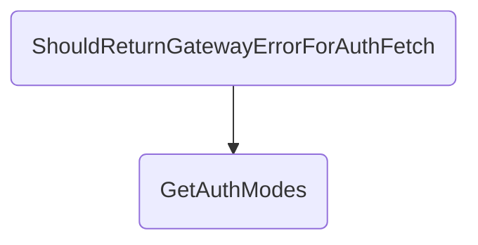

In this document, we will explain the process of handling gateway errors during an authentication fetch request. The process involves setting up a test scenario, configuring the necessary services, and handling the request and response flow.

The flow starts by setting up a test scenario where a gateway error is simulated. Then, the necessary services are configured to handle the request without any errors. The request is sent to the gateway, and the system waits for a response. If an error is found, it returns a `400 Bad `<SwmToken path="src/In.ProjectEKA.HipService/UserAuth/UserAuthController.cs" pos="71:2:2" line-data="                    &quot;Request for fetch-modes to gateway: {@GatewayResponse}&quot;,">`Request`</SwmToken> status with the error message. If the authentication modes are found, it returns a `200 `<SwmToken path="src/In.ProjectEKA.HipService/UserAuth/UserAuthController.cs" pos="267:7:7" line-data="                new AuthOnNotifyAcknowledgement(AuthOnNotifyStatus.OK),">`OK`</SwmToken> status with the authentication modes. If no response is received within the set timeout, it returns a `504 `<SwmToken path="test/In.ProjectEKA.HipServiceTest/UserAuth/UserAuthControllerTest.cs" pos="9:8:8" line-data="using In.ProjectEKA.HipService.Gateway;">`Gateway`</SwmToken>` `<SwmToken path="test/In.ProjectEKA.HipServiceTest/UserAuth/UserAuthControllerTest.cs" pos="298:17:17" line-data="            Error error = new Error(ErrorCode.GatewayTimedOut, &quot;Timeout Error&quot;);">`Timeout`</SwmToken> status with an appropriate error message.

# Flow drill down



<SwmSnippet path="/test/In.ProjectEKA.HipServiceTest/UserAuth/UserAuthControllerTest.cs" line="287">

---

## Handling Gateway Error for Authentication Fetch

First, the <SwmToken path="test/In.ProjectEKA.HipServiceTest/UserAuth/UserAuthControllerTest.cs" pos="288:7:7" line-data="        private async void ShouldReturnGatewayErrorForAuthFetch()">`ShouldReturnGatewayErrorForAuthFetch`</SwmToken> method sets up a test scenario where a gateway error is simulated. This involves creating a <SwmToken path="test/In.ProjectEKA.HipServiceTest/UserAuth/UserAuthControllerTest.cs" pos="290:9:9" line-data="            var request = new FetchRequest(&quot;hina_patel@sbx&quot;, KYC_AND_LINK);">`FetchRequest`</SwmToken> and a <SwmToken path="test/In.ProjectEKA.HipServiceTest/UserAuth/UserAuthControllerTest.cs" pos="296:3:3" line-data="                new GatewayFetchModesRequestRepresentation(requestId, timeStamp, query);">`GatewayFetchModesRequestRepresentation`</SwmToken> with a specific request ID and timestamp. An error is then added to the <SwmToken path="test/In.ProjectEKA.HipServiceTest/UserAuth/UserAuthControllerTest.cs" pos="299:1:3" line-data="            UserAuthMap.RequestIdToErrorMessage.Add(requestId, error);">`UserAuthMap.RequestIdToErrorMessage`</SwmToken> to simulate a timeout error from the gateway.

```c#
        [Fact]
        private async void ShouldReturnGatewayErrorForAuthFetch()
        {
            var request = new FetchRequest("hina_patel@sbx", KYC_AND_LINK);
            var requester = new Requester(bahmniConfiguration.Id, HIP);
            var query = new FetchQuery(request.healthId, KYC_AND_LINK, requester);
            var timeStamp = DateTime.Now.ToUniversalTime().ToString(DateTimeFormat);
            var requestId = Guid.NewGuid();
            var gatewayFetchModesRequestRepresentation =
                new GatewayFetchModesRequestRepresentation(requestId, timeStamp, query);
            var correlationId = Uuid.Generate().ToString();
            Error error = new Error(ErrorCode.GatewayTimedOut, "Timeout Error");
            UserAuthMap.RequestIdToErrorMessage.Add(requestId, error);
```

---

</SwmSnippet>

<SwmSnippet path="/test/In.ProjectEKA.HipServiceTest/UserAuth/UserAuthControllerTest.cs" line="301">

---

Next, the method sets up the <SwmToken path="test/In.ProjectEKA.HipServiceTest/UserAuth/UserAuthControllerTest.cs" pos="301:1:1" line-data="            userAuthService.Setup(a =&gt; a.FetchModeResponse(request, bahmniConfiguration))">`userAuthService`</SwmToken> to return the <SwmToken path="test/In.ProjectEKA.HipServiceTest/UserAuth/UserAuthControllerTest.cs" pos="302:8:8" line-data="                .Returns(new Tuple&lt;GatewayFetchModesRequestRepresentation, ErrorRepresentation&gt;">`GatewayFetchModesRequestRepresentation`</SwmToken> without any errors. It also configures the <SwmToken path="test/In.ProjectEKA.HipServiceTest/UserAuth/UserAuthControllerTest.cs" pos="304:1:1" line-data="            gatewayClient.Setup(">`gatewayClient`</SwmToken> to send data to the gateway and complete the task without any issues.

```c#
            userAuthService.Setup(a => a.FetchModeResponse(request, bahmniConfiguration))
                .Returns(new Tuple<GatewayFetchModesRequestRepresentation, ErrorRepresentation>
                    (gatewayFetchModesRequestRepresentation, null));
            gatewayClient.Setup(
                    client =>
                        client.SendDataToGateway(PATH_FETCH_AUTH_MODES,
                            gatewayFetchModesRequestRepresentation, gatewayConfiguration.CmSuffix, correlationId))
                .Returns(Task.CompletedTask);
```

---

</SwmSnippet>

<SwmSnippet path="/src/In.ProjectEKA.HipService/UserAuth/UserAuthController.cs" line="55">

---

Then, the <SwmToken path="src/In.ProjectEKA.HipService/UserAuth/UserAuthController.cs" pos="57:10:10" line-data="        public async Task&lt;ActionResult&gt; GetAuthModes(">`GetAuthModes`</SwmToken> method is called with the correlation ID and fetch request. This method is responsible for handling the request to fetch authentication modes. It first retrieves the <SwmToken path="test/In.ProjectEKA.HipServiceTest/UserAuth/UserAuthControllerTest.cs" pos="296:3:3" line-data="                new GatewayFetchModesRequestRepresentation(requestId, timeStamp, query);">`GatewayFetchModesRequestRepresentation`</SwmToken> and checks for any errors. If an error is found, it returns a `400 Bad `<SwmToken path="src/In.ProjectEKA.HipService/UserAuth/UserAuthController.cs" pos="71:2:2" line-data="                    &quot;Request for fetch-modes to gateway: {@GatewayResponse}&quot;,">`Request`</SwmToken> status with the error message.

```c#
        [Authorize(AuthenticationSchemes = BAHMNI_AUTH)]
        [Route(PATH_FETCH_MODES)]
        public async Task<ActionResult> GetAuthModes(
            [FromHeader(Name = CORRELATION_ID)] string correlationId, [FromBody] FetchRequest fetchRequest)
        {
            var (gatewayFetchModesRequestRepresentation, error) =
                userAuthService.FetchModeResponse(fetchRequest, bahmniConfiguration);
            if (error != null)
                return StatusCode(StatusCodes.Status400BadRequest, error);
```

---

</SwmSnippet>

<SwmSnippet path="/src/In.ProjectEKA.HipService/UserAuth/UserAuthController.cs" line="67">

---

Moving to the next step, the method logs the request details and sends the data to the gateway. It then enters a loop where it waits for a response from the gateway. If an error message is found in the <SwmToken path="src/In.ProjectEKA.HipService/UserAuth/UserAuthController.cs" pos="84:4:4" line-data="                    if (RequestIdToErrorMessage.ContainsKey(requestId))">`RequestIdToErrorMessage`</SwmToken>, it removes the error message and returns a `400 Bad `<SwmToken path="src/In.ProjectEKA.HipService/UserAuth/UserAuthController.cs" pos="71:2:2" line-data="                    &quot;Request for fetch-modes to gateway: {@GatewayResponse}&quot;,">`Request`</SwmToken> status with the error representation.

```c#
            try
            {
                logger.Log(LogLevel.Information,
                    LogEvents.UserAuth,
                    "Request for fetch-modes to gateway: {@GatewayResponse}",
                    gatewayFetchModesRequestRepresentation.dump(gatewayFetchModesRequestRepresentation));
                logger.Log(LogLevel.Information,
                    LogEvents.UserAuth, $"cmSuffix: {{cmSuffix}}, correlationId: {{correlationId}}," +
                                        $" healthId: {{healthId}}, requestId: {{requestId}}",
                    cmSuffix, correlationId, gatewayFetchModesRequestRepresentation.query.id, requestId);
                await gatewayClient.SendDataToGateway(PATH_FETCH_AUTH_MODES, gatewayFetchModesRequestRepresentation,
                    cmSuffix, correlationId);

                var i = 0;
                do
                {
                    Thread.Sleep(gatewayConfiguration.TimeOut);
                    if (RequestIdToErrorMessage.ContainsKey(requestId))
                    {
                        var gatewayError = RequestIdToErrorMessage[requestId];
                        RequestIdToErrorMessage.Remove(requestId);
```

---

</SwmSnippet>

<SwmSnippet path="/src/In.ProjectEKA.HipService/UserAuth/UserAuthController.cs" line="92">

---

Finally, if the authentication modes are found in the <SwmToken path="src/In.ProjectEKA.HipService/UserAuth/UserAuthController.cs" pos="92:4:4" line-data="                    if (RequestIdToAuthModes.ContainsKey(requestId))">`RequestIdToAuthModes`</SwmToken>, it logs the response details and returns the authentication modes along with a `200 `<SwmToken path="src/In.ProjectEKA.HipService/UserAuth/UserAuthController.cs" pos="267:7:7" line-data="                new AuthOnNotifyAcknowledgement(AuthOnNotifyStatus.OK),">`OK`</SwmToken> status. If no response is received within the set timeout, it returns a `504 `<SwmToken path="test/In.ProjectEKA.HipServiceTest/UserAuth/UserAuthControllerTest.cs" pos="9:8:8" line-data="using In.ProjectEKA.HipService.Gateway;">`Gateway`</SwmToken>` `<SwmToken path="test/In.ProjectEKA.HipServiceTest/UserAuth/UserAuthControllerTest.cs" pos="298:17:17" line-data="            Error error = new Error(ErrorCode.GatewayTimedOut, &quot;Timeout Error&quot;);">`Timeout`</SwmToken> status with an appropriate error message.

```c#
                    if (RequestIdToAuthModes.ContainsKey(requestId))
                    {
                        logger.LogInformation(LogEvents.UserAuth,
                            "Response about to be send for requestId: {RequestId} with authModes: {AuthModes}",
                            requestId, RequestIdToAuthModes[requestId]
                        );
                        List<Mode> authModes = RequestIdToAuthModes[requestId];
                        authModes.Add(Mode.DIRECT);
                        FetchModeResponse fetchModeResponse = new FetchModeResponse(authModes);
                        return Json(fetchModeResponse);
                    }

                    i++;
                } while (i < gatewayConfiguration.Counter);
            }
            catch (Exception exception)
            {
                logger.LogError(LogEvents.UserAuth, exception, "Error happened for requestId: {RequestId} for" +
                                                               " fetch-mode request", requestId);
            }

```

---

</SwmSnippet>

&nbsp;

*This is an auto-generated document by Swimm 🌊 and has not yet been verified by a human*

<SwmMeta version="3.0.0" repo-id="Z2l0aHViJTNBJTNBaGlwLXNlcnZpY2UlM0ElM0FTd2ltbS1EZW1v" repo-name="hip-service"><sup>Powered by [Swimm](/)</sup></SwmMeta>
