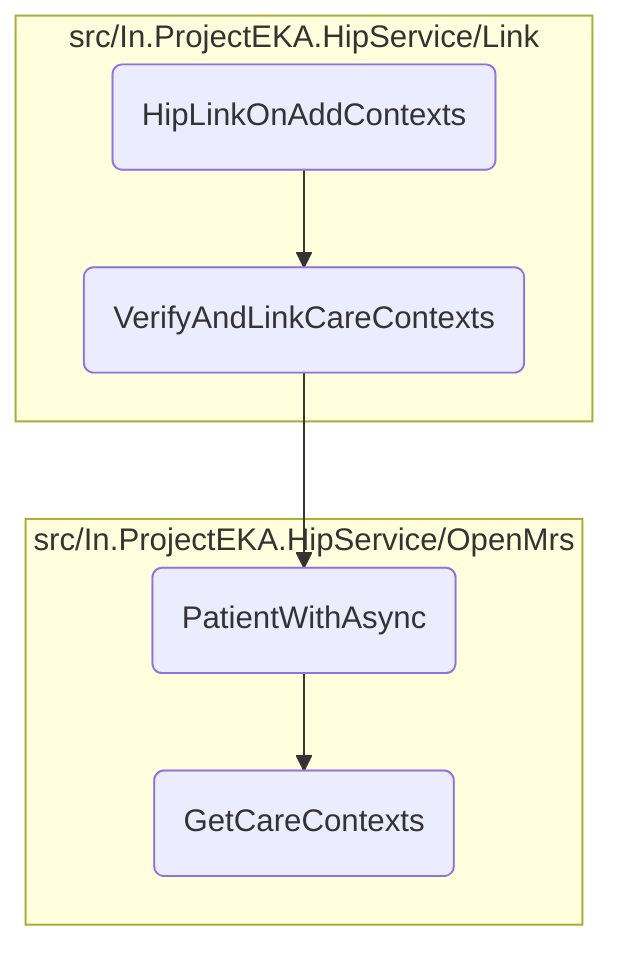

In this document, we will explain the process of handling a link <SwmToken path="src/In.ProjectEKA.HipService/Link/LinkController.cs" pos="158:8:12" line-data="            Log.Information(&quot;Link on-add-context received.&quot; +">`on-add-context`</SwmToken> request. The process involves logging the receipt of the request, checking for errors, and verifying and linking care contexts if the acknowledgment status is successful.

The flow starts by logging the receipt of a link <SwmToken path="src/In.ProjectEKA.HipService/Link/LinkController.cs" pos="158:8:12" line-data="            Log.Information(&quot;Link on-add-context received.&quot; +">`on-add-context`</SwmToken> request. It then checks if there are any errors in the confirmation. If there are errors, it logs the error code and message. If the confirmation contains an acknowledgment with a success status, it proceeds to verify and link care contexts. Finally, it logs the acknowledgment status.

# Flow drill down



<SwmSnippet path="/src/In.ProjectEKA.HipService/Link/LinkController.cs" line="155">

---

## <SwmToken path="src/In.ProjectEKA.HipService/Link/LinkController.cs" pos="156:10:10" line-data="        public async Task&lt;AcceptedResult&gt; HipLinkOnAddContexts(HipLinkContextConfirmation confirmation)">`HipLinkOnAddContexts`</SwmToken>

First, the <SwmToken path="src/In.ProjectEKA.HipService/Link/LinkController.cs" pos="156:10:10" line-data="        public async Task&lt;AcceptedResult&gt; HipLinkOnAddContexts(HipLinkContextConfirmation confirmation)">`HipLinkOnAddContexts`</SwmToken> method logs the receipt of a link <SwmToken path="src/In.ProjectEKA.HipService/Link/LinkController.cs" pos="158:8:12" line-data="            Log.Information(&quot;Link on-add-context received.&quot; +">`on-add-context`</SwmToken> request and checks for any errors in the confirmation. If the confirmation contains an acknowledgment with a success status, it proceeds to verify and link care contexts using the <SwmToken path="src/In.ProjectEKA.HipService/Link/LinkController.cs" pos="169:5:5" line-data="                        await linkPatient.VerifyAndLinkCareContexts(confirmation.Resp.RequestId);">`VerifyAndLinkCareContexts`</SwmToken> method.

```c#
        [HttpPost(PATH_ON_ADD_CONTEXTS)]
        public async Task<AcceptedResult> HipLinkOnAddContexts(HipLinkContextConfirmation confirmation)
        {
            Log.Information("Link on-add-context received." +
                            $" RequestId:{confirmation.RequestId}, " +
                            $" Timestamp:{confirmation.Timestamp}");
            if (confirmation.Error != null)
                Log.Information($" Error Code:{confirmation.Error.Code}," +
                                $" Error Message:{confirmation.Error.Message}");
            else if (confirmation.Acknowledgement != null)
            {
                if (confirmation.Acknowledgement.Status.Equals(Status.SUCCESS.ToString()))
                {
                    var error =
                        await linkPatient.VerifyAndLinkCareContexts(confirmation.Resp.RequestId);
                    if (error != null)
                    {
                        Log.Error(error);
                    }
                }
                Log.Information($" Acknowledgment Status:{confirmation.Acknowledgement.Status}");
```

---

</SwmSnippet>

&nbsp;

*This is an auto-generated document by Swimm 🌊 and has not yet been verified by a human*

<SwmMeta version="3.0.0" repo-id="Z2l0aHViJTNBJTNBaGlwLXNlcnZpY2UlM0ElM0FTd2ltbS1EZW1v" repo-name="hip-service"><sup>Powered by [Swimm](/)</sup></SwmMeta>
