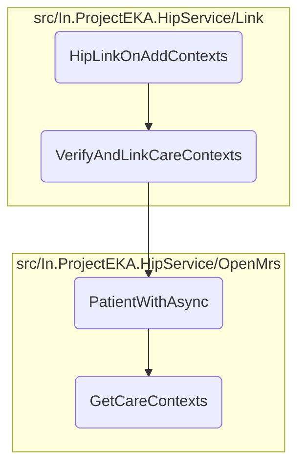

```mermaid
graph TD
  subgraph VerifyAndLinkCareContexts
    VerifyAndLinkCareContexts:A["Get patient for request"] --> VerifyAndLinkCareContexts:B["Check if patient exists"]
    VerifyAndLinkCareContexts:B -->|No| VerifyAndLinkCareContexts:C["Return no link request found error"]
    VerifyAndLinkCareContexts:B -->|Yes| VerifyAndLinkCareContexts:D["Fetch patient data"]
    VerifyAndLinkCareContexts:D --> VerifyAndLinkCareContexts:E["Map patient data"]
    VerifyAndLinkCareContexts:E --> VerifyAndLinkCareContexts:F["Get saved link requests"]
    VerifyAndLinkCareContexts:F --> VerifyAndLinkCareContexts:G["Update link request status"]
    VerifyAndLinkCareContexts:G --> VerifyAndLinkCareContexts:H["Save linked accounts"]
    VerifyAndLinkCareContexts:H -->|Success| VerifyAndLinkCareContexts:I["Return null"]
    VerifyAndLinkCareContexts:H -->|Failure| VerifyAndLinkCareContexts:J["Return no patient found error"]
    VerifyAndLinkCareContexts:E -->|Failure| VerifyAndLinkCareContexts:K["Return care context not found error"]
  end

%% Swimm:
%% graph TD
%%   subgraph <SwmToken path="src/In.ProjectEKA.HipService/Link/LinkController.cs" pos="169:5:5" line-data="                        await linkPatient.VerifyAndLinkCareContexts(confirmation.Resp.RequestId);">`VerifyAndLinkCareContexts`</SwmToken>
%%     <SwmToken path="src/In.ProjectEKA.HipService/Link/LinkController.cs" pos="169:5:5" line-data="                        await linkPatient.VerifyAndLinkCareContexts(confirmation.Resp.RequestId);">`VerifyAndLinkCareContexts`</SwmToken>:A["Get patient for request"] --> <SwmToken path="src/In.ProjectEKA.HipService/Link/LinkController.cs" pos="169:5:5" line-data="                        await linkPatient.VerifyAndLinkCareContexts(confirmation.Resp.RequestId);">`VerifyAndLinkCareContexts`</SwmToken>:B["Check if patient exists"]
%%     <SwmToken path="src/In.ProjectEKA.HipService/Link/LinkController.cs" pos="169:5:5" line-data="                        await linkPatient.VerifyAndLinkCareContexts(confirmation.Resp.RequestId);">`VerifyAndLinkCareContexts`</SwmToken>:B -->|No| <SwmToken path="src/In.ProjectEKA.HipService/Link/LinkController.cs" pos="169:5:5" line-data="                        await linkPatient.VerifyAndLinkCareContexts(confirmation.Resp.RequestId);">`VerifyAndLinkCareContexts`</SwmToken>:C["Return no link request found error"]
%%     <SwmToken path="src/In.ProjectEKA.HipService/Link/LinkController.cs" pos="169:5:5" line-data="                        await linkPatient.VerifyAndLinkCareContexts(confirmation.Resp.RequestId);">`VerifyAndLinkCareContexts`</SwmToken>:B -->|Yes| <SwmToken path="src/In.ProjectEKA.HipService/Link/LinkController.cs" pos="169:5:5" line-data="                        await linkPatient.VerifyAndLinkCareContexts(confirmation.Resp.RequestId);">`VerifyAndLinkCareContexts`</SwmToken>:D["Fetch patient data"]
%%     <SwmToken path="src/In.ProjectEKA.HipService/Link/LinkController.cs" pos="169:5:5" line-data="                        await linkPatient.VerifyAndLinkCareContexts(confirmation.Resp.RequestId);">`VerifyAndLinkCareContexts`</SwmToken>:D --> <SwmToken path="src/In.ProjectEKA.HipService/Link/LinkController.cs" pos="169:5:5" line-data="                        await linkPatient.VerifyAndLinkCareContexts(confirmation.Resp.RequestId);">`VerifyAndLinkCareContexts`</SwmToken>:E["Map patient data"]
%%     <SwmToken path="src/In.ProjectEKA.HipService/Link/LinkController.cs" pos="169:5:5" line-data="                        await linkPatient.VerifyAndLinkCareContexts(confirmation.Resp.RequestId);">`VerifyAndLinkCareContexts`</SwmToken>:E --> <SwmToken path="src/In.ProjectEKA.HipService/Link/LinkController.cs" pos="169:5:5" line-data="                        await linkPatient.VerifyAndLinkCareContexts(confirmation.Resp.RequestId);">`VerifyAndLinkCareContexts`</SwmToken>:F["Get saved link requests"]
%%     <SwmToken path="src/In.ProjectEKA.HipService/Link/LinkController.cs" pos="169:5:5" line-data="                        await linkPatient.VerifyAndLinkCareContexts(confirmation.Resp.RequestId);">`VerifyAndLinkCareContexts`</SwmToken>:F --> <SwmToken path="src/In.ProjectEKA.HipService/Link/LinkController.cs" pos="169:5:5" line-data="                        await linkPatient.VerifyAndLinkCareContexts(confirmation.Resp.RequestId);">`VerifyAndLinkCareContexts`</SwmToken>:G["Update link request status"]
%%     <SwmToken path="src/In.ProjectEKA.HipService/Link/LinkController.cs" pos="169:5:5" line-data="                        await linkPatient.VerifyAndLinkCareContexts(confirmation.Resp.RequestId);">`VerifyAndLinkCareContexts`</SwmToken>:G --> <SwmToken path="src/In.ProjectEKA.HipService/Link/LinkController.cs" pos="169:5:5" line-data="                        await linkPatient.VerifyAndLinkCareContexts(confirmation.Resp.RequestId);">`VerifyAndLinkCareContexts`</SwmToken>:H["Save linked accounts"]
%%     <SwmToken path="src/In.ProjectEKA.HipService/Link/LinkController.cs" pos="169:5:5" line-data="                        await linkPatient.VerifyAndLinkCareContexts(confirmation.Resp.RequestId);">`VerifyAndLinkCareContexts`</SwmToken>:H -->|Success| <SwmToken path="src/In.ProjectEKA.HipService/Link/LinkController.cs" pos="169:5:5" line-data="                        await linkPatient.VerifyAndLinkCareContexts(confirmation.Resp.RequestId);">`VerifyAndLinkCareContexts`</SwmToken>:I["Return null"]
%%     <SwmToken path="src/In.ProjectEKA.HipService/Link/LinkController.cs" pos="169:5:5" line-data="                        await linkPatient.VerifyAndLinkCareContexts(confirmation.Resp.RequestId);">`VerifyAndLinkCareContexts`</SwmToken>:H -->|Failure| <SwmToken path="src/In.ProjectEKA.HipService/Link/LinkController.cs" pos="169:5:5" line-data="                        await linkPatient.VerifyAndLinkCareContexts(confirmation.Resp.RequestId);">`VerifyAndLinkCareContexts`</SwmToken>:J["Return no patient found error"]
%%     <SwmToken path="src/In.ProjectEKA.HipService/Link/LinkController.cs" pos="169:5:5" line-data="                        await linkPatient.VerifyAndLinkCareContexts(confirmation.Resp.RequestId);">`VerifyAndLinkCareContexts`</SwmToken>:E -->|Failure| <SwmToken path="src/In.ProjectEKA.HipService/Link/LinkController.cs" pos="169:5:5" line-data="                        await linkPatient.VerifyAndLinkCareContexts(confirmation.Resp.RequestId);">`VerifyAndLinkCareContexts`</SwmToken>:K["Return care context not found error"]
%%   end
```

```mermaid
graph TD
  subgraph PatientWithAsync
    PatientWithAsync:A["Load patient with identifier"] --> PatientWithAsync:B["Extract patient first name"]
    PatientWithAsync:B --> PatientWithAsync:C["Convert to HIP Patient"]
    PatientWithAsync:C --> PatientWithAsync:D["Get Care Contexts"]
    PatientWithAsync:D --> PatientWithAsync:E["Get Phone Number"]
    PatientWithAsync:E --> PatientWithAsync:F["Return HIP Patient"]
  end
  subgraph GetCareContexts
    GetCareContexts:A["Build API path"] --> GetCareContexts:B["Construct query string"]
    GetCareContexts:B --> GetCareContexts:C["Send GET request"]
    GetCareContexts:C --> GetCareContexts:D["Parse response content"]
    GetCareContexts:D --> GetCareContexts:E["Iterate over care contexts"]
    GetCareContexts:E --> GetCareContexts:F["Return Care Contexts list"]
  end
  PatientWithAsync:D --> GetCareContexts

%% Swimm:
%% graph TD
%%   subgraph <SwmToken path="src/In.ProjectEKA.HipService/Link/LinkPatient.cs" pos="245:11:11" line-data="            var patient = await patientRepository.PatientWithAsync(linkEnquires.PatientReferenceNumber);">`PatientWithAsync`</SwmToken>
%%     <SwmToken path="src/In.ProjectEKA.HipService/Link/LinkPatient.cs" pos="245:11:11" line-data="            var patient = await patientRepository.PatientWithAsync(linkEnquires.PatientReferenceNumber);">`PatientWithAsync`</SwmToken>:A["Load patient with identifier"] --> <SwmToken path="src/In.ProjectEKA.HipService/Link/LinkPatient.cs" pos="245:11:11" line-data="            var patient = await patientRepository.PatientWithAsync(linkEnquires.PatientReferenceNumber);">`PatientWithAsync`</SwmToken>:B["Extract patient first name"]
%%     <SwmToken path="src/In.ProjectEKA.HipService/Link/LinkPatient.cs" pos="245:11:11" line-data="            var patient = await patientRepository.PatientWithAsync(linkEnquires.PatientReferenceNumber);">`PatientWithAsync`</SwmToken>:B --> <SwmToken path="src/In.ProjectEKA.HipService/Link/LinkPatient.cs" pos="245:11:11" line-data="            var patient = await patientRepository.PatientWithAsync(linkEnquires.PatientReferenceNumber);">`PatientWithAsync`</SwmToken>:C["Convert to HIP Patient"]
%%     <SwmToken path="src/In.ProjectEKA.HipService/Link/LinkPatient.cs" pos="245:11:11" line-data="            var patient = await patientRepository.PatientWithAsync(linkEnquires.PatientReferenceNumber);">`PatientWithAsync`</SwmToken>:C --> <SwmToken path="src/In.ProjectEKA.HipService/Link/LinkPatient.cs" pos="245:11:11" line-data="            var patient = await patientRepository.PatientWithAsync(linkEnquires.PatientReferenceNumber);">`PatientWithAsync`</SwmToken>:D["Get Care Contexts"]
%%     <SwmToken path="src/In.ProjectEKA.HipService/Link/LinkPatient.cs" pos="245:11:11" line-data="            var patient = await patientRepository.PatientWithAsync(linkEnquires.PatientReferenceNumber);">`PatientWithAsync`</SwmToken>:D --> <SwmToken path="src/In.ProjectEKA.HipService/Link/LinkPatient.cs" pos="245:11:11" line-data="            var patient = await patientRepository.PatientWithAsync(linkEnquires.PatientReferenceNumber);">`PatientWithAsync`</SwmToken>:E["Get Phone Number"]
%%     <SwmToken path="src/In.ProjectEKA.HipService/Link/LinkPatient.cs" pos="245:11:11" line-data="            var patient = await patientRepository.PatientWithAsync(linkEnquires.PatientReferenceNumber);">`PatientWithAsync`</SwmToken>:E --> <SwmToken path="src/In.ProjectEKA.HipService/Link/LinkPatient.cs" pos="245:11:11" line-data="            var patient = await patientRepository.PatientWithAsync(linkEnquires.PatientReferenceNumber);">`PatientWithAsync`</SwmToken>:F["Return HIP Patient"]
%%   end
%%   subgraph <SwmToken path="src/In.ProjectEKA.HipService/OpenMrs/OpenMrsPatientRepository.cs" pos="35:11:11" line-data="            hipPatient.CareContexts = await _careContextRepository.GetCareContexts(referenceNumber);">`GetCareContexts`</SwmToken>
%%     <SwmToken path="src/In.ProjectEKA.HipService/OpenMrs/OpenMrsPatientRepository.cs" pos="35:11:11" line-data="            hipPatient.CareContexts = await _careContextRepository.GetCareContexts(referenceNumber);">`GetCareContexts`</SwmToken>:A["Build API path"] --> <SwmToken path="src/In.ProjectEKA.HipService/OpenMrs/OpenMrsPatientRepository.cs" pos="35:11:11" line-data="            hipPatient.CareContexts = await _careContextRepository.GetCareContexts(referenceNumber);">`GetCareContexts`</SwmToken>:B["Construct query string"]
%%     <SwmToken path="src/In.ProjectEKA.HipService/OpenMrs/OpenMrsPatientRepository.cs" pos="35:11:11" line-data="            hipPatient.CareContexts = await _careContextRepository.GetCareContexts(referenceNumber);">`GetCareContexts`</SwmToken>:B --> <SwmToken path="src/In.ProjectEKA.HipService/OpenMrs/OpenMrsPatientRepository.cs" pos="35:11:11" line-data="            hipPatient.CareContexts = await _careContextRepository.GetCareContexts(referenceNumber);">`GetCareContexts`</SwmToken>:C["Send GET request"]
%%     <SwmToken path="src/In.ProjectEKA.HipService/OpenMrs/OpenMrsPatientRepository.cs" pos="35:11:11" line-data="            hipPatient.CareContexts = await _careContextRepository.GetCareContexts(referenceNumber);">`GetCareContexts`</SwmToken>:C --> <SwmToken path="src/In.ProjectEKA.HipService/OpenMrs/OpenMrsPatientRepository.cs" pos="35:11:11" line-data="            hipPatient.CareContexts = await _careContextRepository.GetCareContexts(referenceNumber);">`GetCareContexts`</SwmToken>:D["Parse response content"]
%%     <SwmToken path="src/In.ProjectEKA.HipService/OpenMrs/OpenMrsPatientRepository.cs" pos="35:11:11" line-data="            hipPatient.CareContexts = await _careContextRepository.GetCareContexts(referenceNumber);">`GetCareContexts`</SwmToken>:D --> <SwmToken path="src/In.ProjectEKA.HipService/OpenMrs/OpenMrsPatientRepository.cs" pos="35:11:11" line-data="            hipPatient.CareContexts = await _careContextRepository.GetCareContexts(referenceNumber);">`GetCareContexts`</SwmToken>:E["Iterate over care contexts"]
%%     <SwmToken path="src/In.ProjectEKA.HipService/OpenMrs/OpenMrsPatientRepository.cs" pos="35:11:11" line-data="            hipPatient.CareContexts = await _careContextRepository.GetCareContexts(referenceNumber);">`GetCareContexts`</SwmToken>:E --> <SwmToken path="src/In.ProjectEKA.HipService/OpenMrs/OpenMrsPatientRepository.cs" pos="35:11:11" line-data="            hipPatient.CareContexts = await _careContextRepository.GetCareContexts(referenceNumber);">`GetCareContexts`</SwmToken>:F["Return Care Contexts list"]
%%   end
%%   <SwmToken path="src/In.ProjectEKA.HipService/Link/LinkPatient.cs" pos="245:11:11" line-data="            var patient = await patientRepository.PatientWithAsync(linkEnquires.PatientReferenceNumber);">`PatientWithAsync`</SwmToken>:D --> <SwmToken path="src/In.ProjectEKA.HipService/OpenMrs/OpenMrsPatientRepository.cs" pos="35:11:11" line-data="            hipPatient.CareContexts = await _careContextRepository.GetCareContexts(referenceNumber);">`GetCareContexts`</SwmToken>
```

In this document, we will explain the process of handling link <SwmToken path="src/In.ProjectEKA.HipService/Link/LinkController.cs" pos="158:8:12" line-data="            Log.Information(&quot;Link on-add-context received.&quot; +">`on-add-context`</SwmToken> requests. The process involves logging the receipt of the request, checking for errors, verifying and linking care contexts, and logging the final status.

The flow starts by logging the receipt of a link <SwmToken path="src/In.ProjectEKA.HipService/Link/LinkController.cs" pos="158:8:12" line-data="            Log.Information(&quot;Link on-add-context received.&quot; +">`on-add-context`</SwmToken> request. It then checks if there is an error in the confirmation. If an error exists, it logs the error information. If there is no error and an acknowledgment is present, it checks if the acknowledgment status is 'SUCCESS'. If successful, it calls the <SwmToken path="src/In.ProjectEKA.HipService/Link/LinkController.cs" pos="169:5:5" line-data="                        await linkPatient.VerifyAndLinkCareContexts(confirmation.Resp.RequestId);">`VerifyAndLinkCareContexts`</SwmToken> method to verify and link the care contexts. Finally, it logs the acknowledgment status and returns an <SwmToken path="src/In.ProjectEKA.HipService/Link/LinkController.cs" pos="43:3:3" line-data="        public AcceptedResult LinkFor(">`AcceptedResult`</SwmToken>.

Here is a high level diagram of the flow, showing only the most important functions:



# Flow drill down

```mermaid
graph TD
  subgraph HipLinkOnAddContexts
    HipLinkOnAddContexts:A["Log information about receipt"]
    HipLinkOnAddContexts:A --> HipLinkOnAddContexts:B{"Check if there is an error"}
    HipLinkOnAddContexts:B -->|Yes| HipLinkOnAddContexts:C["Log error information"]
    HipLinkOnAddContexts:B -->|No| HipLinkOnAddContexts:D{"Check if there is an acknowledgement"}
    HipLinkOnAddContexts:D -->|Yes| HipLinkOnAddContexts:E{"Check if status is SUCCESS"}
    HipLinkOnAddContexts:E -->|Yes| HipLinkOnAddContexts:F["Call VerifyAndLinkCareContexts"]
    HipLinkOnAddContexts:F --> HipLinkOnAddContexts:G["Log errors if any"]
    HipLinkOnAddContexts:E -->|No| HipLinkOnAddContexts:H["Log acknowledgement status"]
    HipLinkOnAddContexts:D -->|No| HipLinkOnAddContexts:I["Log acknowledgement status"]
    HipLinkOnAddContexts:I --> HipLinkOnAddContexts:J["Return Accepted"]
  end

%% Swimm:
%% graph TD
%%   subgraph <SwmToken path="src/In.ProjectEKA.HipService/Link/LinkController.cs" pos="156:10:10" line-data="        public async Task&lt;AcceptedResult&gt; HipLinkOnAddContexts(HipLinkContextConfirmation confirmation)">`HipLinkOnAddContexts`</SwmToken>
%%     <SwmToken path="src/In.ProjectEKA.HipService/Link/LinkController.cs" pos="156:10:10" line-data="        public async Task&lt;AcceptedResult&gt; HipLinkOnAddContexts(HipLinkContextConfirmation confirmation)">`HipLinkOnAddContexts`</SwmToken>:A["Log information about receipt"]
%%     <SwmToken path="src/In.ProjectEKA.HipService/Link/LinkController.cs" pos="156:10:10" line-data="        public async Task&lt;AcceptedResult&gt; HipLinkOnAddContexts(HipLinkContextConfirmation confirmation)">`HipLinkOnAddContexts`</SwmToken>:A --> <SwmToken path="src/In.ProjectEKA.HipService/Link/LinkController.cs" pos="156:10:10" line-data="        public async Task&lt;AcceptedResult&gt; HipLinkOnAddContexts(HipLinkContextConfirmation confirmation)">`HipLinkOnAddContexts`</SwmToken>:B{"Check if there is an error"}
%%     <SwmToken path="src/In.ProjectEKA.HipService/Link/LinkController.cs" pos="156:10:10" line-data="        public async Task&lt;AcceptedResult&gt; HipLinkOnAddContexts(HipLinkContextConfirmation confirmation)">`HipLinkOnAddContexts`</SwmToken>:B -->|Yes| <SwmToken path="src/In.ProjectEKA.HipService/Link/LinkController.cs" pos="156:10:10" line-data="        public async Task&lt;AcceptedResult&gt; HipLinkOnAddContexts(HipLinkContextConfirmation confirmation)">`HipLinkOnAddContexts`</SwmToken>:C["Log error information"]
%%     <SwmToken path="src/In.ProjectEKA.HipService/Link/LinkController.cs" pos="156:10:10" line-data="        public async Task&lt;AcceptedResult&gt; HipLinkOnAddContexts(HipLinkContextConfirmation confirmation)">`HipLinkOnAddContexts`</SwmToken>:B -->|No| <SwmToken path="src/In.ProjectEKA.HipService/Link/LinkController.cs" pos="156:10:10" line-data="        public async Task&lt;AcceptedResult&gt; HipLinkOnAddContexts(HipLinkContextConfirmation confirmation)">`HipLinkOnAddContexts`</SwmToken>:D{"Check if there is an acknowledgement"}
%%     <SwmToken path="src/In.ProjectEKA.HipService/Link/LinkController.cs" pos="156:10:10" line-data="        public async Task&lt;AcceptedResult&gt; HipLinkOnAddContexts(HipLinkContextConfirmation confirmation)">`HipLinkOnAddContexts`</SwmToken>:D -->|Yes| <SwmToken path="src/In.ProjectEKA.HipService/Link/LinkController.cs" pos="156:10:10" line-data="        public async Task&lt;AcceptedResult&gt; HipLinkOnAddContexts(HipLinkContextConfirmation confirmation)">`HipLinkOnAddContexts`</SwmToken>:E{"Check if status is SUCCESS"}
%%     <SwmToken path="src/In.ProjectEKA.HipService/Link/LinkController.cs" pos="156:10:10" line-data="        public async Task&lt;AcceptedResult&gt; HipLinkOnAddContexts(HipLinkContextConfirmation confirmation)">`HipLinkOnAddContexts`</SwmToken>:E -->|Yes| <SwmToken path="src/In.ProjectEKA.HipService/Link/LinkController.cs" pos="156:10:10" line-data="        public async Task&lt;AcceptedResult&gt; HipLinkOnAddContexts(HipLinkContextConfirmation confirmation)">`HipLinkOnAddContexts`</SwmToken>:F["Call <SwmToken path="src/In.ProjectEKA.HipService/Link/LinkController.cs" pos="169:5:5" line-data="                        await linkPatient.VerifyAndLinkCareContexts(confirmation.Resp.RequestId);">`VerifyAndLinkCareContexts`</SwmToken>"]
%%     <SwmToken path="src/In.ProjectEKA.HipService/Link/LinkController.cs" pos="156:10:10" line-data="        public async Task&lt;AcceptedResult&gt; HipLinkOnAddContexts(HipLinkContextConfirmation confirmation)">`HipLinkOnAddContexts`</SwmToken>:F --> <SwmToken path="src/In.ProjectEKA.HipService/Link/LinkController.cs" pos="156:10:10" line-data="        public async Task&lt;AcceptedResult&gt; HipLinkOnAddContexts(HipLinkContextConfirmation confirmation)">`HipLinkOnAddContexts`</SwmToken>:G["Log errors if any"]
%%     <SwmToken path="src/In.ProjectEKA.HipService/Link/LinkController.cs" pos="156:10:10" line-data="        public async Task&lt;AcceptedResult&gt; HipLinkOnAddContexts(HipLinkContextConfirmation confirmation)">`HipLinkOnAddContexts`</SwmToken>:E -->|No| <SwmToken path="src/In.ProjectEKA.HipService/Link/LinkController.cs" pos="156:10:10" line-data="        public async Task&lt;AcceptedResult&gt; HipLinkOnAddContexts(HipLinkContextConfirmation confirmation)">`HipLinkOnAddContexts`</SwmToken>:H["Log acknowledgement status"]
%%     <SwmToken path="src/In.ProjectEKA.HipService/Link/LinkController.cs" pos="156:10:10" line-data="        public async Task&lt;AcceptedResult&gt; HipLinkOnAddContexts(HipLinkContextConfirmation confirmation)">`HipLinkOnAddContexts`</SwmToken>:D -->|No| <SwmToken path="src/In.ProjectEKA.HipService/Link/LinkController.cs" pos="156:10:10" line-data="        public async Task&lt;AcceptedResult&gt; HipLinkOnAddContexts(HipLinkContextConfirmation confirmation)">`HipLinkOnAddContexts`</SwmToken>:I["Log acknowledgement status"]
%%     <SwmToken path="src/In.ProjectEKA.HipService/Link/LinkController.cs" pos="156:10:10" line-data="        public async Task&lt;AcceptedResult&gt; HipLinkOnAddContexts(HipLinkContextConfirmation confirmation)">`HipLinkOnAddContexts`</SwmToken>:I --> <SwmToken path="src/In.ProjectEKA.HipService/Link/LinkController.cs" pos="156:10:10" line-data="        public async Task&lt;AcceptedResult&gt; HipLinkOnAddContexts(HipLinkContextConfirmation confirmation)">`HipLinkOnAddContexts`</SwmToken>:J["Return Accepted"]
%%   end
```

## Exploring <SwmToken path="src/In.ProjectEKA.HipService/Link/LinkController.cs" pos="156:10:10" line-data="        public async Task&lt;AcceptedResult&gt; HipLinkOnAddContexts(HipLinkContextConfirmation confirmation)">`HipLinkOnAddContexts`</SwmToken>



<SwmSnippet path="/src/In.ProjectEKA.HipService/Link/LinkController.cs" line="158">

---

## Handling the Confirmation

First, the <SwmToken path="src/In.ProjectEKA.HipService/Link/LinkController.cs" pos="156:10:10" line-data="        public async Task&lt;AcceptedResult&gt; HipLinkOnAddContexts(HipLinkContextConfirmation confirmation)">`HipLinkOnAddContexts`</SwmToken> method logs the receipt of a link <SwmToken path="src/In.ProjectEKA.HipService/Link/LinkController.cs" pos="158:8:12" line-data="            Log.Information(&quot;Link on-add-context received.&quot; +">`on-add-context`</SwmToken> request, including the request ID and timestamp. This helps in tracking and debugging the request flow.

```c#
            Log.Information("Link on-add-context received." +
                            $" RequestId:{confirmation.RequestId}, " +
                            $" Timestamp:{confirmation.Timestamp}");
```

---

</SwmSnippet>

<SwmSnippet path="/src/In.ProjectEKA.HipService/Link/LinkController.cs" line="161">

---

Next, it checks if there is an error in the confirmation. If an error exists, it logs the error code and message, which is crucial for identifying issues in the linking process.

```c#
            if (confirmation.Error != null)
                Log.Information($" Error Code:{confirmation.Error.Code}," +
                                $" Error Message:{confirmation.Error.Message}");
```

---

</SwmSnippet>

<SwmSnippet path="/src/In.ProjectEKA.HipService/Link/LinkController.cs" line="164">

---

If there is no error and an acknowledgment is present, it further checks if the acknowledgment status is 'SUCCESS'. This status check ensures that only successful acknowledgments proceed to the next step.

```c#
            else if (confirmation.Acknowledgement != null)
            {
                if (confirmation.Acknowledgement.Status.Equals(Status.SUCCESS.ToString()))
```

---

</SwmSnippet>

<SwmSnippet path="/src/In.ProjectEKA.HipService/Link/LinkController.cs" line="168">

---

## Verifying and Linking Care Contexts

Then, the method calls <SwmToken path="src/In.ProjectEKA.HipService/Link/LinkController.cs" pos="169:5:5" line-data="                        await linkPatient.VerifyAndLinkCareContexts(confirmation.Resp.RequestId);">`VerifyAndLinkCareContexts`</SwmToken> with the request ID from the response. This step is critical as it verifies the care contexts and links them to the patient. It involves retrieving patient data, updating the status of link requests, and saving the linked accounts.

```c#
                    var error =
                        await linkPatient.VerifyAndLinkCareContexts(confirmation.Resp.RequestId);
```

---

</SwmSnippet>

<SwmSnippet path="/src/In.ProjectEKA.HipService/Link/LinkController.cs" line="170">

---

If an error occurs during the verification and linking process, it logs the error. This logging is essential for diagnosing issues that may arise during the linking of care contexts.

```c#
                    if (error != null)
                    {
                        Log.Error(error);
```

---

</SwmSnippet>

<SwmSnippet path="/src/In.ProjectEKA.HipService/Link/LinkController.cs" line="175">

---

Finally, it logs the acknowledgment status and the response request ID before returning an <SwmToken path="src/In.ProjectEKA.HipService/Link/LinkController.cs" pos="43:3:3" line-data="        public AcceptedResult LinkFor(">`AcceptedResult`</SwmToken>. This final logging step ensures that the entire process is well-documented for future reference.

```c#
                Log.Information($" Acknowledgment Status:{confirmation.Acknowledgement.Status}");
            }
            Log.Information($" Resp RequestId:{confirmation.Resp.RequestId}");
            return Accepted();
```

---

</SwmSnippet>

## Looking at <SwmToken path="src/In.ProjectEKA.HipService/Link/LinkController.cs" pos="169:5:5" line-data="                        await linkPatient.VerifyAndLinkCareContexts(confirmation.Resp.RequestId);">`VerifyAndLinkCareContexts`</SwmToken>



<SwmSnippet path="/src/In.ProjectEKA.HipService/Link/LinkPatient.cs" line="239">

---

## Verifying and Linking Care Contexts

First, the method <SwmToken path="src/In.ProjectEKA.HipService/Link/LinkController.cs" pos="169:5:5" line-data="                        await linkPatient.VerifyAndLinkCareContexts(confirmation.Resp.RequestId);">`VerifyAndLinkCareContexts`</SwmToken> retrieves the patient information associated with the provided request ID. This is done by calling the <SwmToken path="src/In.ProjectEKA.HipService/Link/LinkPatient.cs" pos="240:5:5" line-data="                await linkPatientRepository.GetPatientFor(requestId);">`GetPatientFor`</SwmToken> method from the <SwmToken path="src/In.ProjectEKA.HipService/Link/LinkPatient.cs" pos="240:3:3" line-data="                await linkPatientRepository.GetPatientFor(requestId);">`linkPatientRepository`</SwmToken>, which returns the patient's link enquiries and any potential exceptions.

```c#
            var (linkEnquires, exception) =
                await linkPatientRepository.GetPatientFor(requestId);
```

---

</SwmSnippet>

<SwmSnippet path="/src/In.ProjectEKA.HipService/Link/LinkPatient.cs" line="242">

---

Next, the method checks if there was an exception during the retrieval process. If an exception is found, it returns an error representation indicating that no link request was found.

```c#
            if (exception != null)
                return new ErrorRepresentation(new Error(ErrorCode.NoLinkRequestFound, ErrorMessage.NoLinkRequestFound));
```

---

</SwmSnippet>

<SwmSnippet path="/src/In.ProjectEKA.HipService/Link/LinkPatient.cs" line="244">

---

If no exception is found, the method proceeds to extract the consent manager ID from the link enquiries and retrieves the patient information using the <SwmToken path="src/In.ProjectEKA.HipService/Link/LinkPatient.cs" pos="245:11:11" line-data="            var patient = await patientRepository.PatientWithAsync(linkEnquires.PatientReferenceNumber);">`PatientWithAsync`</SwmToken> method from the <SwmToken path="src/In.ProjectEKA.HipService/Link/LinkPatient.cs" pos="245:9:9" line-data="            var patient = await patientRepository.PatientWithAsync(linkEnquires.PatientReferenceNumber);">`patientRepository`</SwmToken>. This method loads patient information based on a patient identifier and populates the model with care contexts and phone number information.

```c#
            cmId = linkEnquires.ConsentManagerId;
            var patient = await patientRepository.PatientWithAsync(linkEnquires.PatientReferenceNumber);
```

---

</SwmSnippet>

<SwmSnippet path="/src/In.ProjectEKA.HipService/Link/LinkPatient.cs" line="248">

---

Then, the method maps the retrieved patient information and attempts to get the saved link requests for the provided request ID. If link requests are found, their status is updated to true, and they are saved back to the repository.

```c#
                    var savedLinkRequests = await linkPatientRepository.Get(requestId);
                    savedLinkRequests.MatchSome(linkRequests =>
                    {
                        foreach (var linkRequest in linkRequests)
                        {
                            linkRequest.Status = true;
                            linkPatientRepository.Update(linkRequest);
```

---

</SwmSnippet>

<SwmSnippet path="/src/In.ProjectEKA.HipService/Link/LinkPatient.cs" line="257">

---

Finally, the method attempts to save the linked accounts using the <SwmToken path="src/In.ProjectEKA.HipService/Link/LinkPatient.cs" pos="257:5:5" line-data="                    return await SaveLinkedAccounts(linkEnquires,patient.Uuid)">`SaveLinkedAccounts`</SwmToken> method. If successful, it returns null, indicating no errors. If unsuccessful, it returns an error representation indicating that no patient was found.

```c#
                    return await SaveLinkedAccounts(linkEnquires,patient.Uuid)
                        ? (ErrorRepresentation) null
                        : new ErrorRepresentation(new Error(ErrorCode.NoPatientFound,
                                ErrorMessage.NoPatientFound));
```

---

</SwmSnippet>

## Diving into <SwmToken path="src/In.ProjectEKA.HipService/Link/LinkPatient.cs" pos="245:11:11" line-data="            var patient = await patientRepository.PatientWithAsync(linkEnquires.PatientReferenceNumber);">`PatientWithAsync`</SwmToken> & <SwmToken path="src/In.ProjectEKA.HipService/OpenMrs/OpenMrsPatientRepository.cs" pos="35:11:11" line-data="            hipPatient.CareContexts = await _careContextRepository.GetCareContexts(referenceNumber);">`GetCareContexts`</SwmToken>



<SwmSnippet path="/src/In.ProjectEKA.HipService/OpenMrs/OpenMrsPatientRepository.cs" line="29">

---

## Fetching Patient Data

First, the <SwmToken path="src/In.ProjectEKA.HipService/OpenMrs/OpenMrsPatientRepository.cs" pos="29:12:12" line-data="        public async Task&lt;Option&lt;Patient&gt;&gt; PatientWithAsync(string patientIdentifier)">`PatientWithAsync`</SwmToken> function is responsible for fetching patient data using a patient identifier. It retrieves the patient details from the database and converts it into a format suitable for further processing.

```c#
        public async Task<Option<Patient>> PatientWithAsync(string patientIdentifier)
        {
            var fhirPatient = await _patientDal.LoadPatientAsyncWithIdentifier(patientIdentifier);
            var firstName = fhirPatient.Name[0].GivenElement.FirstOrDefault().ToString();
            var hipPatient = fhirPatient.ToHipPatient(firstName);
            var referenceNumber = hipPatient.Uuid;
            hipPatient.CareContexts = await _careContextRepository.GetCareContexts(referenceNumber);
            hipPatient.PhoneNumber = await _phoneNumberRepository.GetPhoneNumber(referenceNumber);

            return Option.Some(hipPatient);
```

---

</SwmSnippet>

<SwmSnippet path="/src/In.ProjectEKA.HipService/OpenMrs/OpenMrsPatientRepository.cs" line="32">

---

## Structuring Patient Data

Next, the function extracts the patient's first name and converts the patient data into a HIP-compliant format. This involves creating a <SwmToken path="src/In.ProjectEKA.HipService/OpenMrs/OpenMrsPatientRepository.cs" pos="33:3:3" line-data="            var hipPatient = fhirPatient.ToHipPatient(firstName);">`hipPatient`</SwmToken> object with the necessary details.

```c#
            var firstName = fhirPatient.Name[0].GivenElement.FirstOrDefault().ToString();
            var hipPatient = fhirPatient.ToHipPatient(firstName);
            var referenceNumber = hipPatient.Uuid;
```

---

</SwmSnippet>

<SwmSnippet path="/src/In.ProjectEKA.HipService/OpenMrs/OpenMrsCareContextRepository.cs" line="19">

---

## Fetching Care Contexts

Then, the <SwmToken path="src/In.ProjectEKA.HipService/OpenMrs/OpenMrsCareContextRepository.cs" pos="19:12:12" line-data="        public async Task&lt;IEnumerable&lt;CareContextRepresentation&gt;&gt; GetCareContexts(string patientUuid)">`GetCareContexts`</SwmToken> function is called to fetch the care contexts associated with the patient. This function sends an HTTP GET request to retrieve the care contexts using the patient's UUID.

```c#
        public async Task<IEnumerable<CareContextRepresentation>> GetCareContexts(string patientUuid)
        {
            var path = DiscoveryPathConstants.CareContextPath;
            var query = HttpUtility.ParseQueryString(string.Empty);
            if (!string.IsNullOrEmpty(patientUuid))
            {
                query["patientUuid"] = patientUuid;
            }

            if (query.ToString() != "")
            {
                path = $"{path}?{query}";
            }

            var response = await openMrsClient.GetAsync(path);
            var content = await response.Content.ReadAsStringAsync();
            var jsonDoc = JsonDocument.Parse(content);
            var root = jsonDoc.RootElement;
            var careContexts = new List<CareContextRepresentation>();

            for (var i = 0; i < root.GetArrayLength(); i++)
```

---

</SwmSnippet>

<SwmSnippet path="/src/In.ProjectEKA.HipService/OpenMrs/OpenMrsCareContextRepository.cs" line="37">

---

## Structuring Care Contexts

Moving to the next step, the care contexts data is parsed and structured into a list of <SwmToken path="src/In.ProjectEKA.HipService/OpenMrs/OpenMrsCareContextRepository.cs" pos="37:11:11" line-data="            var careContexts = new List&lt;CareContextRepresentation&gt;();">`CareContextRepresentation`</SwmToken> objects. This ensures that the care contexts are in a format that can be easily used by other parts of the system.

```c#
            var careContexts = new List<CareContextRepresentation>();

            for (var i = 0; i < root.GetArrayLength(); i++)
            {
                var careContextType = root[i].GetProperty("careContextType").ToString();
                var careContextName = root[i].GetProperty("careContextName").GetString();
                var careContextReferenceNumber = root[i].GetProperty("careContextReference").ToString();
                if (careContextType.Equals("PROGRAM"))
                {
                    careContextName = careContextName + "(ID Number:" + careContextReferenceNumber + ")";
                    careContextReferenceNumber = "";
                }
                
                careContexts.Add(new CareContextRepresentation(careContextReferenceNumber,careContextName,
                    careContextType));
            }
```

---

</SwmSnippet>

<SwmSnippet path="/src/In.ProjectEKA.HipService/OpenMrs/OpenMrsPatientRepository.cs" line="36">

---

## Fetching Phone Number

Finally, the patient's phone number is fetched using the <SwmToken path="src/In.ProjectEKA.HipService/OpenMrs/OpenMrsPatientRepository.cs" pos="36:13:13" line-data="            hipPatient.PhoneNumber = await _phoneNumberRepository.GetPhoneNumber(referenceNumber);">`referenceNumber`</SwmToken> and added to the <SwmToken path="src/In.ProjectEKA.HipService/OpenMrs/OpenMrsPatientRepository.cs" pos="36:1:1" line-data="            hipPatient.PhoneNumber = await _phoneNumberRepository.GetPhoneNumber(referenceNumber);">`hipPatient`</SwmToken> object. This completes the process of structuring the patient data with all necessary details.

```c#
            hipPatient.PhoneNumber = await _phoneNumberRepository.GetPhoneNumber(referenceNumber);

```

---

</SwmSnippet>

&nbsp;

*This is an auto-generated document by Swimm 🌊 and has not yet been verified by a human*

<SwmMeta version="3.0.0" repo-id="Z2l0aHViJTNBJTNBaGlwLXNlcnZpY2UlM0ElM0FTd2ltbS1EZW1v" repo-name="hip-service"><sup>Powered by [Swimm](/)</sup></SwmMeta>
