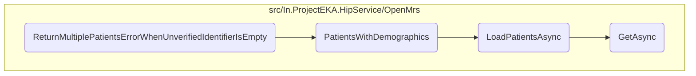

This document explains the process of handling errors when multiple patients are found without a verified identifier. It covers the steps involved in setting up the error response, preparing the patient enquiry, retrieving patients based on demographics, loading patients from an external API, and performing the actual GET request.

The flow starts by setting up the expected error response for scenarios where multiple patients are found without a verified identifier. Next, a patient enquiry object is prepared with the necessary details, which is then used to create a discovery request. The system then retrieves patients whose demographics match the specified criteria, filters out patients who already have an ABHA identifier, and matches the phone number for accurate identification. After that, it loads a list of patients from an external API endpoint by constructing query parameters and parsing the JSON response. Finally, it performs the actual GET request to the API, handling any errors and logging them appropriately.

# Flow drill down



<SwmSnippet path="/test/In.ProjectEKA.HipServiceTest/Discovery/PatientDiscoveryTest.cs" line="189">

---

## Handling Multiple Patients Error

First, the <SwmToken path="test/In.ProjectEKA.HipServiceTest/Discovery/PatientDiscoveryTest.cs" pos="186:7:7" line-data="        private async void ReturnMultiplePatientsErrorWhenUnverifiedIdentifierIsEmpty(">`ReturnMultiplePatientsErrorWhenUnverifiedIdentifierIsEmpty`</SwmToken> method sets up the expected error response for the scenario where multiple patients are found without a verified identifier. This is crucial for ensuring that the system can handle such cases gracefully and inform the user appropriately.

```c#
            var expectedError =
                new ErrorRepresentation(new Error(ErrorCode.MultiplePatientsFound, "Multiple patients found"));
```

---

</SwmSnippet>

<SwmSnippet path="/test/In.ProjectEKA.HipServiceTest/Discovery/PatientDiscoveryTest.cs" line="192">

---

Next, the method prepares a <SwmToken path="test/In.ProjectEKA.HipServiceTest/Discovery/PatientDiscoveryTest.cs" pos="192:9:9" line-data="            var patientRequest = new PatientEnquiry(consentManagerUserId,">`PatientEnquiry`</SwmToken> object with the necessary patient details, including verified and unverified identifiers. This object is used to create a <SwmToken path="test/In.ProjectEKA.HipServiceTest/Discovery/PatientDiscoveryTest.cs" pos="198:9:9" line-data="            var discoveryRequest = new DiscoveryRequest(patientRequest, Faker().Random.String(), RandomString(),">`DiscoveryRequest`</SwmToken>, which encapsulates the patient enquiry and additional request details.

```c#
            var patientRequest = new PatientEnquiry(consentManagerUserId,
                verifiedIdentifiers,
                identifiers,
                name,
                gender,
                yearOfBirth);
            var discoveryRequest = new DiscoveryRequest(patientRequest, Faker().Random.String(), RandomString(),
                DateTime.Now);
```

---

</SwmSnippet>

<SwmSnippet path="/src/In.ProjectEKA.HipService/OpenMrs/OpenMrsPatientRepository.cs" line="51">

---

Moving to the <SwmToken path="src/In.ProjectEKA.HipService/OpenMrs/OpenMrsPatientRepository.cs" pos="51:12:12" line-data="        public async Task&lt;IQueryable&lt;Patient&gt;&gt; PatientsWithDemographics(string name,">`PatientsWithDemographics`</SwmToken> method, it retrieves patients whose demographics match the specified criteria (name, gender, year of birth, and phone number). This method filters out patients who already have an ABHA identifier and matches the phone number to ensure accurate patient identification.

```c#
        public async Task<IQueryable<Patient>> PatientsWithDemographics(string name,
            AdministrativeGender? gender, string yearOfBirth, string phoneNumber)
        {
            var result = new List<Patient>();
            var fhirPatients = await _patientDal.LoadPatientsAsync(name, gender, yearOfBirth);
            foreach (var patient in fhirPatients)
            {
                if (!CheckIfPatientAlreadyHasAbhaIdentifier(patient.Identifier))
                {
                    var hipPatient = patient.ToHipPatient(name);
                    var referenceNumber = hipPatient.Uuid;
                    var bahmniPhoneNumber = _phoneNumberRepository.GetPhoneNumber(referenceNumber).Result;
                    if (bahmniPhoneNumber != null && phoneNumber[^PHONE_NUMBER_LENGTH..].Equals(bahmniPhoneNumber[^PHONE_NUMBER_LENGTH..]))
                    {
                        result.Add(hipPatient);
                    }
                }
            }
            return result.ToList().AsQueryable();
```

---

</SwmSnippet>

<SwmSnippet path="/src/In.ProjectEKA.HipService/OpenMrs/FhirDiscoveryDataSource.cs" line="42">

---

Then, the <SwmToken path="src/In.ProjectEKA.HipService/OpenMrs/FhirDiscoveryDataSource.cs" pos="42:12:12" line-data="        public async Task&lt;List&lt;Patient&gt;&gt; LoadPatientsAsync(string name, AdministrativeGender? gender, string yearOfBirth)">`LoadPatientsAsync`</SwmToken> method is called to load a list of patients from an external OpenMRS API endpoint. It constructs the query parameters based on the provided filters and parses the JSON response to extract patient resources.

```c#
        public async Task<List<Patient>> LoadPatientsAsync(string name, AdministrativeGender? gender, string yearOfBirth)
        {
            var path = DiscoveryPathConstants.OnPatientPath;
            var query = HttpUtility.ParseQueryString(string.Empty);
            if (!string.IsNullOrEmpty(name)) {
                query["name"]=name;
            }
            if (gender != null) {
                query["gender"]=gender.ToString().ToLower();
            }
            if (!string.IsNullOrEmpty(yearOfBirth)) {
                query["birthdate"]=yearOfBirth;
            }
            if (query.ToString() != ""){
                path = $"{path}?{query}";
            }

            var patients = new List<Patient>();
            var response = await openMrsClient.GetAsync(path);
            var content = await response.Content.ReadAsStringAsync();
            var bundle = new FhirJsonParser().Parse<Bundle>(content);
```

---

</SwmSnippet>

<SwmSnippet path="/src/In.ProjectEKA.HipService/OpenMrs/OpenMrsClient.cs" line="23">

---

Finally, the <SwmToken path="src/In.ProjectEKA.HipService/OpenMrs/OpenMrsClient.cs" pos="23:10:10" line-data="        public async Task&lt;HttpResponseMessage&gt; GetAsync(string openMrsUrl)">`GetAsync`</SwmToken> method performs the actual GET request to the OpenMRS API. It handles the response, logging any errors and throwing exceptions if the request fails, ensuring robust error handling and logging.

```c#
        public async Task<HttpResponseMessage> GetAsync(string openMrsUrl)
        {
            var responseMessage = await httpClient.GetAsync(Path.Join(configuration.Url, openMrsUrl));

            if (!responseMessage.IsSuccessStatusCode)
            {
                var error = await responseMessage.Content.ReadAsStringAsync();
                Log.Error(
                    $"Failure in getting the data from OpenMrs with status code {responseMessage.StatusCode}" +
                    $" {error}");
                throw new OpenMrsConnectionException();
            }

            return responseMessage;
```

---

</SwmSnippet>

&nbsp;

*This is an auto-generated document by Swimm 🌊 and has not yet been verified by a human*

<SwmMeta version="3.0.0" repo-id="Z2l0aHViJTNBJTNBaGlwLXNlcnZpY2UlM0ElM0FTd2ltbS1EZW1v" repo-name="hip-service"><sup>Powered by [Swimm](/)</sup></SwmMeta>
