This document explains the process of handling scenarios where multiple patients are found with the same unverified identifiers. This is crucial for ensuring that the system correctly identifies and handles cases where patient identifiers are not unique.

The flow starts by setting up the expected error for the scenario where multiple patients are found with the same unverified identifiers. It then proceeds to create a patient request with both verified and unverified identifiers. A discovery request is then created using this patient request. The system then checks for linked care contexts and verifies patient identifiers. If multiple patients are found with the same unverified identifiers, the system returns an error indicating that multiple patients were found.

# Flow drill down

```mermaid
graph TD;
      subgraph srcInProjectEKAHipServiceOpenMrs["src/In.ProjectEKA.HipService/OpenMrs"]
f793aeed782950ee2cae8966cd01a2510bd0dd0819e916cfe8e730198ca470c6(ShouldGetMultiplePatientsFoundErrorWhenSameUnverifiedIdentifiersAlsoMatch) --> 2a8a366e45522c8a49f4ca13c9d63369431b1ca39d06517e3103600531ed0cbd(PatientsWithDemographics)
end

subgraph srcInProjectEKAHipServiceOpenMrs["src/In.ProjectEKA.HipService/OpenMrs"]
2a8a366e45522c8a49f4ca13c9d63369431b1ca39d06517e3103600531ed0cbd(PatientsWithDemographics) --> 896fa3e096b5c04f1cbded7fd93e758bf8f36a68271f42140fa64b3a82e423be(LoadPatientsAsync)
end

subgraph srcInProjectEKAHipServiceOpenMrs["src/In.ProjectEKA.HipService/OpenMrs"]
896fa3e096b5c04f1cbded7fd93e758bf8f36a68271f42140fa64b3a82e423be(LoadPatientsAsync) --> 0b7efe7460b58469314902a29dedacaecb65b185c9e096a351b978976b82210a(GetAsync)
end


      classDef mainFlowStyle color:#000000,fill:#7CB9F4
classDef rootsStyle color:#000000,fill:#00FFF4
classDef Style1 color:#000000,fill:#00FFAA
classDef Style2 color:#000000,fill:#FFFF00
classDef Style3 color:#000000,fill:#AA7CB9
```



<SwmSnippet path="/test/In.ProjectEKA.HipServiceTest/Discovery/PatientDiscoveryTest.cs" line="228">

---

## Handling multiple patients found error

First, the method <SwmToken path="test/In.ProjectEKA.HipServiceTest/Discovery/PatientDiscoveryTest.cs" pos="229:7:7" line-data="        private async void ShouldGetMultiplePatientsFoundErrorWhenSameUnverifiedIdentifiersAlsoMatch()">`ShouldGetMultiplePatientsFoundErrorWhenSameUnverifiedIdentifiersAlsoMatch`</SwmToken> sets up the expected error for the scenario where multiple patients are found with the same unverified identifiers. This is crucial for ensuring that the system correctly identifies and handles cases where patient identifiers are not unique.

```c#
        [Fact]
        private async void ShouldGetMultiplePatientsFoundErrorWhenSameUnverifiedIdentifiersAlsoMatch()
        {
            var expectedError =
                new ErrorRepresentation(new Error(ErrorCode.MultiplePatientsFound, "Multiple patients found"));
            var patientReferenceNumber = Faker().Random.String();
            var verifiedIdentifiers = new[] {new Identifier(IdentifierType.MOBILE, phoneNumber)};
            var unverifiedIdentifiers = new[] {new Identifier(IdentifierType.MR, patientReferenceNumber)};
            var patientRequest = new PatientEnquiry(consentManagerUserId,
                verifiedIdentifiers,
                unverifiedIdentifiers,
                name,
                gender,
                yearOfBirth);
            var discoveryRequest = new DiscoveryRequest(patientRequest, Faker().Random.String(), RandomString(),
                DateTime.Now);
            linkPatientRepository.Setup(e => e.GetLinkedCareContexts(consentManagerUserId))
                .ReturnsAsync(new Tuple<IEnumerable<LinkedAccounts>, Exception>(new List<LinkedAccounts>(), null));
            patientRepository.Setup(repository => repository.PatientsWithVerifiedId(null))
                .Returns((Task<IQueryable<HipLibrary.Patient.Model.Patient>>) null);
            patientRepository.Setup(repository => repository.PatientsWithDemographics(discoveryRequest.Patient.Name,
```

---

</SwmSnippet>

&nbsp;

*This is an auto-generated document by Swimm 🌊 and has not yet been verified by a human*

<SwmMeta version="3.0.0" repo-id="Z2l0aHViJTNBJTNBaGlwLXNlcnZpY2UlM0ElM0FTd2ltbS1EZW1v" repo-name="hip-service"><sup>Powered by [Swimm](/)</sup></SwmMeta>
