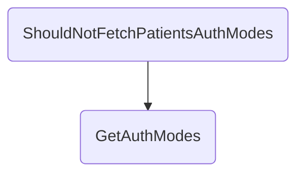

In this document, we will explain the process of handling patient authentication mode fetch requests. The process involves setting up a fetch request, sending data to the gateway, handling the gateway response, and managing gateway timeouts.

The flow starts with setting up a fetch request for patient authentication modes. This request is then sent to the gateway. The system waits for the gateway's response, and if the gateway responds with the authentication modes, they are processed and returned. If the gateway does not respond within a specified time, a timeout error is logged and returned.

# Flow drill down



<SwmSnippet path="/test/In.ProjectEKA.HipServiceTest/UserAuth/UserAuthControllerTest.cs" line="109">

---

## Validating the Fetch Request

First, the <SwmToken path="test/In.ProjectEKA.HipServiceTest/UserAuth/UserAuthControllerTest.cs" pos="107:5:5" line-data="        private void ShouldNotFetchPatientsAuthModes()">`ShouldNotFetchPatientsAuthModes`</SwmToken> method sets up a fetch request for patient authentication modes. It creates a <SwmToken path="test/In.ProjectEKA.HipServiceTest/UserAuth/UserAuthControllerTest.cs" pos="109:9:9" line-data="            var request = new FetchRequest(&quot;hina_patel@ncg&quot;, KYC_AND_LINK);">`FetchRequest`</SwmToken> object with the patient's health ID and the required authentication mode. This request is then used to create a <SwmToken path="test/In.ProjectEKA.HipServiceTest/UserAuth/UserAuthControllerTest.cs" pos="111:9:9" line-data="            var query = new FetchQuery(request.healthId, KYC_AND_LINK, requester);">`FetchQuery`</SwmToken> object, which includes the request details and the requester information.

```c#
            var request = new FetchRequest("hina_patel@ncg", KYC_AND_LINK);
            var requester = new Requester(bahmniConfiguration.Id, HIP);
            var query = new FetchQuery(request.healthId, KYC_AND_LINK, requester);
```

---

</SwmSnippet>

<SwmSnippet path="/test/In.ProjectEKA.HipServiceTest/UserAuth/UserAuthControllerTest.cs" line="115">

---

## Sending Data to the Gateway

Next, the method prepares a <SwmToken path="test/In.ProjectEKA.HipServiceTest/UserAuth/UserAuthControllerTest.cs" pos="116:3:3" line-data="                new GatewayFetchModesRequestRepresentation(requestId, timeStamp, query);">`GatewayFetchModesRequestRepresentation`</SwmToken> object, which includes the request ID, timestamp, and query details. This object is then sent to the gateway using the <SwmToken path="test/In.ProjectEKA.HipServiceTest/UserAuth/UserAuthControllerTest.cs" pos="124:3:3" line-data="                        client.SendDataToGateway(PATH_FETCH_AUTH_MODES,">`SendDataToGateway`</SwmToken> method. The method sets up the necessary configurations and sends the request to the gateway, awaiting a response.

```c#
            var gatewayFetchModesRequestRepresentation =
                new GatewayFetchModesRequestRepresentation(requestId, timeStamp, query);
            var correlationId = Uuid.Generate().ToString();

            userAuthService.Setup(a => a.FetchModeResponse(request, bahmniConfiguration))
                .Returns(new Tuple<GatewayFetchModesRequestRepresentation, ErrorRepresentation>
                    (gatewayFetchModesRequestRepresentation, null));
            gatewayClient.Setup(
                    client =>
                        client.SendDataToGateway(PATH_FETCH_AUTH_MODES,
                            gatewayFetchModesRequestRepresentation, cmSuffix, correlationId))
                .Returns(Task.FromResult(""));
```

---

</SwmSnippet>

<SwmSnippet path="/src/In.ProjectEKA.HipService/UserAuth/UserAuthController.cs" line="55">

---

## Handling the Gateway Response

Moving to the <SwmToken path="src/In.ProjectEKA.HipService/UserAuth/UserAuthController.cs" pos="57:10:10" line-data="        public async Task&lt;ActionResult&gt; GetAuthModes(">`GetAuthModes`</SwmToken> method, it handles the response from the gateway. It logs the request details and waits for the gateway to respond within a specified timeout period. If the gateway returns an error, the method logs the error and returns a `400 Bad `<SwmToken path="src/In.ProjectEKA.HipService/UserAuth/UserAuthController.cs" pos="71:2:2" line-data="                    &quot;Request for fetch-modes to gateway: {@GatewayResponse}&quot;,">`Request`</SwmToken> status. If the gateway returns the authentication modes, the method adds a <SwmToken path="src/In.ProjectEKA.HipService/UserAuth/UserAuthController.cs" pos="99:7:7" line-data="                        authModes.Add(Mode.DIRECT);">`DIRECT`</SwmToken> mode to the list and returns the modes as a JSON response.

```c#
        [Authorize(AuthenticationSchemes = BAHMNI_AUTH)]
        [Route(PATH_FETCH_MODES)]
        public async Task<ActionResult> GetAuthModes(
            [FromHeader(Name = CORRELATION_ID)] string correlationId, [FromBody] FetchRequest fetchRequest)
        {
            var (gatewayFetchModesRequestRepresentation, error) =
                userAuthService.FetchModeResponse(fetchRequest, bahmniConfiguration);
            if (error != null)
                return StatusCode(StatusCodes.Status400BadRequest, error);
            Guid requestId = gatewayFetchModesRequestRepresentation.requestId;
            var cmSuffix = gatewayConfiguration.CmSuffix;

            try
            {
                logger.Log(LogLevel.Information,
                    LogEvents.UserAuth,
                    "Request for fetch-modes to gateway: {@GatewayResponse}",
                    gatewayFetchModesRequestRepresentation.dump(gatewayFetchModesRequestRepresentation));
                logger.Log(LogLevel.Information,
                    LogEvents.UserAuth, $"cmSuffix: {{cmSuffix}}, correlationId: {{correlationId}}," +
                                        $" healthId: {{healthId}}, requestId: {{requestId}}",
```

---

</SwmSnippet>

<SwmSnippet path="/src/In.ProjectEKA.HipService/UserAuth/UserAuthController.cs" line="107">

---

## Handling Gateway Timeout

Finally, if the gateway does not respond within the timeout period, the method logs a timeout error and returns a `504 `<SwmToken path="src/In.ProjectEKA.HipService/UserAuth/UserAuthController.cs" pos="114:15:15" line-data="                new ErrorRepresentation(new Error(ErrorCode.GatewayTimedOut, &quot;Gateway timed out&quot;)));">`Gateway`</SwmToken>` `<SwmToken path="test/In.ProjectEKA.HipServiceTest/UserAuth/UserAuthControllerTest.cs" pos="278:17:17" line-data="            Error error = new Error(ErrorCode.GatewayTimedOut, &quot;Timeout Error&quot;);">`Timeout`</SwmToken> status. This ensures that the system handles cases where the gateway is unresponsive, providing appropriate feedback to the user.

```c#
            catch (Exception exception)
            {
                logger.LogError(LogEvents.UserAuth, exception, "Error happened for requestId: {RequestId} for" +
                                                               " fetch-mode request", requestId);
            }

            return StatusCode(StatusCodes.Status504GatewayTimeout,
                new ErrorRepresentation(new Error(ErrorCode.GatewayTimedOut, "Gateway timed out")));
```

---

</SwmSnippet>

&nbsp;

*This is an auto-generated document by Swimm 🌊 and has not yet been verified by a human*

<SwmMeta version="3.0.0" repo-id="Z2l0aHViJTNBJTNBaGlwLXNlcnZpY2UlM0ElM0FTd2ltbS1EZW1v" repo-name="hip-service"><sup>Powered by [Swimm](/)</sup></SwmMeta>
