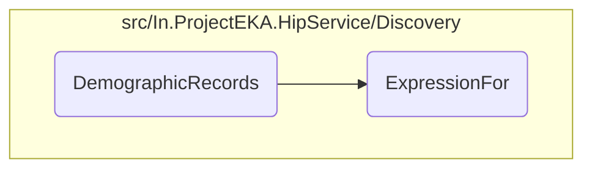

In this document, we will explain the process of handling patient demographic records. The process involves retrieving demographic records and then applying specific expressions to these records.

The flow is straightforward and involves two main steps: first, retrieving the demographic records of patients, and second, applying certain expressions to these records to extract or manipulate the required information.

Here is a high level diagram of the flow, showing only the most important functions:

# Flow drill down

&nbsp;

*This is an auto-generated document by Swimm 🌊 and has not yet been verified by a human*

<SwmMeta version="3.0.0" repo-id="Z2l0aHViJTNBJTNBaGlwLXNlcnZpY2UlM0ElM0FTd2ltbS1EZW1v" repo-name="hip-service">Powered by [Swimm](/)</SwmMeta>
