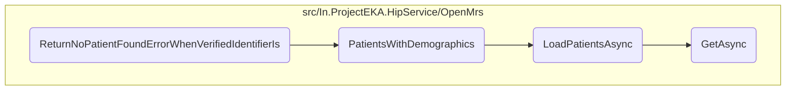

In this document, we will explain the process of handling patient discovery requests when no patient is found. The process involves setting up a patient discovery request, simulating a scenario where no patient is found, and filtering patients based on demographics.

The flow starts by setting up a patient discovery request with specific identifiers and demographics. It then simulates a scenario where no patient is found by setting up mock responses for linked care contexts and patient repository methods. Next, it retrieves patients whose demographics match the specified criteria, filters out those who already have an ABHA identifier, and matches the phone number before adding the filtered patients to the result list.

# Flow drill down



<SwmSnippet path="/test/In.ProjectEKA.HipServiceTest/Discovery/PatientDiscoveryTest.cs" line="297">

---

## Handling Patient Discovery Requests

First, the <SwmToken path="test/In.ProjectEKA.HipServiceTest/Discovery/PatientDiscoveryTest.cs" pos="299:7:7" line-data="        private async void ReturnNoPatientFoundErrorWhenVerifiedIdentifierIs(IEnumerable&lt;Identifier&gt; identifiers)">`ReturnNoPatientFoundErrorWhenVerifiedIdentifierIs`</SwmToken> method sets up a patient discovery request with specific identifiers and demographics. It simulates a scenario where no patient is found by setting up mock responses for linked care contexts and patient repository methods.

```c#
        [Theory]
        [ClassData(typeof(EmptyIdentifierTestData))]
        private async void ReturnNoPatientFoundErrorWhenVerifiedIdentifierIs(IEnumerable<Identifier> identifiers)
        {
            var expectedError = new ErrorRepresentation(new Error(ErrorCode.NoPatientFound, "No patient found"));
            var patientRequest = new PatientEnquiry(consentManagerUserId,
                identifiers,
                new List<Identifier>(),
                name,
                gender,
                yearOfBirth);
            var discoveryRequest = new DiscoveryRequest(patientRequest, Faker().Random.String(), RandomString(),
                DateTime.Now);
            linkPatientRepository.Setup(e => e.GetLinkedCareContexts(consentManagerUserId))
                .ReturnsAsync(new Tuple<IEnumerable<LinkedAccounts>, Exception>(new List<LinkedAccounts>(), null));
            patientRepository.Setup(repository => repository.PatientsWithVerifiedId(null))
                .Returns((Task<IQueryable<HipLibrary.Patient.Model.Patient>>) null);
            patientRepository.Setup(repository => repository.PatientsWithDemographics(discoveryRequest.Patient.Name,
                    discoveryRequest.Patient.Gender.ToOpenMrsGender(),
                    discoveryRequest.Patient.YearOfBirth.ToString(), phoneNumber))
                .Returns(Task.FromResult(new List<HipLibrary.Patient.Model.Patient>
```

---

</SwmSnippet>

<SwmSnippet path="/src/In.ProjectEKA.HipService/OpenMrs/OpenMrsPatientRepository.cs" line="51">

---

## Filtering Patients Based on Demographics

Next, the <SwmToken path="src/In.ProjectEKA.HipService/OpenMrs/OpenMrsPatientRepository.cs" pos="51:12:12" line-data="        public async Task&lt;IQueryable&lt;Patient&gt;&gt; PatientsWithDemographics(string name,">`PatientsWithDemographics`</SwmToken> method retrieves patients whose demographics match the specified criteria (name, gender, year of birth, and phone number). It first loads patients asynchronously, then filters out those who already have an ABHA identifier, and finally matches the phone number before adding the filtered patients to the result list.

```c#
        public async Task<IQueryable<Patient>> PatientsWithDemographics(string name,
            AdministrativeGender? gender, string yearOfBirth, string phoneNumber)
        {
            var result = new List<Patient>();
            var fhirPatients = await _patientDal.LoadPatientsAsync(name, gender, yearOfBirth);
            foreach (var patient in fhirPatients)
            {
                if (!CheckIfPatientAlreadyHasAbhaIdentifier(patient.Identifier))
                {
                    var hipPatient = patient.ToHipPatient(name);
                    var referenceNumber = hipPatient.Uuid;
                    var bahmniPhoneNumber = _phoneNumberRepository.GetPhoneNumber(referenceNumber).Result;
                    if (bahmniPhoneNumber != null && phoneNumber[^PHONE_NUMBER_LENGTH..].Equals(bahmniPhoneNumber[^PHONE_NUMBER_LENGTH..]))
                    {
                        result.Add(hipPatient);
                    }
                }
            }
            return result.ToList().AsQueryable();
        }
```

---

</SwmSnippet>

&nbsp;

*This is an auto-generated document by Swimm 🌊 and has not yet been verified by a human*

<SwmMeta version="3.0.0" repo-id="Z2l0aHViJTNBJTNBaGlwLXNlcnZpY2UlM0ElM0FTd2ltbS1EZW1v" repo-name="hip-service"><sup>Powered by [Swimm](/)</sup></SwmMeta>
