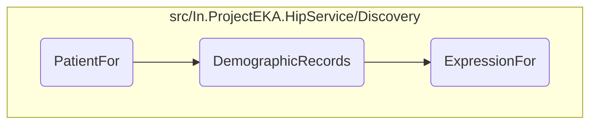

In this document, we will explain the process of handling patient discovery requests. The process involves checking for existing discovery requests, retrieving linked care contexts, searching for patients using health ID or demographics, and filtering the patients based on the provided information.

The flow starts by checking if a discovery request already exists for the given transaction ID. If it does, an error is logged, and a duplicate discovery request error is returned. If not, the system retrieves linked care contexts for the patient. If linked care contexts are found, the patient information is retrieved, and a discovery representation is returned. If no linked care contexts are found, the system searches for patients using the health ID or demographics and retrieves care contexts for the found patients. Finally, the patients are filtered based on health ID or demographics, and a discovery representation is returned if a matching patient is found.

# Flow drill down



<SwmSnippet path="/src/In.ProjectEKA.HipService/Discovery/PatientDiscovery.cs" line="51">

---

## Handling Patient Discovery Requests

First, the <SwmToken path="src/In.ProjectEKA.HipService/Discovery/PatientDiscovery.cs" pos="51:17:17" line-data="        public virtual async Task&lt;ValueTuple&lt;DiscoveryRepresentation, ErrorRepresentation&gt;&gt; PatientFor(">`PatientFor`</SwmToken> method handles patient discovery requests. It checks if a discovery request already exists for the given transaction ID. If it does, it logs an error and returns a duplicate discovery request error. If not, it retrieves linked care contexts for the patient and checks if any linked care contexts exist. If linked care contexts are found, it retrieves the patient information and returns a discovery representation. If no linked care contexts are found, it searches for patients using the health ID or demographics and retrieves care contexts for the found patients. Finally, it filters the patients based on health ID or demographics and returns a discovery representation if a matching patient is found.

```c#
        public virtual async Task<ValueTuple<DiscoveryRepresentation, ErrorRepresentation>> PatientFor(
            DiscoveryRequest request)
        {
            if (await AlreadyExists(request.TransactionId))
            {
                logger.Log(LogLevel.Error, LogEvents.Discovery,
                    "Discovery Request already exists for {request.TransactionId}.");
                return (null,
                    new ErrorRepresentation(new Error(ErrorCode.DuplicateDiscoveryRequest,
                        "Discovery Request already exists")));
            }

            var (linkedAccounts, exception) = await linkPatientRepository.GetLinkedCareContexts(request.Patient.Id);

            if (exception != null)
            {
                logger.Log(LogLevel.Critical, LogEvents.Discovery, exception, "Failed to get care contexts");
                return (null,
                    new ErrorRepresentation(new Error(ErrorCode.FailedToGetLinkedCareContexts,
                        "Failed to get Linked Care Contexts")));
            }
```

---

</SwmSnippet>

<SwmSnippet path="/src/In.ProjectEKA.HipService/Discovery/Filter.cs" line="58">

---

## Filtering Demographic Records

Next, the <SwmToken path="src/In.ProjectEKA.HipService/Discovery/Filter.cs" pos="58:10:10" line-data="        public static IEnumerable&lt;PatientEnquiryRepresentation&gt; DemographicRecords(IEnumerable&lt;Patient&gt; patients, DiscoveryRequest request)">`DemographicRecords`</SwmToken> method filters the list of patients based on the demographic information provided in the discovery request. It uses the <SwmToken path="src/In.ProjectEKA.HipService/Discovery/Filter.cs" pos="62:4:4" line-data="                .Where(ExpressionFor(request.Patient.Name, request.Patient.YearOfBirth, request.Patient.Gender))">`ExpressionFor`</SwmToken> method to create a filter expression and ranks the patients based on the match score. The method then groups the patients by their rank score, selects the top-ranked group, and creates a list of <SwmToken path="src/In.ProjectEKA.HipService/Discovery/Filter.cs" pos="58:7:7" line-data="        public static IEnumerable&lt;PatientEnquiryRepresentation&gt; DemographicRecords(IEnumerable&lt;Patient&gt; patients, DiscoveryRequest request)">`PatientEnquiryRepresentation`</SwmToken> objects for the matched patients.

```c#
        public static IEnumerable<PatientEnquiryRepresentation> DemographicRecords(IEnumerable<Patient> patients, DiscoveryRequest request)
        {
            var temp = patients
                .AsEnumerable()
                .Where(ExpressionFor(request.Patient.Name, request.Patient.YearOfBirth, request.Patient.Gender))
                .Select(patientInfo => RankPatient(patientInfo, request))
                .GroupBy(rankedPatient => rankedPatient.Rank.Score)
                .OrderByDescending(rankedPatient => rankedPatient.Key)
                .Take(1)
                .SelectMany(group => group.Select(rankedPatient =>
                {
                    var careContexts = rankedPatient.Patient.CareContexts ?? new List<CareContextRepresentation>();

                    var careContextRepresentations = careContexts
                        .Select(program =>
                            new CareContextRepresentation(
                                program.ReferenceNumber,
                                program.Display))
                        .ToList();

                    Log.Information("rankedPatient.Patient.Identifier ~~~~~~~~~~~~~~~~~~~~> " + rankedPatient.Patient.Identifier);
```

---

</SwmSnippet>

<SwmSnippet path="/src/In.ProjectEKA.HipService/Discovery/Matcher/DemographicMatcher.cs" line="16">

---

## Creating Filter Expression

Then, the <SwmToken path="src/In.ProjectEKA.HipService/Discovery/Matcher/DemographicMatcher.cs" pos="16:13:13" line-data="        public static Func&lt;Patient, bool&gt; ExpressionFor(string name, ushort? yearOfBirth, Gender? gender)">`ExpressionFor`</SwmToken> method creates a filter expression based on the patient's name, year of birth, and gender. If both year of birth and gender are null, it returns a false expression. Otherwise, it combines the gender, name, and age expressions into a single filter expression and compiles it.

```c#
        public static Func<Patient, bool> ExpressionFor(string name, ushort? yearOfBirth, Gender? gender)
        {
            if (yearOfBirth == null && gender == null)
            {
                return _ => false;
            }
            return GenderExpression(gender).And(NameExpression(name)).And(AgeExpression(yearOfBirth)).Compile();
        }
```

---

</SwmSnippet>

&nbsp;

*This is an auto-generated document by Swimm 🌊 and has not yet been verified by a human*

<SwmMeta version="3.0.0" repo-id="Z2l0aHViJTNBJTNBaGlwLXNlcnZpY2UlM0ElM0FTd2ltbS1EZW1v" repo-name="hip-service"><sup>Powered by [Swimm](/)</sup></SwmMeta>
