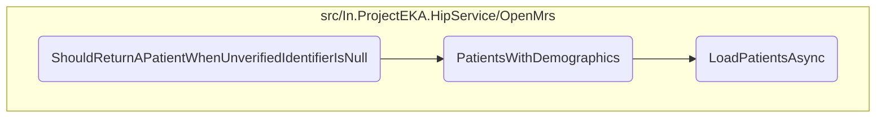

In this document, we will explain the process of handling a patient discovery request when the unverified identifier is null. The process involves setting up the test environment, configuring mock repositories, retrieving patients based on demographics, and verifying the discovery response.

The flow starts by setting up the test environment with care context representations and an expected patient object. A discovery request is built with unverified identifiers set to null and a specific year of birth. Mock repositories are then configured to return specific data, ensuring the test focuses on patients with matching demographics. The <SwmToken path="src/In.ProjectEKA.HipService/OpenMrs/OpenMrsPatientRepository.cs" pos="51:12:12" line-data="        public async Task&lt;IQueryable&lt;Patient&gt;&gt; PatientsWithDemographics(string name,">`PatientsWithDemographics`</SwmToken> method is called to retrieve patients based on the provided demographics, filtering out those with an ABHA identifier and matching the phone number. Finally, the test verifies that the discovery response matches the expected patient and that the discovery request repository was updated correctly.

# Flow drill down



<SwmSnippet path="/test/In.ProjectEKA.HipServiceTest/Discovery/PatientDiscoveryTest.cs" line="136">

---

## <SwmToken path="test/In.ProjectEKA.HipServiceTest/Discovery/PatientDiscoveryTest.cs" pos="137:7:7" line-data="        private async void ShouldReturnAPatientWhenUnverifiedIdentifierIsNull()">`ShouldReturnAPatientWhenUnverifiedIdentifierIsNull`</SwmToken>

First, the <SwmToken path="test/In.ProjectEKA.HipServiceTest/Discovery/PatientDiscoveryTest.cs" pos="137:7:7" line-data="        private async void ShouldReturnAPatientWhenUnverifiedIdentifierIsNull()">`ShouldReturnAPatientWhenUnverifiedIdentifierIsNull`</SwmToken> method sets up the test environment by creating care context representations and an expected patient object. It then builds a discovery request with unverified identifiers set to null and a specific year of birth. This setup is crucial for simulating the scenario where a patient is searched without verified identifiers.

```c#
        [Fact]
        private async void ShouldReturnAPatientWhenUnverifiedIdentifierIsNull()
        {
            var careContextRepresentations = new[]
            {
                new CareContextRepresentation(Faker().Random.String(), Faker().Random.String()),
                new CareContextRepresentation(Faker().Random.String(), Faker().Random.String())
            };
            var expectedPatient = BuildExpectedPatientByExpectedMatchTypes(careContextRepresentations.ToList(),
                Match.Mobile,
                Match.Name,
                Match.Gender);
            var discoveryRequest = discoveryRequestBuilder.WithUnverifiedIdentifiers(null).WithPatientYearOfBirth(2019)
                .Build();
```

---

</SwmSnippet>

<SwmSnippet path="/test/In.ProjectEKA.HipServiceTest/Discovery/PatientDiscoveryTest.cs" line="150">

---

Next, the method configures the mock repositories to return specific data when called. For instance, it sets up the care context repository to return the created care context representations and the patient repository to return null for patients with verified IDs. This ensures that the test focuses on patients with demographics matching the discovery request.

```c#
            SetupLinkRepositoryWithLinkedPatient();
            SetupMatchingRepositoryForDiscoveryRequest(discoveryRequest);

            careContextRepository.Setup(e => e.GetCareContexts(openMrsPatientReferenceNumber))
                .Returns(
                    Task.FromResult(new List<CareContextRepresentation>(careContextRepresentations).AsEnumerable()));
            patientRepository.Setup(repository => repository.PatientsWithVerifiedId(null))
                .Returns((Task<IQueryable<HipLibrary.Patient.Model.Patient>>) null);
```

---

</SwmSnippet>

<SwmSnippet path="/src/In.ProjectEKA.HipService/OpenMrs/OpenMrsPatientRepository.cs" line="51">

---

Then, the method calls the <SwmToken path="src/In.ProjectEKA.HipService/OpenMrs/OpenMrsPatientRepository.cs" pos="51:12:12" line-data="        public async Task&lt;IQueryable&lt;Patient&gt;&gt; PatientsWithDemographics(string name,">`PatientsWithDemographics`</SwmToken> method to retrieve patients based on the provided demographics. This method first loads patients asynchronously using the <SwmToken path="src/In.ProjectEKA.HipService/OpenMrs/OpenMrsPatientRepository.cs" pos="55:11:11" line-data="            var fhirPatients = await _patientDal.LoadPatientsAsync(name, gender, yearOfBirth);">`LoadPatientsAsync`</SwmToken> method, which performs a GET request to an external API and parses the response to extract patient data.

```c#
        public async Task<IQueryable<Patient>> PatientsWithDemographics(string name,
            AdministrativeGender? gender, string yearOfBirth, string phoneNumber)
        {
            var result = new List<Patient>();
            var fhirPatients = await _patientDal.LoadPatientsAsync(name, gender, yearOfBirth);
```

---

</SwmSnippet>

<SwmSnippet path="/src/In.ProjectEKA.HipService/OpenMrs/OpenMrsPatientRepository.cs" line="56">

---

Moving to the <SwmToken path="src/In.ProjectEKA.HipService/OpenMrs/OpenMrsPatientRepository.cs" pos="51:12:12" line-data="        public async Task&lt;IQueryable&lt;Patient&gt;&gt; PatientsWithDemographics(string name,">`PatientsWithDemographics`</SwmToken> method, it filters the loaded patients to exclude those who already have an ABHA identifier. It then matches the phone number and adds the filtered patients to the result list. This step ensures that only relevant patients are considered for the discovery response.

```c#
            foreach (var patient in fhirPatients)
            {
                if (!CheckIfPatientAlreadyHasAbhaIdentifier(patient.Identifier))
                {
                    var hipPatient = patient.ToHipPatient(name);
                    var referenceNumber = hipPatient.Uuid;
                    var bahmniPhoneNumber = _phoneNumberRepository.GetPhoneNumber(referenceNumber).Result;
                    if (bahmniPhoneNumber != null && phoneNumber[^PHONE_NUMBER_LENGTH..].Equals(bahmniPhoneNumber[^PHONE_NUMBER_LENGTH..]))
                    {
                        result.Add(hipPatient);
                    }
                }
            }
            return result.ToList().AsQueryable();
```

---

</SwmSnippet>

<SwmSnippet path="/test/In.ProjectEKA.HipServiceTest/Discovery/PatientDiscoveryTest.cs" line="174">

---

Finally, the test method verifies that the discovery response matches the expected patient and that the discovery request repository was updated correctly. This ensures that the system behaves as expected when an unverified identifier is null, providing accurate patient data based on demographics.

```c#
            var (discoveryResponse, error) = await patientDiscovery.PatientFor(discoveryRequest);

            discoveryResponse.Patient.Should().BeEquivalentTo(expectedPatient);
            discoveryRequestRepository.Verify(
                x => x.Add(It.Is<HipService.Discovery.Model.DiscoveryRequest>(
                    r => r.TransactionId == transactionId && r.ConsentManagerUserId == consentManagerUserId)),
                Times.Once);
            error.Should().BeNull();
        }
```

---

</SwmSnippet>

&nbsp;

*This is an auto-generated document by Swimm 🌊 and has not yet been verified by a human*

<SwmMeta version="3.0.0" repo-id="Z2l0aHViJTNBJTNBaGlwLXNlcnZpY2UlM0ElM0FTd2ltbS1EZW1v" repo-name="hip-service"><sup>Powered by [Swimm](/)</sup></SwmMeta>
