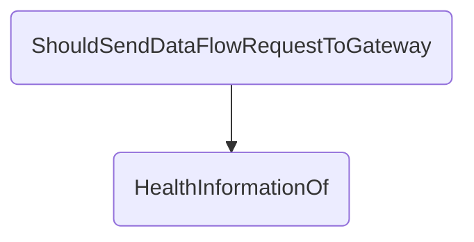

In this document, we will explain the process of handling patient health information requests and sending them to the gateway. The process involves setting up the necessary data, creating request objects, processing the request, and sending the response to the gateway.

The flow starts by setting up the necessary data for the request, including generating IDs and creating request objects. Then, the request is processed, and based on the outcome, a response is created. Finally, the response is sent to the gateway to complete the process.

# Flow drill down



<SwmSnippet path="/test/In.ProjectEKA.HipServiceTest/DataFlow/PatientDataFlowControllerTest.cs" line="76">

---

## Handling Patient Health Information Requests

First, the <SwmToken path="test/In.ProjectEKA.HipServiceTest/DataFlow/PatientDataFlowControllerTest.cs" pos="74:7:7" line-data="        private async void ShouldSendDataFlowRequestToGateway()">`ShouldSendDataFlowRequestToGateway`</SwmToken> function sets up the necessary data for the test, including generating random strings for <SwmToken path="test/In.ProjectEKA.HipServiceTest/DataFlow/PatientDataFlowControllerTest.cs" pos="76:3:3" line-data="            var gatewayId = TestBuilder.Faker().Random.String();">`gatewayId`</SwmToken>, <SwmToken path="test/In.ProjectEKA.HipServiceTest/DataFlow/PatientDataFlowControllerTest.cs" pos="77:3:3" line-data="            var transactionId = TestBuilder.Faker().Random.Hash();">`transactionId`</SwmToken>, and <SwmToken path="test/In.ProjectEKA.HipServiceTest/DataFlow/PatientDataFlowControllerTest.cs" pos="78:3:3" line-data="            var requestId = TestBuilder.Faker().Random.Hash();">`requestId`</SwmToken>, and creating a <SwmToken path="test/In.ProjectEKA.HipServiceTest/DataFlow/PatientDataFlowControllerTest.cs" pos="79:3:3" line-data="            var healthInformationRequest = TestBuilder.HealthInformationRequest(transactionId);">`healthInformationRequest`</SwmToken> object. This setup is crucial for simulating a real-world scenario where patient health information requests are made.

```c#
            var gatewayId = TestBuilder.Faker().Random.String();
            var transactionId = TestBuilder.Faker().Random.Hash();
            var requestId = TestBuilder.Faker().Random.Hash();
            var healthInformationRequest = TestBuilder.HealthInformationRequest(transactionId);
```

---

</SwmSnippet>

<SwmSnippet path="/test/In.ProjectEKA.HipServiceTest/DataFlow/PatientDataFlowControllerTest.cs" line="80">

---

Next, the function creates an <SwmToken path="test/In.ProjectEKA.HipServiceTest/DataFlow/PatientDataFlowControllerTest.cs" pos="80:9:9" line-data="            var hiRequest = new HIRequest(healthInformationRequest.Consent,">`HIRequest`</SwmToken> object using the <SwmToken path="test/In.ProjectEKA.HipServiceTest/DataFlow/PatientDataFlowControllerTest.cs" pos="80:11:11" line-data="            var hiRequest = new HIRequest(healthInformationRequest.Consent,">`healthInformationRequest`</SwmToken> data. This object encapsulates the consent, date range, data push URL, and key material required for the health information request.

```c#
            var hiRequest = new HIRequest(healthInformationRequest.Consent,
                healthInformationRequest.DateRange,
                healthInformationRequest.DataPushUrl,
                healthInformationRequest.KeyMaterial);
```

---

</SwmSnippet>

<SwmSnippet path="/test/In.ProjectEKA.HipServiceTest/DataFlow/PatientDataFlowControllerTest.cs" line="84">

---

Then, a <SwmToken path="test/In.ProjectEKA.HipServiceTest/DataFlow/PatientDataFlowControllerTest.cs" pos="84:9:9" line-data="            var request = new PatientHealthInformationRequest(transactionId, requestId, It.IsAny&lt;DateTime&gt;(), hiRequest);">`PatientHealthInformationRequest`</SwmToken> object is created, which includes the transaction ID, request ID, and the <SwmToken path="test/In.ProjectEKA.HipServiceTest/DataFlow/PatientDataFlowControllerTest.cs" pos="80:9:9" line-data="            var hiRequest = new HIRequest(healthInformationRequest.Consent,">`HIRequest`</SwmToken> object. This object represents the complete request for patient health information.

```c#
            var request = new PatientHealthInformationRequest(transactionId, requestId, It.IsAny<DateTime>(), hiRequest);
```

---

</SwmSnippet>

<SwmSnippet path="/src/In.ProjectEKA.HipService/DataFlow/DataFlowController.cs" line="103">

---

Moving to the <SwmToken path="test/In.ProjectEKA.HipServiceTest/DataFlow/PatientDataFlowControllerTest.cs" pos="67:21:21" line-data="                It.Is&lt;Job&gt;(job =&gt; job.Method.Name == &quot;HealthInformationOf&quot; &amp;&amp; job.Args[0] == request),">`HealthInformationOf`</SwmToken> function, it first extracts the <SwmToken path="test/In.ProjectEKA.HipServiceTest/DataFlow/PatientDataFlowControllerTest.cs" pos="80:9:9" line-data="            var hiRequest = new HIRequest(healthInformationRequest.Consent,">`HIRequest`</SwmToken> from the <SwmToken path="src/In.ProjectEKA.HipService/DataFlow/DataFlowController.cs" pos="103:7:7" line-data="                var hiRequest = healthInformationRequest.HiRequest;">`healthInformationRequest`</SwmToken> object and creates a new <SwmToken path="src/In.ProjectEKA.HipService/DataFlow/DataFlowController.cs" pos="104:9:9" line-data="                var request = new HealthInformationRequest(healthInformationRequest.TransactionId,">`HealthInformationRequest`</SwmToken> object. This step is essential for preparing the request data to be processed.

```c#
                var hiRequest = healthInformationRequest.HiRequest;
                var request = new HealthInformationRequest(healthInformationRequest.TransactionId,
                    hiRequest.Consent,
                    hiRequest.DateRange,
                    hiRequest.DataPushUrl,
                    hiRequest.KeyMaterial);
```

---

</SwmSnippet>

<SwmSnippet path="/src/In.ProjectEKA.HipService/DataFlow/DataFlowController.cs" line="109">

---

Next, the function calls <SwmToken path="src/In.ProjectEKA.HipService/DataFlow/DataFlowController.cs" pos="109:14:16" line-data="                var (_, error) = await dataFlow.HealthInformationRequestFor(request, gatewayId, correlationId);">`dataFlow.HealthInformationRequestFor`</SwmToken> to process the request and obtain a response. If an error occurs during this process, it creates a <SwmToken path="src/In.ProjectEKA.HipService/DataFlow/DataFlowController.cs" pos="110:1:1" line-data="                GatewayDataFlowRequestResponse gatewayResponse;">`GatewayDataFlowRequestResponse`</SwmToken> object with an error status and logs the error.

```c#
                var (_, error) = await dataFlow.HealthInformationRequestFor(request, gatewayId, correlationId);
                GatewayDataFlowRequestResponse gatewayResponse;

                if (error != null)
                {
                    gatewayResponse = new GatewayDataFlowRequestResponse(
                        Guid.NewGuid(),
                        DateTime.Now.ToUniversalTime().ToString(DateTimeFormat),
                        new DataFlowRequestResponse(healthInformationRequest.TransactionId,
                            DataFlowRequestStatus.ERRORED.ToString()),
                        error.Error,
                        new Resp(healthInformationRequest.RequestId));
                    logger.Log(LogLevel.Error,
                        LogEvents.DataFlow,
                        "Response for data request {@GatewayResponse}",
                        gatewayResponse);
                }
```

---

</SwmSnippet>

<SwmSnippet path="/src/In.ProjectEKA.HipService/DataFlow/DataFlowController.cs" line="126">

---

If no error occurs, the function creates a <SwmToken path="src/In.ProjectEKA.HipService/DataFlow/DataFlowController.cs" pos="128:7:7" line-data="                    gatewayResponse = new GatewayDataFlowRequestResponse(">`GatewayDataFlowRequestResponse`</SwmToken> object with an acknowledged status and logs the successful response. This step ensures that the gateway receives the correct status of the health information request.

```c#
                else
                {
                    gatewayResponse = new GatewayDataFlowRequestResponse(
                        Guid.NewGuid(),
                        DateTime.Now.ToUniversalTime().ToString(DateTimeFormat),
                        new DataFlowRequestResponse(healthInformationRequest.TransactionId,
                            DataFlowRequestStatus.ACKNOWLEDGED.ToString()),
                        null,
                        new Resp(healthInformationRequest.RequestId));
                    logger.Log(LogLevel.Information,
                        LogEvents.DataFlow,
                        "Response for data request {@GatewayResponse}",
                        gatewayResponse);
                }
```

---

</SwmSnippet>

<SwmSnippet path="/src/In.ProjectEKA.HipService/DataFlow/DataFlowController.cs" line="141">

---

Finally, the function sends the <SwmToken path="src/In.ProjectEKA.HipService/DataFlow/DataFlowController.cs" pos="110:1:1" line-data="                GatewayDataFlowRequestResponse gatewayResponse;">`GatewayDataFlowRequestResponse`</SwmToken> to the gateway using <SwmToken path="src/In.ProjectEKA.HipService/DataFlow/DataFlowController.cs" pos="141:3:5" line-data="                await gatewayClient.SendDataToGateway(PATH_HEALTH_INFORMATION_ON_REQUEST,">`gatewayClient.SendDataToGateway`</SwmToken>. This step completes the process by communicating the result of the health information request to the gateway.

```c#
                await gatewayClient.SendDataToGateway(PATH_HEALTH_INFORMATION_ON_REQUEST,
                    gatewayResponse,
                    gatewayConfiguration.CmSuffix, correlationId);
```

---

</SwmSnippet>

&nbsp;

*This is an auto-generated document by Swimm 🌊 and has not yet been verified by a human*

<SwmMeta version="3.0.0" repo-id="Z2l0aHViJTNBJTNBaGlwLXNlcnZpY2UlM0ElM0FTd2ltbS1EZW1v" repo-name="hip-service"><sup>Powered by [Swimm](/)</sup></SwmMeta>
