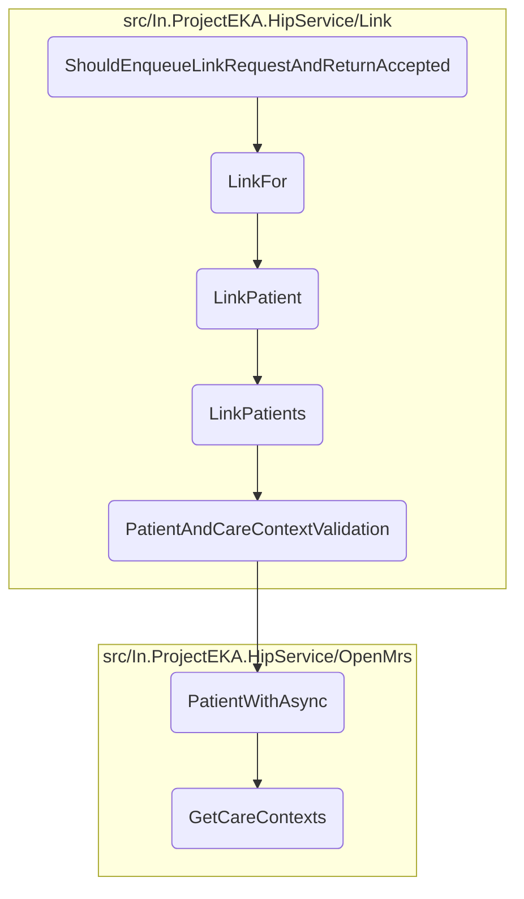

In this document, we will explain the process of handling link requests for patients. The process involves several steps to ensure that the link request is properly enqueued, validated, and processed.

The flow starts with enqueuing a link request, which is then handled asynchronously. The system validates the patient and care context information, retrieves necessary patient details, and processes the link request. If everything is correct, the patient is linked successfully, and any errors are logged and handled appropriately.

# Flow drill down



<SwmSnippet path="/test/In.ProjectEKA.HipServiceTest/Link/LinkControllerTest.cs" line="40">

---

## Enqueuing the Link Request

First, the <SwmToken path="test/In.ProjectEKA.HipServiceTest/Link/LinkControllerTest.cs" pos="41:5:5" line-data="        private void ShouldEnqueueLinkRequestAndReturnAccepted()">`ShouldEnqueueLinkRequestAndReturnAccepted`</SwmToken> method sets up a test scenario where a link request is created and enqueued. This method ensures that the link request is properly enqueued and returns an accepted status. It verifies that the background job for linking the patient is created and that the response status is 202 Accepted.

```c#
        [Fact]
        private void ShouldEnqueueLinkRequestAndReturnAccepted()
        {
            var faker = Faker();
            const string programRefNo = "129";
            const string patientReference = "4";
            var id = faker.Random.Hash();
            var transactionId = faker.Random.Hash();
            var correlationId = Uuid.Generate().ToString();
            var linkRequest = new LinkReferenceRequest(
                transactionId,
                new PatientLinkReference(
                    id,
                    patientReference,
                    new[] {new CareContextEnquiry(programRefNo)}),
                faker.Random.Hash());

            discoveryRequestRepository.Setup(x => x.RequestExistsFor(linkRequest.TransactionId,
                id,
                linkRequest.Patient.ReferenceNumber))
                .ReturnsAsync(true);
```

---

</SwmSnippet>

<SwmSnippet path="/src/In.ProjectEKA.HipService/Link/LinkController.cs" line="41">

---

## Handling the Link Request

Moving to the <SwmToken path="src/In.ProjectEKA.HipService/Link/LinkController.cs" pos="43:5:5" line-data="        public AcceptedResult LinkFor(">`LinkFor`</SwmToken> method, it handles POST requests for initializing patient linking. This method enqueues a background job for linking patients and immediately responds with a status of 202 Accepted. This ensures that the linking process is handled asynchronously, allowing the system to respond quickly to the initial request.

```c#
        [HttpPost(PATH_LINKS_LINK_INIT)]
        [ProducesResponseType(StatusCodes.Status202Accepted)]
        public AcceptedResult LinkFor(
            [FromHeader(Name = CORRELATION_ID)] string correlationId,
            [FromBody] LinkReferenceRequest request)
        {
            backgroundJob.Enqueue(() => LinkPatient(request, correlationId));
            return Accepted();
        }
```

---

</SwmSnippet>

<SwmSnippet path="/src/In.ProjectEKA.HipService/Link/LinkController.cs" line="73">

---

## Linking the Patient

Next, the <SwmToken path="src/In.ProjectEKA.HipService/Link/LinkController.cs" pos="74:7:7" line-data="        public async Task LinkPatient(LinkReferenceRequest request, string correlationId)">`LinkPatient`</SwmToken> method is an asynchronous method that links patients by checking if the request exists, creating a patient link inquiry, sending the inquiry, and handling the response. It logs errors if present and sends the final linked patient representation to the gateway. This method ensures that the patient linking process is completed and any errors are properly logged and handled.

```c#
        [NonAction]
        public async Task LinkPatient(LinkReferenceRequest request, string correlationId)
        {
            var cmUserId = request.Patient.Id;
            var cmSuffix = cmUserId.Substring(cmUserId.LastIndexOf("@", StringComparison.Ordinal) + 1);
            var patient = new LinkEnquiry(
                cmSuffix,
                cmUserId,
                request.Patient.ReferenceNumber,
                request.Patient.CareContexts);
            try
            {
                var doesRequestExists = await discoveryRequestRepository.RequestExistsFor(
                    request.TransactionId,
                    request.Patient?.Id,
                    request.Patient?.ReferenceNumber);

                ErrorRepresentation errorRepresentation = null;
                if (!doesRequestExists)
                {
                    errorRepresentation = new ErrorRepresentation(
```

---

</SwmSnippet>

<SwmSnippet path="/src/In.ProjectEKA.HipService/Link/LinkPatient.cs" line="52">

---

## Validating Patient and Care Context

Then, the <SwmToken path="src/In.ProjectEKA.HipService/Link/LinkPatient.cs" pos="52:17:17" line-data="        public virtual async Task&lt;ValueTuple&lt;PatientLinkEnquiryRepresentation, ErrorRepresentation&gt;&gt; LinkPatients(">`LinkPatients`</SwmToken> method validates the patient and care context, generates a link reference number, initiates the link request, saves it, sends an OTP for patient verification, and cleans up the discovery request repository. Finally, it forms the link reference response. This method ensures that the patient and care context are valid and that the linking process is properly initiated and verified.

```c#
        public virtual async Task<ValueTuple<PatientLinkEnquiryRepresentation, ErrorRepresentation>> LinkPatients(
            PatientLinkEnquiry request)
        {
            var (patient, error) = await PatientAndCareContextValidation(request);
            if (error != null)
            {
                Log.Error(error.Error.Message);
                return (null, error);
            }

            var linkRefNumber = referenceNumberGenerator.NewGuid();
            using (var scope = new TransactionScope(TransactionScopeAsyncFlowOption.Enabled))
            {
                if (!await SaveInitiatedLinkRequest(request.RequestId, request.TransactionId, linkRefNumber)
                    .ConfigureAwait(false))
                    return (null,
                        new ErrorRepresentation(new Error(ErrorCode.DuplicateRequestId, ErrorMessage.DuplicateRequestId))
                        );

                var careContextReferenceNumbers = request.Patient.CareContexts
                    .Select(context => context.ReferenceNumber)
```

---

</SwmSnippet>

<SwmSnippet path="/src/In.ProjectEKA.HipService/Link/LinkPatient.cs" line="110">

---

## Retrieving Patient Information

Diving into the <SwmToken path="src/In.ProjectEKA.HipService/Link/LinkPatient.cs" pos="110:21:21" line-data="        private async Task&lt;ValueTuple&lt;HipLibrary.Patient.Model.Patient, ErrorRepresentation&gt;&gt; PatientAndCareContextValidation(">`PatientAndCareContextValidation`</SwmToken> method, it validates the patient and their care contexts. It first retrieves patient information based on the patient reference number and then checks if the provided care contexts match the ones stored for the patient. If there is any care context mismatch or if the patient is not found, appropriate error representations are returned. This method ensures that the patient and care context information is accurate and consistent.

```c#
        private async Task<ValueTuple<HipLibrary.Patient.Model.Patient, ErrorRepresentation>> PatientAndCareContextValidation(
            PatientLinkEnquiry request)
        {
            var patient = await patientRepository.PatientWithAsync(request.Patient.ReferenceNumber);
            return patient.Map(patient =>
                    {
                        var programs = request.Patient.CareContexts
                            .Where(careContext =>
                                patient.CareContexts.Any(c => c.ReferenceNumber == careContext.ReferenceNumber))
                            .Select(context => new CareContextRepresentation(context.ReferenceNumber,
                                patient.CareContexts.First(info => info.ReferenceNumber == context.ReferenceNumber)
                                    .Display)).ToList();
                        if (programs.Count != request.Patient.CareContexts.Count())
                            return (null, new ErrorRepresentation(new Error(ErrorCode.CareContextNotFound,
                                ErrorMessage.CareContextNotFound)));

                        return (patient, (ErrorRepresentation) null);
                    })
                .ValueOr((null,
                    new ErrorRepresentation(new Error(ErrorCode.NoPatientFound, ErrorMessage.NoPatientFound))));
        }
```

---

</SwmSnippet>

<SwmSnippet path="/src/In.ProjectEKA.HipService/OpenMrs/OpenMrsPatientRepository.cs" line="29">

---

## Retrieving Patient Details

Next, the <SwmToken path="src/In.ProjectEKA.HipService/OpenMrs/OpenMrsPatientRepository.cs" pos="29:12:12" line-data="        public async Task&lt;Option&lt;Patient&gt;&gt; PatientWithAsync(string patientIdentifier)">`PatientWithAsync`</SwmToken> method retrieves a patient's information using their identifier, processes the information including care contexts and phone number, and returns an optional Patient object. This method ensures that the patient's details are accurately retrieved and processed.

```c#
        public async Task<Option<Patient>> PatientWithAsync(string patientIdentifier)
        {
            var fhirPatient = await _patientDal.LoadPatientAsyncWithIdentifier(patientIdentifier);
            var firstName = fhirPatient.Name[0].GivenElement.FirstOrDefault().ToString();
            var hipPatient = fhirPatient.ToHipPatient(firstName);
            var referenceNumber = hipPatient.Uuid;
            hipPatient.CareContexts = await _careContextRepository.GetCareContexts(referenceNumber);
            hipPatient.PhoneNumber = await _phoneNumberRepository.GetPhoneNumber(referenceNumber);

            return Option.Some(hipPatient);
        }
```

---

</SwmSnippet>

<SwmSnippet path="/src/In.ProjectEKA.HipService/OpenMrs/OpenMrsCareContextRepository.cs" line="19">

---

## Retrieving Care Contexts

Finally, the <SwmToken path="src/In.ProjectEKA.HipService/OpenMrs/OpenMrsCareContextRepository.cs" pos="19:12:12" line-data="        public async Task&lt;IEnumerable&lt;CareContextRepresentation&gt;&gt; GetCareContexts(string patientUuid)">`GetCareContexts`</SwmToken> method retrieves care context information for a given patient using their UUID, processes the information, and returns a list of care context representations. This method ensures that the care context information is accurately retrieved and represented.

```c#
        public async Task<IEnumerable<CareContextRepresentation>> GetCareContexts(string patientUuid)
        {
            var path = DiscoveryPathConstants.CareContextPath;
            var query = HttpUtility.ParseQueryString(string.Empty);
            if (!string.IsNullOrEmpty(patientUuid))
            {
                query["patientUuid"] = patientUuid;
            }

            if (query.ToString() != "")
            {
                path = $"{path}?{query}";
            }

            var response = await openMrsClient.GetAsync(path);
            var content = await response.Content.ReadAsStringAsync();
            var jsonDoc = JsonDocument.Parse(content);
            var root = jsonDoc.RootElement;
            var careContexts = new List<CareContextRepresentation>();

            for (var i = 0; i < root.GetArrayLength(); i++)
```

---

</SwmSnippet>

&nbsp;

*This is an auto-generated document by Swimm 🌊 and has not yet been verified by a human*

<SwmMeta version="3.0.0" repo-id="Z2l0aHViJTNBJTNBaGlwLXNlcnZpY2UlM0ElM0FTd2ltbS1EZW1v" repo-name="hip-service"><sup>Powered by [Swimm](/)</sup></SwmMeta>
