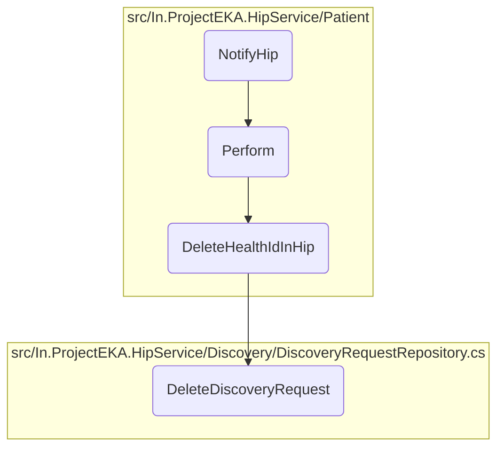

In this document, we will explain the process of handling patient status notifications. The process involves receiving the notification, performing necessary actions based on the status, and sending a confirmation response.

The flow starts with receiving a patient status notification. The notification is then processed to extract the health ID and status. If the status indicates that the health ID should be deleted, the system removes the health ID from various repositories. Finally, a confirmation response is sent back to acknowledge the notification.

# Flow drill down



<SwmSnippet path="/src/In.ProjectEKA.HipService/Patient/PatientController.cs" line="31">

---

## <SwmToken path="src/In.ProjectEKA.HipService/Patient/PatientController.cs" pos="32:10:10" line-data="        public async Task&lt;AcceptedResult&gt; NotifyHip([FromHeader(Name = CORRELATION_ID)] string correlationId,">`NotifyHip`</SwmToken>

First, the <SwmToken path="src/In.ProjectEKA.HipService/Patient/PatientController.cs" pos="32:10:10" line-data="        public async Task&lt;AcceptedResult&gt; NotifyHip([FromHeader(Name = CORRELATION_ID)] string correlationId,">`NotifyHip`</SwmToken> method receives a patient status notification and processes it. It calls the <SwmToken path="src/In.ProjectEKA.HipService/Patient/PatientController.cs" pos="36:5:5" line-data="            await _patientNotificationService.Perform(hipPatientStatusNotification);">`Perform`</SwmToken> method to handle the notification and then sends a confirmation response back to the gateway.

```c#
        [Route(PATH_PATIENT_NOTIFY)]
        public async Task<AcceptedResult> NotifyHip([FromHeader(Name = CORRELATION_ID)] string correlationId,
            [FromBody] HipPatientStatusNotification hipPatientStatusNotification)
        {
            var cmSuffix = _gatewayConfiguration.CmSuffix;
            await _patientNotificationService.Perform(hipPatientStatusNotification);
            var gatewayResponse = new HipPatientNotifyConfirmation(
                Guid.NewGuid().ToString(),
                DateTime.Now.ToUniversalTime().ToString(DateTimeFormat),
                new PatientNotifyAcknowledgement(Status.SUCCESS.ToString()), null,
                new Resp(hipPatientStatusNotification.requestId.ToString()));
            await _gatewayClient.SendDataToGateway(PATH_PATIENT_ON_NOTIFY,
                gatewayResponse,
                cmSuffix,
                correlationId);
            return Accepted();
        }
```

---

</SwmSnippet>

<SwmSnippet path="/src/In.ProjectEKA.HipService/Patient/PatientNotificationService.cs" line="34">

---

## Perform

Next, the <SwmToken path="src/In.ProjectEKA.HipService/Patient/PatientNotificationService.cs" pos="34:7:7" line-data="        public async Task Perform(HipPatientStatusNotification hipPatientStatusNotification)">`Perform`</SwmToken> method extracts the health ID and status from the notification. If the status is defined as an action, it checks if the status is 'DELETED'. If so, it calls <SwmToken path="src/In.ProjectEKA.HipService/Patient/PatientNotificationService.cs" pos="40:18:18" line-data="                if (status.Equals(Action.DELETED.ToString())) DeleteHealthIdInHip(healthId);">`DeleteHealthIdInHip`</SwmToken> to remove the health ID from the system.

```c#
        public async Task Perform(HipPatientStatusNotification hipPatientStatusNotification)
        {
            var healthId = hipPatientStatusNotification.notification.patient.id;
            var status = hipPatientStatusNotification.notification.status.ToString();
            if (Enum.IsDefined(typeof(Action), status))
            {
                if (status.Equals(Action.DELETED.ToString())) DeleteHealthIdInHip(healthId);
                await RemoveHealthIdInOpenMrs(healthId, status);
            }
        }
```

---

</SwmSnippet>

<SwmSnippet path="/src/In.ProjectEKA.HipService/Patient/PatientNotificationService.cs" line="45">

---

## <SwmToken path="src/In.ProjectEKA.HipService/Patient/PatientNotificationService.cs" pos="45:5:5" line-data="        private void DeleteHealthIdInHip(string healthId)">`DeleteHealthIdInHip`</SwmToken>

Then, the <SwmToken path="src/In.ProjectEKA.HipService/Patient/PatientNotificationService.cs" pos="45:5:5" line-data="        private void DeleteHealthIdInHip(string healthId)">`DeleteHealthIdInHip`</SwmToken> method deletes the health ID from various repositories, including discovery requests, linked accounts, link enquiries, user authentication, and consent artifacts.

```c#
        private void DeleteHealthIdInHip(string healthId)
        {
            discoveryRequestRepository.DeleteDiscoveryRequest(healthId);
            linkPatientRepository.DeleteLinkedAccounts(healthId);
            linkPatientRepository.DeleteLinkEnquires(healthId);
            userAuthRepository.Delete(healthId);
            userAuthRepository.DeleteDemographics(healthId);
            consentRepository.DeleteConsentArtefact(healthId);
        }
```

---

</SwmSnippet>

<SwmSnippet path="/src/In.ProjectEKA.HipService/Discovery/DiscoveryRequestRepository.cs" line="52">

---

## <SwmToken path="src/In.ProjectEKA.HipService/Discovery/DiscoveryRequestRepository.cs" pos="52:7:7" line-data="        public async Task DeleteDiscoveryRequest(string healthId)">`DeleteDiscoveryRequest`</SwmToken>

Finally, the <SwmToken path="src/In.ProjectEKA.HipService/Discovery/DiscoveryRequestRepository.cs" pos="52:7:7" line-data="        public async Task DeleteDiscoveryRequest(string healthId)">`DeleteDiscoveryRequest`</SwmToken> method removes discovery requests associated with the given health ID from the discovery context and saves the changes.

```c#
        public async Task DeleteDiscoveryRequest(string healthId)
        {
            var discoveryRequests = discoveryContext.DiscoveryRequest
                .Where(request =>
                    request.ConsentManagerUserId == healthId);
            foreach (var discoveryRequest in discoveryRequests)
            {
                discoveryContext.Remove(discoveryRequest);
            }

            await discoveryContext.SaveChangesAsync();
        }
```

---

</SwmSnippet>

&nbsp;

*This is an auto-generated document by Swimm 🌊 and has not yet been verified by a human*

<SwmMeta version="3.0.0" repo-id="Z2l0aHViJTNBJTNBaGlwLXNlcnZpY2UlM0ElM0FTd2ltbS1EZW1v" repo-name="hip-service"><sup>Powered by [Swimm](/)</sup></SwmMeta>
