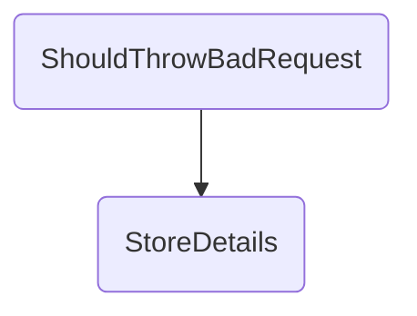

In this document, we will explain the process of handling a profile sharing request, validating it, and responding appropriately. The process involves setting up the request, validating it, handling errors, sending data to the gateway, and returning the response.

The flow starts with setting up a profile sharing request with specific details. The request is then validated to check if it is valid. If the request is invalid, an error is created, and the status is set to failure. The next step involves creating a response and sending it to the gateway. Finally, the response is returned to the client, indicating whether the request was successful or not.

# Flow drill down



<SwmSnippet path="/test/In.ProjectEKA.HipServiceTest/Patient/PatientControllerTest.cs" line="98">

---

## Validating the Request

First, the <SwmToken path="test/In.ProjectEKA.HipServiceTest/Patient/PatientControllerTest.cs" pos="99:5:5" line-data="        private void ShouldThrowBadRequest()">`ShouldThrowBadRequest`</SwmToken> method sets up a test scenario where a profile sharing request is created with specific details. It then mocks the behavior of the <SwmToken path="test/In.ProjectEKA.HipServiceTest/Patient/PatientControllerTest.cs" pos="111:1:1" line-data="            _patientProfileService.Setup(d =&gt; d.IsValidRequest(shareProfileRequest)).Returns(false);">`_patientProfileService`</SwmToken> to return `false` for the <SwmToken path="test/In.ProjectEKA.HipServiceTest/Patient/PatientControllerTest.cs" pos="111:11:11" line-data="            _patientProfileService.Setup(d =&gt; d.IsValidRequest(shareProfileRequest)).Returns(false);">`IsValidRequest`</SwmToken> method, indicating that the request is invalid.

```c#
        [Fact]
        private void ShouldThrowBadRequest()
        {
            var requestId = Guid.NewGuid().ToString();
            var timestamp = DateTime.Now.ToUniversalTime();
            var identifier = new Identifier("MOBILE", "9999999999");
            var address = new Address("string", "string", "string", "string");
            var patient = new PatientDemographics(null, "M", "test@sbx", address, 2000, 0, 0,
                new List<Identifier>() {identifier}, "1234-5678");
            var profile = new Profile("12345", patient);
            var shareProfileRequest = new ShareProfileRequest(requestId, timestamp, profile);
            var correlationId = Uuid.Generate().ToString();
            var cmSuffix = "ncg";
            _patientProfileService.Setup(d => d.IsValidRequest(shareProfileRequest)).Returns(false);
```

---

</SwmSnippet>

<SwmSnippet path="/src/In.ProjectEKA.HipService/Patient/PatientController.cs" line="56">

---

## Handling Errors

Next, the <SwmToken path="test/In.ProjectEKA.HipServiceTest/Patient/PatientControllerTest.cs" pos="94:2:2" line-data="                    .StoreDetails(correlationId, shareProfileRequest).Result).StatusCode,">`StoreDetails`</SwmToken> method in the <SwmToken path="test/In.ProjectEKA.HipServiceTest/Patient/PatientControllerTest.cs" pos="22:5:5" line-data="        private readonly PatientController _patientController;">`PatientController`</SwmToken> checks if the request is valid. If the request is invalid, it sets the status to `FAILURE` and creates an error object with a <SwmToken path="src/In.ProjectEKA.HipService/Patient/PatientController.cs" pos="59:11:11" line-data="                error = new Error(ErrorCode.BadRequest, &quot;Invalid Request Format&quot;);">`BadRequest`</SwmToken> error code and message. This ensures that invalid requests are properly identified and handled.

```c#
            if (!_patientProfileService.IsValidRequest(shareProfileRequest))
            {
                status = Status.FALIURE;
                error = new Error(ErrorCode.BadRequest, "Invalid Request Format");
            }
```

---

</SwmSnippet>

<SwmSnippet path="/src/In.ProjectEKA.HipService/Patient/PatientController.cs" line="68">

---

## Sending Data to Gateway

Then, the <SwmToken path="test/In.ProjectEKA.HipServiceTest/Patient/PatientControllerTest.cs" pos="94:2:2" line-data="                    .StoreDetails(correlationId, shareProfileRequest).Result).StatusCode,">`StoreDetails`</SwmToken> method creates a <SwmToken path="src/In.ProjectEKA.HipService/Patient/PatientController.cs" pos="68:9:9" line-data="            var gatewayResponse = new ProfileShareConfirmation(">`ProfileShareConfirmation`</SwmToken> response and sends it to the gateway. If there are no errors, it also links the token to the patient's demographics. This step ensures that the profile sharing process is completed and the necessary data is sent to the gateway.

```c#
            var gatewayResponse = new ProfileShareConfirmation(
                Guid.NewGuid().ToString(),
                DateTime.Now.ToUniversalTime().ToString(DateTimeFormat),
                new ProfileShareAcknowledgement(status.ToString(),shareProfileRequest.Profile.PatientDemographics.HealthId,token.ToString()), error,
                new Resp(shareProfileRequest.RequestId));
            Task.Run(async () =>
            {
                await Task.Delay(500);
                await _gatewayClient.SendDataToGateway(PATH_PROFILE_ON_SHARE,
                    gatewayResponse,
                    cmSuffix,
                    correlationId);
                if(error == null)
                    await _patientProfileService.linkToken(shareProfileRequest.Profile.PatientDemographics);
            });
```

---

</SwmSnippet>

<SwmSnippet path="/src/In.ProjectEKA.HipService/Patient/PatientController.cs" line="83">

---

## Returning the Response

Finally, the <SwmToken path="test/In.ProjectEKA.HipServiceTest/Patient/PatientControllerTest.cs" pos="94:2:2" line-data="                    .StoreDetails(correlationId, shareProfileRequest).Result).StatusCode,">`StoreDetails`</SwmToken> method returns a <SwmToken path="src/In.ProjectEKA.HipService/Patient/PatientController.cs" pos="87:3:3" line-data="            return BadRequest();">`BadRequest`</SwmToken> response if there was an error, or an <SwmToken path="src/In.ProjectEKA.HipService/Patient/PatientController.cs" pos="85:3:3" line-data="                return Accepted();">`Accepted`</SwmToken> response if the request was processed successfully. This provides feedback to the client about the outcome of their request.

```c#
            if (error == null)
            {
                return Accepted();
            }
            return BadRequest();
```

---

</SwmSnippet>

&nbsp;

*This is an auto-generated document by Swimm 🌊 and has not yet been verified by a human*

<SwmMeta version="3.0.0" repo-id="Z2l0aHViJTNBJTNBaGlwLXNlcnZpY2UlM0ElM0FTd2ltbS1EZW1v" repo-name="hip-service"><sup>Powered by [Swimm](/)</sup></SwmMeta>
