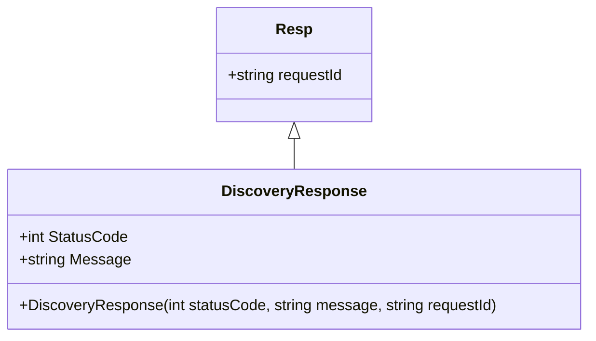

# Introduction to Discovery Response Model

The <SwmToken path="src/In.ProjectEKA.HipLibrary/Patient/Model/DiscoveryResponse.cs" pos="10:3:3" line-data="        public DiscoveryResponse(string requestId, HttpStatusCode statusCode, string message) : base(requestId)">`DiscoveryResponse`</SwmToken> class is designed to encapsulate the response details of a discovery request. It inherits from the <SwmToken path="src/In.ProjectEKA.HipLibrary/Patient/Model/DiscoveryResponse.cs" pos="5:8:8" line-data="    public class DiscoveryResponse: Resp">`Resp`</SwmToken> class and includes two main properties: <SwmToken path="src/In.ProjectEKA.HipLibrary/Patient/Model/DiscoveryResponse.cs" pos="7:5:5" line-data="        public HttpStatusCode StatusCode { get; }">`StatusCode`</SwmToken> and <SwmToken path="src/In.ProjectEKA.HipLibrary/Patient/Model/DiscoveryResponse.cs" pos="8:5:5" line-data="        public string Message { get; }">`Message`</SwmToken>.

## Properties

The <SwmToken path="src/In.ProjectEKA.HipLibrary/Patient/Model/DiscoveryResponse.cs" pos="10:3:3" line-data="        public DiscoveryResponse(string requestId, HttpStatusCode statusCode, string message) : base(requestId)">`DiscoveryResponse`</SwmToken> class contains the following properties:

<SwmSnippet path="/src/In.ProjectEKA.HipLibrary/Patient/Model/DiscoveryResponse.cs" line="7">

---

### <SwmToken path="src/In.ProjectEKA.HipLibrary/Patient/Model/DiscoveryResponse.cs" pos="7:5:5" line-data="        public HttpStatusCode StatusCode { get; }">`StatusCode`</SwmToken>

The <SwmToken path="src/In.ProjectEKA.HipLibrary/Patient/Model/DiscoveryResponse.cs" pos="7:5:5" line-data="        public HttpStatusCode StatusCode { get; }">`StatusCode`</SwmToken> property holds the HTTP status code of the response. It indicates the result of the discovery request, such as whether it was successful or if there was an error.

```c#
        public HttpStatusCode StatusCode { get; }
```

---

</SwmSnippet>

<SwmSnippet path="/src/In.ProjectEKA.HipLibrary/Patient/Model/DiscoveryResponse.cs" line="8">

---

### Message

The <SwmToken path="src/In.ProjectEKA.HipLibrary/Patient/Model/DiscoveryResponse.cs" pos="8:5:5" line-data="        public string Message { get; }">`Message`</SwmToken> property contains a message related to the discovery response. This message provides additional information about the result of the discovery request.

```c#
        public string Message { get; }
```

---

</SwmSnippet>

<SwmSnippet path="/src/In.ProjectEKA.HipLibrary/Patient/Model/DiscoveryResponse.cs" line="10">

---

## Constructor

The constructor of the <SwmToken path="src/In.ProjectEKA.HipLibrary/Patient/Model/DiscoveryResponse.cs" pos="10:3:3" line-data="        public DiscoveryResponse(string requestId, HttpStatusCode statusCode, string message) : base(requestId)">`DiscoveryResponse`</SwmToken> class initializes the <SwmToken path="src/In.ProjectEKA.HipLibrary/Patient/Model/DiscoveryResponse.cs" pos="12:1:1" line-data="            StatusCode = statusCode;">`StatusCode`</SwmToken> and <SwmToken path="src/In.ProjectEKA.HipLibrary/Patient/Model/DiscoveryResponse.cs" pos="13:1:1" line-data="            Message = message;">`Message`</SwmToken> properties along with the <SwmToken path="src/In.ProjectEKA.HipLibrary/Patient/Model/DiscoveryResponse.cs" pos="10:7:7" line-data="        public DiscoveryResponse(string requestId, HttpStatusCode statusCode, string message) : base(requestId)">`requestId`</SwmToken> from the base class. This ensures that all necessary information is encapsulated in the response object.

```c#
        public DiscoveryResponse(string requestId, HttpStatusCode statusCode, string message) : base(requestId)
        {
            StatusCode = statusCode;
            Message = message;
        }
```

---

</SwmSnippet>

## Usage Examples

The <SwmToken path="src/In.ProjectEKA.HipLibrary/Patient/Model/DiscoveryResponse.cs" pos="10:3:3" line-data="        public DiscoveryResponse(string requestId, HttpStatusCode statusCode, string message) : base(requestId)">`DiscoveryResponse`</SwmToken> class is used in various parts of the codebase to handle discovery responses. Below are some examples of its usage:

<SwmSnippet path="/src/In.ProjectEKA.HipService/Discovery/PatientController.cs" line="95">

---

### In PatientController

An example usage of <SwmToken path="src/In.ProjectEKA.HipService/Discovery/PatientController.cs" pos="96:3:3" line-data="                    new DiscoveryResponse(request.RequestId, HttpStatusCode.InternalServerError,">`DiscoveryResponse`</SwmToken> in `PatientController` to handle an error response.

```c#
                    new Error(ErrorCode.ServerInternalError, "Unreachable external service"),
                    new DiscoveryResponse(request.RequestId, HttpStatusCode.InternalServerError,
                        "Unreachable external service"));
```

---

</SwmSnippet>

<SwmSnippet path="/src/In.ProjectEKA.HipService/Gateway/Model/GatewayDiscoveryRepresentation.cs" line="12">

---

### In <SwmToken path="src/In.ProjectEKA.HipService/Discovery/PatientController.cs" pos="68:9:9" line-data="                var gatewayDiscoveryRepresentation = new GatewayDiscoveryRepresentation(">`GatewayDiscoveryRepresentation`</SwmToken>

An example usage of <SwmToken path="src/In.ProjectEKA.HipService/Gateway/Model/GatewayDiscoveryRepresentation.cs" pos="13:1:1" line-data="            DiscoveryResponse resp)">`DiscoveryResponse`</SwmToken> in <SwmToken path="src/In.ProjectEKA.HipService/Discovery/PatientController.cs" pos="68:9:9" line-data="                var gatewayDiscoveryRepresentation = new GatewayDiscoveryRepresentation(">`GatewayDiscoveryRepresentation`</SwmToken> to represent the discovery response.

```c#
            Error error,
            DiscoveryResponse resp)
        {
```

---

</SwmSnippet>



&nbsp;

*This is an auto-generated document by Swimm 🌊 and has not yet been verified by a human*

<SwmMeta version="3.0.0" repo-id="Z2l0aHViJTNBJTNBaGlwLXNlcnZpY2UlM0ElM0FTd2ltbS1EZW1v" repo-name="hip-service"><sup>Powered by [Swimm](/)</sup></SwmMeta>
