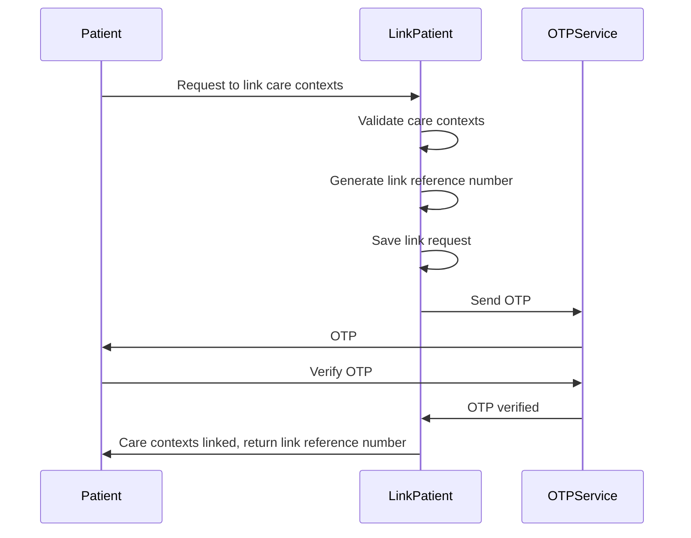

# Introduction to Link Patient Process

The link patient process involves associating a patient's care contexts with their consent manager and generating a unique link reference number. This process ensures that the patient's health information is securely linked and accessible through their consent manager.

## <SwmToken path="src/In.ProjectEKA.HipService/Link/LinkPatient.cs" pos="22:5:5" line-data="    public class LinkPatient">`LinkPatient`</SwmToken> Class

The <SwmToken path="src/In.ProjectEKA.HipService/Link/LinkPatient.cs" pos="22:5:5" line-data="    public class LinkPatient">`LinkPatient`</SwmToken> class is responsible for handling the linking process. It includes methods for validating the patient's care contexts, generating a link reference number, and saving the link request.

## <SwmToken path="src/In.ProjectEKA.HipService/Link/LinkPatient.cs" pos="52:17:17" line-data="        public virtual async Task&lt;ValueTuple&lt;PatientLinkEnquiryRepresentation, ErrorRepresentation&gt;&gt; LinkPatients(">`LinkPatients`</SwmToken> Method

The <SwmToken path="src/In.ProjectEKA.HipService/Link/LinkPatient.cs" pos="52:17:17" line-data="        public virtual async Task&lt;ValueTuple&lt;PatientLinkEnquiryRepresentation, ErrorRepresentation&gt;&gt; LinkPatients(">`LinkPatients`</SwmToken> method in the <SwmToken path="src/In.ProjectEKA.HipService/Link/LinkPatient.cs" pos="22:5:5" line-data="    public class LinkPatient">`LinkPatient`</SwmToken> class initiates the linking process. It validates the patient's care contexts, generates a link reference number, saves the link request, and sends an OTP to the patient's mobile number for verification.

<SwmSnippet path="/src/In.ProjectEKA.HipService/Link/LinkPatient.cs" line="52">

---

The <SwmToken path="src/In.ProjectEKA.HipService/Link/LinkPatient.cs" pos="52:17:17" line-data="        public virtual async Task&lt;ValueTuple&lt;PatientLinkEnquiryRepresentation, ErrorRepresentation&gt;&gt; LinkPatients(">`LinkPatients`</SwmToken> method initiates the linking process by validating the patient's care contexts and generating a link reference number. It saves the link request and sends an OTP to the patient's mobile number for verification.

```c#
        public virtual async Task<ValueTuple<PatientLinkEnquiryRepresentation, ErrorRepresentation>> LinkPatients(
            PatientLinkEnquiry request)
        {
            var (patient, error) = await PatientAndCareContextValidation(request);
            if (error != null)
            {
                Log.Error(error.Error.Message);
                return (null, error);
            }

            var linkRefNumber = referenceNumberGenerator.NewGuid();
            using (var scope = new TransactionScope(TransactionScopeAsyncFlowOption.Enabled))
            {
                if (!await SaveInitiatedLinkRequest(request.RequestId, request.TransactionId, linkRefNumber)
                    .ConfigureAwait(false))
                    return (null,
                        new ErrorRepresentation(new Error(ErrorCode.DuplicateRequestId, ErrorMessage.DuplicateRequestId))
                        );

                var careContextReferenceNumbers = request.Patient.CareContexts
                    .Select(context => context.ReferenceNumber)
```

---

</SwmSnippet>

## <SwmToken path="src/In.ProjectEKA.HipService/Link/LinkPatient.cs" pos="133:1:1" line-data="            VerifyAndLinkCareContext(">`VerifyAndLinkCareContext`</SwmToken> Method

The <SwmToken path="src/In.ProjectEKA.HipService/Link/LinkPatient.cs" pos="133:1:1" line-data="            VerifyAndLinkCareContext(">`VerifyAndLinkCareContext`</SwmToken> method verifies the OTP sent to the patient and links the care contexts to the patient's profile. It retrieves the patient's information, updates the link request status, and if the verification is successful, saves the linked accounts and links the ABHA identifier to the patient.

<SwmSnippet path="/src/In.ProjectEKA.HipService/Link/LinkPatient.cs" line="132">

---

The <SwmToken path="src/In.ProjectEKA.HipService/Link/LinkPatient.cs" pos="133:1:1" line-data="            VerifyAndLinkCareContext(">`VerifyAndLinkCareContext`</SwmToken> method verifies the OTP sent to the patient and links the care contexts to the patient's profile. It retrieves the patient's information and updates the link request status.

```c#
        public virtual async Task<ValueTuple<PatientLinkConfirmationRepresentation, string, ErrorRepresentation>>
            VerifyAndLinkCareContext(
            LinkConfirmationRequest request)
        {
            var (linkEnquires, exception) =
                await linkPatientRepository.GetPatientFor(request.LinkReferenceNumber);
            var cmId = "";
            if (exception != null)
                return (null,cmId,
                    new ErrorRepresentation(new Error(ErrorCode.NoLinkRequestFound, ErrorMessage.NoLinkRequestFound)));
            cmId = linkEnquires.ConsentManagerId;

            var errorResponse = await patientVerification.Verify(request.LinkReferenceNumber, request.Token);
            if (errorResponse != null)
                return (null,cmId, new ErrorRepresentation(errorResponse.toError()));

            var patient = await patientRepository.PatientWithAsync(linkEnquires.PatientReferenceNumber);
            return await patient.Map( async patient =>
                {
                    var savedLinkRequests = await linkPatientRepository.Get(request.LinkReferenceNumber);
                    savedLinkRequests.MatchSome(linkRequests =>
```

---

</SwmSnippet>

## Link Patient Endpoints

The <SwmToken path="src/In.ProjectEKA.HipService/Link/LinkPatient.cs" pos="52:17:17" line-data="        public virtual async Task&lt;ValueTuple&lt;PatientLinkEnquiryRepresentation, ErrorRepresentation&gt;&gt; LinkPatients(">`LinkPatients`</SwmToken> method in the <SwmToken path="src/In.ProjectEKA.HipService/Link/LinkPatient.cs" pos="22:5:5" line-data="    public class LinkPatient">`LinkPatient`</SwmToken> class initiates the linking process by validating the patient's care contexts and generating a link reference number. Once the link reference number is generated, the method saves the link request and sends an OTP to the patient's mobile number for verification. After the OTP is verified, the patient's care contexts are linked, and the link reference number is returned as part of the response.

<SwmSnippet path="/src/In.ProjectEKA.HipService/Link/LinkPatient.cs" line="10">

---

The <SwmToken path="src/In.ProjectEKA.HipService/Link/LinkPatient.cs" pos="52:17:17" line-data="        public virtual async Task&lt;ValueTuple&lt;PatientLinkEnquiryRepresentation, ErrorRepresentation&gt;&gt; LinkPatients(">`LinkPatients`</SwmToken> method initiates the linking process by validating the patient's care contexts and generating a link reference number.

```c#
    using System.Linq;
    using System.Threading.Tasks;
    using System.Transactions;
    using Common;
    using Discovery;
    using HipLibrary.Patient;
    using HipLibrary.Patient.Model;
    using Logger;
    using Microsoft.Extensions.Options;
    using Model;
    using static In.ProjectEKA.HipService.Discovery.DiscoveryReqMap;
```

---

</SwmSnippet>



&nbsp;

*This is an auto-generated document by Swimm 🌊 and has not yet been verified by a human*

<SwmMeta version="3.0.0" repo-id="Z2l0aHViJTNBJTNBaGlwLXNlcnZpY2UlM0ElM0FTd2ltbS1EZW1v" repo-name="hip-service"><sup>Powered by [Swimm](/)</sup></SwmMeta>
