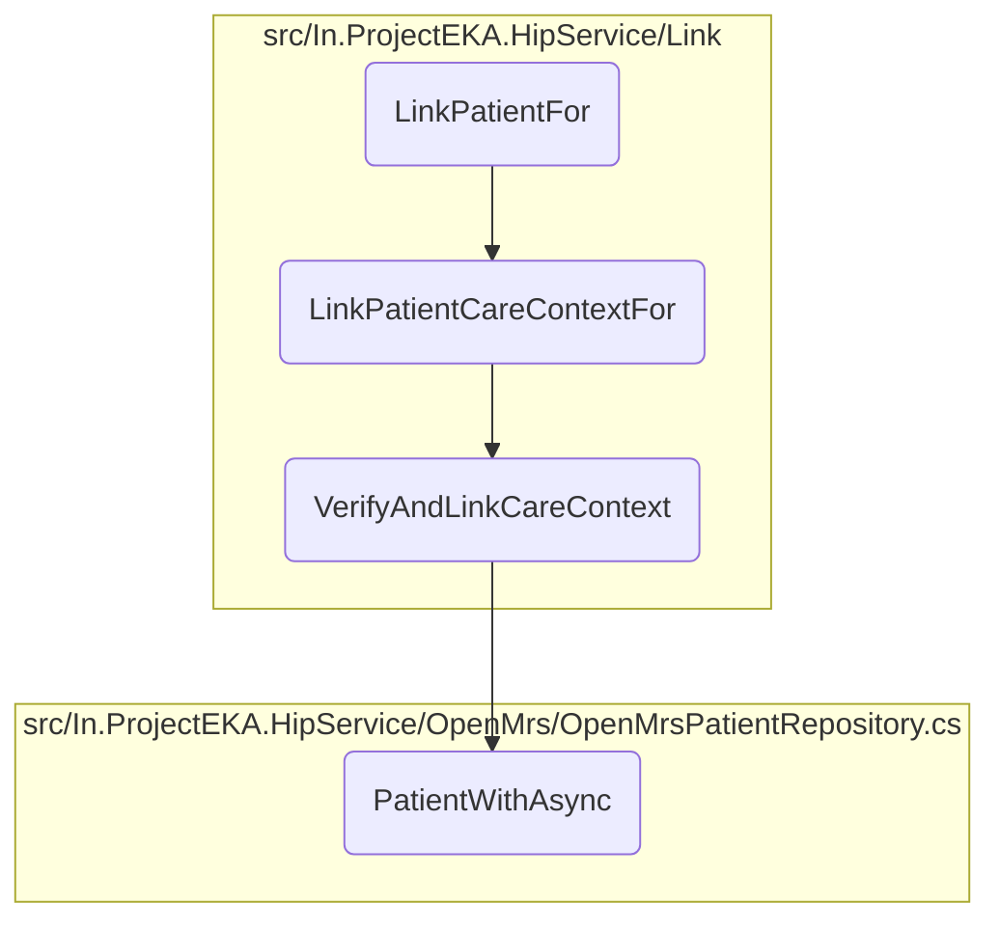

```mermaid
graph TD
  subgraph VerifyAndLinkCareContext
    VerifyAndLinkCareContext:A["Fetch patient details using link reference number"] --> VerifyAndLinkCareContext:B["Check if patient details exist"]
    VerifyAndLinkCareContext:B -->|Exists| VerifyAndLinkCareContext:C["Verify patient using token"]
    VerifyAndLinkCareContext:C -->|Verified| VerifyAndLinkCareContext:D["Fetch patient information using patient reference number"]
    VerifyAndLinkCareContext:D --> VerifyAndLinkCareContext:E["Update patient link requests"]
    VerifyAndLinkCareContext:E --> VerifyAndLinkCareContext:F["Filter and map care contexts"]
    VerifyAndLinkCareContext:F --> VerifyAndLinkCareContext:G["Prepare patient link confirmation response"]
    VerifyAndLinkCareContext:G --> VerifyAndLinkCareContext:H["Save linked accounts"]
    VerifyAndLinkCareContext:H -->|Saved| VerifyAndLinkCareContext:I["Link ABHA identifier"]
  end
  subgraph PatientWithAsync
      PatientWithAsync:A["Load FHIR patient using identifier"] --> PatientWithAsync:B["Extract patient name"]
      PatientWithAsync:B --> PatientWithAsync:C["Convert FHIR patient to HIP patient model"]
      PatientWithAsync:C --> PatientWithAsync:D["Fetch and set care contexts"]
      PatientWithAsync:D --> PatientWithAsync:E["Fetch and set phone number"]
  end
  VerifyAndLinkCareContext:D --> PatientWithAsync

%% Swimm:
%% graph TD
%%   subgraph <SwmToken path="src/In.ProjectEKA.HipService/Link/LinkController.cs" pos="133:2:2" line-data="                    .VerifyAndLinkCareContext(new LinkConfirmationRequest(request.Confirmation.Token,">`VerifyAndLinkCareContext`</SwmToken>
%%     <SwmToken path="src/In.ProjectEKA.HipService/Link/LinkController.cs" pos="133:2:2" line-data="                    .VerifyAndLinkCareContext(new LinkConfirmationRequest(request.Confirmation.Token,">`VerifyAndLinkCareContext`</SwmToken>:A["Fetch patient details using link reference number"] --> <SwmToken path="src/In.ProjectEKA.HipService/Link/LinkController.cs" pos="133:2:2" line-data="                    .VerifyAndLinkCareContext(new LinkConfirmationRequest(request.Confirmation.Token,">`VerifyAndLinkCareContext`</SwmToken>:B["Check if patient details exist"]
%%     <SwmToken path="src/In.ProjectEKA.HipService/Link/LinkController.cs" pos="133:2:2" line-data="                    .VerifyAndLinkCareContext(new LinkConfirmationRequest(request.Confirmation.Token,">`VerifyAndLinkCareContext`</SwmToken>:B -->|Exists| <SwmToken path="src/In.ProjectEKA.HipService/Link/LinkController.cs" pos="133:2:2" line-data="                    .VerifyAndLinkCareContext(new LinkConfirmationRequest(request.Confirmation.Token,">`VerifyAndLinkCareContext`</SwmToken>:C["Verify patient using token"]
%%     <SwmToken path="src/In.ProjectEKA.HipService/Link/LinkController.cs" pos="133:2:2" line-data="                    .VerifyAndLinkCareContext(new LinkConfirmationRequest(request.Confirmation.Token,">`VerifyAndLinkCareContext`</SwmToken>:C -->|Verified| <SwmToken path="src/In.ProjectEKA.HipService/Link/LinkController.cs" pos="133:2:2" line-data="                    .VerifyAndLinkCareContext(new LinkConfirmationRequest(request.Confirmation.Token,">`VerifyAndLinkCareContext`</SwmToken>:D["Fetch patient information using patient reference number"]
%%     <SwmToken path="src/In.ProjectEKA.HipService/Link/LinkController.cs" pos="133:2:2" line-data="                    .VerifyAndLinkCareContext(new LinkConfirmationRequest(request.Confirmation.Token,">`VerifyAndLinkCareContext`</SwmToken>:D --> <SwmToken path="src/In.ProjectEKA.HipService/Link/LinkController.cs" pos="133:2:2" line-data="                    .VerifyAndLinkCareContext(new LinkConfirmationRequest(request.Confirmation.Token,">`VerifyAndLinkCareContext`</SwmToken>:E["Update patient link requests"]
%%     <SwmToken path="src/In.ProjectEKA.HipService/Link/LinkController.cs" pos="133:2:2" line-data="                    .VerifyAndLinkCareContext(new LinkConfirmationRequest(request.Confirmation.Token,">`VerifyAndLinkCareContext`</SwmToken>:E --> <SwmToken path="src/In.ProjectEKA.HipService/Link/LinkController.cs" pos="133:2:2" line-data="                    .VerifyAndLinkCareContext(new LinkConfirmationRequest(request.Confirmation.Token,">`VerifyAndLinkCareContext`</SwmToken>:F["Filter and map care contexts"]
%%     <SwmToken path="src/In.ProjectEKA.HipService/Link/LinkController.cs" pos="133:2:2" line-data="                    .VerifyAndLinkCareContext(new LinkConfirmationRequest(request.Confirmation.Token,">`VerifyAndLinkCareContext`</SwmToken>:F --> <SwmToken path="src/In.ProjectEKA.HipService/Link/LinkController.cs" pos="133:2:2" line-data="                    .VerifyAndLinkCareContext(new LinkConfirmationRequest(request.Confirmation.Token,">`VerifyAndLinkCareContext`</SwmToken>:G["Prepare patient link confirmation response"]
%%     <SwmToken path="src/In.ProjectEKA.HipService/Link/LinkController.cs" pos="133:2:2" line-data="                    .VerifyAndLinkCareContext(new LinkConfirmationRequest(request.Confirmation.Token,">`VerifyAndLinkCareContext`</SwmToken>:G --> <SwmToken path="src/In.ProjectEKA.HipService/Link/LinkController.cs" pos="133:2:2" line-data="                    .VerifyAndLinkCareContext(new LinkConfirmationRequest(request.Confirmation.Token,">`VerifyAndLinkCareContext`</SwmToken>:H["Save linked accounts"]
%%     <SwmToken path="src/In.ProjectEKA.HipService/Link/LinkController.cs" pos="133:2:2" line-data="                    .VerifyAndLinkCareContext(new LinkConfirmationRequest(request.Confirmation.Token,">`VerifyAndLinkCareContext`</SwmToken>:H -->|Saved| <SwmToken path="src/In.ProjectEKA.HipService/Link/LinkController.cs" pos="133:2:2" line-data="                    .VerifyAndLinkCareContext(new LinkConfirmationRequest(request.Confirmation.Token,">`VerifyAndLinkCareContext`</SwmToken>:I["Link ABHA identifier"]
%%   end
%%   subgraph <SwmToken path="src/In.ProjectEKA.HipService/Link/LinkPatient.cs" pos="148:11:11" line-data="            var patient = await patientRepository.PatientWithAsync(linkEnquires.PatientReferenceNumber);">`PatientWithAsync`</SwmToken>
%%       <SwmToken path="src/In.ProjectEKA.HipService/Link/LinkPatient.cs" pos="148:11:11" line-data="            var patient = await patientRepository.PatientWithAsync(linkEnquires.PatientReferenceNumber);">`PatientWithAsync`</SwmToken>:A["Load FHIR patient using identifier"] --> <SwmToken path="src/In.ProjectEKA.HipService/Link/LinkPatient.cs" pos="148:11:11" line-data="            var patient = await patientRepository.PatientWithAsync(linkEnquires.PatientReferenceNumber);">`PatientWithAsync`</SwmToken>:B["Extract patient name"]
%%       <SwmToken path="src/In.ProjectEKA.HipService/Link/LinkPatient.cs" pos="148:11:11" line-data="            var patient = await patientRepository.PatientWithAsync(linkEnquires.PatientReferenceNumber);">`PatientWithAsync`</SwmToken>:B --> <SwmToken path="src/In.ProjectEKA.HipService/Link/LinkPatient.cs" pos="148:11:11" line-data="            var patient = await patientRepository.PatientWithAsync(linkEnquires.PatientReferenceNumber);">`PatientWithAsync`</SwmToken>:C["Convert FHIR patient to HIP patient model"]
%%       <SwmToken path="src/In.ProjectEKA.HipService/Link/LinkPatient.cs" pos="148:11:11" line-data="            var patient = await patientRepository.PatientWithAsync(linkEnquires.PatientReferenceNumber);">`PatientWithAsync`</SwmToken>:C --> <SwmToken path="src/In.ProjectEKA.HipService/Link/LinkPatient.cs" pos="148:11:11" line-data="            var patient = await patientRepository.PatientWithAsync(linkEnquires.PatientReferenceNumber);">`PatientWithAsync`</SwmToken>:D["Fetch and set care contexts"]
%%       <SwmToken path="src/In.ProjectEKA.HipService/Link/LinkPatient.cs" pos="148:11:11" line-data="            var patient = await patientRepository.PatientWithAsync(linkEnquires.PatientReferenceNumber);">`PatientWithAsync`</SwmToken>:D --> <SwmToken path="src/In.ProjectEKA.HipService/Link/LinkPatient.cs" pos="148:11:11" line-data="            var patient = await patientRepository.PatientWithAsync(linkEnquires.PatientReferenceNumber);">`PatientWithAsync`</SwmToken>:E["Fetch and set phone number"]
%%   end
%%   <SwmToken path="src/In.ProjectEKA.HipService/Link/LinkController.cs" pos="133:2:2" line-data="                    .VerifyAndLinkCareContext(new LinkConfirmationRequest(request.Confirmation.Token,">`VerifyAndLinkCareContext`</SwmToken>:D --> <SwmToken path="src/In.ProjectEKA.HipService/Link/LinkPatient.cs" pos="148:11:11" line-data="            var patient = await patientRepository.PatientWithAsync(linkEnquires.PatientReferenceNumber);">`PatientWithAsync`</SwmToken>
```

This document explains the process of linking a patient's care contexts. The process involves several steps, starting from validating the account reference number and care context reference number, to verifying the patient's identity, and finally linking the care contexts securely.

The flow begins with validating the account and care context reference numbers to ensure they are correct. Next, the transaction ID is validated against a discovery request to confirm the care contexts were discovered for the patient. The patient's identity is then authenticated, typically through OTP verification. Once authenticated, a background job is triggered to link the care contexts. This job verifies the link request, fetches patient details, updates the link request status, creates care context representations, and saves the linked accounts. If successful, the ABHA identifier is linked to the patient, and a confirmation response is sent to the gateway.

Here is a high level diagram of the flow, showing only the most important functions:



# Flow drill down

```mermaid
graph TD
  subgraph LinkPatientFor
    LinkPatientFor:A["Validate account reference number and care context reference number"] --> LinkPatientFor:B["Validate transactionId with discovery request"]
    LinkPatientFor:B --> LinkPatientFor:C["Authenticate request with patient"]
    LinkPatientFor:C --> LinkPatientFor:D["Communicate authentication mode with Consent Manager"]
    LinkPatientFor:D --> LinkPatientFor:E["Trigger background job to link care context"]
  end

%% Swimm:
%% graph TD
%%   subgraph <SwmToken path="src/In.ProjectEKA.HipService/Link/LinkController.cs" pos="65:5:5" line-data="        public AcceptedResult LinkPatientFor(">`LinkPatientFor`</SwmToken>
%%     <SwmToken path="src/In.ProjectEKA.HipService/Link/LinkController.cs" pos="65:5:5" line-data="        public AcceptedResult LinkPatientFor(">`LinkPatientFor`</SwmToken>:A["Validate account reference number and care context reference number"] --> <SwmToken path="src/In.ProjectEKA.HipService/Link/LinkController.cs" pos="65:5:5" line-data="        public AcceptedResult LinkPatientFor(">`LinkPatientFor`</SwmToken>:B["Validate <SwmToken path="src/In.ProjectEKA.HipService/Link/LinkController.cs" pos="58:8:8" line-data="        /// 2. Validate transactionId in the request with discovery request entry to check whether there was a discovery and were these care contexts discovered or not for a given patient">`transactionId`</SwmToken> with discovery request"]
%%     <SwmToken path="src/In.ProjectEKA.HipService/Link/LinkController.cs" pos="65:5:5" line-data="        public AcceptedResult LinkPatientFor(">`LinkPatientFor`</SwmToken>:B --> <SwmToken path="src/In.ProjectEKA.HipService/Link/LinkController.cs" pos="65:5:5" line-data="        public AcceptedResult LinkPatientFor(">`LinkPatientFor`</SwmToken>:C["Authenticate request with patient"]
%%     <SwmToken path="src/In.ProjectEKA.HipService/Link/LinkController.cs" pos="65:5:5" line-data="        public AcceptedResult LinkPatientFor(">`LinkPatientFor`</SwmToken>:C --> <SwmToken path="src/In.ProjectEKA.HipService/Link/LinkController.cs" pos="65:5:5" line-data="        public AcceptedResult LinkPatientFor(">`LinkPatientFor`</SwmToken>:D["Communicate authentication mode with Consent Manager"]
%%     <SwmToken path="src/In.ProjectEKA.HipService/Link/LinkController.cs" pos="65:5:5" line-data="        public AcceptedResult LinkPatientFor(">`LinkPatientFor`</SwmToken>:D --> <SwmToken path="src/In.ProjectEKA.HipService/Link/LinkController.cs" pos="65:5:5" line-data="        public AcceptedResult LinkPatientFor(">`LinkPatientFor`</SwmToken>:E["Trigger background job to link care context"]
%%   end
```

## Going into <SwmToken path="src/In.ProjectEKA.HipService/Link/LinkController.cs" pos="65:5:5" line-data="        public AcceptedResult LinkPatientFor(">`LinkPatientFor`</SwmToken>



<SwmSnippet path="/src/In.ProjectEKA.HipService/Link/LinkController.cs" line="63">

---

## Validating and linking patient's care contexts

First, the <SwmToken path="src/In.ProjectEKA.HipService/Link/LinkController.cs" pos="65:5:5" line-data="        public AcceptedResult LinkPatientFor(">`LinkPatientFor`</SwmToken> method is responsible for initiating the process of linking a patient's care contexts. This method is triggered by an HTTP POST request and begins by enqueuing a background job to handle the linking process asynchronously.

```c#
        [HttpPost(PATH_LINKS_LINK_CONFIRM)]
        [ProducesResponseType(StatusCodes.Status202Accepted)]
        public AcceptedResult LinkPatientFor(
            [FromHeader(Name = CORRELATION_ID)] string correlationId,
            [FromBody] LinkPatientRequest request)
        {
            backgroundJob.Enqueue(() => LinkPatientCareContextFor(request, correlationId));
            return Accepted();
```

---

</SwmSnippet>

Moving to the next step, the method <SwmToken path="src/In.ProjectEKA.HipService/Link/LinkController.cs" pos="69:10:10" line-data="            backgroundJob.Enqueue(() =&gt; LinkPatientCareContextFor(request, correlationId));">`LinkPatientCareContextFor`</SwmToken> is called within the background job. This method performs several critical tasks to ensure the care contexts are linked correctly and securely.

Next, the method validates the account reference number and care context reference number provided in the request. This ensures that the references are correct and belong to the patient in question.

Then, it validates the <SwmToken path="src/In.ProjectEKA.HipService/Link/LinkController.cs" pos="58:8:8" line-data="        /// 2. Validate transactionId in the request with discovery request entry to check whether there was a discovery and were these care contexts discovered or not for a given patient">`transactionId`</SwmToken> in the request against the discovery request entry. This step checks whether there was a prior discovery and if the care contexts were indeed discovered for the given patient.

Going into the authentication step, before linking the care contexts, the method ensures that the request is authenticated with the patient. This typically involves OTP verification to confirm the patient's identity.

```mermaid
graph TD
  subgraph LinkPatientCareContextFor
    LinkPatientCareContextFor:A["Verify and link care context"] --> LinkPatientCareContextFor:B["Check patient link response"]
    LinkPatientCareContextFor:B --Yes--> LinkPatientCareContextFor:C["Create response with linked patient"]
    LinkPatientCareContextFor:B --No--> LinkPatientCareContextFor:D["Create response with error"]
    LinkPatientCareContextFor:C --> LinkPatientCareContextFor:E["Send data to gateway"]
    LinkPatientCareContextFor:D --> LinkPatientCareContextFor:E
  end

%% Swimm:
%% graph TD
%%   subgraph <SwmToken path="src/In.ProjectEKA.HipService/Link/LinkController.cs" pos="69:10:10" line-data="            backgroundJob.Enqueue(() =&gt; LinkPatientCareContextFor(request, correlationId));">`LinkPatientCareContextFor`</SwmToken>
%%     <SwmToken path="src/In.ProjectEKA.HipService/Link/LinkController.cs" pos="69:10:10" line-data="            backgroundJob.Enqueue(() =&gt; LinkPatientCareContextFor(request, correlationId));">`LinkPatientCareContextFor`</SwmToken>:A["Verify and link care context"] --> <SwmToken path="src/In.ProjectEKA.HipService/Link/LinkController.cs" pos="69:10:10" line-data="            backgroundJob.Enqueue(() =&gt; LinkPatientCareContextFor(request, correlationId));">`LinkPatientCareContextFor`</SwmToken>:B["Check patient link response"]
%%     <SwmToken path="src/In.ProjectEKA.HipService/Link/LinkController.cs" pos="69:10:10" line-data="            backgroundJob.Enqueue(() =&gt; LinkPatientCareContextFor(request, correlationId));">`LinkPatientCareContextFor`</SwmToken>:B --Yes--> <SwmToken path="src/In.ProjectEKA.HipService/Link/LinkController.cs" pos="69:10:10" line-data="            backgroundJob.Enqueue(() =&gt; LinkPatientCareContextFor(request, correlationId));">`LinkPatientCareContextFor`</SwmToken>:C["Create response with linked patient"]
%%     <SwmToken path="src/In.ProjectEKA.HipService/Link/LinkController.cs" pos="69:10:10" line-data="            backgroundJob.Enqueue(() =&gt; LinkPatientCareContextFor(request, correlationId));">`LinkPatientCareContextFor`</SwmToken>:B --No--> <SwmToken path="src/In.ProjectEKA.HipService/Link/LinkController.cs" pos="69:10:10" line-data="            backgroundJob.Enqueue(() =&gt; LinkPatientCareContextFor(request, correlationId));">`LinkPatientCareContextFor`</SwmToken>:D["Create response with error"]
%%     <SwmToken path="src/In.ProjectEKA.HipService/Link/LinkController.cs" pos="69:10:10" line-data="            backgroundJob.Enqueue(() =&gt; LinkPatientCareContextFor(request, correlationId));">`LinkPatientCareContextFor`</SwmToken>:C --> <SwmToken path="src/In.ProjectEKA.HipService/Link/LinkController.cs" pos="69:10:10" line-data="            backgroundJob.Enqueue(() =&gt; LinkPatientCareContextFor(request, correlationId));">`LinkPatientCareContextFor`</SwmToken>:E["Send data to gateway"]
%%     <SwmToken path="src/In.ProjectEKA.HipService/Link/LinkController.cs" pos="69:10:10" line-data="            backgroundJob.Enqueue(() =&gt; LinkPatientCareContextFor(request, correlationId));">`LinkPatientCareContextFor`</SwmToken>:D --> <SwmToken path="src/In.ProjectEKA.HipService/Link/LinkController.cs" pos="69:10:10" line-data="            backgroundJob.Enqueue(() =&gt; LinkPatientCareContextFor(request, correlationId));">`LinkPatientCareContextFor`</SwmToken>:E
%%   end
```

## A closer look at <SwmToken path="src/In.ProjectEKA.HipService/Link/LinkController.cs" pos="69:10:10" line-data="            backgroundJob.Enqueue(() =&gt; LinkPatientCareContextFor(request, correlationId));">`LinkPatientCareContextFor`</SwmToken>



## Verifying and Linking the Care Context

First, the method <SwmToken path="src/In.ProjectEKA.HipService/Link/LinkController.cs" pos="69:10:10" line-data="            backgroundJob.Enqueue(() =&gt; LinkPatientCareContextFor(request, correlationId));">`LinkPatientCareContextFor`</SwmToken> is called with a <SwmToken path="src/In.ProjectEKA.HipService/Link/LinkController.cs" pos="67:5:5" line-data="            [FromBody] LinkPatientRequest request)">`LinkPatientRequest`</SwmToken> and a <SwmToken path="src/In.ProjectEKA.HipService/Link/LinkController.cs" pos="66:14:14" line-data="            [FromHeader(Name = CORRELATION_ID)] string correlationId,">`correlationId`</SwmToken>. This method is responsible for verifying and linking a patient's care context using the provided token.

Moving to the next step, the method calls <SwmToken path="src/In.ProjectEKA.HipService/Link/LinkController.cs" pos="133:2:2" line-data="                    .VerifyAndLinkCareContext(new LinkConfirmationRequest(request.Confirmation.Token,">`VerifyAndLinkCareContext`</SwmToken> with a <SwmToken path="src/In.ProjectEKA.HipService/Link/LinkController.cs" pos="133:6:6" line-data="                    .VerifyAndLinkCareContext(new LinkConfirmationRequest(request.Confirmation.Token,">`LinkConfirmationRequest`</SwmToken> that includes the token and link reference number from the request. This step verifies the patient's link to the care context and updates the link status.

Next, the method checks if the <SwmToken path="src/In.ProjectEKA.HipService/Link/LinkController.cs" pos="132:4:4" line-data="                var (patientLinkResponse, cmId, error) = await linkPatient">`patientLinkResponse`</SwmToken> is not null or if <SwmToken path="src/In.ProjectEKA.HipService/Link/LinkController.cs" pos="132:7:7" line-data="                var (patientLinkResponse, cmId, error) = await linkPatient">`cmId`</SwmToken> is not an empty string. If either condition is met, it assigns the <SwmToken path="src/In.ProjectEKA.HipService/Link/LinkController.cs" pos="138:5:7" line-data="                    linkedPatientRepresentation = patientLinkResponse.Patient;">`patientLinkResponse.Patient`</SwmToken> to <SwmToken path="src/In.ProjectEKA.HipService/Link/LinkController.cs" pos="135:3:3" line-data="                var linkedPatientRepresentation = new LinkConfirmationRepresentation();">`linkedPatientRepresentation`</SwmToken>.

Then, a <SwmToken path="src/In.ProjectEKA.HipService/Link/LinkController.cs" pos="141:9:9" line-data="                var response = new GatewayLinkConfirmResponse(">`GatewayLinkConfirmResponse`</SwmToken> is created with a new GUID, the current UTC time, the <SwmToken path="src/In.ProjectEKA.HipService/Link/LinkController.cs" pos="135:3:3" line-data="                var linkedPatientRepresentation = new LinkConfirmationRepresentation();">`linkedPatientRepresentation`</SwmToken>, any error encountered, and a response object containing the request ID.

Finally, the method sends the <SwmToken path="src/In.ProjectEKA.HipService/Link/LinkController.cs" pos="141:9:9" line-data="                var response = new GatewayLinkConfirmResponse(">`GatewayLinkConfirmResponse`</SwmToken> to the gateway using the <SwmToken path="src/In.ProjectEKA.HipService/Link/LinkController.cs" pos="147:3:5" line-data="                await gatewayClient.SendDataToGateway(PATH_ON_LINK_CONFIRM, response, cmId, correlationId);">`gatewayClient.SendDataToGateway`</SwmToken> method, passing the path, response, <SwmToken path="src/In.ProjectEKA.HipService/Link/LinkController.cs" pos="132:7:7" line-data="                var (patientLinkResponse, cmId, error) = await linkPatient">`cmId`</SwmToken>, and <SwmToken path="src/In.ProjectEKA.HipService/Link/LinkController.cs" pos="66:14:14" line-data="            [FromHeader(Name = CORRELATION_ID)] string correlationId,">`correlationId`</SwmToken>.

<SwmSnippet path="/src/In.ProjectEKA.HipService/Link/LinkController.cs" line="127">

---

If any exception occurs during the process, it is caught and logged using <SwmToken path="src/In.ProjectEKA.HipService/Link/LinkController.cs" pos="110:1:3" line-data="                    Log.Error(error.Error.Code.ToString());">`Log.Error`</SwmToken>.

```c#
        [NonAction]
        public async Task LinkPatientCareContextFor(LinkPatientRequest request, String correlationId)
        {
            try
            {
                var (patientLinkResponse, cmId, error) = await linkPatient
                    .VerifyAndLinkCareContext(new LinkConfirmationRequest(request.Confirmation.Token,
                        request.Confirmation.LinkRefNumber));
                var linkedPatientRepresentation = new LinkConfirmationRepresentation();
                if (patientLinkResponse != null || cmId != "")
                {
                    linkedPatientRepresentation = patientLinkResponse.Patient;
                }

                var response = new GatewayLinkConfirmResponse(
                    Guid.NewGuid(),
                    DateTime.Now.ToUniversalTime().ToString(DateTimeFormat),
                    linkedPatientRepresentation,
                    error?.Error,
                    new Resp(request.RequestId));
                await gatewayClient.SendDataToGateway(PATH_ON_LINK_CONFIRM, response, cmId, correlationId);
```

---

</SwmSnippet>

## Diving into <SwmToken path="src/In.ProjectEKA.HipService/Link/LinkController.cs" pos="133:2:2" line-data="                    .VerifyAndLinkCareContext(new LinkConfirmationRequest(request.Confirmation.Token,">`VerifyAndLinkCareContext`</SwmToken> & <SwmToken path="src/In.ProjectEKA.HipService/Link/LinkPatient.cs" pos="148:11:11" line-data="            var patient = await patientRepository.PatientWithAsync(linkEnquires.PatientReferenceNumber);">`PatientWithAsync`</SwmToken>



<SwmSnippet path="/src/In.ProjectEKA.HipService/Link/LinkPatient.cs" line="136">

---

## Verifying the Link Request

First, the <SwmToken path="src/In.ProjectEKA.HipService/Link/LinkController.cs" pos="133:2:2" line-data="                    .VerifyAndLinkCareContext(new LinkConfirmationRequest(request.Confirmation.Token,">`VerifyAndLinkCareContext`</SwmToken> function retrieves the link request details using the provided link reference number. If the link request is not found, an error is returned indicating that no link request was found.

```c#
            var (linkEnquires, exception) =
                await linkPatientRepository.GetPatientFor(request.LinkReferenceNumber);
            var cmId = "";
            if (exception != null)
                return (null,cmId,
                    new ErrorRepresentation(new Error(ErrorCode.NoLinkRequestFound, ErrorMessage.NoLinkRequestFound)));
```

---

</SwmSnippet>

<SwmSnippet path="/src/In.ProjectEKA.HipService/Link/LinkPatient.cs" line="144">

---

## Verifying the Token

Next, the function verifies the token associated with the link request. If the token verification fails, an error is returned indicating the failure.

```c#
            var errorResponse = await patientVerification.Verify(request.LinkReferenceNumber, request.Token);
            if (errorResponse != null)
                return (null,cmId, new ErrorRepresentation(errorResponse.toError()));
```

---

</SwmSnippet>

<SwmSnippet path="/src/In.ProjectEKA.HipService/Link/LinkPatient.cs" line="148">

---

## Fetching Patient Details

Then, the function fetches the patient details using the patient reference number from the link request. This is done by calling the <SwmToken path="src/In.ProjectEKA.HipService/Link/LinkPatient.cs" pos="148:11:11" line-data="            var patient = await patientRepository.PatientWithAsync(linkEnquires.PatientReferenceNumber);">`PatientWithAsync`</SwmToken> function, which loads the patient information, converts it into a HIP patient model, and populates it with care contexts and phone number information.

```c#
            var patient = await patientRepository.PatientWithAsync(linkEnquires.PatientReferenceNumber);
            return await patient.Map( async patient =>
```

---

</SwmSnippet>

<SwmSnippet path="/src/In.ProjectEKA.HipService/OpenMrs/OpenMrsPatientRepository.cs" line="29">

---

### Loading Patient Information

The <SwmToken path="src/In.ProjectEKA.HipService/OpenMrs/OpenMrsPatientRepository.cs" pos="29:12:12" line-data="        public async Task&lt;Option&lt;Patient&gt;&gt; PatientWithAsync(string patientIdentifier)">`PatientWithAsync`</SwmToken> function loads patient information based on a patient identifier, converts it into a HIP patient model, and then populates the model with care contexts and phone number information using repositories.

```c#
        public async Task<Option<Patient>> PatientWithAsync(string patientIdentifier)
        {
            var fhirPatient = await _patientDal.LoadPatientAsyncWithIdentifier(patientIdentifier);
            var firstName = fhirPatient.Name[0].GivenElement.FirstOrDefault().ToString();
            var hipPatient = fhirPatient.ToHipPatient(firstName);
            var referenceNumber = hipPatient.Uuid;
            hipPatient.CareContexts = await _careContextRepository.GetCareContexts(referenceNumber);
            hipPatient.PhoneNumber = await _phoneNumberRepository.GetPhoneNumber(referenceNumber);

            return Option.Some(hipPatient);
```

---

</SwmSnippet>

<SwmSnippet path="/src/In.ProjectEKA.HipService/Link/LinkPatient.cs" line="151">

---

## Updating Link Request Status

Moving to the next step, the function updates the status of the link request to indicate that it has been processed. This involves iterating over the saved link requests and updating their status.

```c#
                    var savedLinkRequests = await linkPatientRepository.Get(request.LinkReferenceNumber);
                    savedLinkRequests.MatchSome(linkRequests =>
                    {
                        foreach (var linkRequest in linkRequests)
                        {
                            linkRequest.Status = true;
                            linkPatientRepository.Update(linkRequest);
                        }
```

---

</SwmSnippet>

<SwmSnippet path="/src/In.ProjectEKA.HipService/Link/LinkPatient.cs" line="161">

---

## Creating Care Context Representations

Then, the function creates representations of the care contexts that are linked to the patient. This involves filtering the care contexts from the link request that match the care contexts in the patient details.

```c#
                    var representations = linkEnquires.CareContexts
                        .Where(careContext =>
                            patient.CareContexts.Any(info => info.ReferenceNumber == careContext.CareContextName))
                        .Select(context => new CareContextRepresentation(context.CareContextName,
                            patient.CareContexts.First(info => info.ReferenceNumber == context.CareContextName)
                                .Display));
```

---

</SwmSnippet>

<SwmSnippet path="/src/In.ProjectEKA.HipService/Link/LinkPatient.cs" line="172">

---

## Saving Linked Accounts

Finally, the function attempts to save the linked accounts. If successful, it links the ABHA identifier to the patient and returns the patient link confirmation representation. If unsuccessful, an error is returned indicating that no patient was found.

```c#
                    var resp = await SaveLinkedAccounts(linkEnquires, patient.Uuid);
                    if (resp)
                    {
                        LinkAbhaIdentifier(patient.Uuid, linkEnquires.ConsentManagerUserId);
                        return (patientLinkResponse, cmId, (ErrorRepresentation) null);
                    } 
                    return (null,cmId,
                            new ErrorRepresentation(new Error(ErrorCode.NoPatientFound,
                                ErrorMessage.NoPatientFound)));
```

---

</SwmSnippet>

&nbsp;

*This is an auto-generated document by Swimm 🌊 and has not yet been verified by a human*

<SwmMeta version="3.0.0" repo-id="Z2l0aHViJTNBJTNBaGlwLXNlcnZpY2UlM0ElM0FTd2ltbS1EZW1v" repo-name="hip-service"><sup>Powered by [Swimm](/)</sup></SwmMeta>
