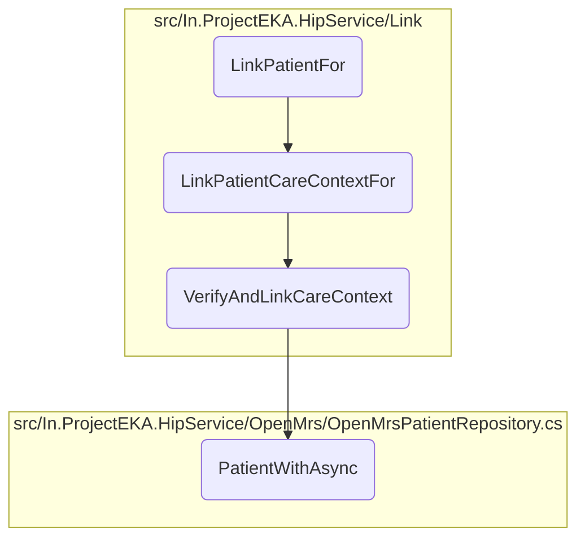

In this document, we will explain the process of linking patient care contexts. The process involves validating the account and care context reference numbers, verifying the transaction ID, authenticating the request with the patient, and finally linking the care contexts.

The flow starts with validating the account and care context reference numbers. Then, it verifies the transaction ID to ensure the care contexts were discovered for the patient. After that, the request is authenticated with the patient, usually through OTP verification. Once authenticated, the care contexts are linked, and a response is sent to the gateway.

# Flow drill down



<SwmSnippet path="/src/In.ProjectEKA.HipService/Link/LinkController.cs" line="51">

---

## Linking Patient Care Contexts

First, the <SwmToken path="src/In.ProjectEKA.HipService/Link/LinkController.cs" pos="65:5:5" line-data="        public AcceptedResult LinkPatientFor(">`LinkPatientFor`</SwmToken> method is responsible for initiating the process of linking patient care contexts. It validates the account reference number and care context reference number, checks the <SwmToken path="src/In.ProjectEKA.HipService/Link/LinkController.cs" pos="58:8:8" line-data="        /// 2. Validate transactionId in the request with discovery request entry to check whether there was a discovery and were these care contexts discovered or not for a given patient">`transactionId`</SwmToken> with the discovery request entry, and ensures the request is authenticated with the patient. If all validations pass, it enqueues the <SwmToken path="src/In.ProjectEKA.HipService/Link/LinkController.cs" pos="69:10:10" line-data="            backgroundJob.Enqueue(() =&gt; LinkPatientCareContextFor(request, correlationId));">`LinkPatientCareContextFor`</SwmToken> method to handle the linking process.

```c#
        /// <summary>
        /// Link patient's care contexts
        /// </summary>
        /// <remarks>
        /// Links care contexts associated with only one patient
        ///
        /// 1. Validate account reference number and care context reference number
        /// 2. Validate transactionId in the request with discovery request entry to check whether there was a discovery and were these care contexts discovered or not for a given patient
        /// 3. Before linking, HIP needs to authenticate the request with the patient(Ex: OTP verification)
        /// 4. Communicate the mode of authentication of a successful request with Consent Manager
        /// </remarks>
        /// <response code="202">Request accepted</response>
        [HttpPost(PATH_LINKS_LINK_CONFIRM)]
        [ProducesResponseType(StatusCodes.Status202Accepted)]
        public AcceptedResult LinkPatientFor(
            [FromHeader(Name = CORRELATION_ID)] string correlationId,
            [FromBody] LinkPatientRequest request)
        {
            backgroundJob.Enqueue(() => LinkPatientCareContextFor(request, correlationId));
            return Accepted();
        }
```

---

</SwmSnippet>

<SwmSnippet path="/src/In.ProjectEKA.HipService/Link/LinkController.cs" line="127">

---

## Handling the Linking Process

Next, the <SwmToken path="src/In.ProjectEKA.HipService/Link/LinkController.cs" pos="128:7:7" line-data="        public async Task LinkPatientCareContextFor(LinkPatientRequest request, String correlationId)">`LinkPatientCareContextFor`</SwmToken> method is called to handle the actual linking process. It verifies the patient's care context using the <SwmToken path="src/In.ProjectEKA.HipService/Link/LinkController.cs" pos="133:2:2" line-data="                    .VerifyAndLinkCareContext(new LinkConfirmationRequest(request.Confirmation.Token,">`VerifyAndLinkCareContext`</SwmToken> method and prepares a response to be sent to the gateway. If any exceptions occur, they are logged for further investigation.

```c#
        [NonAction]
        public async Task LinkPatientCareContextFor(LinkPatientRequest request, String correlationId)
        {
            try
            {
                var (patientLinkResponse, cmId, error) = await linkPatient
                    .VerifyAndLinkCareContext(new LinkConfirmationRequest(request.Confirmation.Token,
                        request.Confirmation.LinkRefNumber));
                var linkedPatientRepresentation = new LinkConfirmationRepresentation();
                if (patientLinkResponse != null || cmId != "")
                {
                    linkedPatientRepresentation = patientLinkResponse.Patient;
                }

                var response = new GatewayLinkConfirmResponse(
                    Guid.NewGuid(),
                    DateTime.Now.ToUniversalTime().ToString(DateTimeFormat),
                    linkedPatientRepresentation,
                    error?.Error,
                    new Resp(request.RequestId));
                await gatewayClient.SendDataToGateway(PATH_ON_LINK_CONFIRM, response, cmId, correlationId);
```

---

</SwmSnippet>

<SwmSnippet path="/src/In.ProjectEKA.HipService/Link/LinkPatient.cs" line="132">

---

## Verifying and Linking Care Contexts

Then, the <SwmToken path="src/In.ProjectEKA.HipService/Link/LinkPatient.cs" pos="133:1:1" line-data="            VerifyAndLinkCareContext(">`VerifyAndLinkCareContext`</SwmToken> method verifies the patient's care context by checking the link reference number and token. If the verification is successful, it retrieves the patient's details using the <SwmToken path="src/In.ProjectEKA.HipService/Link/LinkPatient.cs" pos="148:11:11" line-data="            var patient = await patientRepository.PatientWithAsync(linkEnquires.PatientReferenceNumber);">`PatientWithAsync`</SwmToken> method and updates the link request status. It also prepares a response with the linked care contexts and saves the linked accounts.

```c#
        public virtual async Task<ValueTuple<PatientLinkConfirmationRepresentation, string, ErrorRepresentation>>
            VerifyAndLinkCareContext(
            LinkConfirmationRequest request)
        {
            var (linkEnquires, exception) =
                await linkPatientRepository.GetPatientFor(request.LinkReferenceNumber);
            var cmId = "";
            if (exception != null)
                return (null,cmId,
                    new ErrorRepresentation(new Error(ErrorCode.NoLinkRequestFound, ErrorMessage.NoLinkRequestFound)));
            cmId = linkEnquires.ConsentManagerId;

            var errorResponse = await patientVerification.Verify(request.LinkReferenceNumber, request.Token);
            if (errorResponse != null)
                return (null,cmId, new ErrorRepresentation(errorResponse.toError()));

            var patient = await patientRepository.PatientWithAsync(linkEnquires.PatientReferenceNumber);
            return await patient.Map( async patient =>
                {
                    var savedLinkRequests = await linkPatientRepository.Get(request.LinkReferenceNumber);
                    savedLinkRequests.MatchSome(linkRequests =>
```

---

</SwmSnippet>

<SwmSnippet path="/src/In.ProjectEKA.HipService/OpenMrs/OpenMrsPatientRepository.cs" line="29">

---

## Retrieving Patient Details

Finally, the <SwmToken path="src/In.ProjectEKA.HipService/OpenMrs/OpenMrsPatientRepository.cs" pos="29:12:12" line-data="        public async Task&lt;Option&lt;Patient&gt;&gt; PatientWithAsync(string patientIdentifier)">`PatientWithAsync`</SwmToken> method retrieves the patient's details from the database using the patient identifier. It loads the patient's information, including care contexts and phone number, and returns the patient's details to be used in the linking process.

```c#
        public async Task<Option<Patient>> PatientWithAsync(string patientIdentifier)
        {
            var fhirPatient = await _patientDal.LoadPatientAsyncWithIdentifier(patientIdentifier);
            var firstName = fhirPatient.Name[0].GivenElement.FirstOrDefault().ToString();
            var hipPatient = fhirPatient.ToHipPatient(firstName);
            var referenceNumber = hipPatient.Uuid;
            hipPatient.CareContexts = await _careContextRepository.GetCareContexts(referenceNumber);
            hipPatient.PhoneNumber = await _phoneNumberRepository.GetPhoneNumber(referenceNumber);

            return Option.Some(hipPatient);
```

---

</SwmSnippet>

&nbsp;

*This is an auto-generated document by Swimm 🌊 and has not yet been verified by a human*

<SwmMeta version="3.0.0" repo-id="Z2l0aHViJTNBJTNBaGlwLXNlcnZpY2UlM0ElM0FTd2ltbS1EZW1v" repo-name="hip-service"><sup>Powered by [Swimm](/)</sup></SwmMeta>
