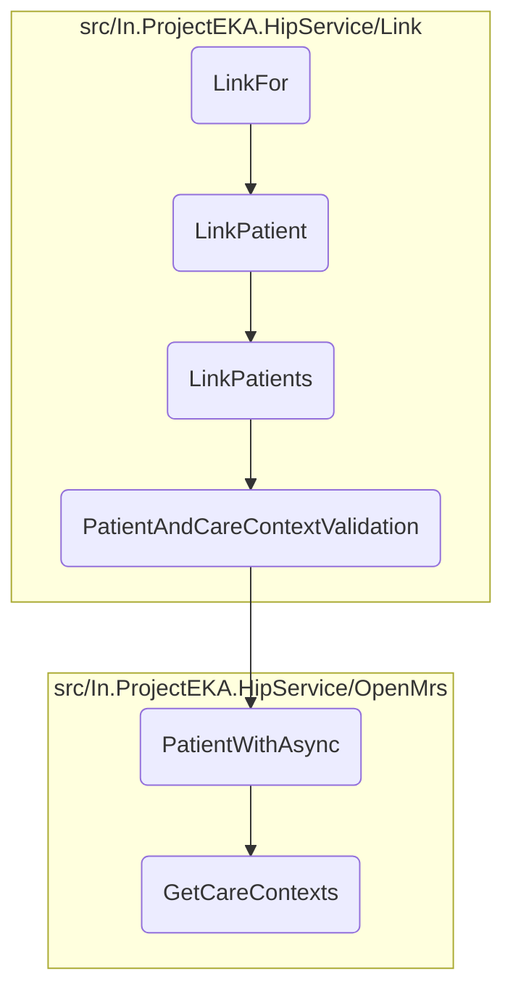

In this document, we will explain the process of linking patient data. The process involves initiating the linking process, processing the link request, handling patient linking, validating patient and care contexts, retrieving patient information, and fetching care contexts.

The flow starts with initiating the linking process by enqueuing a background job to link the patient data. Then, the link request is processed by extracting patient information and creating a link enquiry object. The system checks if a discovery request exists for the given transaction and patient details. If it exists, a patient link enquiry is created, and the linking process is handled. The patient and care context information are validated, and a link reference number is generated. The link request is saved, an OTP is sent for verification, and the discovery request is deleted. Patient information is retrieved from the database, and care contexts are fetched for the given patient UUID.

# Flow drill down



<SwmSnippet path="/src/In.ProjectEKA.HipService/Link/LinkController.cs" line="41">

---

## Linking Patient Data

First, the <SwmToken path="src/In.ProjectEKA.HipService/Link/LinkController.cs" pos="43:5:5" line-data="        public AcceptedResult LinkFor(">`LinkFor`</SwmToken> function initiates the linking process by enqueuing a background job to link the patient data. This ensures that the linking process is handled asynchronously, improving the system's responsiveness.

```c#
        [HttpPost(PATH_LINKS_LINK_INIT)]
        [ProducesResponseType(StatusCodes.Status202Accepted)]
        public AcceptedResult LinkFor(
            [FromHeader(Name = CORRELATION_ID)] string correlationId,
            [FromBody] LinkReferenceRequest request)
        {
            backgroundJob.Enqueue(() => LinkPatient(request, correlationId));
            return Accepted();
        }
```

---

</SwmSnippet>

<SwmSnippet path="/src/In.ProjectEKA.HipService/Link/LinkController.cs" line="73">

---

## Processing Link Request

Moving to the <SwmToken path="src/In.ProjectEKA.HipService/Link/LinkController.cs" pos="74:7:7" line-data="        public async Task LinkPatient(LinkReferenceRequest request, string correlationId)">`LinkPatient`</SwmToken> function, it processes the link request by first extracting patient information and creating a <SwmToken path="src/In.ProjectEKA.HipService/Link/LinkController.cs" pos="78:9:9" line-data="            var patient = new LinkEnquiry(">`LinkEnquiry`</SwmToken> object. It then checks if a discovery request exists for the given transaction and patient details. If the request exists, it proceeds to create a <SwmToken path="src/In.ProjectEKA.HipService/Link/LinkPatient.cs" pos="53:1:1" line-data="            PatientLinkEnquiry request)">`PatientLinkEnquiry`</SwmToken> and calls the <SwmToken path="src/In.ProjectEKA.HipService/Link/LinkPatient.cs" pos="52:17:17" line-data="        public virtual async Task&lt;ValueTuple&lt;PatientLinkEnquiryRepresentation, ErrorRepresentation&gt;&gt; LinkPatients(">`LinkPatients`</SwmToken> function to handle the linking process.

```c#
        [NonAction]
        public async Task LinkPatient(LinkReferenceRequest request, string correlationId)
        {
            var cmUserId = request.Patient.Id;
            var cmSuffix = cmUserId.Substring(cmUserId.LastIndexOf("@", StringComparison.Ordinal) + 1);
            var patient = new LinkEnquiry(
                cmSuffix,
                cmUserId,
                request.Patient.ReferenceNumber,
                request.Patient.CareContexts);
            try
            {
                var doesRequestExists = await discoveryRequestRepository.RequestExistsFor(
                    request.TransactionId,
                    request.Patient?.Id,
                    request.Patient?.ReferenceNumber);

                ErrorRepresentation errorRepresentation = null;
                if (!doesRequestExists)
                {
                    errorRepresentation = new ErrorRepresentation(
```

---

</SwmSnippet>

<SwmSnippet path="/src/In.ProjectEKA.HipService/Link/LinkPatient.cs" line="52">

---

## Handling Patient Linking

Next, the <SwmToken path="src/In.ProjectEKA.HipService/Link/LinkPatient.cs" pos="52:17:17" line-data="        public virtual async Task&lt;ValueTuple&lt;PatientLinkEnquiryRepresentation, ErrorRepresentation&gt;&gt; LinkPatients(">`LinkPatients`</SwmToken> function handles the actual linking of patient data. It validates the patient and care context information, generates a link reference number, and saves the link request. It also sends an OTP for verification and deletes the discovery request once the linking is initiated.

```c#
        public virtual async Task<ValueTuple<PatientLinkEnquiryRepresentation, ErrorRepresentation>> LinkPatients(
            PatientLinkEnquiry request)
        {
            var (patient, error) = await PatientAndCareContextValidation(request);
            if (error != null)
            {
                Log.Error(error.Error.Message);
                return (null, error);
            }

            var linkRefNumber = referenceNumberGenerator.NewGuid();
            using (var scope = new TransactionScope(TransactionScopeAsyncFlowOption.Enabled))
            {
                if (!await SaveInitiatedLinkRequest(request.RequestId, request.TransactionId, linkRefNumber)
                    .ConfigureAwait(false))
                    return (null,
                        new ErrorRepresentation(new Error(ErrorCode.DuplicateRequestId, ErrorMessage.DuplicateRequestId))
                        );

                var careContextReferenceNumbers = request.Patient.CareContexts
                    .Select(context => context.ReferenceNumber)
```

---

</SwmSnippet>

<SwmSnippet path="/src/In.ProjectEKA.HipService/Link/LinkPatient.cs" line="110">

---

## Validating Patient and Care Contexts

Then, the <SwmToken path="src/In.ProjectEKA.HipService/Link/LinkPatient.cs" pos="110:21:21" line-data="        private async Task&lt;ValueTuple&lt;HipLibrary.Patient.Model.Patient, ErrorRepresentation&gt;&gt; PatientAndCareContextValidation(">`PatientAndCareContextValidation`</SwmToken> function validates the patient and care context information by checking if the care contexts provided in the request match the ones stored in the system. If any care context is not found, it returns an error.

```c#
        private async Task<ValueTuple<HipLibrary.Patient.Model.Patient, ErrorRepresentation>> PatientAndCareContextValidation(
            PatientLinkEnquiry request)
        {
            var patient = await patientRepository.PatientWithAsync(request.Patient.ReferenceNumber);
            return patient.Map(patient =>
                    {
                        var programs = request.Patient.CareContexts
                            .Where(careContext =>
                                patient.CareContexts.Any(c => c.ReferenceNumber == careContext.ReferenceNumber))
                            .Select(context => new CareContextRepresentation(context.ReferenceNumber,
                                patient.CareContexts.First(info => info.ReferenceNumber == context.ReferenceNumber)
                                    .Display)).ToList();
                        if (programs.Count != request.Patient.CareContexts.Count())
                            return (null, new ErrorRepresentation(new Error(ErrorCode.CareContextNotFound,
                                ErrorMessage.CareContextNotFound)));

                        return (patient, (ErrorRepresentation) null);
                    })
                .ValueOr((null,
                    new ErrorRepresentation(new Error(ErrorCode.NoPatientFound, ErrorMessage.NoPatientFound))));
        }
```

---

</SwmSnippet>

<SwmSnippet path="/src/In.ProjectEKA.HipService/OpenMrs/OpenMrsPatientRepository.cs" line="29">

---

## Retrieving Patient Information

Diving into the <SwmToken path="src/In.ProjectEKA.HipService/OpenMrs/OpenMrsPatientRepository.cs" pos="29:12:12" line-data="        public async Task&lt;Option&lt;Patient&gt;&gt; PatientWithAsync(string patientIdentifier)">`PatientWithAsync`</SwmToken> function, it retrieves patient information from the database using the patient identifier. It also fetches the care contexts and phone number associated with the patient.

```c#
        public async Task<Option<Patient>> PatientWithAsync(string patientIdentifier)
        {
            var fhirPatient = await _patientDal.LoadPatientAsyncWithIdentifier(patientIdentifier);
            var firstName = fhirPatient.Name[0].GivenElement.FirstOrDefault().ToString();
            var hipPatient = fhirPatient.ToHipPatient(firstName);
            var referenceNumber = hipPatient.Uuid;
            hipPatient.CareContexts = await _careContextRepository.GetCareContexts(referenceNumber);
            hipPatient.PhoneNumber = await _phoneNumberRepository.GetPhoneNumber(referenceNumber);

            return Option.Some(hipPatient);
        }
```

---

</SwmSnippet>

<SwmSnippet path="/src/In.ProjectEKA.HipService/OpenMrs/OpenMrsCareContextRepository.cs" line="19">

---

## Fetching Care Contexts

Finally, the <SwmToken path="src/In.ProjectEKA.HipService/OpenMrs/OpenMrsCareContextRepository.cs" pos="19:12:12" line-data="        public async Task&lt;IEnumerable&lt;CareContextRepresentation&gt;&gt; GetCareContexts(string patientUuid)">`GetCareContexts`</SwmToken> function fetches the care contexts for a given patient UUID from the database. It constructs the query parameters and sends a request to the OpenMRS client to retrieve the care context information.

```c#
        public async Task<IEnumerable<CareContextRepresentation>> GetCareContexts(string patientUuid)
        {
            var path = DiscoveryPathConstants.CareContextPath;
            var query = HttpUtility.ParseQueryString(string.Empty);
            if (!string.IsNullOrEmpty(patientUuid))
            {
                query["patientUuid"] = patientUuid;
            }

            if (query.ToString() != "")
            {
                path = $"{path}?{query}";
            }

            var response = await openMrsClient.GetAsync(path);
            var content = await response.Content.ReadAsStringAsync();
            var jsonDoc = JsonDocument.Parse(content);
            var root = jsonDoc.RootElement;
            var careContexts = new List<CareContextRepresentation>();

            for (var i = 0; i < root.GetArrayLength(); i++)
```

---

</SwmSnippet>

&nbsp;

*This is an auto-generated document by Swimm 🌊 and has not yet been verified by a human*

<SwmMeta version="3.0.0" repo-id="Z2l0aHViJTNBJTNBaGlwLXNlcnZpY2UlM0ElM0FTd2ltbS1EZW1v" repo-name="hip-service"><sup>Powered by [Swimm](/)</sup></SwmMeta>
