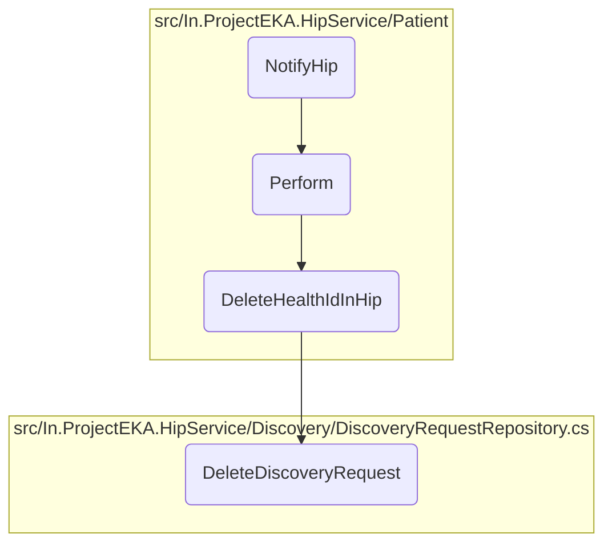

```mermaid
graph TD
  subgraph DeleteHealthIdInHip
    DeleteHealthIdInHip:A["Call DeleteDiscoveryRequest with healthId"] --> DeleteHealthIdInHip:B["Delete linked accounts"]
    DeleteHealthIdInHip:B --> DeleteHealthIdInHip:C["Delete link enquiries"]
    DeleteHealthIdInHip:C --> DeleteHealthIdInHip:D["Delete user authentication"]
    DeleteHealthIdInHip:D --> DeleteHealthIdInHip:E["Delete user demographics"]
    DeleteHealthIdInHip:E --> DeleteHealthIdInHip:F["Delete consent artefact"]
  end
  subgraph DeleteDiscoveryRequest
    DeleteDiscoveryRequest:A["Find discovery requests with healthId"] --> DeleteDiscoveryRequest:B["Remove discovery requests"]
    DeleteDiscoveryRequest:B --> DeleteDiscoveryRequest:C["Save changes asynchronously"]
  end
  DeleteHealthIdInHip:A --> DeleteDiscoveryRequest

%% Swimm:
%% graph TD
%%   subgraph <SwmToken path="src/In.ProjectEKA.HipService/Patient/PatientNotificationService.cs" pos="40:18:18" line-data="                if (status.Equals(Action.DELETED.ToString())) DeleteHealthIdInHip(healthId);">`DeleteHealthIdInHip`</SwmToken>
%%     <SwmToken path="src/In.ProjectEKA.HipService/Patient/PatientNotificationService.cs" pos="40:18:18" line-data="                if (status.Equals(Action.DELETED.ToString())) DeleteHealthIdInHip(healthId);">`DeleteHealthIdInHip`</SwmToken>:A["Call <SwmToken path="src/In.ProjectEKA.HipService/Patient/PatientNotificationService.cs" pos="47:3:3" line-data="            discoveryRequestRepository.DeleteDiscoveryRequest(healthId);">`DeleteDiscoveryRequest`</SwmToken> with <SwmToken path="src/In.ProjectEKA.HipService/Patient/PatientNotificationService.cs" pos="36:3:3" line-data="            var healthId = hipPatientStatusNotification.notification.patient.id;">`healthId`</SwmToken>"] --> <SwmToken path="src/In.ProjectEKA.HipService/Patient/PatientNotificationService.cs" pos="40:18:18" line-data="                if (status.Equals(Action.DELETED.ToString())) DeleteHealthIdInHip(healthId);">`DeleteHealthIdInHip`</SwmToken>:B["Delete linked accounts"]
%%     <SwmToken path="src/In.ProjectEKA.HipService/Patient/PatientNotificationService.cs" pos="40:18:18" line-data="                if (status.Equals(Action.DELETED.ToString())) DeleteHealthIdInHip(healthId);">`DeleteHealthIdInHip`</SwmToken>:B --> <SwmToken path="src/In.ProjectEKA.HipService/Patient/PatientNotificationService.cs" pos="40:18:18" line-data="                if (status.Equals(Action.DELETED.ToString())) DeleteHealthIdInHip(healthId);">`DeleteHealthIdInHip`</SwmToken>:C["Delete link enquiries"]
%%     <SwmToken path="src/In.ProjectEKA.HipService/Patient/PatientNotificationService.cs" pos="40:18:18" line-data="                if (status.Equals(Action.DELETED.ToString())) DeleteHealthIdInHip(healthId);">`DeleteHealthIdInHip`</SwmToken>:C --> <SwmToken path="src/In.ProjectEKA.HipService/Patient/PatientNotificationService.cs" pos="40:18:18" line-data="                if (status.Equals(Action.DELETED.ToString())) DeleteHealthIdInHip(healthId);">`DeleteHealthIdInHip`</SwmToken>:D["Delete user authentication"]
%%     <SwmToken path="src/In.ProjectEKA.HipService/Patient/PatientNotificationService.cs" pos="40:18:18" line-data="                if (status.Equals(Action.DELETED.ToString())) DeleteHealthIdInHip(healthId);">`DeleteHealthIdInHip`</SwmToken>:D --> <SwmToken path="src/In.ProjectEKA.HipService/Patient/PatientNotificationService.cs" pos="40:18:18" line-data="                if (status.Equals(Action.DELETED.ToString())) DeleteHealthIdInHip(healthId);">`DeleteHealthIdInHip`</SwmToken>:E["Delete user demographics"]
%%     <SwmToken path="src/In.ProjectEKA.HipService/Patient/PatientNotificationService.cs" pos="40:18:18" line-data="                if (status.Equals(Action.DELETED.ToString())) DeleteHealthIdInHip(healthId);">`DeleteHealthIdInHip`</SwmToken>:E --> <SwmToken path="src/In.ProjectEKA.HipService/Patient/PatientNotificationService.cs" pos="40:18:18" line-data="                if (status.Equals(Action.DELETED.ToString())) DeleteHealthIdInHip(healthId);">`DeleteHealthIdInHip`</SwmToken>:F["Delete consent artefact"]
%%   end
%%   subgraph <SwmToken path="src/In.ProjectEKA.HipService/Patient/PatientNotificationService.cs" pos="47:3:3" line-data="            discoveryRequestRepository.DeleteDiscoveryRequest(healthId);">`DeleteDiscoveryRequest`</SwmToken>
%%     <SwmToken path="src/In.ProjectEKA.HipService/Patient/PatientNotificationService.cs" pos="47:3:3" line-data="            discoveryRequestRepository.DeleteDiscoveryRequest(healthId);">`DeleteDiscoveryRequest`</SwmToken>:A["Find discovery requests with <SwmToken path="src/In.ProjectEKA.HipService/Patient/PatientNotificationService.cs" pos="36:3:3" line-data="            var healthId = hipPatientStatusNotification.notification.patient.id;">`healthId`</SwmToken>"] --> <SwmToken path="src/In.ProjectEKA.HipService/Patient/PatientNotificationService.cs" pos="47:3:3" line-data="            discoveryRequestRepository.DeleteDiscoveryRequest(healthId);">`DeleteDiscoveryRequest`</SwmToken>:B["Remove discovery requests"]
%%     <SwmToken path="src/In.ProjectEKA.HipService/Patient/PatientNotificationService.cs" pos="47:3:3" line-data="            discoveryRequestRepository.DeleteDiscoveryRequest(healthId);">`DeleteDiscoveryRequest`</SwmToken>:B --> <SwmToken path="src/In.ProjectEKA.HipService/Patient/PatientNotificationService.cs" pos="47:3:3" line-data="            discoveryRequestRepository.DeleteDiscoveryRequest(healthId);">`DeleteDiscoveryRequest`</SwmToken>:C["Save changes asynchronously"]
%%   end
%%   <SwmToken path="src/In.ProjectEKA.HipService/Patient/PatientNotificationService.cs" pos="40:18:18" line-data="                if (status.Equals(Action.DELETED.ToString())) DeleteHealthIdInHip(healthId);">`DeleteHealthIdInHip`</SwmToken>:A --> <SwmToken path="src/In.ProjectEKA.HipService/Patient/PatientNotificationService.cs" pos="47:3:3" line-data="            discoveryRequestRepository.DeleteDiscoveryRequest(healthId);">`DeleteDiscoveryRequest`</SwmToken>
```

In this document, we will explain the <SwmToken path="src/In.ProjectEKA.HipService/Patient/PatientController.cs" pos="32:10:10" line-data="        public async Task&lt;AcceptedResult&gt; NotifyHip([FromHeader(Name = CORRELATION_ID)] string correlationId,">`NotifyHip`</SwmToken> process. This process involves handling patient status notifications, performing necessary actions based on the status, and deleting health IDs and related data from various repositories.

The flow starts with receiving a patient status notification, then performs actions based on the status, such as deleting health IDs if the status is 'DELETED'. Finally, it ensures that all related data is removed from the system.

Here is a high level diagram of the flow, showing only the most important functions:



# Flow drill down

```mermaid
graph TD
subgraph NotifyHip
NotifyHip:A["Get cmSuffix from _gatewayConfiguration"] --> NotifyHip:B["Call Perform on _patientNotificationService"]
NotifyHip:B --> NotifyHip:C["Create HipPatientNotifyConfirmation"]
NotifyHip:C --> NotifyHip:D["Send data to _gatewayClient"]
end

%% Swimm:
%% graph TD
%% subgraph <SwmToken path="src/In.ProjectEKA.HipService/Patient/PatientController.cs" pos="32:10:10" line-data="        public async Task&lt;AcceptedResult&gt; NotifyHip([FromHeader(Name = CORRELATION_ID)] string correlationId,">`NotifyHip`</SwmToken>
%% <SwmToken path="src/In.ProjectEKA.HipService/Patient/PatientController.cs" pos="32:10:10" line-data="        public async Task&lt;AcceptedResult&gt; NotifyHip([FromHeader(Name = CORRELATION_ID)] string correlationId,">`NotifyHip`</SwmToken>:A["Get <SwmToken path="src/In.ProjectEKA.HipService/Patient/PatientController.cs" pos="35:3:3" line-data="            var cmSuffix = _gatewayConfiguration.CmSuffix;">`cmSuffix`</SwmToken> from <SwmToken path="src/In.ProjectEKA.HipService/Patient/PatientController.cs" pos="35:7:7" line-data="            var cmSuffix = _gatewayConfiguration.CmSuffix;">`_gatewayConfiguration`</SwmToken>"] --> <SwmToken path="src/In.ProjectEKA.HipService/Patient/PatientController.cs" pos="32:10:10" line-data="        public async Task&lt;AcceptedResult&gt; NotifyHip([FromHeader(Name = CORRELATION_ID)] string correlationId,">`NotifyHip`</SwmToken>:B["Call Perform on <SwmToken path="src/In.ProjectEKA.HipService/Patient/PatientController.cs" pos="36:3:3" line-data="            await _patientNotificationService.Perform(hipPatientStatusNotification);">`_patientNotificationService`</SwmToken>"]
%% <SwmToken path="src/In.ProjectEKA.HipService/Patient/PatientController.cs" pos="32:10:10" line-data="        public async Task&lt;AcceptedResult&gt; NotifyHip([FromHeader(Name = CORRELATION_ID)] string correlationId,">`NotifyHip`</SwmToken>:B --> <SwmToken path="src/In.ProjectEKA.HipService/Patient/PatientController.cs" pos="32:10:10" line-data="        public async Task&lt;AcceptedResult&gt; NotifyHip([FromHeader(Name = CORRELATION_ID)] string correlationId,">`NotifyHip`</SwmToken>:C["Create <SwmToken path="src/In.ProjectEKA.HipService/Patient/PatientController.cs" pos="37:9:9" line-data="            var gatewayResponse = new HipPatientNotifyConfirmation(">`HipPatientNotifyConfirmation`</SwmToken>"]
%% <SwmToken path="src/In.ProjectEKA.HipService/Patient/PatientController.cs" pos="32:10:10" line-data="        public async Task&lt;AcceptedResult&gt; NotifyHip([FromHeader(Name = CORRELATION_ID)] string correlationId,">`NotifyHip`</SwmToken>:C --> <SwmToken path="src/In.ProjectEKA.HipService/Patient/PatientController.cs" pos="32:10:10" line-data="        public async Task&lt;AcceptedResult&gt; NotifyHip([FromHeader(Name = CORRELATION_ID)] string correlationId,">`NotifyHip`</SwmToken>:D["Send data to <SwmToken path="src/In.ProjectEKA.HipService/Patient/PatientController.cs" pos="42:3:3" line-data="            await _gatewayClient.SendDataToGateway(PATH_PATIENT_ON_NOTIFY,">`_gatewayClient`</SwmToken>"]
%% end
```

## Looking at <SwmToken path="src/In.ProjectEKA.HipService/Patient/PatientController.cs" pos="32:10:10" line-data="        public async Task&lt;AcceptedResult&gt; NotifyHip([FromHeader(Name = CORRELATION_ID)] string correlationId,">`NotifyHip`</SwmToken>



<SwmSnippet path="/src/In.ProjectEKA.HipService/Patient/PatientController.cs" line="31">

---

## Handling patient status notifications

First, the <SwmToken path="src/In.ProjectEKA.HipService/Patient/PatientController.cs" pos="32:10:10" line-data="        public async Task&lt;AcceptedResult&gt; NotifyHip([FromHeader(Name = CORRELATION_ID)] string correlationId,">`NotifyHip`</SwmToken> function is responsible for handling patient status notifications. It receives a correlation ID from the header and a <SwmToken path="src/In.ProjectEKA.HipService/Patient/PatientController.cs" pos="33:5:5" line-data="            [FromBody] HipPatientStatusNotification hipPatientStatusNotification)">`HipPatientStatusNotification`</SwmToken> object from the body of the request. The function then retrieves the CM suffix from the gateway configuration and calls the <SwmToken path="src/In.ProjectEKA.HipService/Patient/PatientController.cs" pos="36:5:5" line-data="            await _patientNotificationService.Perform(hipPatientStatusNotification);">`Perform`</SwmToken> method of the <SwmToken path="src/In.ProjectEKA.HipService/Patient/PatientController.cs" pos="36:3:3" line-data="            await _patientNotificationService.Perform(hipPatientStatusNotification);">`_patientNotificationService`</SwmToken> to process the notification.

```c#
        [Route(PATH_PATIENT_NOTIFY)]
        public async Task<AcceptedResult> NotifyHip([FromHeader(Name = CORRELATION_ID)] string correlationId,
            [FromBody] HipPatientStatusNotification hipPatientStatusNotification)
        {
            var cmSuffix = _gatewayConfiguration.CmSuffix;
            await _patientNotificationService.Perform(hipPatientStatusNotification);
```

---

</SwmSnippet>

<SwmSnippet path="/src/In.ProjectEKA.HipService/Patient/PatientController.cs" line="37">

---

## Sending confirmation to the gateway

Next, the function creates a <SwmToken path="src/In.ProjectEKA.HipService/Patient/PatientController.cs" pos="37:9:9" line-data="            var gatewayResponse = new HipPatientNotifyConfirmation(">`HipPatientNotifyConfirmation`</SwmToken> object, which includes a unique ID, the current timestamp, a success status, and the request ID from the notification. This confirmation object is then sent to the gateway using the <SwmToken path="src/In.ProjectEKA.HipService/Patient/PatientController.cs" pos="42:3:3" line-data="            await _gatewayClient.SendDataToGateway(PATH_PATIENT_ON_NOTIFY,">`_gatewayClient`</SwmToken>'s <SwmToken path="src/In.ProjectEKA.HipService/Patient/PatientController.cs" pos="42:5:5" line-data="            await _gatewayClient.SendDataToGateway(PATH_PATIENT_ON_NOTIFY,">`SendDataToGateway`</SwmToken> method. The function finally returns an <SwmToken path="src/In.ProjectEKA.HipService/Patient/PatientController.cs" pos="32:7:7" line-data="        public async Task&lt;AcceptedResult&gt; NotifyHip([FromHeader(Name = CORRELATION_ID)] string correlationId,">`AcceptedResult`</SwmToken> to indicate that the notification was successfully processed.

```c#
            var gatewayResponse = new HipPatientNotifyConfirmation(
                Guid.NewGuid().ToString(),
                DateTime.Now.ToUniversalTime().ToString(DateTimeFormat),
                new PatientNotifyAcknowledgement(Status.SUCCESS.ToString()), null,
                new Resp(hipPatientStatusNotification.requestId.ToString()));
            await _gatewayClient.SendDataToGateway(PATH_PATIENT_ON_NOTIFY,
                gatewayResponse,
                cmSuffix,
                correlationId);
            return Accepted();
```

---

</SwmSnippet>

## Breaking down Perform

```mermaid
graph TD
  subgraph Perform
    Perform:A["Get health ID"] --> Perform:B["Get status"]
    Perform:B --> Perform:C["Is status defined in Action?"]
    Perform:C -->|Yes| Perform:D["Is status DELETE?"]
    Perform:D -->|Yes| Perform:E["Call DeleteHealthIdInHip"]
    Perform:D --> Perform:F["Call RemoveHealthIdInOpenMrs"]
    Perform:E --> Perform:F
  end

%% Swimm:
%% graph TD
%%   subgraph Perform
%%     Perform:A["Get health ID"] --> Perform:B["Get status"]
%%     Perform:B --> Perform:C["Is status defined in Action?"]
%%     Perform:C -->|Yes| Perform:D["Is status DELETE?"]
%%     Perform:D -->|Yes| Perform:E["Call <SwmToken path="src/In.ProjectEKA.HipService/Patient/PatientNotificationService.cs" pos="40:18:18" line-data="                if (status.Equals(Action.DELETED.ToString())) DeleteHealthIdInHip(healthId);">`DeleteHealthIdInHip`</SwmToken>"]
%%     Perform:D --> Perform:F["Call <SwmToken path="src/In.ProjectEKA.HipService/Patient/PatientNotificationService.cs" pos="41:3:3" line-data="                await RemoveHealthIdInOpenMrs(healthId, status);">`RemoveHealthIdInOpenMrs`</SwmToken>"]
%%     Perform:E --> Perform:F
%%   end
```



## Handling patient status notifications

First, the <SwmToken path="src/In.ProjectEKA.HipService/Patient/PatientController.cs" pos="36:5:5" line-data="            await _patientNotificationService.Perform(hipPatientStatusNotification);">`Perform`</SwmToken> method is responsible for handling patient status notifications. It takes a <SwmToken path="src/In.ProjectEKA.HipService/Patient/PatientController.cs" pos="33:5:5" line-data="            [FromBody] HipPatientStatusNotification hipPatientStatusNotification)">`HipPatientStatusNotification`</SwmToken> object as input, which contains the patient's health ID and their status.

<SwmSnippet path="/src/In.ProjectEKA.HipService/Patient/PatientNotificationService.cs" line="36">

---

Next, the method extracts the health ID and status from the notification object. This is crucial for identifying the patient and determining the appropriate action based on their status.

```c#
            var healthId = hipPatientStatusNotification.notification.patient.id;
            var status = hipPatientStatusNotification.notification.status.ToString();
```

---

</SwmSnippet>

<SwmSnippet path="/src/In.ProjectEKA.HipService/Patient/PatientNotificationService.cs" line="38">

---

Then, the method checks if the status is a defined action within the system. This ensures that only valid statuses are processed, preventing any unexpected behavior.

```c#
            if (Enum.IsDefined(typeof(Action), status))
```

---

</SwmSnippet>

<SwmSnippet path="/src/In.ProjectEKA.HipService/Patient/PatientNotificationService.cs" line="40">

---

Moving to the next step, if the status is 'DELETED', the method calls <SwmToken path="src/In.ProjectEKA.HipService/Patient/PatientNotificationService.cs" pos="40:18:18" line-data="                if (status.Equals(Action.DELETED.ToString())) DeleteHealthIdInHip(healthId);">`DeleteHealthIdInHip`</SwmToken> to delete all data related to the health ID from various repositories. This is important for maintaining data integrity and ensuring that deleted patients' data is properly removed.

```c#
                if (status.Equals(Action.DELETED.ToString())) DeleteHealthIdInHip(healthId);
```

---

</SwmSnippet>

<SwmSnippet path="/src/In.ProjectEKA.HipService/Patient/PatientNotificationService.cs" line="41">

---

Finally, the method calls <SwmToken path="src/In.ProjectEKA.HipService/Patient/PatientNotificationService.cs" pos="41:3:3" line-data="                await RemoveHealthIdInOpenMrs(healthId, status);">`RemoveHealthIdInOpenMrs`</SwmToken> to remove the health ID from the OpenMRS system, ensuring that the patient's status is updated across all relevant systems.

```c#
                await RemoveHealthIdInOpenMrs(healthId, status);
```

---

</SwmSnippet>

## Zooming into <SwmToken path="src/In.ProjectEKA.HipService/Patient/PatientNotificationService.cs" pos="40:18:18" line-data="                if (status.Equals(Action.DELETED.ToString())) DeleteHealthIdInHip(healthId);">`DeleteHealthIdInHip`</SwmToken> & <SwmToken path="src/In.ProjectEKA.HipService/Patient/PatientNotificationService.cs" pos="47:3:3" line-data="            discoveryRequestRepository.DeleteDiscoveryRequest(healthId);">`DeleteDiscoveryRequest`</SwmToken>



<SwmSnippet path="/src/In.ProjectEKA.HipService/Patient/PatientNotificationService.cs" line="45">

---

## Deleting Health ID and Related Data

First, the <SwmToken path="src/In.ProjectEKA.HipService/Patient/PatientNotificationService.cs" pos="45:5:5" line-data="        private void DeleteHealthIdInHip(string healthId)">`DeleteHealthIdInHip`</SwmToken> function is responsible for deleting a user's health ID and all associated data from various repositories. This ensures that all traces of the user's data are removed from the system.

```c#
        private void DeleteHealthIdInHip(string healthId)
        {
            discoveryRequestRepository.DeleteDiscoveryRequest(healthId);
            linkPatientRepository.DeleteLinkedAccounts(healthId);
            linkPatientRepository.DeleteLinkEnquires(healthId);
            userAuthRepository.Delete(healthId);
            userAuthRepository.DeleteDemographics(healthId);
            consentRepository.DeleteConsentArtefact(healthId);
        }
```

---

</SwmSnippet>

<SwmSnippet path="/src/In.ProjectEKA.HipService/Discovery/DiscoveryRequestRepository.cs" line="52">

---

### Deleting Discovery Requests

Next, the <SwmToken path="src/In.ProjectEKA.HipService/Discovery/DiscoveryRequestRepository.cs" pos="52:7:7" line-data="        public async Task DeleteDiscoveryRequest(string healthId)">`DeleteDiscoveryRequest`</SwmToken> function is called within <SwmToken path="src/In.ProjectEKA.HipService/Patient/PatientNotificationService.cs" pos="40:18:18" line-data="                if (status.Equals(Action.DELETED.ToString())) DeleteHealthIdInHip(healthId);">`DeleteHealthIdInHip`</SwmToken>. This function deletes discovery requests from the context where the health ID matches the given parameter and then saves the changes to the database asynchronously. This step ensures that any discovery requests associated with the health ID are removed.

```c#
        public async Task DeleteDiscoveryRequest(string healthId)
        {
            var discoveryRequests = discoveryContext.DiscoveryRequest
                .Where(request =>
                    request.ConsentManagerUserId == healthId);
            foreach (var discoveryRequest in discoveryRequests)
            {
                discoveryContext.Remove(discoveryRequest);
            }

            await discoveryContext.SaveChangesAsync();
        }
```

---

</SwmSnippet>

&nbsp;

*This is an auto-generated document by Swimm 🌊 and has not yet been verified by a human*

<SwmMeta version="3.0.0" repo-id="Z2l0aHViJTNBJTNBaGlwLXNlcnZpY2UlM0ElM0FTd2ltbS1EZW1v" repo-name="hip-service"><sup>Powered by [Swimm](/)</sup></SwmMeta>
