In this document, we will explain the process of notifying the gateway when there is a failure in data transfer. The process involves setting up necessary configurations, simulating a failure, and ensuring the gateway is notified.

The flow starts by setting up the necessary configurations and mocks. Then, it simulates a failure in data transfer by throwing an exception. Finally, it verifies that the system properly notifies the gateway about the failure, ensuring appropriate actions can be taken.

# Flow drill down

```mermaid
graph TD;
      subgraph srcInProjectEKAHipServiceDataFlow["src/In.ProjectEKA.HipService/DataFlow"]
f692f0c2d0ac18a4a0f67487ac6571bb31f47b6b33394cb42fd9e410dc906ff2(ShouldNotifyGatewayAboutFailureInDataTransfer) --> c9d796bfd5d9245dda9e6770a132540969064581b0d206bd5244e6c71f05a59a(SendDataToHiu)
end

subgraph srcInProjectEKAHipServiceDataFlow["src/In.ProjectEKA.HipService/DataFlow"]
c9d796bfd5d9245dda9e6770a132540969064581b0d206bd5244e6c71f05a59a(SendDataToHiu) --> de87029b085ba0bfbc501cb4d0247fd17ec5da0b704ca2f6678c47ee2ee54d3e(PostTo)
end

subgraph srcInProjectEKAHipServiceDataFlow["src/In.ProjectEKA.HipService/DataFlow"]
de87029b085ba0bfbc501cb4d0247fd17ec5da0b704ca2f6678c47ee2ee54d3e(PostTo) --> bf771a0a0b89d8a519e583a8ccb25b40f0a10871f9290ba76de4d45fc238a5a6(GetDataNotificationRequest)
end

subgraph srcInProjectEKAHipServiceDataFlow["src/In.ProjectEKA.HipService/DataFlow"]
bf771a0a0b89d8a519e583a8ccb25b40f0a10871f9290ba76de4d45fc238a5a6(GetDataNotificationRequest) --> b606a099c9228225dda5462a248d2bdc1deac70e74cff407cac66d79cfa3dca8(NotifyGateway)
end


      classDef mainFlowStyle color:#000000,fill:#7CB9F4
classDef rootsStyle color:#000000,fill:#00FFF4
classDef Style1 color:#000000,fill:#00FFAA
classDef Style2 color:#000000,fill:#FFFF00
classDef Style3 color:#000000,fill:#AA7CB9
```



<SwmSnippet path="/test/In.ProjectEKA.HipServiceTest/DataFlow/DataFlowClientTest.cs" line="88">

---

## <SwmToken path="test/In.ProjectEKA.HipServiceTest/DataFlow/DataFlowClientTest.cs" pos="86:5:5" line-data="        private void ShouldNotifyGatewayAboutFailureInDataTransfer()">`ShouldNotifyGatewayAboutFailureInDataTransfer`</SwmToken>

First, the function <SwmToken path="test/In.ProjectEKA.HipServiceTest/DataFlow/DataFlowClientTest.cs" pos="86:5:5" line-data="        private void ShouldNotifyGatewayAboutFailureInDataTransfer()">`ShouldNotifyGatewayAboutFailureInDataTransfer`</SwmToken> sets up the necessary mocks and configurations for the test. It creates a mock <SwmToken path="test/In.ProjectEKA.HipServiceTest/DataFlow/DataFlowClientTest.cs" pos="89:11:11" line-data="            var dataFlowNotificationClient = new Mock&lt;DataFlowNotificationClient&gt;(MockBehavior.Strict, null);">`DataFlowNotificationClient`</SwmToken>, a <SwmToken path="test/In.ProjectEKA.HipServiceTest/DataFlow/DataFlowClientTest.cs" pos="90:9:9" line-data="            var configuration = new GatewayConfiguration">`GatewayConfiguration`</SwmToken> with a client ID, and a mock <SwmToken path="test/In.ProjectEKA.HipServiceTest/DataFlow/DataFlowClientTest.cs" pos="94:11:11" line-data="            var handlerMock = new Mock&lt;HttpMessageHandler&gt;(MockBehavior.Strict);">`HttpMessageHandler`</SwmToken> to simulate HTTP requests.

```c#
            const string id = "ConsentManagerId";
            var dataFlowNotificationClient = new Mock<DataFlowNotificationClient>(MockBehavior.Strict, null);
            var configuration = new GatewayConfiguration
            {
                ClientId = id
            };
            var handlerMock = new Mock<HttpMessageHandler>(MockBehavior.Strict);
            var httpClient = new HttpClient(handlerMock.Object);
```

---

</SwmSnippet>

<SwmSnippet path="/test/In.ProjectEKA.HipServiceTest/DataFlow/DataFlowClientTest.cs" line="100">

---

Next, it simulates a failure in data transfer by throwing an exception when the <SwmToken path="test/In.ProjectEKA.HipServiceTest/DataFlow/DataFlowClientTest.cs" pos="103:2:2" line-data="                    &quot;SendAsync&quot;,">`SendAsync`</SwmToken> method is called. This is done to test how the system handles failures during data transfer.

```c#
            handlerMock
                .Protected()
                .Setup<Task<HttpResponseMessage>>(
                    "SendAsync",
                    ItExpr.IsAny<HttpRequestMessage>(),
                    ItExpr.IsAny<CancellationToken>())
                .Throws(new Exception("Unknown exception"))
```

---

</SwmSnippet>

<SwmSnippet path="/test/In.ProjectEKA.HipServiceTest/DataFlow/DataFlowClientTest.cs" line="108">

---

Then, it verifies that the <SwmToken path="test/In.ProjectEKA.HipServiceTest/DataFlow/DataFlowClientTest.cs" pos="108:11:11" line-data="            dataFlowNotificationClient.Setup(client =&gt; client.NotifyGateway(id, It.IsAny&lt;DataNotificationRequest&gt;(),correlationId))">`NotifyGateway`</SwmToken> method is called to notify about the failure. This ensures that the system properly notifies the gateway about any issues in data transfer, allowing for appropriate actions to be taken.

```c#
            dataFlowNotificationClient.Setup(client => client.NotifyGateway(id, It.IsAny<DataNotificationRequest>(),correlationId))
                .Returns(Task.CompletedTask);

            dataFlowClient.SendDataToHiu(dataRequest, entries, null);

            handlerMock.Protected().Verify(
                "SendAsync",
                Times.Exactly(1),
                ItExpr.IsAny<HttpRequestMessage>(),
                ItExpr.IsAny<CancellationToken>());
        }
```

---

</SwmSnippet>

&nbsp;

*This is an auto-generated document by Swimm 🌊 and has not yet been verified by a human*

<SwmMeta version="3.0.0" repo-id="Z2l0aHViJTNBJTNBaGlwLXNlcnZpY2UlM0ElM0FTd2ltbS1EZW1v" repo-name="hip-service"><sup>Powered by [Swimm](/)</sup></SwmMeta>
