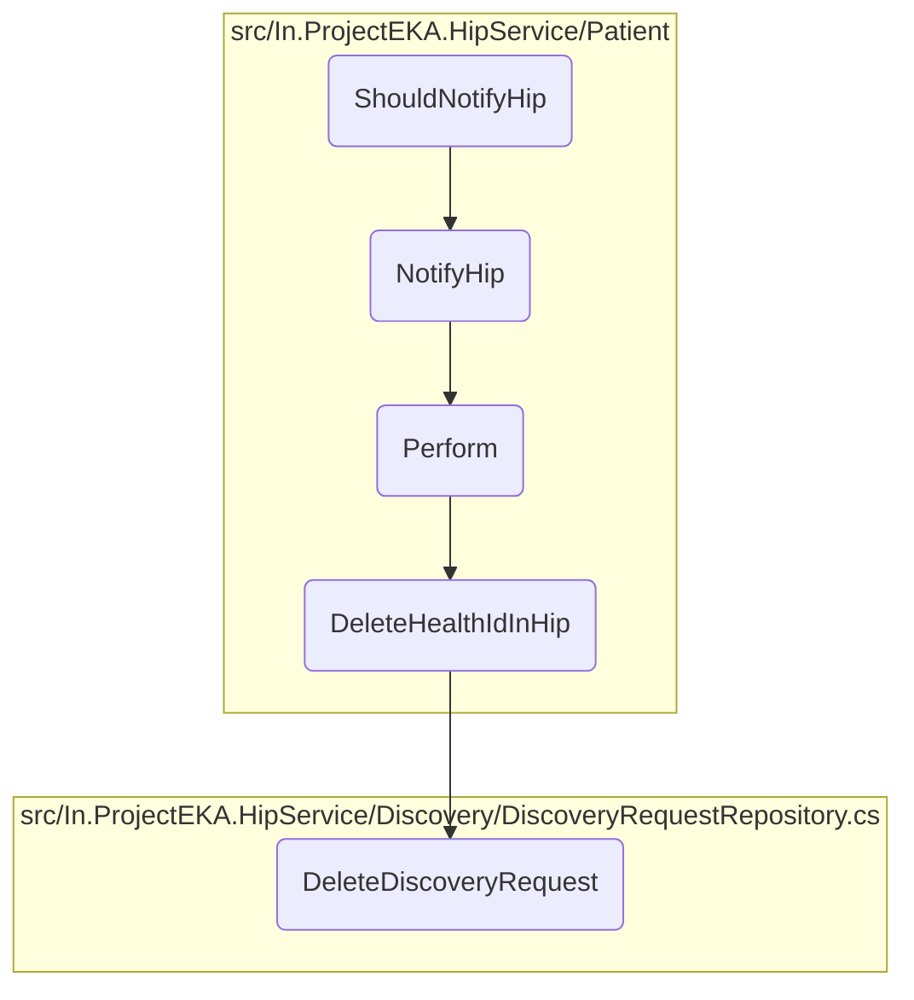

In this document, we will explain the process of notifying the Health Information Provider (HIP) when certain actions occur. This process involves several steps, including setting up a notification, sending data to the gateway, and verifying the expected status code.

The flow starts with setting up a notification for the HIP. Once the notification is prepared, it is sent to the gateway. The system then checks if the notification was successfully sent by verifying the status code returned by the gateway.

# Flow drill down



<SwmSnippet path="/test/In.ProjectEKA.HipServiceTest/Patient/PatientControllerTest.cs" line="45">

---

## <SwmToken path="test/In.ProjectEKA.HipServiceTest/Patient/PatientControllerTest.cs" pos="46:5:5" line-data="        private void ShouldNotifyHip()">`ShouldNotifyHip`</SwmToken>

First, the <SwmToken path="test/In.ProjectEKA.HipServiceTest/Patient/PatientControllerTest.cs" pos="46:5:5" line-data="        private void ShouldNotifyHip()">`ShouldNotifyHip`</SwmToken> method is a test method that verifies the functionality of the <SwmToken path="test/In.ProjectEKA.HipServiceTest/Patient/PatientControllerTest.cs" pos="63:7:7" line-data="            Assert.Equal(_patientController.NotifyHip(correlationId, hipPatientStatusNotification).Result.StatusCode,">`NotifyHip`</SwmToken> method. It sets up a mock notification and checks if the <SwmToken path="test/In.ProjectEKA.HipServiceTest/Patient/PatientControllerTest.cs" pos="63:7:7" line-data="            Assert.Equal(_patientController.NotifyHip(correlationId, hipPatientStatusNotification).Result.StatusCode,">`NotifyHip`</SwmToken> method returns the expected status code.

```c#
        [Fact]
        private void ShouldNotifyHip()
        {
            var requestId = Guid.NewGuid();
            var timestamp = DateTime.Now.ToUniversalTime();
            var patient = new HipNotifyPatient("test@sbx");
            var notification = new PatientNotification(HipService.Patient.Model.Action.DELETED, patient);
            var hipPatientStatusNotification = new HipPatientStatusNotification(requestId, timestamp, notification);
            var correlationId = Uuid.Generate().ToString();
            var cmSuffix = "ncg";
            var hipPatientNotifyConfirmation = new HipPatientNotifyConfirmation(Guid.NewGuid().ToString(), timestamp.ToString(DateTimeFormat),
                new PatientNotifyAcknowledgement(Status.SUCCESS.ToString()),
                null, new Resp(requestId.ToString()));
            _gatewayClient.Setup(
                    client =>
                        client.SendDataToGateway(PATH_PATIENT_ON_NOTIFY,
                            hipPatientNotifyConfirmation, cmSuffix, correlationId))
                .Returns(Task.FromResult(""));
            Assert.Equal(_patientController.NotifyHip(correlationId, hipPatientStatusNotification).Result.StatusCode,
                StatusCodes.Status202Accepted);
        }
```

---

</SwmSnippet>

&nbsp;

*This is an auto-generated document by Swimm 🌊 and has not yet been verified by a human*

<SwmMeta version="3.0.0" repo-id="Z2l0aHViJTNBJTNBaGlwLXNlcnZpY2UlM0ElM0FTd2ltbS1EZW1v" repo-name="hip-service"><sup>Powered by [Swimm](/)</sup></SwmMeta>
