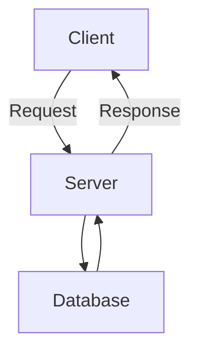

# Overview of Common Models

The Common Models in the application refer to a collection of classes that represent various entities and configurations used throughout the application. These models provide a standardized way to handle and manipulate data related to health information, consent management, and authentication.

# Purpose of Common Models

The primary purpose of these models is to ensure that data is consistently structured and easily accessible across different parts of the application. This consistency is crucial for maintaining the integrity and reliability of the data being processed.

# Key Models

Some of the key models included in the Common Models are `DataFrequency`, <SwmToken path="src/In.ProjectEKA.HipService/Common/Model/ConsentArtefact.cs" pos="7:5:5" line-data="    public class ConsentArtefact">`ConsentArtefact`</SwmToken>, `AccessPeriod`, and <SwmToken path="src/In.ProjectEKA.HipService/Common/Model/ConsentArtefact.cs" pos="13:1:1" line-data="            PatientReference patient,">`PatientReference`</SwmToken>. Each of these models serves a specific purpose in the application.

## <SwmToken path="src/In.ProjectEKA.HipService/Common/Model/ConsentArtefact.cs" pos="7:5:5" line-data="    public class ConsentArtefact">`ConsentArtefact`</SwmToken>

<SwmToken path="src/In.ProjectEKA.HipService/Common/Model/ConsentArtefact.cs" pos="7:5:5" line-data="    public class ConsentArtefact">`ConsentArtefact`</SwmToken> is used to represent the consent given by a patient for accessing their health data. This model ensures that the consent information is accurately captured and can be easily referenced throughout the application.

<SwmSnippet path="/src/In.ProjectEKA.HipService/Common/Model/ConsentArtefact.cs" line="1">

---

The <SwmToken path="src/In.ProjectEKA.HipService/Common/Model/ConsentArtefact.cs" pos="7:5:5" line-data="    public class ConsentArtefact">`ConsentArtefact`</SwmToken> model is defined in the <SwmPath>[src/In.ProjectEKA.HipService/Common/Model/ConsentArtefact.cs](src/In.ProjectEKA.HipService/Common/Model/ConsentArtefact.cs)</SwmPath> file. It includes necessary properties and methods to handle consent data.

```c#
using In.ProjectEKA.HipLibrary.Patient.Model;
namespace In.ProjectEKA.HipService.Common.Model
```

---

</SwmSnippet>

## CustomAuthenticationOptions and CustomAuthenticationHandler

`CustomAuthenticationOptions` and `CustomAuthenticationHandler` are used for handling custom authentication mechanisms. These models provide the necessary configurations and handlers to implement custom authentication logic in the application.

# Model Endpoints

The application includes several endpoints that interact with the Common Models. These endpoints facilitate the retrieval and manipulation of data represented by the models.

## getDocument

The `getDocument` function is used to retrieve a document by its ID. This function interacts with the relevant model to fetch the required document data.

## getPlaylist

The `getPlaylist` function is used to retrieve a playlist by its ID. Similar to `getDocument`, this function interacts with the relevant model to fetch the playlist data.



&nbsp;

*This is an auto-generated document by Swimm 🌊 and has not yet been verified by a human*

<SwmMeta version="3.0.0" repo-id="Z2l0aHViJTNBJTNBaGlwLXNlcnZpY2UlM0ElM0FTd2ltbS1EZW1v" repo-name="hip-service"><sup>Powered by [Swimm](/)</sup></SwmMeta>
