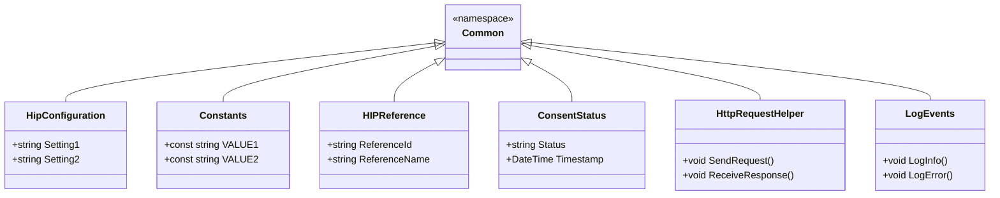

# Common Namespace and Directory

The <SwmToken path="src/In.ProjectEKA.HipService/Common/HttpRequestHelper.cs" pos="1:8:8" line-data="namespace In.ProjectEKA.HipService.Common">`Common`</SwmToken> namespace and directory in the HIP Service project contain shared configurations, constants, models, and utilities used throughout the application. This central location for shared resources ensures consistency and reusability across different components of the HIP service.

# Configuration Settings

The `HipConfiguration` class within the <SwmToken path="src/In.ProjectEKA.HipService/Common/HttpRequestHelper.cs" pos="1:8:8" line-data="namespace In.ProjectEKA.HipService.Common">`Common`</SwmToken> namespace holds configuration settings for the HIP service. This class centralizes configuration management, making it easier to maintain and update settings as needed.

# Constants

The <SwmToken path="src/In.ProjectEKA.HipService/Common/HttpRequestHelper.cs" pos="10:5:5" line-data="    using static Constants;">`Constants`</SwmToken> class defines various constant values used across the application. By centralizing these constants, the codebase becomes more maintainable and less prone to errors caused by hardcoding values in multiple places.

# Models

The <SwmToken path="src/In.ProjectEKA.HipService/Common/HttpRequestHelper.cs" pos="1:8:8" line-data="namespace In.ProjectEKA.HipService.Common">`Common`</SwmToken> directory contains models like `HIPReference` and `ConsentStatus`, which represent data structures and statuses within the HIP service. These models facilitate data handling and ensure consistency in how data is represented and processed.

# Utility Classes

Utility classes such as <SwmToken path="src/In.ProjectEKA.HipService/Common/HttpRequestHelper.cs" pos="12:7:7" line-data="    public static class HttpRequestHelper">`HttpRequestHelper`</SwmToken> and `LogEvents` provide helper methods for HTTP requests and logging events, respectively. These utilities simplify common tasks and promote code reuse.

<SwmSnippet path="/src/In.ProjectEKA.HipService/Common/HttpRequestHelper.cs" line="1">

---

The <SwmToken path="src/In.ProjectEKA.HipService/Common/HttpRequestHelper.cs" pos="12:7:7" line-data="    public static class HttpRequestHelper">`HttpRequestHelper`</SwmToken> class in the <SwmToken path="src/In.ProjectEKA.HipService/Common/HttpRequestHelper.cs" pos="1:8:8" line-data="namespace In.ProjectEKA.HipService.Common">`Common`</SwmToken> namespace provides helper methods for making HTTP requests. This class streamlines the process of sending and receiving HTTP requests, reducing boilerplate code.

```c#
namespace In.ProjectEKA.HipService.Common
```

---

</SwmSnippet>



&nbsp;

*This is an auto-generated document by Swimm 🌊 and has not yet been verified by a human*

<SwmMeta version="3.0.0" repo-id="Z2l0aHViJTNBJTNBaGlwLXNlcnZpY2UlM0ElM0FTd2ltbS1EZW1v" repo-name="hip-service"><sup>Powered by [Swimm](/)</sup></SwmMeta>
